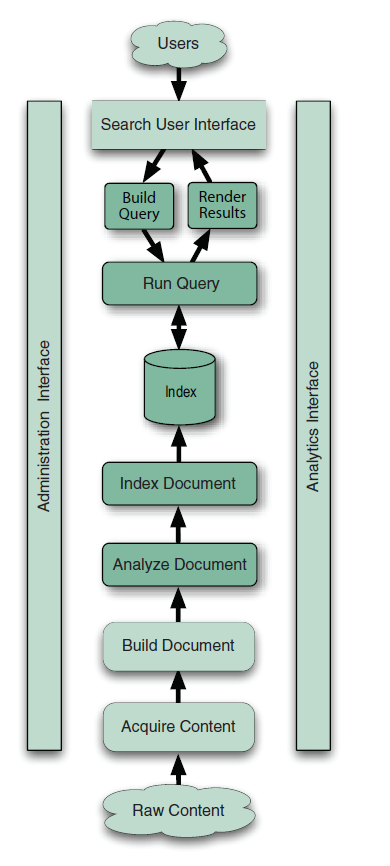

## 1.3 Lucene 与搜索程序组件 Lucene and the components of a search application ##

&emsp;&emsp;对于搜索程序来说，重要的是要掌控其总体架构，这样才能清楚地理解，程序的哪些部分由 Lucene 来处理，哪些部分必须由另外的组件来解决。一个常见的误解是把 Lucene 当做一个完整的搜索程序，而实际上，它仅仅是索引和搜索组件的核心。

我们将看到，一个搜索程序从一个索引链（an indexing chain）开始，要求按照几个独立的步骤来依次完成：
1. 获取原始内容
2. 根据原始内容来创建对应的文档，或许期间需要从二进制文档中抽取出文本信息
3. 对文档进行索引

建立起索引库之后，就要对索引库进行搜索。用于搜索所需要的组件同样是多种多样的，包括：
- 用户界面
- 构建可编程查询语句的形式
- 执行查询，即检索匹配的文档
- 结果展示

&emsp;&emsp;现代搜索程序具有非常丰富的多样性。有些搜索程序在后台安静地运行，就像一个小组件深度嵌入到现有软件中，搜索一些特定的内容（例如本地文件、email 消息、日程计划等等）。另外一些搜索程序运行于远程的 web 站点上，在专用的服务器基础环境中运行，支持多个用户通过浏览器或移动设备与之交互，或许可以搜索诸如产品目录、或某特定范围的文件集等。有些运行在公司的内部网络上，用于搜索公司内部可见的文档集。还有些搜索程序对很大一部分互联网上的 web 内容建立索引，并且以令人难以想象的规模处理 web 内容和并发搜索请求。

&emsp;&emsp;尽管种类繁多，搜索引擎通常具有同样的总体架构，如果图 1.4 所示（图片来源于 Lucene in Action Second Edition）：

图 1.4

  

&emsp;&emsp;在设计自己的搜索程序时，需要明确界定哪些功能是必须的，以及它们应该如何运行。事先说明：现代受欢迎的搜索引擎，特别是 Google，有非常多的 **基线要求（baseline requirements）**，这是所有用户在第一次与搜索引擎交互时所期望的。如果我们的搜索引擎不能满足这些基线要求，那么我们的用户会在一开始就对它失去信心。Google 的拼写纠正能力非常好，它在每条搜索结果上以高亮形式动态标注的摘要也非常准确，并且，它的响应时间也远小于一秒钟。如果感到疑惑，可以看看并体验一下 Google 来获取灵感和启发，以便在设计自己的搜索程序时，指引我们应该提供哪些基本功能。模仿是最真诚的赞美！（Imitation is the sincerest form of flattery!）

&emsp;&emsp;下面我们逐步探讨搜索程序的每个组件。在分析过程中，出于对每个组件的理解，可以思考自己的搜索程序要求什么，如何使用 Lucene 来完成自己的搜索目标。我们也会清楚地指出，Lucene 能够处理哪些组件（图中颜色较深的图框），以及哪些组件必须由自己程序或其它开源软件实现。最后将对搜索程序中 Lucene 的角色做出总结。

&emsp;&emsp;从图1.4底部开始，展现了所有搜索引擎的首要部分，概念上称为**索引操作（indexing）**：将原始数据处理到一个高效的交叉引用查找表，用于促进快速搜索操作。

  

## 1.3.1 索引组件 Components for indexing ##

&emsp;&emsp;假设我们需要搜索大量的文件，并且要找到包含某一特定单词或短语的文件。那么应该如何写一个程序来完成这件事呢？最原始的方法是顺序扫描每一个文件，来查找其中是否包含给定的单词或者短语。虽然这个办法可以工作，但它有很多缺陷，最明显的问题是：它不能扩展更大规模的文件集，或者处理非常大的文件。这就是索引要出现的地方：要快速地对大量文本进行搜索，必须首先索引那些文本，并将其转换成一种能够快速搜索的格式，消除缓慢的顺序扫描过程。这个转换过程称为**索引操作（indexing）**，并且它的输出称作**索引/索引库（index）**。

&emsp;&emsp;可以把索引库想象成一种数据结构，这种数据结构可以对存储在其中的单词进行快速随机访问。这个概念的背后，是类似于书后的索引页，可以让我们从特定主题迅速定位到讨论该主题的页面。对于 Lucene 来说，索引库（index）是一个精心设计的数据结构，通常作为一组索引文件存储在文件系统中。

&emsp;&emsp;通过进一步研究会发现，建立索引（indexing）的过程包括一些列逻辑上相互独立的步骤，这是我们下面要讨论的内容。第一步，必须要获得对需要搜索内容的访问。

  
#### 获取内容 Acquire Content ####

&emsp;&emsp;如图 1.4 底部所示，第一步就是获取内容。这一步包括使用网络爬虫或网络蜘蛛，搜集并界定需要索引的内容。这部分工作可能非常琐碎，比如要索引一批存在于文件系统特定目录内的 XML 文件，或者所需的内容存在于某个组织良好的数据库中。另外，如果内容分散于各处（比如文件系统、内容管理系统、Microsoft Exchange、Lotus Domino、各种 web 站点、数据库、本地 XML 文件、运行在局域网上的 CGI 脚本、等等），也有可能使这部分工作变得非常复杂和混乱。

&emsp;&emsp;对于使用权限管理的系统来说，获取内容这一步将变得更加复杂，因为它在获取内容的时候，很可能需要 “超级用户（superuser）” 权限访问。更进一步，访问权限或访问控制列表（ACL）必须和文档内容一起获得，并且把它作为文档的附加域索引到 Lucene 的索引库中，这样才能在搜索期间使用，正确地进行强制授权。5.6.7 节讨论在搜索期间使用安全过滤器。

&emsp;&emsp;对于大规模内容集来说，内容获取组件能够高效地进行增量运行非常重要，这样它就只访问那些它最后一次运行后发生变化的文档。并且，它也应该是 “有生命的（live）”，意思是说，它是一个持续运行的服务，等待新的或者发生变化的内容抵达，并载入变化的内容使其成为可用。

&emsp;&emsp;Lucene 作为一个核心搜索库，并不提供任何支持获取内容的功能。内容获取组件完全由自己程序或者另外一款其它软件来实现。目前有大量的开源网络爬虫软件可以实现这个功能，下面列出其中的一部分：

- Solr（https://solr.apache.org/） ，Apache 旗下顶级项目，构建域 Lucene 之上，支持从关系数据库和 XML 文档中提取原始数据，以及能够通过集成 Tika 来处理复杂文件（第7章介绍 Tika）。
- Nutch（https://nutch.apache.org/） ，Apache 旗下顶级项目，构建域 Lucene 之上，高可扩展的、成熟的、大规模 web 网络爬虫，用于抓取和分辨 web 站点数据。
- Aperture（http://aperture.sourceforge.net/） ，文件获取工具，支持爬取 web 站点、文件系统、以及邮箱，能够抽取并索引文本数据。

&emsp;&emsp;如果我们程序的内容分散在各处，最好是使用已存在的爬虫工具。这类工具通常采用专门的设计，能够轻松获取存储在各种系统中的内容，并且有的还提供到通用内容存储的连接器，比如 web 站点、数据库、流行的内容管理系统、以及文件系统等。如果爬虫没有连接到我们内容源的连接器，自己构建一个可能也是很容易的。

&emsp;&emsp;下一步，根据获取的内容，建立小数据块，称为文档（document）。

  
#### 建立文档 Build Document ####

&emsp;&emsp;有了要索引的原始内容之后，必须将内容转换为用于搜索引擎的小单元，通常称作文档（document）。文档一般由几个带有名子和值的域（field）组成，例如 ttitle、body、abstract、author、以及 url 等。我们必须要精心设计，如何将原始内容分割成合适的文档和域，以及如何计算其中每个域的值。一般的做法是这样的：一封 email 消息作为一个文档，一个 PDF 文件或一个网页作为一个文档。但这种做法有时候也存在问题：该如何处理 email 的附件？是把从附件中提取出所有的文本 和 email 消息作为一个文档，还是分开为不同的文档，以什么方式为每个附件添加返回源邮件消息的链接？

&emsp;&emsp;设计好方案之后，需要为每个文档从原始内容中提取出文本。如果内容已经是纯文本格式的，并使用已有标准进行编码，那么工作就简单了。但如今，更多的文件是以二进制的形式存在的（PDF, Microsoft Office, Open Office, Adobe Flash, streaming video and audio 多媒体文件），或者含有大量标记，索引前必须删除（RDF, XML, HTML）。创建搜索引擎文档之前，需要运行文件过滤器来从这些格式的原始内容中提取出文本。

&emsp;&emsp;在这一步期间，也可能创建额外的域，来加入必要的商业逻辑。例如，如果有一个大的 “body text” 域，可以运行语义分析器来提取出正确的名称（name）、地点（place）、日期（date）、时间（time）、位置（location）等等信息，把它们存储到文档单独的域中。也或许需要结合其它存储区中的内容，例如数据库，并且把这些内容合并在一起，作为一个文档提供给搜索引擎。

&emsp;&emsp;Lucene 提供了构建域和文档的 API，但它没有提供构建文档的任何逻辑，因为那完全是应用程序特定的工作。它也没有提供任何文件过滤器，但它在 Apache 有一个姊妹项目 Tika，Tika 能非常出色地处理文件过滤。如果原始内容存储在数据里，也有些项目，例如 DBSight, Hibernate Search, LuSQL, Compass, 以及 Oracle/Lucene 项目，集成了 Lucene，通过将获取内容和构建文档步骤无缝连接在一起，使索引和搜索数据库表的操作非常简单。

&emsp;&emsp;至此，文档中的文本域还不能被搜索引擎索引。要进行索引操作，必须先对文本进行分析。

  
#### 分析文档 Analyze Document ####

&emsp;&emsp;搜索引擎不能直接对文本进行索引：更确切地说，文本必须被切分成一系列单独的原子元素，称作词元（token）。这就是**分析文档**这一步所要做的工作。每一个词元大致和语言中的“单词（word）”对应，并且这一步骤确定文档中的文本域是如何被分割成一系列词元的。这里存在各种复杂的问题：如何处理复合词？要进行拼写纠正吗（如果内容本身存在打印错误）？要为原始词元内联注入同义词吗？这样，当搜索 “laptop” 时也返回涉及 “notebook” 的产品。是否要将名称单数形式和复数形式合并为同一个词元？通常还需要一个词干提取器，例如 Martin Porter 博士的 Snowball 词干提取器，用来从单词中提取词根（例如，runs, running, 以及 run, 所有单词都映射到它的基本形式 run）。是否要保留单词大小写形式？对于非拉丁语系的语言，如何确定一个 “词”？这个组件非常重要，第4章，用一整章的内容探讨分析过程。

&emsp;&emsp;Lucene 核心提供了多个内置的分析器，让我们可以很好控制这个过程。而大量的分析器实现则从 Lucene 核心包分离出来，构建在独立的 Jar 包中，例如：analyzers-common，analyzers-icu，analyzers-kuromoji，analyzers-nori，analyzers-opennlp，analysis-phonetic，analysis-stempel，analyzers-smartcn 等等。构建自己的分析器也是很直接的，通过联合使用词元分词器（tokenizer）和词元过滤器（token filter）创建分析器链，来自定义创建词元的过程。

  
#### 索引文档 Index Document ####

&emsp;&emsp;在索引文档这一步，文档被添加到索引库。Lucene 提供了这一步操作的所有必要的支持，所有的工作仅通过一个令人惊叹的简单 API，魔术般的完成了索引操作。第2章，深入探讨执行索引操作的详细内容。

&emsp;&emsp;我们回顾了搜索程序典型的索引步骤。重要的是要记住，为了提供好的搜索体验，索引是最需要处理好的一环：应该精心设计并不断完善索引过程，到提升用户搜索体验的程度。

  

## 1.3.2 搜索组件 Components for searching ##

&emsp;&emsp;搜索操作是在索引库中查找某个单词，从而找到包含该单词文档的过程。搜索质量通常使用 **“查准率（precision）”** 和 **“查全率（recall）”** 指标衡量。查全率用来衡量搜索系统查找**相关文档**的能力，查准率衡量的是系统过滤出**不相关文档**的能力。后面章节有使用 Lucene 的 benchmark 模块对自己的搜索程序衡量查准率和查全率的阐述。 

&emsp;&emsp;在进行搜索操作时，必须考虑其它几个问题。我们提到过，搜索速度和快速搜索大量文本的能力。支持单项（single term query）或多项查询（multiterm query）、短语查询（phrase query）、通配符查询（wildcards query）、模糊查询（fuzzy query）、结果评分（result ranking）、以及排序支持也是很重要的，还要有友好的查询输入语法能够输入这些类查询。Lucene 提供了数量众多的搜索特性，后面会通过 3 个章节来展开讨论（第 3、5、6 章）。

&emsp;&emsp;继续探讨搜索引擎的典型组件，这次从图 1.4 的上部往下观察，首先探索搜索程序的用户界面。

  
#### 用户搜索界面 Search User Interface ####

&emsp;&emsp;用户界面（the User Interface）就是最终用户通过 web 浏览器、桌面应用程序、或者移动设备，与我们的搜索程序进行交互时，所实际看到的界面。**UI 是搜索程序最重要的部分**！我们可能拥有世界上最好的搜索引擎运行在后台，使用了极其先进的功能技术，但一个低级愚蠢的 UI 设计体验会抵消掉这些优势，从而导致宝贵的用户逐渐转向竞争对手一方。

&emsp;&emsp;保持搜索界面的简洁：不要把一大推高级选项放在首页。搜索框要放置在界面上显著的位置，并且要随处可见，用户可以随时向搜索框输入文本进行搜索，而不要让用户先要点击一个搜索链接，然后再显示搜索框让用户用户输入搜索文本，两个步骤完成（这是常见的错误）。

&emsp;&emsp;不要低估搜索结果展现的重要性。简单来说，如果未能在标题或摘要中高亮显示匹配内容，或者字体显示太小，以及在搜索结果中显示过多的文本，这些都很快毁掉用户的搜索体验效果。要确保对搜索结果按明确的排序顺序展现出来，并且默认起始点是符合用户要求的（通常按照相关性进行排序）。要充分明确：如果我们的搜索程序在做一些 “引人入胜的（interesting）”小功能，例如扩展搜索包括同义词，使用了相对加权以影响排序顺序，或者自动进行拼写纠正等小功能，要在搜索结果的顶部给出清晰的提示，并能让用户很容易地关闭这些功能。

>**NOTE**: 最糟糕的事情莫过于毁掉用户对搜索结果的信心，这事情很容易发生。一旦发生这种情况，用户可能放弃使用我们的搜索引擎，而我们可能再也没有机会挽回用户对它的信心了。

&emsp;&emsp;最重要的是，要对自己开发的搜索程序进行广泛的使用。要享受它好方面的特性，但更要积极地修正它的问题。几乎可以肯定地，我们搜索程序界面应该提供拼写纠正功能。可以使用 Lucene 提供的 suggest 模块，该模块提供了自动建议（Auto-suggest）和拼写检查（Spellchecking）功能，在 8.5 节讲述它的用法。然而，在每个搜索结果中提供动态摘要（excerpts，有时叫作 summary）高亮显示是非常重要的，为此，Lucene 提供了 highlighter 模块，将在 8.3 节讲述。

&emsp;&emsp;Lucene 不提供任何默认的搜索 UI，这完全由自己的应用程序构建。当用户用我们的搜索界面进行交互时，他或她提交一个搜索请求，该请求必须首先转换成合适的 “查询 Query” 对象，才能给搜索引擎使用。

  
#### 建立查询 Build Query ####

&emsp;&emsp;当我们想尽办法吸引用户使用我们的搜索引擎时，他们会提交一个搜索请求，通常以 HTML 表单或者 Ajax 请求的形式由浏览器提交到搜索引擎服务器。然后我们必须把这个请求转换成搜索引擎理解的 Query 对象形式，我们把这一步骤称为**建立索引（Build Query）**。

&emsp;&emsp;Query 对象可以很简单，也可以很复杂。Lucene 提供了强大的 QueryParser 包，来根据通用查询语法将用户输入的文本处理成 Query 对象。**查询解析器（QueryParser）** 对象及其语法将在第 3 章阐述。在线文档参考：

https://lucene.apache.org/core/8_11_2/queryparser/index.html

&emsp;&emsp;查询可以包含布尔操作（Boolean operation）、短语查询（phrase query 在双引号之内的文本）、或者通配符词项（wild term）。如果我们的应用程序对搜索 UI 有很紧密的控制，或者有其它特定的约束，那就必须自己实现逻辑来将用户输入文本转换成等效的 Query 对象。例如，如果有授权限制（entitlement constraint），限制每个用户只能搜到允许他搜索的那部分文档，我们需要在 query 对象上设置权限过滤器（filter）。关于权限过滤器的细节将在 5.6 节探讨。

&emsp;&emsp;很多程序会修改查询语句，对重要信息进行相对加权（boost）或者过滤。电商网站经常会对更赚钱的品类进行临时提权，或者滤除马上就要脱销的商品（这样用户就不会看到这些商品已经没有库存，而到别的地方去购买）。要尽量抑制这种重度提权和滤除搜索结果的诱惑：因为一旦用户知晓了真实情况，就会失去对我们的信任。

&emsp;&emsp;对于搜索程序来说，Lucene 默认的查询解析器一般就已经足够用了。但有些时候，我们想要使用 QueryParser 的输出结果，然后加入自己的逻辑来深度重定义查询对象，也有可能想要自定义查询分析器语法、或者自定义查询解析器实际创建的 Query 实例，或者其它无论什么原因，由于 Lucene 的开源特性，这些都很容易做到。将在 6.3 节讨论自定义 QueryParser 的细节。现在，我们已经准备好执行搜索请求来检索结果了。

  
#### 搜索查询 Search Query ####

&emsp;&emsp;搜索查询是查询索引库并检索出与所提供的 Query 匹配的文档的过程，按请求的排序顺序排序。这个组件隐藏了搜索引擎复杂的内部操作，由 Lucene 来为我们完成所有的工作。Lucene 在这一点上也有非常好的扩展机制，所以如果我们想要自定义如何对查询结果进行收集、过滤、排序，等等，都是简单直接的。详细内容参考第 6 章。

有 3 种常用的搜索理论模型：
- **纯布尔模型（Pure Boolean model）**：文档要么匹配，要么不匹配所提供的查询，没有评分机制。在这种模型下，没有相关性评分与匹配的文档关联，并且匹配的文档是未经排序的，查询只是简单地识别出全部数据的一个子集作为匹配查询的结果。
- **向量空间模型（Vector space model）**：查询和文档都模型化为一个高纬度空间的向量，其中每一个唯一的词项（term）都是一个维度。一个查询和一个文档间的相关性，或者说相似度，由向量间的距离计算。
- **概率模型（Probabilistic model）**：这种模型中，采用全概率方法来计算一个文档是否良好地匹配一个查询。

&emsp;&emsp;Lucene 的方法是联合使用**向量空间模型**和**纯布尔模型**，并且为我们提供了基于搜索到搜索的（search by search）控制方法，让我们自己决定要采用哪种模型。最后，Lucene 返回的文档，在下一步我们应以可使用的（consumable）方式展现给用户。 

  
#### 展现结果 Render Results ####

&emsp;&emsp;有了原始匹配查询的文档集，按正确的顺序排好序，就要把它们以直观、可用的方式展现给用户。UI 也应为下一步搜索或动作提供清晰的路径，例如点击下一页（nex page），精化搜索（refining the search），或者对某一个匹配结果查找相似文档，这样，用户永远不会进入死局（hit a dead end）。

&emsp;&emsp;结束了对索引操作和搜索操作组件的探讨，但这并没有结束，搜索程序一般还会要求能进行持续管理。

  

## 1.3.3 搜索程序的其它组件 The rest of the search application ##

&emsp;&emsp;对于一个典型的全功能搜索引擎，特别是一个运行在 web 站点上的搜索引擎来说，还需要一些功能组件。必须包含管理组件，来持续跟踪应用的健康状况、配置不同的组件、以及启动和停止服务器。也应该包含分析组件，这让我们能用不同的视角来观察用户如何进行搜索，对哪些组件正常工作，而哪些没有工作，为我们给出必要的指导。最后，对于大型的搜索程序来说，规模扩展（scaling）—— 使我们的搜索程序能够应对越来越庞大的内容，越来越高的并发搜索查询，这是非常重要的特性。

  
#### 管理界面 Administration Interface ####

&emsp;&emsp;现代搜索引擎是一个复杂的软件，并且有大量的控制选项需要配置。如果用网络爬虫来爬取数据内容，管理页面需要可以设置起始 URL，创建规则以界定爬虫要访问的站点范围，设置可以载入的文档类型，设置读取文件允许的最低速度，等等。启动和停止搜索服务、管理复制（如果是高规模并发搜索，是否要求高可用性备援），选择搜索日志、检查系统总体运行健康状况，以及创建和恢复备份等等，都是管理页面应该提供的功能。

&emsp;&emsp;Lucene 本身有很多配置选项，可以暴露到管理页面。在索引期间，可能需要调整内存缓冲区大小，一次合并多少个索引段，多久做一次提交。第 2 章讨论这部分内容。搜索操作也有很多重要的管理选项，例如多久重新打开一次 reader。可能也很想把索引库的基本摘要信息暴露给管理界面，库中有多少索引段，文档总数、存活文档总数量、待删除文档数量等等。如果有文档索引失败，或者搜索操作时遇到查询异常，管理 API 应该可以记录它们。

&emsp;&emsp;有些搜索程序，例如桌面搜索，不需要管理组件，而一个全功能的企业搜索程序可能有一个非常复杂的管理页面。一般管理页面主要是基于 web 的，但也有可能包括一些命令行工具。

  
#### 分析界面 Analytics Interface ####

&emsp;&emsp;图 1.4 右侧展开即为分析界面，通常是基于 web 的 UI，通常运行在一个独立的服务器上自带一个报告引擎。分析是很重要的：通过使用模式查看搜索日志，可以获得很多关于用户的信息，以及它们为什么通过我们的站点购买或不购买我们的商品。有人甚至说这是部署一个好的搜索引擎最重要的原因！如果我们运行一个电商网站，这是个极其强大的工具，它让我们看到用户如何使用搜索，哪些搜索未能获得令人满意的结果、哪些搜索结果被用户点击过，以及哪些购买通过或者不是通过一次搜索进行的 ———— 使我们不断优化用户的购买体验。

&emsp;&emsp;可以输送给分析界面的 Lucene 特定指标包括：
- 每类查询多长时间运行一次（单项查询 term, 短语查询, 布尔查询, 等等）
- 哪些查询关联程度较低
- 哪些查询用户没有点击任何搜索结果（如果我们的搜索程序跟踪点击率（click-throughs）的话）
- 用户通过特定域对结果排序而不是默认的相关性排序的使用频率
- 搜索期间发生的故障

&emsp;&emsp;也可能想要看索引指标，每秒索引的文档数，或者索引文档的字节数。

&emsp;&emsp;Lucene，因为它是一个搜索库，并不提供任何分析工具。如果我们的搜索程序是基于 web 的，使用 Google Analytics 是创建分析界面的快速方法。如果不适用于自己的需要，我们也可以基于 Google’s visualization API 构建自己的图表页面。

最后一个主题，我们讨论规模扩展。

  
#### 规模扩展 Scaling ####

&emsp;&emsp;一个特别棘手的领域是扩展搜索程序的规模。绝大多数的搜索程序并没有足够的内容或者高并发搜索能力，那要求扩展超过一台计算机的规模。Lucene 的索引操作和搜索操作吞吐量，允许在一台现代计算机上处理相当大数量的内容。然而，这样的程序可能要运行在两个相同的计算机上，以确保在硬件有问题时不会出现单点故障（没有停工期 no downtime）。这种方案也使我们可以从生产环境上退出其中的一台计算机来进行维护和升级，而不会影响持续的在线搜索。

&emsp;&emsp;有两个维度的规模扩展：**网络化内容**和**网络化查询吞吐量**。如果我们的数据内容极其庞大，应该将它们分割成分片（shard），这样每台单独的计算机搜索一个分片。一个前端（frond-end）服务器把它接收到的每一个查询发送到所有的分片计算机上，然后合并所有分片返回的结果作为一个结果集。如果是要在流量高峰期间有很高搜索吞吐量，那么应该把同一个索引库复制到多台计算机上。一个前端服务器作为负载均衡器，把接收到的每个查询发送给负载最轻的计算机。如果整两个维度的规模扩展都需要，就像一个大规模 web 搜索引擎那样，我们可以联合使用这两种方案。

&emsp;&emsp;构建这样一个体系结构涉及非常多的复杂性。需要稳定的途径来跨多台计算机间复制索引库。如果某台计算机宕机了，计划的或非计划的，需要一种方法，在它重返生产环境之前，把它处理成最新状态（bring it up-to-date）。如果有事务性要求，让所有的 searcher 必须同时转换到（“go live”）索引库的新提交上，这又增加了复杂性。在分布式系统上，故障恢复的设置也可能很复杂。最后，重要的功能，例如拼写纠正和高亮，甚至评分的词项权重（term weight）如何计算，也会受这种分布式体系结构的影响。

&emsp;&emsp;Lucene 没有提供规模扩展的工具。然而，Apache 旗下的 **Solr** 和 **Nutch** 项目，都提供了索引分片和复制功能。另外 **Elastic Search** 项目是另一个基于 Lucene 的开源项目，也提供了分布式架构的搜索引擎方案。因此，使用现有成熟稳定的分布式搜索引擎，是构建搜索程序的首选方案。 

&emsp;&emsp;我们已回顾了当代搜索应用程序的各个组件。下面将考虑 Lucene 是否适于我们的应用程序。

  

## 1.3.4 Lucene 与应用程序的整合点 Where Lucene fits into your application ##

&emsp;&emsp;如前所述，一个现代的搜索程序需要多个组件。然而，对一个具体的程序来说，每个组件的需求是大不相同的。虽然 Lucene 实现了其中多个组件（图 1.4 中深色部分标识的组件），但其它组件最好由别的开源软件或自己的自定义程序逻辑来补充。某些情况下，我们的搜索程序是专用的，不需要其中某些特定组件也是可能的。此刻，我们应该明白之前所说的，**Lucene 是一个搜索库，而不是一个完整的搜索程序**的含义了。

&emsp;&emsp;如果 Lucene 不直能接适合整合到我们的搜索程序，很可能某个补充 Lucene 或构建于 Lucene 之上的开源项目适合我们的需要。例如，Solr 作为一个服务器运行，并提供了一个管理界面，两个维度的规模扩展，具有从数据库索引内容的能力，以及重要的最终用户功能，如 faceted 导航，所有的功能都构建在 Lucene 之上。Lucene 是搜索库，而 Solr 提供了整个搜索程序的大部分组件。

&emsp;&emsp;另外，有些 web 框架也提供了基于 Lucene 的搜索插件。例如，Grails 有一个可搜索的插件（http://www.grails.org/Searchable+Plugin），基于 Compass Search Engine Framework，其后台使用的就是 Lucene 库。

