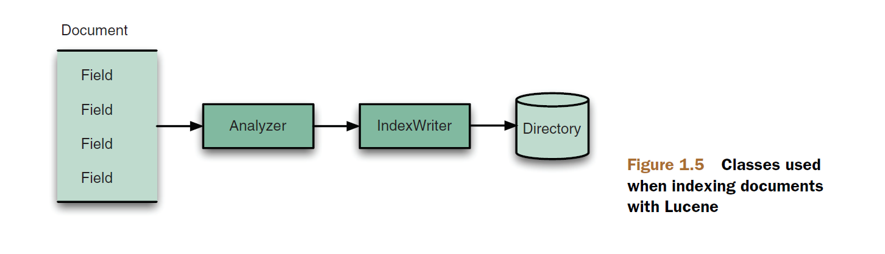

## 1.5 理解 Lucene 核心索引类 Understanding the core indexing classes ##

&emsp;&emsp;正如 Indexer 类中所看到的，我们需要如下这些类来执行最简单的索引操作：
- IndexWriter
- Directory
- Analyzer
- Document
- Field

&emsp;&emsp;图 1.5 展示了这些类如何参与到索引操作过程（图片来源于 Lucene in Action Second Edition）。图中展示的只是这些类的简要概述，给我们一个它们在 Lucene 中角色的大体印象，这些类将在整部书中使用。

  

## 1.5.1 IndexWriter ##

&emsp;&emsp;IndexWriter 是索引过程的中心组件。使用 IndexWriter 创建新索引或打开已存在的索引，添加、删除、或更新索引中的文档。考虑 IndexWriter 为这样的对象，对索引库进行写操作，而不是对其进行读取或搜索。IndexWriter 需要某个位置存储索引库，而这正是 Directory 的工作。

&emsp;&emsp;

