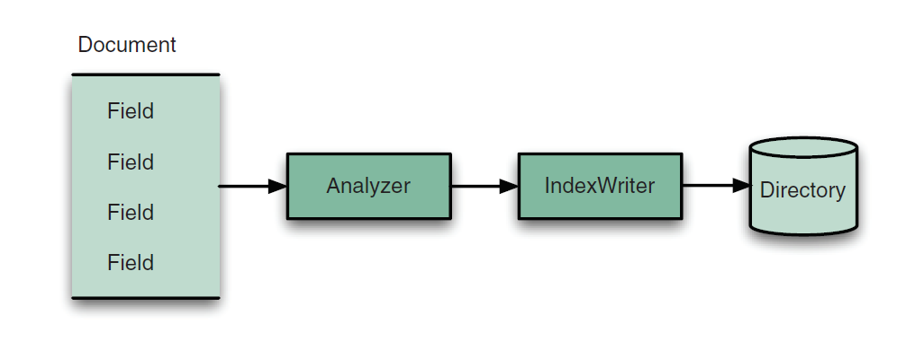

## 1.5 理解 Lucene 核心索引类 Understanding the core indexing classes ##

&emsp;&emsp;正如 Indexer 类中所看到的，我们需要如下这些类来执行最简单的索引操作：
- **IndexWriter**
- **Directory**
- **Analyzer**
- **Document**
- **Field**

&emsp;&emsp;图 1.5 展示了这些类如何参与到索引操作过程（图片来源于 Lucene in Action Second Edition）。图中展示的只是这些类的简要概述，给我们一个它们在 Lucene 中角色的大体印象，这些类将在整部书中使用。

  

## 1.5.1 IndexWriter ##

**IndexWriter** 是索引过程的中心组件。使用 IndexWriter 创建新索引或打开已存在的索引，添加、删除、或更新索引中的文档。可以把 IndexWriter 理解为这样的对象，它只对索引库进行写操作，而不对其进行读取或搜索操作。

&emsp;&emsp;IndexWriter 是一个具体的类，位于 Lucene 的 org.apache.lucene.index 核心包。IndexWriter 类是线程安全的，并且强制每个索引库只能有一个 IndexWriter 实例。创建 IndexWriter 的一个实例是创建一个新的索引库，或者打开一个已存在的索引库，索引库的位置由提供给 IndexWriter 构造器的 Directory 类型实例定义，而丰富的配置选项则由 IndexWriter 构造器的第二个参数 IndexWriterConfig 提供。

  

## 1.5.2 Directory ##

&emsp;&emsp;**Directory** 类表示 Lucene 索引库的位置。它是一个抽象类，其子类可以使用合适的实现来存储索引。在 Indexer 实例中，使用了 FSDirectory.open() 静态方法来打开一个具体的 FSDirectory 实现，在文件系统目录中存储真正的索引文件，并把它作为参数传递给 IndexWriter 构造器。

&emsp;&emsp;Lucene 自带了多个特定的 Directory 实现，用以适应不同的存储机制。调用 FSDirectory.open() 静态方法，Lucene 会为我们选择最合适的实现类打开目标目录，并返回该类实例。

一个Directory 是一个索引库存储位置信息的逻辑抽象，一般具体表现为一个本地文件系统目录，FSDirectory 是继承自 Directory 的表示这种本地文件系统目录的抽象基类，它有 3 个具体的子类：MMapDirectory、NIOFSDirectory 和 SimpleFSDirectory。但 Directory 也可以表示其它一些存储技术的索引库，比如 hadoop 分布式文件系统目录。

&emsp;&emsp;IndexWriter 不能直接对文本进行索引，必须先由分析器将文本切分成独立的“单词”才能对其索引。

  

## 1.5.3 Analyzer ##

&emsp;&emsp;文本被索引之前，需要经过分析器 **Analyzer** 的处理。分析器通过 IndexWriterConfig 构造器指定，而该类对象作为构造器参数由 IndexWriter 类来接收，默认为 StandardAnalyzer。分析器负责从文本中抽取词元（token）以进行索引，并排除其它不要索引的语汇元素。如果要索引的内容不是纯文本格式，那么在索引之前要先从原始信息中提取出文本格式内容。第 7 章展示如何利用 Tika 库从常见的富媒体文件格式抽取文本信息的技术。Analyzer 是抽象类，Lucene 核心模块自带了几个常用的具体子类以适应一般性的需求，主要用于测试。它们其中有些用于处理跳过停用词（stop word），**停用词** 是指频繁使用但无助于区分文档的词，例如 *a, an, and, the, in, on* 等等。有些用于处理将词元转换为小写字符，以使搜索不区分大小写，等等。Analyzer 是 Lucene 非常重要组件，而且不仅仅用于简单的输入过滤。作为将 Lucene 集成到程序中的开发者，对分析器的选择是程序设计的关键要素。Lucene 除了在核心模块内置了几个常用分析器之外，还开发了大量的分析器，这些分析器按功能和语系分别构建在几个独立的模块中，例如：analyzers-common，analyzers-icu，analyzers-kuromoji，analyzers-nori，analyzers-opennlp，analysis-phonetic，analysis-stempel，analyzers-smartcn 等等。可以根据自己的需求选择合适的分析器。另外，如果如果没有合适的分析器可用，也完全可以自定义开发符合自己需要的分析器。

  

## 1.5.4 Document ##

&emsp;&emsp;**Document** 类表示域（Field）的集合，我们把它翻译成“文档”。可以把文档理解成一个虚拟的文件（a virtual document），使其之后成为可检索的一块数据，就像一个 web 页，一个 email 消息，或者一个文本文件。文档的域表示文件本身的内容或文件的元数据信息。而文档数据的原始来源，例如数据库的一条记录、一个 Microsoft Word 文件，一本书的某章内容等等，都与 Lucene 不相关。Lucene 只处理从二进制文件中抽取出来的文本，并作为一个 Field 的实例添加到 Document 对象中。元数据信息（例如作者、标题、主题、以及修改日期）被索引和存储在文档不同的域中。

&emsp;&emsp;Lucene 只处理文本和数值。Lucene 核心除了 java.lang.String、java.io.Reader 以及纯数值类型（例如 int、long、float）之外，不处理任何其它数据类型。虽然可以索引各种类型文件并使其成为可搜索，对它们的处理并不是像处理纯文本或纯数值内容那么直接。第 7 章将探讨处理非文本文件技术。

&emsp;&emsp;在前面 Indexer 示例中，我们只涉及了索引文本文件。对于每个找到的文本文件，创建了一个新的 Document 类的实例，使用域对其继续填充，然后将文档添加到索引中，事实上索引了该文件。类似地，在我们的程序中，必须仔细设计如何构建文档和其中包含的域，以满足我们的内容源和程序的需求。

&emsp;&emsp;文档是多个域的简单容器，Field 是持有被索引文本内容的类。

  

## 1.5.5 Field ##

&emsp;&emsp;索引中每个文档包含一个或多个命名的域，由 **Field** 类表示。每个域由三个部分组成：名称，值，选项。其中选项用于精确控制 Lucene 如何索引该域的值。一个文档可以包含多个同名的域，这种情况下，在索引期间，域值是被连续追加的，顺序就是它们添加到文档中的顺序。在搜索时，就如所有同名域的文本连接在一起，并作为一个文本域效果一样。

&emsp;&emsp;在使用 Lucene 进行索引操作时，会非常频繁地使用以上介绍的这几个类。在实现基本的搜索功能时，我们需要熟悉使用一组对等且简单的 Lucene 搜索类。

