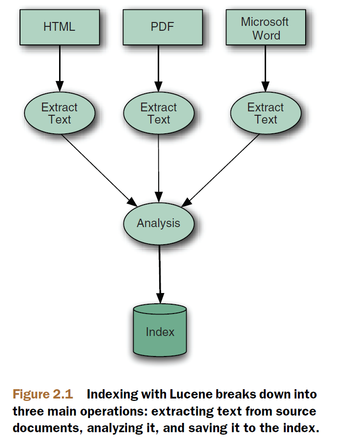
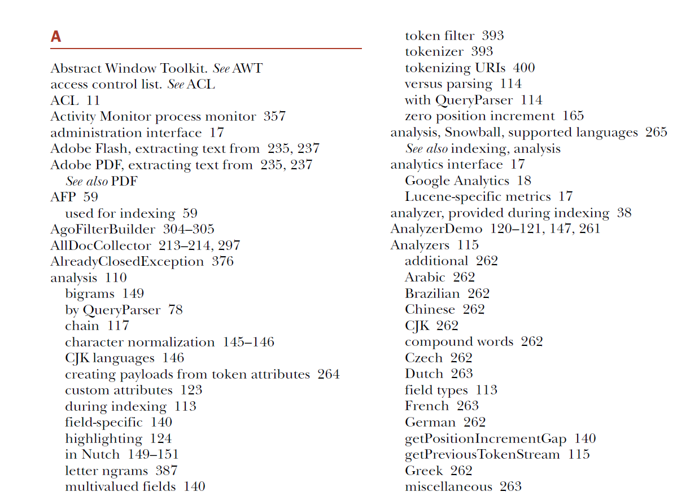
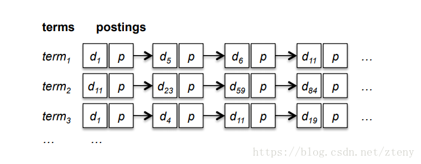
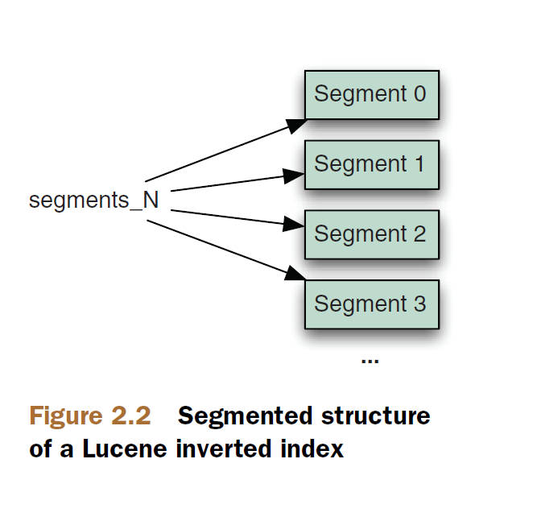

## 2.2 理解索引过程 Understanding the indexing process ##

&emsp;&emsp;索引一个文件只需要调用 Lucene 公用 API 的几个方法即可完成。结果是，从表面上看，用 Lucene 进行索引操作是一个简单而独立的操作。然而，隐藏在这些简单 API 背后的却是一套巧妙而相对复杂的操作，可以将它们划分为三个主要且功能上不同的组，如图 2.1 所示（本图来源于 Lucene in Action second edition）。

&emsp;&emsp;在索引期间，文本首先从原始内容中提取出来，并用于创建 Document 实例，该实例包含多个 Field 实例，它们都用来保存原始内容信息。域中的文本被分析产生出词元流(a stream of tokens)，最后，这些词元被加入到分段结构的（in a segmented architecture）索引中。

  

## 2.2.1 提取文本和创建文档 Extracting text and creating the document ##

&emsp;&emsp;使用 Lucene 索引数据，必须先从数据中提取纯文本格式的信息，纯文本是 Lucene 能够识别的信息格式，然后建立对应的 Lucene document。在第1章，我们限制示例索引和搜索 .txt 文本文件，这使我们能够轻松地得到它们的内容，并用它来操作 Field 实例。但事情并不会总是那么简单：在图 1.4 中的 "Build Document" 步骤中，实际上其背后隐藏有非常多的工作。

&emsp;&emsp;假若需要对一堆的 PDF 格式的手册进行索引，必须首先设法从这些 PDF 文件中提取出文本格式内容，然后用这些文本内容来创建 Lucene 文档和域。即便有表示 PDF 的 Java 类型，也没有可以接受这种类型的方法。在索引微软的 Word 文件和其它非纯文本的文档格式时，会面临同样的情况。即便要处理纯文本字符的 XML 或 HTML 文件，仍需要灵活考虑为索引准备数据，避免索引到 XML 元素或 HTML 标签，而只索引真正的文本数据。

&emsp;&emsp;有关提取文本的细节将在第 7 章结合 Tika 框架详细讲述，使用该框架能够很轻松地从各种格式的文件中提取文本内容。一旦有了要索引的文本，也创建了包含要索引的所有的域的文档之后，下一步，就是对这些文本进行分析了。

  

## 2.2.2 分析 Analysis ##

&emsp;&emsp;一旦创建了文档以及其中包含的域，就可以调用 IndexWriter 的 addDocument 方法以将数据写入到 Lucene 的索引中去。在索引过程中，Lucene 首先对文本进行分析，这是一个将文本数据分割成词汇单元流(stream of tokens)，并对这些词汇单元执行一些可选的操作的过程。例如，在被索引之前，利用 Lucene 的 LowerCaseFilter，将词元转换为小写形式，以便搜索时忽略大小写。通常，利用 StopFilter，从输入的语汇中移除所有的停用词(stop words)也是很有意义的，停用词是指一些使用很频繁但没有实际意义的语汇(例如，英语文本中的 a, an, the, in, on 等等)。类似地，处理输入的语汇以使其回归到它们的词根也是很常见的，例如使用 PorterStemFilter 来处理英文文本(对于其他语种，lucene-analyzers-common 模块中有许多类似的类可以使用)。联合将原始数据转换为词元的**分词器（tokenizer）**，随后连接一系列修正这些词元的**过滤器（filters）**，一起构成了**分析器（analyzer）**。也可以通过把 Lucene 的分词器和各种过滤器连接在一起，或者自定义的方式，自由构建自己的分析器。

&emsp;&emsp;这个重要的步骤，也就是在图 1.4 中表示为 Analyze Document 步骤，称之为**分析（analysis）**。输入到 Lucene 中的数据，可以被多种有趣且实用方式分析，具体细节在第4章详细阐述。分析过程产生词元流，然后这些词元被写入到索引的文件中。

  

## 2.2.3 向索引添加数据 Adding to index ##

&emsp;&emsp;对输入数据分析完毕后，就准备好将分析结果写入索引中。在 Lucene 中，向索引库写数据的基本单元称之为 Document。Lucene 的 Document 中给出了明确的定义：
1. 文档（Document）由域（Field）构成，是 Field 的集合。
2. 域（Field）是词项（Term）的集合。
3. Segment 是最小的独立索引单元，由多个 Document 构成。

### 倒排（反向）索引 Inverted Index ###
&emsp;&emsp;Lucene 以一种称为 **倒排索引（inverted index）** 的数据结构存储输入数据。这种数据结构能够有效利用磁盘空间，同时可以快速进行关键字查找（quick keyword lookups）。这种结构之所以是反向的（inverted）,是它把从输入文档中提取出来的词元（token）作为查找的键(key)，而不是把文档作为中心实体，很像本书的索引，每一个概念阐述的位置引用一个书中的页码。换句话说，这种结构不是为了回答这样的问题“这个文档中含有哪些单词（What words are contained in this document?）”，而是经过优化来提供快速回答“**某个单词包含在哪些文档中（Which documents contain word X?**）”，是 **词到文档的映射结构**，因此称之为倒排索引。

下面的图片是本书原版索引的部分片段切图：

图：本书索引的部分内容

 

回想一下自己喜欢的 web 搜索引擎和最常用的查询方式，会发现上述查询方式正是我们想要的最快的查询方式。当代 web 搜索引擎核心都采用倒排索引技术。

>倒排索引由两部分组成，所有独立的词（Lucene 术语中的 term，意为词或词项）组成的列表称为**索引（Index）**，词对应的一系列的含有该词的文档组成的表统称为**倒排表（Postings list）**。

下图来源于网络，说明倒排索引的整体逻辑结构：

&emsp;&emsp;从图中可以看出，整个倒排索引分两部分：图中左边部分 terms 表由 term1, term2, term3...组成，称为索引表。图中右边部分 postings 表由各个 term 所对应的文档 d1, d5, d6, d11... 以及该 term 在文档中一些附加信息 p（例如 term 在文档中词频、位置、在原始文本数据中的位置偏移量、附加数据等）组成，称为倒排表（Postings List）。

1. **索引或索引表或词典（Lexicon）**: 倒排索引并不需要扫描整个文档集，而是对文档进行预处理，识别出文档集中的每个词，即通过分析过程（analysis）产生大量的词或词元，在 Lucene 术语中称为 Token，再由 Token 构成 Lucene 用于表示可存储和搜索的语汇数据结构词项（Term）。至此，表示词元的概念 token 的使命结束，在写入索引和之后的搜索过程中，都以 Term 为单位进行，不再有 Token 的概念。因此索引表也称为 Term Dictionary，简称为 Dictionary，是由一系列的 Term 组成的表。词典内每条索引项记载单词本身的一些信息以及指向“倒排表”的指针。Terms Dictionary 的文件后缀称为.tim，它是 Term 与 Postings 的关系纽带，存储了 Term 和其对应的 Postings 文件指针。
2. **倒排表（Postings List）**: 由每个 Term 对应的 Postings 组成。倒排列表记载了出现过某个单词的所有文档的文档列表，以及单词在该文档中出现的位置信息，每条记录称为一个倒排项或倒排记录(Posting)。根据倒排列表，即可获知哪些文档包含某个词（由 term 表示），以及该词项在每个文档中的具体位置、词频等信息。Postings 信息分别存储在 .doc、.pay、.pox，分别记录 Postings 的 DocId 信息和 Term 的词频、Payload 信息、pox 是记录位置信息。

>NOTE: 可以把整个索引想象为一个数据库，但它没有传统的关系型数据库的概念，没有所谓的主键（primary key）关联关系，因此，词典内每条索引项除了要单词本身的一些信息外，还有指向“倒排表”的指针。同理，索引数据库也没有关系型数据库中 table 中的概念，因此，它使用 Postings List 术语表示倒排表的语义。

&emsp;&emsp;可以用一个 HashMap 来简单描述这个结构：Map&lt;String, List&lt;Integer&gt;&gt;，这个 Map 的 Key 的即是 Term，那它的 Value 即是 Postings。所以它的 Key 的集合即是Dictionary 了。

&emsp;&emsp;全文搜索引擎通常是需要存储大量的文本，Postings 可能会占据大量的存储空间，同样 Dictionary 也可能是非常大的，因此上面说的基于 HashMap 的实现方式几乎是不可行的。在海量数据背景下，倒排索引的实现都极其复杂，因为它直接关系到存储成本以及搜索性能。为此，Lucene 引入了多种巧妙的数据结构和算法。Lucene 为我们做了大量的数据结构和算法方面的工作，而且随着版本的更新，这些结构和算法会不断优化已提升索引和搜索的性能。作为应用者，我们不必过于关心 Lucene 的底层实现细节，而应将关注点放在 Lucene 公开的 API 应用上，利用这些公开的 API，快速建立索引并构建符合自己需求的搜索功能。

 

### 正向索引 Forward Index ###

&emsp;&emsp;作为全面的搜索引擎，仅使用倒排索引是不够的，还需要正向索引的支持。Lucene 使用正向索引来存储词元在某个文档中的出现的词频、位置、偏移量等信息，这些信息称为词项向量 TermVector。有了这些信息，就可以在搜索结果中准确的位置对搜索关键词进行高亮显示。

&emsp;&emsp;可以用一个 HashMap 来简单描述这个结构：Map&lt;Integer, List&lt;Term&gt;&gt;，这个 Map 的 Key 文档的 ID 值，即是 DocId，Value 是这文档中包含的所有词项的列表。

 

### 索引段 Index Segments ###

&emsp;&emsp;Lucene 的索引文件格式丰富而详细，而且它随着时间的推移不断地被优化和演化，Lucene 在每个版本升级时都有可能会升级索引文件的版本，以适应不断演化的索引数据结构和底层算法。尽管在使用 Lucene 之前并不需要知道该格式的细节，但还是建议在较高层次上对它有一些基本的理解。

&emsp;&emsp;Lucene 索引都包含一个或多个段（Segment），如图 2.2 所示。

每个段都是一个独立的索引，它包含整个索引文档的一个子集。每当 writer 将缓存中被加入的文档和等待删除的文档刷新到索引目录，都会创建一个新的段。在搜索时，每个段都是单独访问的，但搜索结果是合并后返回的。

&emsp;&emsp;每个段包含多个文件，文件名格式为 \_X.<ext>，这里 X 代表段的名称，<ext>为文件扩展名，用来标识该文件对应索引的某个部分。由分开的文件存储索引的不同部分（词项向量 term vector，存储的域 field，反向索引 inverted index，等等）。如果使用复合文件格式（默认是启用的，但可以通过 IndexWriterConfig 类的 setUseCompoundFile() 方法修改默认行为），那么上述各个文件会被合并为一个文件：\_X.cfs。这种方式能在搜索期间减少打开文件描述符的数量，但会有一些搜索和索引时的性能损失。

&emsp;&emsp;索引中有一个特殊的文件，称为**段文件(segments file)**，文件名为 **segments\_N**，此文件会引用所有活动的段(segment)，**这个文件非常重要！** Lucene 首先打开这个文件，然后才打开由它所引用的每个段文件。N 的值，称为“代（the generation）”，它是一个整数，Lucene 每次向索引提交更改时会讲这个值加 1。

&emsp;&emsp;久而久之，索引会积累很多的段，特别是当程序打开和关闭 writer 较为频繁时。这是没问题的，IndexWriter 会周期性地选择一些段将它们合并到一个新的段中，然后删除这些旧的段。合并段的选取策略由独立的 MergePolicy 类控制，顺便提一句，MergePolicy 是抽象类，Lucene 默认使用 TieredMergePolicy 这个具体的类来执行选取策略。一旦选择好这些段，具体的合并操作由 MergeScheduler 类执行。MergeScheduler 也是抽象类，Lucene 默认使用 ConcurrentMergeScheduler 具体类执行合并操作。这些类是高级主题，在 2.13.6 节中详述。

