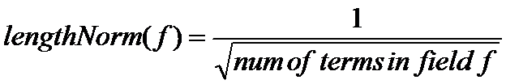

## 2.4 域选项 Field options ##

&emsp;&emsp;Field 类也许是文档索引期间最重要的类了：它是持有索引原始数据真正的实体对象，也是控制如何将该条数据加入到索引数据库中的控制单元。在 IndexWriter 对该条数据进行索引时，就是根据 Field 的域类型选项来对该 Field 上持有的数据进行索引的。上一节介绍过，它是真正携带数据内容的实体，代表 Document 集合中元素的抽象类型。每个域由由三部分组成：名字 name、类型 type、值 value。值可以是文本数据（String, Reader 或预分析的 TokenStream 类型），二进制数据（byte[] 类型），或者数值型数据(Number 类型)。Field 携带的原始值可以存入索引，也可以不存入。是否存入，是可选的，通过域类型选项进行控制。如果在索引时将这条数据存入索引，那么它就可以在搜索时，一字不差地从搜索结果中取回来，就如它传递给 Field 之前的样子。当然也并不是说所有的值类型数据都能存储，例如，Reader 和 TokenStream 类型的值就没办法存储，因为在传递给 Field 之前并，程序并不知道该值真正完整的原始内容。

&emsp;&emsp;最初的 Field 类没有域类型概念（Field Type），通过十多个重载的构造器为数据处理方式提供选项。Lucene 4.0 之后，引入了 **IndexableFieldType** 接口及其实现类 **FieldType** 来作为 Field 的数据处理方式选项的提供者。新版 Field 构造器的每一个版本都必须提供一个 IndexableFieldType 类型的参数作为域的类型传递给构造器，Lucene 通过这个类型参数的详细配置信息控制索引时数据的处理方式。作用类似于 IndexWriter 的 IndexWriterConfig 构造器参数。

&emsp;&emsp;FieldType 是 IndexableFieldType 的具体实现类。实际应用时，我们通过 FieldType 实例配置域类型的具体选项信息。Lucene 为 FieldType 类的每个选项都设置了默认的选项，创建实例之后不需要任何配置就可以直接使用。

&emsp;&emsp;域选项分为几个独立的类别，我们在接下来的几个小节分别讨论这几个类别：索引选项、存储选项、词项向量(term vector)，之后，会探讨域的值类型话题。

&emsp;&emsp; 在进入选项细节之前，为了清晰展现 Field 类的关键信息，先列出当前版本（Lucene 8.11） Field 类的构造器：
-  **Field(String name, byte[] value, IndexableFieldType type)** 使用二进制值创建域。
-  **Field(String name, byte[] value, int offset, int length, IndexableFieldType type)** 使用二进制值创建域。
-  **Field(String name, BytesRef bytes, IndexableFieldType type)** 使用二进制值创建域。
-  **Field(String name, CharSequence value, IndexableFieldType type)** 使用字符串值创建域
-  **Field(String name, IndexableFieldType type)** protected: 高级应用，没有初始值创建域。仅用于自定义子类。
-  **Field(String name, Reader reader, IndexableFieldType type)** 通过 Reader 作为值创建域，实际上是读取 Reader 中的文本数据。
-  **Field(String name, TokenStream tokenStream, IndexableFieldType type)** 使用 TokenStream 作为值创建域，实际上是读取 TokenStream 中的词元（token）。

&emsp;&emsp;以上 7 个重载构造器表明了 Field 类的三个重要组成部分：name, value, type，是 Field 类型的三个必须的要素。其中字符串类型的 name 定义了域的名字，是识别该域的标识信息，也是搜索时 Term 对象关联域的信息，类似于数据库中的列名（column name）概念。IndexableFieldType 类型的 type 参数就是我们下面各小节要详细讨论的域选项信息。重载构造器的区别主要在于域值类型的差异，也是后面小节要重点讨论的内容。

<br/><br/>
<a id="1"></a>
## 2.4.1 域索引选项 Field options for indexing ##

&emsp;&emsp;域的索引选项通过 **FieldType.setIndexOptions(IndexOptions value)** 方法配置，控制哪些信息存储到倒排索引的倒排表（posting lists）中，搜索时可以利用这个域的哪些信息。

IndexOptions 是一个枚举值，不同的索引选项类型会直接影响查询和评分效果，具体有如下选项：
- **DOCS** 索引这个域，但不存储词频信息和位置信息。在这个域上进行短语查询以及其它与位置相关的查询会抛出异常。由于没有词频信息，进行搜索评分的时候，其行为就好像任何词项在文档中仅出现 1 次。FieldType 的默认值。
- **DOCS_AND_FREQS** 索引这个域和其中的词频信息，位置信息被忽略。这使其可以正常参与评分计算，但在这个域上进行短语查询以及其它与位置相关的查询会抛出异常。
- **DOCS_AND_FREQS_AND_POSITIONS** 索引该域的数据、词频、以及位置信息。这是典型的全文搜索的默认选项：完全的评分和位置查询都支持。
- **DOCS_AND_FREQS_AND_POSITIONS_AND_OFFSETS** 索引该域的数据、词频、位置信息、以及词元在原文中的位置偏移量。字符偏移量通过编码与位置信息放在一起。
- **NONE** 不索引。也就是说，这个域的内容不会加入到倒排表中，也就不会有任何查询通过这个域进行查询。

&emsp;&emsp;在建立倒排索引时，应使用 DOCS_AND_FREQS_AND_POSITIONS 索引选项，来存储索引必要的信息来实现向量空间模型（Vector Space Model）。该模型要求每个词项（term）在原文中出现的次数，也就是词频（term frequency），以及每个词项在原文中出现的位置，这是必要的，例如，为了支持短语查询。但有时候，可能某个域只用于纯粹的布尔查询，并不需要它贡献相关性评分，这样的域只是用于过滤，例如权限过滤和日期过滤。这种情况下，就不需要词频和位置信息了，通过设置索引选项为 DOCS 选项值来达到目的。该选项可以节省一部分索引所占用的磁盘空间，并且可以提升搜索和过滤速度。但会阻止需要位置信息进行搜索的执行，例如，短语查询（PhraseQuery）和跨度查询（SpanQuery）。

<br/><br/>
<a id="2"></a>
## 2.4.2 域存储选项 Field options for storing fields ##

&emsp;&emsp;域存储选项用于确定域所持有的原文是否需要存储，以便搜索时取回该域所持有的原始域值。域原始值的存储不是在索引的倒排表中，而是在另外的地方。它并不参与搜索，只是搜索时可以从搜索结果中取回。

&emsp;&emsp;域存储选项通过 FieldType.setStored(boolean value) 方法设置，true 为存储，false 为不存储。
- **true** 表示存储该域值。这种情况下，原始数据会按原样全部保存在索引中，并可以通过 IndexReader 类获取回该值。 该选项对于需要显示在搜索结果中的域非常有用，例如 URL、标题（title）、数据库主键（primary key）。不要存储值特别大的域，因为这样的域会消耗索引存储空间。
- **false** 表示不存储该域的值。该选项通常与 FieldType.setTokenized(true) 配合使用，来分析大的文本域，而不需要在搜索时取回其原始文本。例如网页的正文，或其它类型文本文件的正文内容。


<br/><br/>
<a id="3"></a>
## 2.4.3 域的词项向量选项 Field options for term vectors ##

&emsp;&emsp;有些时候，我们索引了某个文档，想要在搜索时获取这个文档内包含的所有的词项信息。一个常用的场景是加快在已存储的域文本上高亮显示匹配的语汇（token）。另一个应用场景是建立所谓“查找相似文章”的连接，当点击这个链接时，会使用源文档中重要的词项，运行一个新的搜索。还有一个应用的例子是自动分类文档。第 5.9 节给出使用 term vectors 具体例子。

&emsp;&emsp;那么到底什么是的 **词向量（term vectors）** 呢？它是介于索引的域和存储的域一种中间结构。它类似于存储的域，是因为给定一个文档，可以快速地获取这个文档内所有的词向量的域（term vector field）：首先，term vector 使用文档 ID 作为键，然后，以 term 作为第二级键来存储实际是数据，这意味着词向量在一个文档内部存储为一个小型的倒排索引。与存储域不同的是，存储域是将域的原始内容原封不动地存储到索引中，而词向量 term vector 实际上存储的是已被分析器处理过的单个的词项（term），这样，在一个给定的文档内，就可以获取到每个域所有的词项，以及它们出现的频率，存储是按词汇顺序的。由于分析器输出的词元 token 中含有词的词频、位置、偏移量，以及附加的 payload 信息，因此 term vector 中也可以存储这些信息。Lucene 把词向量 term vecotr 所有信息都记录在同一个文件 .tvd 上。

&emsp;&emsp;为了表述方便，我们用一个 TermMeta 数据类型来作为词项在原始文本中的词频、位置、偏移量、附加数据 payload 这些信息的载体，表明这个类型里面包含着 term 的一些元数据信息。有了这个类型之后，用一个 Map 来描述 term vector 的逻辑结构就比较方便了：**Map&lt;Integer, Map&lt;Term, List&lt;TermMeta&gt;&gt;&gt;**，外层 Map 的 Key 是文档的 ID 值，即是 DocId，Value 是这文档中所包含的所有 term 及其元数据组成的列表，也由一个 Map 表示，我们把它称为二级 Map。把这个二级 Map 单独拿出来分析：**Map&lt;Term, List&lt;TermMeta&gt;&gt;**，很明显，它的 key 是 term，value 是一个 TermMeta 的 List。回顾倒排索引的结构，可以看得出，这就是在一个文档内部建立的一个小型的倒排索引，只是在这个小型倒排索引中，倒排表的每一项，没有d1, d5, d6, d11... 这些标识文档的信息，因为 DocID 已经由外部 Map 结构的 key 确定了。但每一个项的元数据信息，如词频 term frequency、位置 position、偏移量 offset，附加数据 payload 等信息，由 TermMeta 携带。再从外层 Map 观察这个结构，类型为 Integer 的键，表示文档 ID 号，value 是由另一个 Map 定义的 term 与元数据数据的列表，这又是一个典型的正向索引结构。当然，没有 TermMeta 这样的数据结构的定义，Lucene 实际上也不是通过 List&lt;TermMeta&gt;这样简单的结构存储 term 元数据的，这里只是为了说明 term vecotr 逻辑结构而进行的简单示意。

&emsp;&emsp;最后还有个问题就是为什么词向量 term vector 里面会带向量 vector 这个词呢？词向量一词并非 Lucene 中发明的概念，而是 IR 领域的一个概念，再细点就是 Vector space model 文本相似度模型中的概念。将 term 转化成向量空间之后，我们就可以使用余弦相似度（cosine similarity）来计算我们搜索语句与索引中 document 之间的相似度了。例如本节开始提到的“查找类似文章”，以及“推荐阅读”之类的应用会用到这种算法。

&emsp;&emsp;显然，对 term vector 的存储，增大了索引文件空间。但却加快了获取文档内数据信息的速度，是典型的以空间换时间的方法。这种方法在 Lucene 中有很多，后面介绍的 DocValues 概念也是其中之一。

&emsp;&emsp;现在来看看在索引时 FieldType 如何控制对词向量的处理，调用 FieldType 类如下方法：
- **setStoreTermVectors(boolean value)** 如果该域索引的格式（field's indexed form）也存储到词向量中，设置为 true 值，与该域的 IndexOptions 设置一致。
- **setStoreTermVectorPositions(boolean value)** 索引该域也把词元的位置信息存储到词向量中，设置为 true 值。
- **setStoreTermVectorOffsets(boolean value)** 索引该域也把词元字符的偏移量信息存储到词向量中，设置为 true 值。
- **setStoreTermVectorPayloads(boolean value)** 索引该域也把词元的附加数据 payload 存储到词向量中，设置为 true 值。

&emsp;&emsp;以上这些选项默认都是关闭的，即默认值都是 false, 也就是说，不启用词向量 term vectors 存储。要开启后面 3 个任何选项，必须首先开启第一个 setStoreTermVectors(true) 选项。


<br/><br/>
<a id="4"></a>
## 2.4.4 域分析选项 Field options for analysis ##

&emsp;&emsp;这个选项很好理解，就是控制这个域的值是否使用分析器进行分析。对于文本类型的域，有些数据是不需要进行分析的，比如 url、 email 地址、md5 字符串值、人名、地名等等。另外，Lucene 的域目前还支持二进制数据和数值数据，这些也是不需要使用分析器进行分析。只有那些对搜索有意义的文本才需要使用分析器进行分析，比如文章标题、描述、摘要、文章正文等。

&emsp;&emsp;FieldType 通过 **setTokenized(boolean value)** 方法控制该域是否使用分析器分析进行分析，true 表示分析，false 表示不分析，默认值为 true。

<br/><br/>
<a id="5"></a>
## 2.4.5 域的 DocValuesType 选项 Field options for DocValuesType ##

&emsp;&emsp;**DocValues** 是 Lucene4.0 正式引入的新特性，通过正向索引（forward index）实现。它存储文档编号到域值正向关系的索引，目的是取代 FieldCache 的设计，以在搜索时发挥重要作用，消除搜索时需要加载倒排索引构建 FieldCache 引起性能影响。DocValues 以牺牲少量的索引占用空间来换取搜索性能的提升，这又是一个以空间换时间方案的体现。

&emsp;&emsp;倒排索引是搜索的核心，它的优势在于查找包含某个词项（term）的文档时非常高效，其结果是一批表示文档的 DocID 号码。而对于从搜索结果中要获知某个文档中存在哪些唯一的词项（Term）就力不从心了。Lucene 的 DocValues 不同于 document 文档级的存储，它是一个面向列的存储结构，正向索引存储的是文档的 DocID 号码到域的值这种正向映射关系，可以非常高效地解决倒排索引所不擅长的问题，并且这种正向索引对搜索结果的排序和统计等处理也给出了很多可能性。

例如下面是一个倒排索引的例子：

<div align=left></div>

如果我们想要获得所有包含 brown 的文档的词的完整列表，我们会创建如下查询：

```java
TermQuery q = new TermQuery(new Term("body", "brown"));
```

&emsp;&emsp;查询部分简单又高效。倒排索引是根据项来排序的，所以我们首先在词项列表中找到 "brown"，该项中有指向倒排表（postings list）中一条记录的指针，通过这个指针，可以快速定位到对应的记录。记录里包含着含有这个 term 的文档编号记录，零个或者多个。如果索引足够大，这个条记录里可能会有成千上万个 DocID 记录，不论有多少，倒排索引都可以快速地返回这些结果。在我们的这个例子里，可以快速地得到包含 "brown" 这个 term 的文档是 Doc_1 和 Doc_2。

&emsp;&emsp;然后，对于聚合部分，我们需要找到 Doc_1 和 Doc_2 里所有唯一的词项。用倒排索引做这件事情代价很高：我们会迭代索引里的每个词项并收集 Doc_1 和 Doc_2 列里面 term。这很慢而且难以扩展：随着词项和文档的数量增加，执行时间也会增加。

Docvalues 通过转置两者间的关系来解决这个问题。倒排索引将词项映射到包含它们的文档，而 Docvalues 是将文档映射到它们包含的词项，如下图所示：

<div align=left></div>

当数据被转置之后，想要收集到 Doc_1 和 Doc_2 的唯一 term 会非常容易。获得这两个文档的行，获取每个文档的所有词项，然后求两个集合的并集就快速地得到想要的结果。

&emsp;&emsp;我们也用 Map 来看看正向索引的 DocValues 结构：Map&lt;Integer,​ list&lt;Term&gt;&gt;，Integer 类型的 key 表示文档的 DocID，而 value 是这个文档中包含的所有的 term 所组成的列表。可以看出，同为正向存储，DocValues 与词向量 TermVector 有明显不同，词向量存储的是词项在原始文档中一些记录信息，这些信息来源于分析器输出的词元信息 token，包括词频、位置、偏移量、附加数据。而 DocValues 中记录的是它的值，即 term 的内容，侧重于值（value），比如我们这个例子中 "body" 这个域中所包含的每一个单词、销售数据中商品的价格、销售量等实际的值信息。

&emsp;&emsp;因此，搜索和聚合是紧密关联的。搜索使用倒排索引查找文档，对搜索结果进行聚合、排序、分组等需要 DocValues 里的数据。

&emsp;&emsp;在索引时，文档的域（Field）可以选择性地存储其 DocValues 值，是否索引，完全取决于应用的需要。获取到搜索结果之后，如果要在这个域上进行聚合操作、排序操作（比如按商品销售价格排序、按销售量排序、按价格区间过滤结果、按地域过滤等）就应该存储其 DocValues，而有些域是主要是为了搜索（比如商品名称、流行语、行业主题等），就没有必要为其存储 DocValues 值了。

&emsp;&emsp;FieldType 通过 **setDocValuesType(DocValuesType type)** 方法控制域的 DocValuesType 选项，DocValuesType 是枚举类型，Lucene 为控制域的 DocValues 处理提供了如下选项：
- **NONE** 该域不进行 DocValues 存储。这是 FieldType 的默认值，也就是说，对于一个新创建的 Field 对象，默认是不存储其 DocValues 的。
- **BINARY** 该域每个文档存储一个完整的字节数组，就是说不与其它文档共享或部分共享数据。值可能超过 32766 字节，但不同的编码可能有其自己的限制。
- **NUMERIC** 每个文档单独存储的数值型域（Number）。
- **SORTED** 预先排好序的 byte[] 类型。这种类型域值只存储它自己不同部分的字节值，而另外相同部分的数据存储在共享的字节数组中，每个文档会存储另外一个偏移量指针，用于指向共享字节数组。也就是说，SORTED 选项的域，将域的值拆分成两个部分，不同的部分自己存储，相同的部分与其它文档共享，只存储一份。这种结构不仅降低了索引文件空间的大小，还优化了数据比较，只比较其中一小部分不同的数据就可以了，而相同部分的数据不必参加比较，这正是数据排序功能所需要的。存储的域值可以通过文档 id （DocID）、序号（ordinal）访问。要求域值数据必须小于或等于 32766 个字节。
- **SORTED_NUMERIC** 预先排好序的数值类型，数据以 Number[] 类型存储。这种类型的域存储数字型值时，根据 Java 语言原生方法 Long.compare(long, long) 排序顺序存储。 
- **SORTED_SET** 预先排好序的 `Set<byte[]>` 类型。数据存储方式与 SORTED 选项一样，域值只存储它自己不同部分的字节值，而另外相同部分的数据存储在共享的字节数组中，每个文档会存储另外一个偏移量指针，用于指向共享字节数组。也就是说，SORTED_SET 选项的域，将域的值拆分成两个部分，不同的部分自己存储，相同的部分与其它文档共享，只存储一份。这种结构不仅降低了索引文件空间的大小，还优化了数据比较，只比较其中一小部分不同的数据就可以了，而相同部分的数据不必参加比较，这正是数据排序功能所需要的。存储的域值可以通过文档 id （DocID）、序号（ordinal）访问。要求域值数据必须小于或等于 32766 个字节。

第 5.1 节更深入地讨论 DocValues 的技术细节。


<br/><br/>
<a id="6"></a>
## 2.4.6 域的 Norms 选项 Field option for Norms ##
&emsp;&emsp;**Norms** 的全称是 “Normalization Factor”，称为归一化因子。它是 Lucene 相关性评分（scoring）计算公式中的一个因子，这个因子会影响文档的最终相关性评分结果。在搜索过程中，搜索出的文档按与查询语句的相关性排序，相关性大的文档评分(score)就更高，因此排在前面。归一化因子会影响搜索时返回的多个匹配文档在最终结果中的排列顺序。

&emsp;&emsp;Norms 数值是在索引时根据域中唯一性 term 的数量以及其它一些因素计算的，并保存到最终索引中。最初的 Norms 计算公式如下图所示（本图来源于网络）：

<div align=left></div>

**norm(t, d)**：表示某个 term 在文档中的归一化因子，它包括三个参数： 
- Document boost：此值越大，说明此文档越重要。 
- Field boost：此域越大，说明此域越重要。 
- lengthNorm(field) = (1.0 / Math.sqrt(numTerms))：一个域中包含的唯一性 Term 总数越多，即文档越长，这个值越小，文档越短，这个值越大。

各类 Boost 值：
- d.getBoost()：文档权重，在索引阶段写入 nrm 文件，表明某些文档比其他文档更重要。
- f.getBoost()：域的权重，在索引阶段写入 nrm 文件，表明某些域比其他的域更重要。
- t.getBoost()：查询语句中每个词的权重，可以在查询中设定某个词更加重要，common^4 hello

&emsp;&emsp;这是 Lucene 早期版本计算公式，随着 Lucene 的版本升级演变，这个计算公式已经发生微妙的变化。其中文档权重即 Document.getBoost()/Document.setBoost(float boost) 已从 Lucene 4.0 版移除。域权重 Field.setBoost(float boost)/Field.getBoost() 从 lucene 6.5 被标记为 @Deprecated 并且在 Lucene 7.0 版被移除。并且建议：
>Deprecated. Index-time boosts are deprecated, please index index-time scoring factors into a doc value field and combine them with the score at query time using eg. FunctionScoreQuery.

也就是说当前版本的 Norms 计算可以简化为：

>norm(t, d) = lengthNorm(field) = (1.0 / Math.sqrt(numTerms))

如下图所示（本图来源于网络）：

<div align=left></div>

&emsp;&emsp;计算公式可能随 Lucene 版本的迭代，会有微小的变化，但 Norms 归一化因子的总体思想基本是：一个域中包含的唯一性 Term 总数越多，即文档越长，Norms 值越小，那么相关性评分也就会越低。相反，域中包含的唯一性 Term 越少，表明文档越短，Norms 值就越大，相关性评分也就会越高。

&emsp;&emsp;Lucene 评分计算是一个复杂的过程，其中需要很多数据作为支撑，这些数据可以划分为两个部分：一部分可以在索引期间获得或计算的静态数据，这些数据在索引时一经得到，除非这个文档被删除，否则就不会发生改变。这类数据一般是评分计算公式中与查询语句无关的参数，例如这个归一化因子 Norms 就是其中之一。因此，在索引期间可以选择性地将这部分数据存储到索引中。Norms 数据会存储在索引中以 .nrm 扩展名标识的文件中。评分计算的另外一部分数据发生在搜索过程中，会在搜索章节做深入讨论。

&emsp;&emsp;在索引期间，域默认是记录 Norms 值的，但出于某些原因，比如为了减少索引文件的大小，可以通过 **FieldType.setOmitNorms(true)** 方法来禁用对某个域归一化因子的计算和存储，默认值为 false，即默认情况下开启对域归一化因子的计算和存储。

<br/><br/>
<a id="7"></a>
## 2.4.7 数值数据的维度选项和维度数据占用字节数选项 Field options for dimensionCount、indexDimensionCount and dimensionNumBytes ##

&emsp;&emsp;这三个选项和值类型为数值型（Number）的域相关。

&emsp;&emsp;对于传统版本，Lucene 对数值型数据的处理使用几个简单的域类型表示：DoubleField、FloatField、IntField、LongField。从 6.0 版开始，Lucene 引入了 PointValues 数据概念，用于表示地理位置信息的索引和查询操作，地理信息经常表示为二维或三维空间的数据，但这种数据类型也可以表示一维的纯数值数据，或者更多维数空间的数据。得益于 PointValues 的优秀设计，它在多维数值和多维数值区间的索引和搜索操作上表现得非常出色，并且可以将任何数量维度的数值统一为一种实现。因此，从 Lucene 6.0 开始，PointValues 已成为数值型数据事实上的标准，所有数值型域都以 PointValues 作为默认实现。由 PointValues 引入 IntPoint、LongPoint、FloatPoint、DoublePoint 多维数值域类型。而传统的数值型域类型 DoubleField、FloatField、IntField、LongField 被更名为带有 Legacy 前缀的类名，并被标注为废弃内容 @Deprecated，最终在 Lucene 7.0 版被移除。

&emsp;&emsp;PointValues 采用新存储结构: BKD-Tree(KD-Tree的变种)。KD-Tree 主要应用于多维空间，范围搜索和邻近搜索。BKD-Tree 是基于 KD-Tree 实现的数据结构，它有高效的 IO 性能、更高磁盘利用率等优点。基于 BKD-Tree 实现的 IntPoint、LongPoint、FloatPoint、DoublePoint，不管是索引的性能，还是在搜索的性能都比原先的 TrieField 的性能更加高，索引文件也更小，尤其是搜索时占用 Heap 内存要小很多。PointValues 是一个非常有价值的特性，它并不只是适用于多维的空间搜索，在一维场景下的性能也非常优异。

&emsp;&emsp;由于最初用于地理信息中表示某个点（point）的原因，这些类都具有一个 Point 后缀。

&emsp;&emsp;dimensionCount 和 indexDimensionCount 都可以理解为是点（Point）的维度数，类似于数组的维度，表示某个点由几个数值表示。例如一维空间由 1 个维度表示，二维空间由 2 个数值表示，三维空间由 3 个数值表示等等。indexDimensionCount 表示索引几个维度，例如 dimensionCount 值为 4，表示一个四维空间点的数据，但索引时，只索引三个维度的数据，即 indexDimensionCount 值为 3，那么第四维度的数据就不进行索引了，这样可以减小索引文件空间尺寸和增加搜索过滤性能。dimensionNumBytes 表示点（Point）的每一个维度中的数据占用的字节个数，例如 IntPoint 和 FloatPoint 占用 4 个字节，LongPoint 和 DoublePoint 则占用 8 个字节。

FieldType 使用如下方法配置这三个选项：
- **setDimensions(int dimensionCount, int indexDimensionCount, int dimensionNumBytes)** 启用数值索引，并设置每个点的维度数和每个维度数据占用的字节数为指定的数值。其中 dimensionCount 表示数据的维度数，indexDimensionCount 表示索引维度数。
- **setDimensions(int dimensionCount, int dimensionNumBytes)** 启用数值索引，并设置每个点的维度数和每个维度数据占用的字节数为指定的数值。事实上此方法使用 dimensionCount 作为 indexDimensionCount 值，然后调用 setDimensions(dimensionCount, dimensionCount, dimensionNumBytes)方法，即数据维度数和索引维度数相同的配置。

<br/><br/>
<a id="8"></a>
## 2.4.8 FieldType 的 freeze 方法 freeze method for FieldType ##

**freeze()** 这个方法不是用于控制域 Field 的，而是控制 FieldType 本身的一个方法。为了保证 Field 在整个索引过程中的一致性，FieldType 设置好各种选项并传递给 Field 构造器之后，在索引期间，对于一个特定的 Field 对象，其选项不应该发生任何改变。为了防止其它代码对 Field 内这个 FieldType 对象的意外改变（通过 Field.fieldType() 方法可以获取这个 Field 对象内的 FieldType 实例），FieldType 提供了对其本身进行冻结的 freeze() 方法。调用了 freeze() 方法之后，对该 FieldType 实例任何选项进行设置的调用，都会引发异常。也就是说，调用 freeze() 方法之后，FieldType 变成了只读对象，再也不能对它调用任何 set*** 方法了。

>JavaDoc: Prevents future changes. Note, it is recommended that this is called once the FieldTypes's properties have been set, to prevent unintentional state changes.

&emsp;&emsp;在后面有关 Field 语法糖子类的阐述中将会看到，所有的 Field 语法糖子类的定义，在其内部定义好 FieldType 选项之后，都会调用它的 freeze() 方法，以防止使用者对其内部 FieldType 实例的选项进行随意修改。


