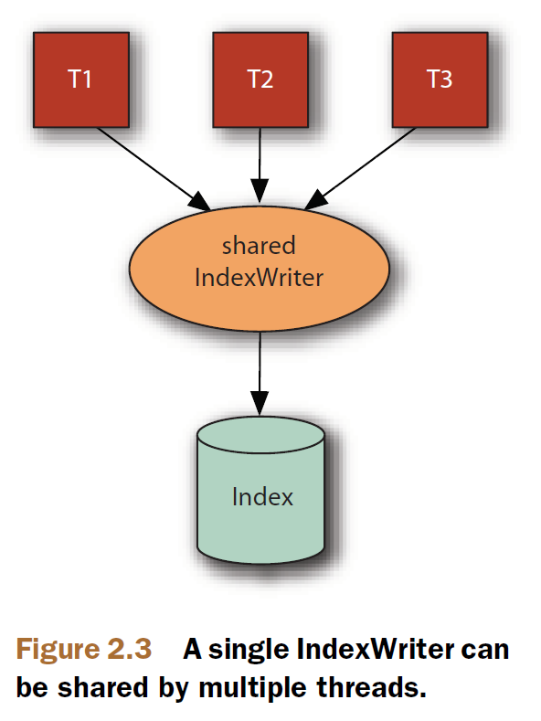

## 2.9 并发、线程安全及锁机制 Concurrency, thread safety, and locking issues ##

&emsp;&emsp;本节内容包含三个紧密相连的主题：从多个 Java 虚拟机（JVM）访问索引库，IndexReader 和 IndexWriter 的线程安全，以及 Lucene 用以实现这些规则的锁机制。全面理解这些主题是必要的，因为当我们的索引应用开始为多用户同时提供服务，或者并行扩展某些操作的规模时，这些机制会为我们消除疑问。

  

## 2.9.1 线程和多虚拟机安全 Thread and multi-JVM safety ##

&emsp;&emsp;Lucene 的并发处理规则非常简单。
- 多个线程安全的 IndexReader 可以通过 DirectoryReader.open(Directory) 在一个索引库上并发打开。无论这些 IndexReader 是否属于同一个 JVM，以及是否属于同一台计算机或多台计算机上都无关紧要。但要记住，在同一个 JVM 上，最好的资源利用和性能，是用多个线程在一个索引库上共享单个 IndexReader 实例。例如，多个线程或进程可以并行在同一个索引库上执行搜索。
- 对于一个索引来说，一次只能打开一个 writer。Lucene 使用一个写锁定文件（a write lock
file）来保障这一点。只要一个 IndexWriter 创建了，就会获得一个写锁（write lock）。只有在这个 IndexWriter 被关闭时，写锁才会被释放。
- IndexReader 即便在有 IndexWriter 正在修改索引的时候也可以打开。IndexReader 总是展示打开它时那个时间点的索引。它不会看到那个时间点之后由 IndexWriter 所做的变化，直到 IndexWriter 提交，并且这个 reader 重新打开之后才能看到。
- 任何数量的线程都可以共享同一个 IndexReader 或 IndexWriter 对象，这些类不仅是线程安全的而且是线程友好的，这意味着可以通常可以用增加线程来进行规模扩展。

下面的图来自于 Lucene in Action Second Edition

如上所述，Lucene 在多线程和多虚拟机环境上工作得很好。但如果需要通过远程文件系统来共享一个索引库，还要面对一些有趣的挑战。

  

## 2.9.2 通过远程文件系统访问索引 Accessing an index over a remote file system ##

&emsp;&emsp;如果想要不同的计算机上的不同 JVM 访问同一个索引，就必须要通过一个远程文件系统来访问这个索引。一般的配置是用一台指定的计算机在本地文件系统上进行索引写入操作，然后由多个计算机通过远程文件系统对这个索引执行搜索操作。这种配置可以工作，但是性能，通常要比在本机文件系统的索引上进行搜索要差很多（见表2.3）。把远程文件系统作为只读挂载可能会获得某些性能的提升，但最佳性能最好是，每台计算机复制索引的一份副本到本地文件系统来进行搜索操作。

&emsp;&emsp;**Solr 和 Elasticsearch**，都是构建在 Lucene 之上的企业级搜索服务器，支持开箱即用的索引复制特性（replication out of the box）。

&emsp;&emsp;如果仍执意要通过远程文件系统访问索引，那么了解其可能的限制就很重要了。不幸的是，目前流行的的远程文件系统都存在已知的问题，表2.3做了简要的总结。

表 2.3 通过远程文件系统访问 Lucene 索引相关问题

<table>
    <tr bgcolor=#AA0000>
        <th align=center>远程文件系统</th>
        <th align=center>说明</th>
    </tr>
    <tr>
        <td>Samba/CIFS 1.0</td>
        <td>Windows 标准远程文件系统。共享 Lucene 索引可以很好工作。</td>
    </tr>
    <tr>
        <td>Samba/CIFS 2.0</td>
        <td>Windows Server 2007 和 Windows Vista 的默认远程文件系统，由于其不连贯的客户端缓存问题，Lucene 在其上运行有问题。</td>
    </tr>
    <tr>
        <td>Networked File System (NFS)</td>
        <td>Unix/Linux 操作系统上的标准远程文件系统。由于其不连贯的客户端缓存，以及 NFS 在处理由其它计算机打开并持有文件的删除问题，Lucene 在其上运行有问题。 </td>
    </tr>
    <tr>
        <td>Apple File Protocol (AFP)</td>
        <td>Apple 的标准远程文件系统，由于其不连贯的客户端缓存问题，Lucene 在其上运行有问题。</td>
    </tr>
</table>

&emsp;&emsp;NFS、ASP、和 Samba/CIFS 2.0 在打开和重新打开索引时，由于其不连贯的客户端缓存的原因，都有间断性问题。问题只在 writer 刚刚向索引提交玩修改，随之另一计算机的 reader 打开时发生。那么，如果频繁地尝试重新打开 reader 和 writer并且经常向索引提交修改，就会很容易遇到这个问题。当遇到这个问题时，会在 open 方法内抛出 FileNotFoundException 异常。幸运的是，应变方法也很简单，就是过一会儿再次尝试打开操作，因为通常客户端缓存会在一定时间后自动修复本身的缓存。

&emsp;&emsp;NFS 方案尤其会面临一个更严重的挑战，即删除一个被其它计算机打开并持有文件的处理方式问题。大多数文件系统会保护打开的文件不被删除。例如，Windows 简单地不允许删除打开的文件，而大多数 Unix/Linux 文件系统允许删除操作的处理，但实际的文件仍保留在磁盘上，直到所有打开的文件句柄全部关闭（这就是所谓得到“delete on last close”语义）。以上两种方案之下，在文件尝试删除之后，被打开的文件句柄仍能读取整个文件的内容。而 NFS 与上述两个方案都不同，它直接删除文件，这样，当计算机对其打开的文件句柄进行下一次 I/O 操作时，会遇到可怕的 “过时的 NFS 文件句柄(Stale NFS file handle)” 异常。

&emsp;&emsp;为了防止这种错误对 searcher 的冲击，我们必须创建自己的 **IndexDeletionPolicy** 类来控制之前提交点（previous commit points）的删除，直到索引上所有的 searcher 都已在较新的提交点重新打开。例如，一般的做法是，一个旧的索引提交只有在过去了一段时间后，一般来说，4个小时，才删除，只要能保证一个索引提交之后，每个 IndexReader 读取索引在 4 个小时之内重新打开它自己就可以了。还有另一个办法，就是在搜索时遇到 “Stale NFS file handle” 异常时，这时可以重新打开 searcher，然后重做之前的搜索。如果重新打开一个 searcher 不会耗费太多时间的话，这是一个切实可行的方法。否则，这个不幸的查询遇到“Stale NFS file handle” 错误会耗费无法接受的时间来获得结果。

&emsp;&emsp;综上所述，Lucene 允许高度并发访问一个索引库。多个 reader 可以共享一个索引库，多个线程可以共享一个 IndexWriter 和 IndexReader，等等。唯一强制的并发限制是，不能同时打开一个以上的 writer 来操作索引库。

  

## 2.9.3 索引锁机制 Index locking ##

&emsp;&emsp;为了强制同一时刻只能有一个 writer，也就是说只能有一个 IndexWriter 对索引进行删除和修改，Lucene 使用基于文件的锁：如果索引目录中有锁文件（默认锁文件名为 "write.lock"）存在，表明当前有一个 writer 打开了索引。试图对同一个索引创建另一个 writer 会抛出 LockObtainFailedException 异常。这是至关重要的保护机制，因为如果偶尔有两个 writer 创建在同一个索引上，会很快导致这个索引被损坏。

&emsp;&emsp;Lucene 允许用户改变锁机制的实现：任何 LockFactory 子类都可以作为锁机制实现，作为参数传递给 FSDirectory 的静态方法 **open(Path path, LockFactory lockFactory)** 来打开一个索引目录。FSDirectory 还有一个不含有 LockFactory 参数的静态方法：**open(Path path)** 使用默认的锁机制打开索引，对基于 FSDirectory 的索引目录来说，默认的锁机制为 NativeFSLockFactory 实例。

&emsp;&emsp;一般情况下，我们无需考虑所使用锁的实现问题，Lucene 为我们选择的默认实现，能够很好地工作。只有那些高级的应用程序，需要在多台计算机或 JVM 上执行索引，为了调优才有可能、有必要采用自定义的锁实现。

