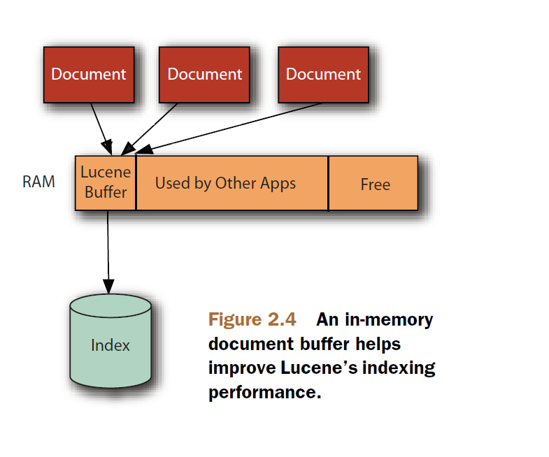

## 2.11 高级索引概念 Advanced indexing concepts ##

&emsp;&emsp;本节讨论索引的高级话题，是 Lucene 为维护索引和提高搜索效率而提供高级概念和特性。


<br/><br/>
<a id="1"></a>
## 2.11.1 索引删除策略 IndexDeletionPolicy ##

&emsp;&emsp;2.9.2 节提到过 IndexDeletionPolicy 概念。注意，它不是指对索引中文档的删除策略，而是 IndexWriter 对索引库所做提交的管理策略。一个提交，代表索引库的一个完整状态，是保存在持久存储器上的完整索引。索引库至少保留一个的提交，也可能多个。具体保留多少个提交，以及什么时候删除旧的提交，就是由 IndexDeletionPolicy 策略决定的。搜索功能的 IndexSearcher 或 IndexReader 就是在索引库中某个具体的提交上建立起来的，它表示某一时刻的索引库，或者说是某一次提交表示的索引库完整数据。IndexDeletionPolicy 是对这些前期存在的提交（prior commits）进行管理的策略。IndexWriter 允许为其指定不同的实现，用以控制什么时候把索引中的前期提交删除。这个操作是可选的，如果不特别指定，默认实现为 **KeepOnlyLastCommitDeletionPolicy** 类，它的执行策略是只要有新的提交进来，就移除前期的所有提交。创建自定义的删除策略，可以显式将索引中前期时间点的提交保持存在一段时间，或者因为这对具体的应用很有用，也或者是给索引上所有的 reader 足够的时间来刷新到新的提交，而无需删除它们之前所持有的旧提交。对于后一种情况是很有必要的，多台计算机对同一个由远程文件系统挂载的共享索引库，打开它们自己 IndexWriter 和 IndexReader，例如 NFS 系统，它不支持 "delete on last close" 语义。使用默认删除策略, 单台计算机通过 NFS 访问索引是没问题的，因为 NFS 客户端会在本地模拟 "delete on last close" 语义。即便如此，通过 NFS 访问索引很可能导致比本机 I/O 设备差很多的性能。

&emsp;&emsp;通过 IndexWriterConfig 的 **setIndexDeletionPolicy(IndexDeletionPolicy delPolicy)** 方法为 IndexWriter 设置指定的 IndexDeletionPolicy 实现，指定的策略不能为 null 值。只有在 IndexWriter 第一次创建时才有效。

IndexDeletionPolicy 是抽象类，Lucene 提供了 4 个具体实现：
- **KeepOnlyLastCommitDeletionPolicy** 默认的删除策略。只要有新的提交到来，就会删除索引中所有旧的提交。
- **NoDeletionPolicy** 保留索引的所有提交，不会删除它们。
- **SnapshotDeletionPolicy** 内部封装有另外一个 IndexDeletionPolicy 策略，并有添加和释放索引快照的能力。当持有快照时，IndexWriter 不会删除与之关联的任何文件，即便索引被频繁地任意修改。由于内部封装了另一个任意的 IndexDeletionPolicy 策略，这给了我们很大的自由度，可以继续使用这个内部 IndexDeletionPolicy 对索引进行操作。这个类在内存上维护所有快照，因此信息不会持久，也不会在系统崩溃时得到保护。如果持久化很重要，可以使用它的子类 PersistentSnapshotDeletionPolicy。
- **PersistentSnapshotDeletionPolicy** 在 SnapshotDeletionPolicy 基础上加入了持久层，因此快照可以跨程序生命周期而存在。快照持久化到一个 Directory 目录中，并且会在 snapshot() 或 release(IndexCommit) 调用时提交。把快照的 Directory 和 IndexWriter 索引的 Directory 分开为不同的目录。


<br/><br/>
<a id="2"></a>
## 2.11.2 缓存和刷新 Buffering and flushing ##

&emsp;&emsp;当向索引添加文档，或者从索引中删除文档时，它们先是被缓存到内存中，而不是立刻写入磁盘，如下图所示（图片来源于 Lucene in Action Second Edition）。

<div align=center></div>

&emsp;&emsp;这种缓存处理是出于性能的考虑，以最小化磁盘 I/O 操作。Lucene 会定期将缓存中的变化刷新到 Directory 表示的索引库中。

IndexWriter 根据两种条件来触发刷新操作，这些条件由程序控制：
- **所有新增文档占用一定数量的内存时触发**。可以通过 **IndexWriterConfig.setRAMBufferSizeMB(double ramBufferSizeMB)** 设置具体的刷新缓存大小，默认值是 DEFAULT_RAM_BUFFER_SIZE_MB，即默认刷新条件是 16 MB。也可以设置该选项为 DISABLE_AUTO_FLUSH 来禁用内存刷新条件。为了加快索引速度，应该使用较大的内存触发刷新缓存。
- **缓存中添加了足够数量的文档时触发**。可通过 **IndexWriterConfig.setMaxBufferedDocs(int maxBufferedDocs)** 设置一个具体的缓存文档数量，当缓存中新增文档数量超过这个设置值时，触发刷新操作。也将这个选项设置为 DISABLE_AUTO_FLUSH 常量值，表示不使用添加一定文档数量来作为触发刷新操作的条件，而且默认值就是 DISABLE_AUTO_FLUSH，所以默认是不开启文档数量刷新缓存的。

不论先满足哪一种条件，都会触发缓存刷新操作。刷新操作会在 Directory 表示的索库目录内创建新的段文件(segment)，以及该段所包含的其它文件。

&emsp;&emsp;注意，刷新操作把 IndexWriter 内部缓存的状态转移到索引，此时这些变化对新打开的 IndexReader 对象来说还是不可见的，除非调用了 IndexWriter.commit() 或者 IndexWriter.close() 方法，并且 IndexReader 对象重新打开才能看到索引中真正的变化。理解刷新（flush）和提交（commit）二者的区别非常重要。刷新是释放由缓存索引变化占用的内存。而提交是使所有的变化（缓存的以及被刷新的）持久化到磁盘，并在索引中可见。

刷新操作可能会触发索引中一个或多个段的合并操作，段合并操作默认情况下在一个后台线程中执行，因此不会阻塞添加文档的调用。

>**NOTE**:&emsp;当 IndexWriter 对索引进行改变时，新打开的 IndexReader 不会看到这些变化，直到 IndexWriter.commit() 或 IndexWriter.close() 被调用之后，并且 reader 重新打开才能看到这种变化。但对于新打开的近实时搜索 reader 却不同，它能立即看到 IndexWriter 之前对索引所做的修改，而不必等到 IndexWriter.commit() 或 IndexWriter.close() 调用之后。因为近实时搜索的 reader 在打开时，会强制对 writer 进行提交。


<br/><br/>
<a id="3"></a>
## 2.11.3 索引提交 Index commits ##

&emsp;&emsp;每次调用 **IndexWriter** 的 **commit()** 方法时都会创建一个索引提交。如果 **LiveIndexWriterConfig.getCommitOnClose()** 返回 **true** 值，那么 IndexWriter 在调用 close() 方法时也会调用 commit() 方法，因此会创建索引提交。commitOnClose 选项可通过 **IndexWriterConfig.setCommitOnClose(boolean commitOnClose)** 方法设置，默认为 true 值。

&emsp;&emsp;2.11.1节谈论过，一个提交，代表索引库的一个完整状态，是保存在持久存储器上的完整索引，一般是保存在磁盘上。索引库至少保留一个的提交，也可能多个。具体保留多少个提交，以及什么时候删除旧的提交，是由 IndexDeletionPolicy 策略决定的。搜索功能的 IndexSearcher 或 IndexReader 就是在索引库中某个具体的提交上建立起来的，它表示某一时刻的索引库，或者说是某一次提交表示的索引库完整数据。从这一点上看，Lucene 索引的提交（commit）有点类似于代码管理程序中的提交，比如 Git 中 commit 也有类似的概念。只是代码管理库中的提交一般不删除，而是作为整个项目的迭代历史而存在，与索引删除策略中的NoDeletionPolicy 有同样的语义。而一般情况下，Lucene 的索引是不保留这么多提交的，如果是默认删除策略，当对索引做提交时，Lucene 只保留最新的一次提交，将之前的提交全部删除。

&emsp;&emsp;对于新打开或者重新打开的 IndexReader 或 IndexSearcher 看到的只能是最后一次提交的索引，从最后一次提交到当前，IndexWriter 对索引所做的所有改变对 reader 是不可见的，唯一的例外是近实时搜索功能（**near real time, NRT**），它能看到到最近由 InddexWriter 对索引所做的更改，而不必先对这些更改做一次提交。

&emsp;&emsp;提交是一个代价高昂的操作，过于频繁调用会拖慢索引操作吞吐能力。如果由于某些原因要丢弃所有对索引做的改变，可以调用 **IndexWriter.rollback()** 方法来删除当前 IndexWriter 对索引所做的所有改变，使索引恢复到最后一次提交状态。rollback() 操作是不提交从最后一次提交以来的任何变化来关闭当前 IndexWriter 对象，或者是该 IndexWriter 打开之后一直没有进行过任何提交调用，那么 rollback() 将恢复到 IndexWriter 打开之前的状态。rollback() 调用会删除所有创建的临时文件，状态恢复到与最后一次提交一致，或与打开之前状态一致，如果期间调用了 IndexWriter.prepareCommit() 方法，也会被清除。最后，rollback() 操作关闭 IndexWriter 对象，释放索引库 write lock。

下面是 IndexWriter 在提交过程中执行的步骤：
1. 刷新缓存中的所有文档和删除操作。
2. 同步新创建的文件，包括刷新产生的临时文件，以及合并操作结束后产生的文件。IndexWriter 调用 Directory.sync() 方法来执行这一步，该调用不会立即返回，直到把所有待写入的文件内容和元数据都写入到底层 I/O 系统的稳定存储器中。这一步通常会是一个代价高昂的操作，因为它会强制操作系统刷新所有的待写入数据，这种操作对不同的文件系统有不同的代价。对于 FSDirectory 表示的目录来说，会调用操作系统的 fsync 系统调用。
3. 写入并同步下一个 segments_N 文件。一旦这一步完成，IndexReader 立即就会看到最后一次提交以来索引的所有变化。
4. 通过已配置的 IndexDeletionPolicy 策略删除旧的提交，默认是 KeepOnlyLastCommitDeletionPolicy 策略，我们可以创建自己的 IndexDeletionPolicy 策略实现，来自定义删除哪些提交，以及什么时候删除。

&emsp;&emsp;因为旧的索引文件只被最后的提交引用，在有新的提交到来并完成之前它们不会被删除，两次提交之间等待较长的时间，比频繁执行提交的操作，必然会消耗更多的磁盘空间。如果索引库与外部事务资源关联，例如数据库，那么你可能对 Lucene 提供的两段式提交的高级 API 感兴趣。


<br/>
#### 两阶段提交 Two-Phase Commit ####

&emsp;&emsp;对有些应用程序来说，需要提交一个包含 Lucene 索引和其他外部资源的事务，例如数据库，Lucene 为此提供了 **prepareCommit()** 方法。该方法完成了上面步骤列表中的 1 和 2 两个步骤，以及步骤 3 中的大部分操作，但停止于使新的 segments_N 文件对 reader 可见。执行完 prepareCommit() 方法调用之后，可以调用 rollback() 方法放弃这次提交，也可以调用 **commit()** 方法来完成这次提交。prepareCommit() 方法调用完成之后，commit() 的调用会非常快。如果执行过程中出现错误，如遇到 “磁盘已满（disk full）” 异常，会发生在 prepareCommit() 调用阶段，而不是调用 commit() 时，这对保证整个事务完整性是非常有益的表现。把提交分成两个阶段的机制，让我们能够构建包含 Lucene 在内的分布式两阶段提交协议。

<br/>
#### 管理多个提交 Managing Multiple Index Commits ####

&emsp;&emsp;2.11.1 小节提到过，索引中保留多少个提交是由 IndexDeletionPolicy 策略管理的。默认情况下，Lucene 索引只保留一个当前提交，它是最近的提交。但如果实现自定义的提交策略，就可以很容易地在索引中累积多个提交。可以使用 DirectoryReader 的静态方法 **listCommits(Directory dir)** 获取到索引中所有的提交，Directory dir 表示索引所在目录。listCommits() 方法返回 List<IndexCommit> 数据，列表的每个元素为 **IndexCommit** 类型，它表示一个提交的逻辑定义。而 DirectoryReader 的实例方法 **getIndexCommit()** 返回的 **IndexCommit** 表示当前 reader 打开的那个提交，这就是 2.11.1 小节所说的，**一个 IndexReader 或 IndexSearcher 必须在某个具体的提交上打开，才能正常工作**。

&emsp;&emsp;得到索引上的所有的提交之后，就可以遍历列表，来获得每个提交的具体细节信息。例如，如果之前在 IndexWriter 上通过调用 **setLiveCommitData(Iterable<Map.Entry<String,String>> commitUserData)**，或者 **setLiveCommitData(Iterable<Map.Entry<String,String>> commitUserData, boolean doIncrementVersion)** 方法为提交设置了自定义的数据，这时候，就可以通过调用 IndexCommit 的 getUserData() 来得到自定义提供的数据，其结果是 Map<String,String> 类型。这里可以存储一些对我们应用程序有用的数据信息，使我们可以从多个提交中挑出我们感兴趣的那一个。然后通过 DirectoryReader 的静态方法 **open(IndexCommit commit)** 或 **open(IndexCommit commit, Comparator<LeafReader> leafSorter)** 来直接在这个提交上打开 reader，进而通过 **IndexSearcher(IndexReader r)** 构造器创建 IndexSearcher 对象，之后该 searcher 的所有搜索操作都是在这个提交提供的索引上进行。

&emsp;&emsp;应用同样的逻辑，也可以在某个旧的提交上打开一个 **IndexWriter**，但它们的用意是不同的：这是将 IndexWriter 回滚到一个先前的提交上，并在这个先前的提交点上开始索引新文档，在效果上是移除这个提交点之后对索引做的所有更改。这有点像 IndexWriter 的 rollback() 方法，只不过 rollback() 方法只是回滚当前 IndexWriter 最后一个提交之后对索引所做的更改，而让 IndexWriter 打开某个前期提交的操作，是回滚已经提交到索引中的更改，或许是很久以前的提交，中间或许回滚掉多个提交。

&emsp;&emsp;在某个具体的前期提交上打开一个 IndexWriter，可以在创建 IndexWriter 之前，通过 **IndexWriterConfig** 的 **setIndexCommit(IndexCommit commit)** 方法设置提交点，然后通过 **IndexWriter(Directory d, IndexWriterConfig conf)** 创建并打开 IndexWriter 实例对象。IndexWriterConfig 中 commit 默认值为 null，因此默认情况下，IndexWriter 在最近的提交点上打开。


<br/><br/>
<a id="4"></a>
## 2.11.4 ACID 事务和索引一的致性 ACID transactions and index consistency ##

&emsp;&emsp;Lucene 实现了 ACID 事务模型，它是通过限制同时只能打开一个事务，即 writer，来实现这个特性的。下面是 ACID 标准，以及 Lucene 如何符合每一项标准的细节。
- **原子性（Atomic）：** 通过 writer 对索引所做的改变，要么全部提交到索引中，要么全都不提交，没有两者之间的中间状态存在。
- **一致性（Consistency）：** Lucene 索引库也是一致性的。例如，从一个 updateDocument() 操作中，从来不会看到没有对应 addDocument() 的删除操作。在使用 IndexWriter.addIndexes(CodecReader... readers) 和 addIndexes(Directory... dirs) 方法合并多个索引时，要么所有的索引都合并成功并提交创建一个新的 segments_N 文件，要么不提交，所有合并操作失败，不会有任何索引加入到现有索引中。
- **隔离性（Isolation）：** 在 IndexWriter 对索引进行改变时，新打开的 IndexReader 不会看到索引的任何变化，直到 IndexWriter 进行一次成功的提交，IndexReader 重新打开后才能看到索引的变化，IndexReader 只能看到索引中最后一次成功的提交。
- **持久性（Durability）：** 如果应用程序遇到无法处理的异常，JVM 虚拟机崩溃、操作系统死机、或者计算机突然掉电，Lucene 索引库会保持一致，会保留最后一次成功提交中所有的更改。那次提交之后所做的更改会丢失。


<br/><br/>
<a id="5"></a>
## 2.11.5 段合并 Merging ##

&emsp;&emsp;当索引中有太多的索引段时，IndexWriter 就会选择其中的一些来把它们合并成一个更大的段。段合并有如下几个重要好处：
- **段合并会减少索引库中段的数量**。因为一旦合并完成，所有参与合并的旧段就会被删除，只把最后合并成的那一个大段加入索引。由于需要搜索的索引段变少了，因此会加速搜索。段合并也会有效防止由于操作系统限制打开文件描述符数量而造成的错误。
- **段合并会减小索引库的总体大小**。比如说，待合并的索引段中有一些待删除的文档，其实索引删除文档，并不是真正地将文档从索引中删除，而是将这些文档做了删除标记，合并过程会跳过合并这些待删除的文档，彻底移除了这些待删除文档所占用的空间，这样才算真正地将文档从索引库文件中删除。即便待索引段中没有待删除的文档，对于相同一批被索引的文档来说，一个合并的段也会比多个段占用更少的文件空间。

&emsp;&emsp;那么到底什么时候进行合并是必要的？“段太多了（too many segments）”特殊含义是什么？这些都是由 MergePolicy 来决定的。但 MergePolicy 只确定哪些段要参与合并，真正的合并是由 MergeScheduler 来执行的。


<br/>
#### 段合并策略 MergePolicy ####

&emsp;&emsp;IndexWriter 依赖于抽象基类 **MergePolicy** 的子类来确定何时进行段合并。在索引中的段被 IndexWriter 修改的时候，或者是因缓存刷新而增加了新段，亦或者由于调用了 IndexWriter.addIndexes(CodecReader... readers) 或	IndexWriter.addIndexes(Directory... dirs) 而增加了一些新的索引段，也或者是因为前一次合并而可能现在需要级联，这时，IndexWriter 将询问 MergePolicy 以确定当前是否需要进行新的合并操作。如果是，MergePolicy 将精确提供将被合并的段。

&emsp;&emsp;在段发生变化时，IndexWriter 通过调用 MergePolicy 的 **findMerges(MergeTrigger mergeTrigger, SegmentInfos segmentInfos, MergePolicy.MergeContext mergeContext)** 方法来让 MergePolicy 选择需要合并的索引段。该方法返回 **MergePolicy.MergeSpecification** 实例，是一个描述合并操作的列表 List<MergePolicy.OneMerge>，或者返回 null 值表示当前没有需要合并的操作。如果 IndexWriter 调用了 **forceMerge(int maxNumSegments)** 或者 **forceMerge(int maxNumSegments, boolean doWait)** 方法，那么 MergePolicy 的 **findForcedMerges(SegmentInfos segmentInfos, int maxSegmentCount, Map<SegmentCommitInfo,Boolean> segmentsToMerge, MergePolicy.MergeContext mergeContext)** 方法会被调用，返回值与 findMerges() 方法相同。如果 IndexWriter 调用了 **forceMergeDeletes()** 或者 **forceMergeDeletes(boolean doWait)** 方法，那么 MergePolicy 的 **findForcedDeletesMerges(SegmentInfos segmentInfos, MergePolicy.MergeContext mergeContext)** 方法会被调用，返回值与 findMerges() 方法相同。

&emsp;&emsp; Lucene 为 MergePolicy 提供了多个具体子类以适应不同的应用场景：**FilterMergePolicy, LogMergePolicy, NoMergePolicy, TieredMergePolicy** 是 MergePolicy 的直接子类，其中 **TieredMergePolicy** 是 Luecne 为 IndexWriter 提供的默认合并策略。除此之外，FilterMergePolicy 类之下又有     OneMergeWrappingMergePolicy, UpgradeIndexMergePolicy，SoftDeletesRetentionMergePolicy 子类；LogMergePolicy 类之下有 LogByteSizeMergePolicy, LogDocMergePolicy 子类。

&emsp;&emsp;改变 IndexWriter 的合并策略，可以通过 **IndexWriterConfig.setMergePolicy(MergePolicy mergePolicy)** 方法为 IndexWriter 设置合并策略。注意，改变合并策略只对改变之后的合并生效，对改变之前的合并无效。


<br/>
#### 合并调度器 MergeScheduler ####

&emsp;&emsp;合并选择只是第一步，下一步是实际的合并操作的执行。IndexWriter 依赖于 MergeScheduler 合并调度器来完成合并操作。Lucene 为 MergeScheduler 提供了 **ConcurrentMergeScheduler**, **NoMergeScheduler**, **SerialMergeScheduler** 3 个 MergeScheduler 具体实现，其中 **ConcurrentMergeScheduler** 是 IndexWriter 的默认值。所有实现的核心方法是 merge(MergeScheduler.MergeSource mergeSource, MergeTrigger trigger) 用于执行具体的合并操作。

&emsp;&emsp;ConcurrentMergeScheduler 使用后台线程执行合并段操作，而 SerialMergeScheduler 使用调用线程执行段合并，这意味着当合并时，会在当前线程上占用比较长的时间执行合并操作，这会使我们立刻感受到类似 addDocument() 或 deleteDocuments() 方法调用好像卡住了一样，也会执行比较长的时间，直到合并操作执行完毕。

&emsp;&emsp;改变 IndexWriter 的合并调度器，可以通过调用 **IndexWriterConfig.setMergeScheduler(MergeScheduler mergeScheduler)** 为 IndexWriter 设置新的合并调度器选项。

注意，&emsp;&emsp;MergePolicy 的 findMerges()、findForcedMerges()、findForcedDeletesMerges() 等方法返回的是 MergePolicy.MergeSpecification 类型值，MergePolicy.MergeSpecification 类型最重要的它含有一个 List<MergePolicy.OneMerge> 公开字段，表示合并操作的列表。 每个 MergePolicy.OneMerge 对象表示的是一个单独的合并操作，其本身包含一个 List<SegmentCommitInfo>，其中包含这个合并操作所包含的索引段。因此，合并策略的 MergePolicy.MergeSpecification 实例的合并操作可能是多个。如果是多个合并操作，那么如果 IndexWriter 使用的是 SerialMergeScheduler 调度器，则多个合并操作会顺序执行，如果使用的是 ConcurrentMergeScheduler 调度器，那么它们会并发执行（will be run concurrently）。 

&emsp;&emsp;一般情况下，自定义 MergePolicy 选项，或者实现自己的 MergePolicy 以及 MergeScheduler 是非常高级的用法。对于大多数应用程序来说，Lucene 的默认设置就已经能够很好地完成任务了。如果对 IndexWriter 什么时候进行缓存刷新以及段合并操作非常好奇，可以调用 2.10 节描述的 setInfoStream() 方法来观察这些操作的细节。


<br/><br/>
<a id="6"></a>
## 2.11.6 合并多个索引 Adding indexes to a index ##

&emsp;&emsp;IndexWriter 提供了将多个索引库合并为一个索引库的方法。当然，在多个索引库上进行搜索也是可以的，Lucene 允许这样做。但将多个索引合并成一个索引也有它的应用场景，比如，有一个巨大的文件集合，比如文件有几百个 TB 大小，甚至几十个 PB 的文件总量，可以把它们切分成一些小的子集，每个子集分别索引到自己的索引库中，它们可以并行运行在不同的线程、进程、或者不同的机器上。然后，将这些子集索引合并到一个完整的索引中。

IndexWriter 提供了如下两个方法来完成上述应用：
- **addIndexes(Directory... dirs)** 将索引数组中所有的索引段加入到本索引中。此方法要获取每个索引目录中的写锁，因此要确保该方法调用期间，没有其它的 IndexWriter 打开或尝试打开每一个参与合并的索引目录。
- **addIndexes(CodecReader... readers)** 将所提供的索引合并到本索引中。其中每一个 CodecReader 都必须是打开的，空的索引段会被丢弃，不会加入到本索引中。此方法将 readers 提供的所有索引作为一个合并操作，因此，如果有非常大数量的 readers，最好是把所有的索引划分为几个组，然后针对每一组进行 addIndexes(CodecReader... readers) 调用。此方法不会使用 MergeScheduler 执行合并操作。

&emsp;&emsp;两个 addIndexes() 方法都是事务性的，除非索引索引都添加完毕，否则不会提交一个新的 segments_N 文件。意思是说，如果在 addIndexes() 过程中发生了异常，例如，磁盘已满（disk full）异常，那么或者没有任何索引加入到本索引中，或者所有的索引都加入到了本索引中。没有发生异常时，加入了其中的几个索引，还有一些没加入的这种中间状态。

&emsp;&emsp;注意，合并多个索引的操作要求当前索引的 Directory 要有 2 倍的磁盘临时自由空间，这包括所有输入索引文件磁盘空间的总和，也包括当前索引占用的起始索引磁盘空间。如果当前起始索引上还有 IndexReader 或 IndexSearcher 打开，那么还要求有起始索引更多的临时空间。

&emsp;&emsp;当然，不能把当前索引也作为 addIndexes() 参数之一传入方法。

&emsp;&emsp;还有一点需要注意，就是所有添加的索引库必须是使用与当前索引库相同的 Lucene 版本创建的。


<br/><br/>
<a id="7"></a>
## 2.11.7 倒排索引 API（Postings APIs） ##


<br/>
#####<font size=3 color=green>Fields</font> #####

Fields 是进入倒排索引的起始入口点，它表示某个具体对象内所包含的域的集合，可以通过多种方式获得：

```
 // access indexed fields for an index segment
 Fields fields = reader.fields();
 // access term vector fields for a specified document
 Fields fields = reader.getTermVectors(docid);
```

Fields 类实现了 Java 的 Iterable 接口，因此很容易迭代其域列表：

```
 // enumerate list of fields
 for (String field : fields) {
   // access the terms for this field
   Terms terms = fields.terms(field);
 }
```


<br/>
#####<font size=3 color=green>Terms</font> #####

Terms 表示某个域中所包含的词项 term 的集合，它暴露出一些元数据和统计信息，以及一个迭代 API。

```
 // metadata about the field
 System.out.println("positions? " + terms.hasPositions());
 System.out.println("offsets? " + terms.hasOffsets());
 System.out.println("payloads? " + terms.hasPayloads());
 // iterate through terms
 TermsEnum termsEnum = terms.iterator(null);
 BytesRef term = null;
 while ((term = termsEnum.next()) != null) {
   doSomethingWith(termsEnum.term());
 }
 
```

TermsEnum 类提供了获取域中词项列表迭代器的方法，还有一些获取有关词项统计信息，以及访问词项的文档和位置信息的方法。

```
 // seek to a specific term
 boolean found = termsEnum.seekExact(new BytesRef("foobar"));
 if (found) {
   // get the document frequency
   System.out.println(termsEnum.docFreq());
   // enumerate through documents
   PostingsEnum docs = termsEnum.postings(null, null);
   // enumerate through documents and positions
   PostingsEnum docsAndPositions = termsEnum.postings(null, null, PostingsEnum.FLAG_POSITIONS);
 }
```

<br/>
#####<font size=3 color=green>Documents</font> #####
PostingsEnum 是 DocIdSetIterator 的一个扩展，因此，可以迭代某个词项上的文档列表，以及某个文档中该词项的词频。

```
 int docid;
 while ((docid = docsEnum.nextDoc()) != DocIdSetIterator.NO_MORE_DOCS) {
   System.out.println(docid);
   System.out.println(docsEnum.freq());
  }
```


<br/>
#####<font size=3 color=green>Positions</font> #####

PostingsEnum 也可以迭代一个词项在文档中的位置，以及与每个位置相关的信息（例如偏移量 offset 和附加信息 payload）。信息是否可用由传递给 TermsEnum.postings(PostingsEnum reuse, int flags)方法的 flag 参数控制。

```
 int docid;
 PostingsEnum postings = termsEnum.postings(null, null, PostingsEnum.FLAG_PAYLOADS | PostingsEnum.FLAG_OFFSETS);
 while ((docid = postings.nextDoc()) != DocIdSetIterator.NO_MORE_DOCS) {
   System.out.println(docid);
   int freq = postings.freq();
   for (int i = 0; i < freq; i++) {
    System.out.println(postings.nextPosition());
    System.out.println(postings.startOffset());
    System.out.println(postings.endOffset());
    System.out.println(postings.getPayload());
   }
 }
```


<br/><br/>
<a id="8"></a>
## 2.11.8 索引库统计信息 Index Statistics ##

<br/>
#####<font size=3 color=green>词项统计信息 Term statistics</font> #####

- **TermsEnum.docFreq()**: 返回至少包含一个本词项的文档数量。对于一个被索引的词项来说，这个统计信息总是可用。注意，该方法也会把删除的文档计算在内，在索引段被合并之后，统计信息会同步更新，因为删除文档被移除了。
- **TermsEnum.totalTermFreq()**: 返回该词项在所有文档中出现次数的总和。类似于 docFreq() 方法，也会把删除的文档计算在内。


<br/>
#####<font size=3 color=green>域统计信息 Field statistics</font> #####

- **Terms.size()**: 返回域中唯一词项的数量。这个统计信息对某些 Terms 实现可能不可用，例如 MultiTerms 其值不能进行有效计算，返回值为 -1。注意，该方法也会把删除的文档计算在内，在索引段被合并之后，统计信息会同步更新，因为删除文档被移除了。
- **Terms.getDocCount()**: 返回至少包含一个该域的任意词项的文档数量。可以认为它是域级别的 docFreq()方法。与 docFreq() 类似，包括已删除的文档。
- **Terms.getSumDocFreq()**: 返回该域倒排表的数量（倒排索引中词项到文档的映射 term-document mappings in the inverted index）。可以认为是本域中所有词项的 TermsEnum.docFreq() 的总和，并且与 docFreq() 类似，包括已删除的文档。
- **Terms.getSumTotalTermFreq()**: 返回该域中所有词元的（token）总和。可以认为是该域中所有词项 TermsEnum.totalTermFreq() 的总和，并且类似于 totalTermFreq()，它也计算被删除文档中的出现次数。


<br/>
#####<font size=3 color=green>索引段的统计信息 Segment statistics</font> #####

- **IndexReader.maxDoc()**: 返回索引库中的文档数量，包括被删除的文档。
- **IndexReader.numDocs()**: 返回索引中存活的文档数量，不包括已被删除的文档。
- **IndexReader.numDeletedDocs()**: 返回索引中被删除的文档数量。
- **Fields.size()**: 返回被索引的域的数量。


<br/>
#####<font size=3 color=green>文档统计信息 Document statistics</font> #####

文档的统计信息在对索引的域进行索引过程中可用：典型的，一个 Similarity 的实现会存储一些这类信息（可能会以有损耗的方式），通过 Similarity.computeNorm(org.apache.lucene.index.FieldInvertState) 方法存储为文档的归一化值（the normalization value）。

- **FieldInvertState.getLength()**: 返回文档中该域的词元数量。注意，这个数值仅仅是 TokenStream.incrementToken() 调用返回 true 的数量，与 PositionIncrementAttribute 中的值无关。
- **FieldInvertState.getNumOverlap()**: 返回文档中该域该的位置提升（position increment）为 0 值的词元数量。这个值可用于计算不考虑人造词元文档的长度，例如同义词。
- **FieldInvertState.getPosition()**: 返回文档中该当前域的累积位置值：从 PositionIncrementAttribute 和 Analyzer.getPositionIncrementGap(java.lang.String) 跨多值域进行计算。
- **FieldInvertState.getOffset()**: 返回文档当前域的字符偏移量总体值。
- **FieldInvertState.getUniqueTermCount()**: 返回文档中当前域唯一词项数量。
- **FieldInvertState.getMaxTermFrequency()**: 返回文档中当前域中跨所有唯一词项的最大词频。


