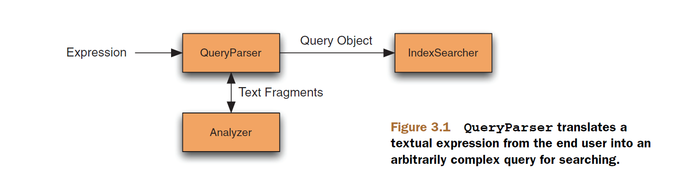

## 3.1 实现简单搜索 Implementing a simple search feature ##

&emsp;&emsp;假设要向应用程序中添加搜索功能，我们已经用上一章的技术解决了数据索引问题，现在要为最终用户提供全文搜索能力。很难想象还有哪种方法比使用 Lucene 添加搜索功能更简单的了，只需几行代码就能获得搜索结果。Lucene 也提供了简单高效方法来访问搜索结果，把我们从围绕搜索结果的繁重代码中解脱出来，使我们集中精力进行程序逻辑和 UI 设计。

&emsp;&emsp;在使用 Lucene 进行搜索时，有两种选择，一种方式是使用编程方式构建查询对象，另一种方式是使用 QueryParser 将用户输入的文本翻译成对等的查询对象。第一种方法给我们绝对的操纵能力，应用程序可以向外提供任意的 UI 界面，我们的逻辑将与 UI 交互过程中接收到的用户输入转换成 Query 对象。而第二种方法是极其简单易用，并提供所有用户都熟知的标准搜索语法。本节将展示如何使用最简单的编程方法构造查询，搜索单一词项，然后我们将看到怎么使用 QueryParser 来接收文本的查询。在下面的各小节，我们会利用这个简单的例子深入描述 Lucene 自带的所有查询类型。下面以最简单的搜索开始：搜索包含单一词项的所有文档。


<br/><br/>
<a id="1"></a>

## 3.1.1 搜索指定的词项 Searching for a specific term ##

&emsp;&emsp;IndexSearcher 是用于在索引库中搜索文档的中心类，它有几个重载的搜索方法。可以使用它最常用的搜索方法来搜索指定的词项（term）。词项由一个 String 类型的的值，与包含该值的域名称组成的一对，本例为 "subject"。下面是示例程序使用的重载搜索方法：

```java
IndexSearcher.search(Query query, int n)
```

搜索 query 并返回 top n 个搜索结果。

&emsp;&emsp;代码使用的关于书籍的测试数据位于项目根目录下的 data 子目录，索引库位于项目根目录下的 index 子目录。索引库通过 common 子模块建立，命令行进入 common 子模块所在目录，然后执行：

```shell
java -jar target/common-1.0-SNAPSHOT-shaded.jar
```
程序执行完毕之后，会在项目根目录下建立 index 索引库。

我们要查询 "subject" 域的 "ant" 和 "junit" 单词，代码清单 3.1 创建 term 查询，执行搜索，然后确认搜索结果与期望结果相同。

本章代码位于示例代码 searching 子模块。

<table width="100%"><tr><td bgcolor=green><font color=black>Listing 3.1 使用 TermQuery 进行简单搜索 Simple searching with TermQuery</td></tr></table>

```java
public class BasicSearchingTest {

  @Test
  public void testTerm() throws Exception {
    Directory dir = TestUtil.getBookIndexDirectory(); //①
    DirectoryReader reader = DirectoryReader.open(dir);
    IndexSearcher searcher = new IndexSearcher(reader);//②

    Term t = new Term("subject", "ant");
    Query query = new TermQuery(t);
    TopDocs docs = searcher.search(query, 10);
    assertEquals("Ant in Action",              //③
                 1, docs.totalHits.value);

    t = new Term("subject", "junit");
    docs = searcher.search(new TermQuery(t), 10);
    assertEquals("Ant in Action, " +           //④
                 "JUnit in Action, Second Edition",
                 2, docs.totalHits.value);

    reader.close(); //⑤
    dir.close();    //⑥
  }
}
```
① 使用 TestUtil 获取索引库目录
② 创建 IndexSearcher 实例
③ 确认搜索结果有一个文档匹配词项查询："subject":"ant"
④ 确认搜索结果有两个文档匹配词项查询："subject":"junit"
⑤ 关闭 reader
⑥ 关闭 dir

TestUtil.getBookIndexDirectory() 是个静态工具方法，位于 common 子模块，便于在测试代码中使用，实现很简单：

```
  public static Directory getBookIndexDirectory() throws IOException {
    return FSDirectory.open(Paths.get("../index"));
  }
```
这个索引库会在后面章节的测试代码中多次使用，为了方便起见，此处索引库目录硬编码为 "../index"，位于示例代码的根目录之下。

搜索方法会返回 TopDocs 对象。在实际代码中，应该访问该对象内部的 scoreDocs 数组以向最终用户展示每一个搜索结果，而这里我们关注检查搜索结果的文档数量。

最后测试结束后，关闭 reader 和 dir 对象。通常最好是让它们保持打开状态，让所有的搜索共享一个 searcher 来执行搜索。打开一个新的 reader 是一个代价很高的操作，因为它必须从索引库载入数据并构建其内部数据结构。


<br/><br/>
<a id="2"></a>

## 3.1.2 解析用户输入的查询表达式 Parsing a user-entered query expression: QueryParser ##

Lucene 的搜索方法需要一个 Query 对象作为参数，解析查询表达式是指将用户输入的文本查询语句，例如 "mock OR junit"，转换成适当的 Query 对象的过程，在本例中，解析出来的 Query 对象应该是一个 BooleanQuery 实例，其中包含两个可选的子句，每一个子句是一个 term 查询。图 3.1 展示了这一过程（图片来源于 Lucene in Action Second Edition）。

<div></div>
<div align=center style="font-weight:bold;color:black;font-size:17px;">图 3.1</div>

<br/>

>NOTE: Lucene 的查询表达式有点类似于数据库的 SQL 表达式，要使用 SQL 表达式查询数据库，必须先将其解析为较低级别的数据库服务器能够直接理解的形式。

代码清单 3.2 解析两个查询表达式，并断言它们按预期工作。当返回命中结果时，我们检索第一个找到的文档的标题（title） 域。

<table width="100%"><tr><td bgcolor=green><font color=black>Listing 3.2 QueryParser 将搜索文本解析为 Query 对象 QueryParser, which makes it trivial to translate search text into a Query</td></tr></table>

```java
  @Test
  public void testQueryParser() throws Exception {
    Directory dir = TestUtil.getBookIndexDirectory();
    DirectoryReader reader = DirectoryReader.open(dir);
    IndexSearcher searcher = new IndexSearcher(reader);

    QueryParser parser = new QueryParser("contents", new SimpleAnalyzer());  //①

    Query query = parser.parse("+JUNIT +ANT -MOCK");                         //②
    TopDocs docs = searcher.search(query, 10);
    assertEquals(1, docs.totalHits.value);

    Document d = searcher.doc(docs.scoreDocs[0].doc);
    assertEquals("Ant in Action", d.get("title"));

    query = parser.parse("mock OR junit");                                    //②
    docs = searcher.search(query, 10);
    assertEquals("Ant in Action, " + 
                 "JUnit in Action, Second Edition",
                 2, docs.totalHits.value);

    reader.close();
    dir.close();
  }
  ```

① 创建 QueryParser
② 解析用户文本

Lucene 的解析特性用于解析查询表达式，它的功能非常强大，QueryParser 可以解析非常丰富的查询表达式，例如代码清单中的两个表达式："+JUNIT +ANT -MOCK" 和 "mock OR junit"，将它们解析为合适的 Query 实现。QueryParser 最终解析生成 Query 实例，该实例可能非常庞大复杂！

QueryParser 的主要目标是处理人类输入的查询表达式。获得了 QueryParser 返回的 Query 对象，其它搜索操作就与编程方式的操作相同了。

&emsp;&emsp;从 Lucene 4.0 开始，**QueryParser** 类及其支持组件已从 Lucene 核心移出，独立到 Lucene 专门的解析框架 lucene-queryparser 模块。QueryParser 只是其中的一个解析类，模块中还包含其它的解析类，例如 **StandardQueryParser**、**SimpleQueryParser**、**PrecedenceQueryParser**、**ComplexPhraseQueryParser**、**ExtendableQueryParser**、**MultiFieldQueryParser** 等，并且 QueryParser 被移入 org.apache.lucene.queryparser.classic 包，是 Lucene 一直支持的查询解析类型，称为经典 QueryParser。在该模块内，还存在一个 QueryParser 类，位于 org.apache.lucene.queryparser.surround.parser 包。对于新人来说，Lucene 建议从更具灵活性的 **StandardQueryParser** 开始查询解析之路。StandardQueryParser 支持大部分经典 QueryParser 的特性，并允许动态配置某些特性，而且支持新的查询类型和表达式。

&emsp;&emsp;如图 3.1 所示，QueryParser 需要一个分析器来将查询文本切分成多个词项。在第一个表达式中，整个查询表达式文本都是大写的。而 contents 域的值在索引时已被转换为小写形式。在本例中，QueryParser 使用 SimpleAnalyzer 分析器，它会在构造 Query 对象之前，将词项都转换为小写形式。本章要考虑与分析相关的关键点是，要确保在实际索引的词项上执行查询。**QueryParser 是在搜索过程中唯一使用分析器的组件**。使用 TermQuery 或其它类型查询，以 API 编程方式执行的搜索不需要分析器，但它们依赖于匹配已索引的词项。因此，如果完全以编程方式构造查询，必须保证所有查询中的词项，要与索引期间经由分析器产生的词元（token）相匹配。

&emsp;&emsp;有了这几个例子，我们已准备好开始在自己的索引库上执行搜索了，当然，还有很多关乎搜索的细节有待了解。特别是 QueryParser，我们还需要进一步阐述。下面对如何使用 QueryParser 进行简要概述，本章后面还会对此进行更深入的讨论。

<br/><br/>
#### <font color=green>使用 QueryParser</font> ####

在深入探讨 QueryParser 细节之前，我们首先看看一般情况下如何使用 QueryParser。QueryParser 实例化需要一个域名（field name）和一个分析器，分析器用于将输入文本切分成词项：

&emsp;&emsp;**QueryParser parser = new QueryParser(String field, Analyzer analyzer)**

域名称（field name）参数用作所有词项的默认域，除非搜索文本显式要求匹配不同的域名，使用如下语法：

&emsp;&emsp;**"field:text"**

否则，被搜索的词项都使用默认域进行搜索。QueryParser 最重要方法就是解析查询表达式字符串：

**public Query parse(String query) throws ParseException**

其中 query 字符串是要解析的查询表达式文本，例如 "+cat +dog"。

&emsp;&emsp;如果表达式解析失败，会抛出 ParseException 异常，应用程序应该优雅地处理该异常。ParseException 的消息会给出解析失败的合理解释，但这种描述对于最终用户来说可能太过技术性了。

&emsp;&emsp;parse() 方法的使用快捷方便，但这可能还不够，还有各种设置方法用于控制 QueryParser 实例，例如当用于多个词项时的默认操作符（默认是 OR）。还可以设置日期时间的解析精度、时区、local、通配符、短语间隙（slop）、模糊查询前缀长度等等高级设置。

<br/><br/>
#### <font color=green>使用 QueryParser 处理基本的查询表达式</font> ####

&emsp;&emsp;QueryParser 将查询表达式转换成 Lucene 内置的查询类型，表 3.2 展示一些表达式示例及其转换含义。

<div align=center>表 3.2 QueryParser 处理的表达式范例</div>

<table>
    <tr bgcolor=#AA0000>
        <th align=center>查询表达式</th>
        <th align=center>匹配的文档</th>
    </tr>
    <tr>
      <td>java</td>
      <td>默认域中包含 "java" 词项的文档</td>
    </tr>
    <tr>
      <td>java junit</td>
      <td>默认域中包含 "java" 或 "junit" 词项的文档，或者二者都包含其中</td>
    </tr>
    <tr>
      <td>java OR junit</td>
      <td>与上例相同</td>
    </tr>
    <tr>
      <td>+java +junit</td>
      <td>默认域中包含 "java" 和 "junit" 词项的文档</td>
    </tr>
    <tr>
      <td>java AND junit</td>
      <td>与上例相同</td>
    </tr>
    <tr>
      <td>title:ant</td>
      <td>"title" 域中包含 "ant" 词项的文档</td>
    </tr>
    <tr>
      <td>title:extreme –subject:sports</td>
      <td>"title" 域中包含 "extreme" 词项，并且 "subject" 域中不包含 "sports"词项的文档</td>
    </tr>
    <tr>
      <td>title:extreme AND NOT subject:sports</td>
      <td>与上例相同</td>
    </tr>
    <tr>
      <td>(agile OR extreme) AND methodology</td>
      <td>包含 "methodology" 并且必须包含 "agile" 或 "extreme" 的词项，所有词项都是在默认域中</td>
    </tr>
    <tr>
      <td>title:"junit in action"</td>
      <td>双引号（""），这是个短语查询语法，表示"title"域中准确包含"junit in action"词项</td>
    </tr>
    <tr>
      <td>title:"junit action"~5</td>
      <td>这是个邻近查询，表示在"title"域中包含 "junit" 和 "action"，并且两个词之间彼此邻近小于5个位置的词项</td>
    </tr>
    <tr>
      <td>java*</td>
      <td>通配符查询，默认域中包含以 "java" 开头的词项，例如 "javaspaces", "javaserver", "java.net"，以及完全是其自身 "java" 的词项</td>
    </tr>
    <tr>
      <td>java~</td>
      <td>包含域词 "java" 相近的词项，例如 "lava"</td>
    </tr>
    <tr>
      <td>lastmodified:[1/1/09 TO 12/31/09]</td>
      <td>具有 "lastmodified" 域，并且其值是在2009年1月1日到2009年12月31日之间的词项</td>
    </tr>
</table>

&emsp;&emsp;在对 Lucene 的搜索能力有了总体认识之后，我们已经准备好对其进行深入探索。


