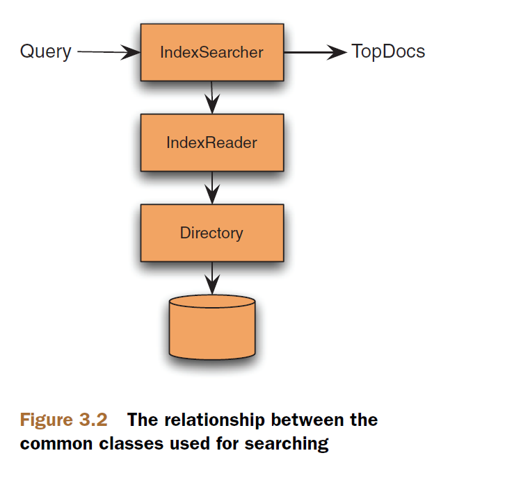

## 3.2 使用 IndexSearcher ##

&emsp;&emsp;**IndexSearcher** 类是 Lucene 搜索操作的顶级 API，位于 Lucene 核心模块的 org.apache.lucene.search 包中，用于实现搜索功能（JavaDoc: Implements search over a single IndexReader），它是所有搜索操作的中心和入口。

&emsp;&emsp;用 Lucene 进行搜索操作非常简单。首先创建一个 IndexSearcher 实例，它打开要搜索的索引库，然后调用其 search(Query query, int n) 方法进行搜索，该方法返回 TopDocs 对象，表示搜索结果，我们用该对象向最终用户展示搜索结果。出于性能考虑，如果索引不变，我们应该在多个搜索操作中共享一个 IndexSearcher 实例，而不是每次搜索都创建一个新的 IndexSearcher 实例。如果索引库发生了变化，并且希望在搜索操作中看到这些变化，应该使用  DirectoryReader.openIfChanged(DirectoryReader) 方法获取一个新的 reader，然后用这个新的 reader 创建新的 IndexSearcher 实例。并且，对于低延迟转换，最好使用近实时的 reader，即通过 DirectoryReader.open(IndexWriter) 方法打开一个新 reader。一旦创建了新的 IndexReader 对象，用它创建新的 IndexSearcher 实例开销就比较轻了。

<br/><br/>
<a id="1"></a>
## 3.2.1 创建 IndexSearcher ##

&emsp;&emsp;与 Lucene 的其它顶级 API 类似，IndexSearcher 使用很简单。与搜索相关的类展示在图 3.2 中（图片来源于 Lucene in Action Second Edition）。

<div align=left></div>

首先，和索引操作一样，需要一个目录。大多数情况我们搜索的索引库存在于文件系统上：

```
Directory dir = FSDirectory.open(Paths.get("/path/to/index"));
```
下一步，打开 IndexReader 实例：

```
IndexReader reader = DirectoryReader.open(dir);
```

最后，创建 IndexSearcher:

```
IndexSearcher searcher = new IndexSearcher(reader);
```

Directory 类，我们在索引操作环境见过它，提供类似文件操作的 API 抽象，在 2.3.1 节有比较详细的阐述。IndexReader 使用 Directory 对象与实际的索引库文件进行交互，并对外暴露低级 API，以供 IndexSearcher 执行搜索操作使用。IndexSearcher API 接受 Query 对象作为参数执行搜索，并返回 TopDocs 对象表示搜索结果。


