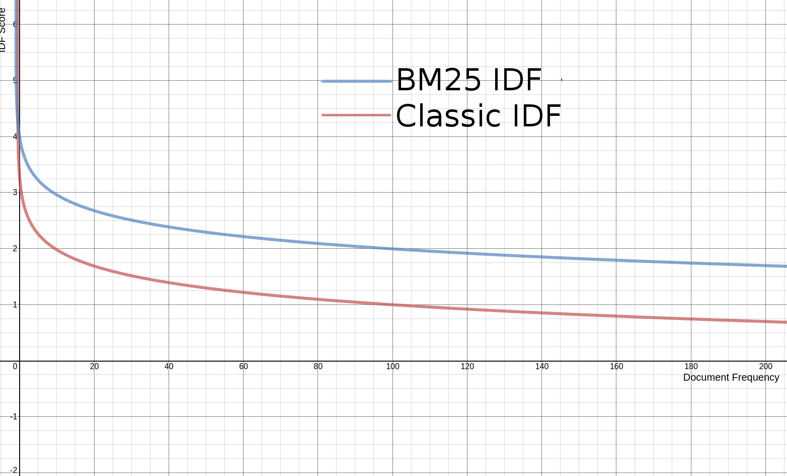

## 3.3 理解 Lucene 评分机制 Understanding Lucene scoring ##

&emsp;&emsp;每当搜索到匹配文档时，该文档都会被赋予一定的评分值，用以反映其匹配程度。该分值计算文档与查询语句之间的相似程度，较高的分值反映更强的相似度，因此也表示更强的匹配程度。选择在这里讨论这个复杂的主题，目的是在继续探讨搜索细节之前，对 Lucene 的各种评分因子有个总体的认识。评分机制，是 Lucene 的重要核心内容之一，是 Lucene 整个搜索功能的重要组成部分。

<br/><br/>
<a id="1"></a>
## 3.3.1 Lucene 如何评分 How Lucene scores ##

相关性（Relevance）的本质，就是两个文档的相似性（Similarity），更具体地量化到数值上，就是相似程度，或者说相似度，相关度。Lucene 使用一个 float 型的评分数值 score，来表示这种相似的程度。而这个数值的计算 scoring 过程，是通过信息检索业内成熟的数学模型，经过不断地改善、优化而来。

&emsp;&emsp;Lucene 的评分计算经历了从经典的 TF-IDF 算法到新一代 BM25 算法的演变过程。它们并不存在新算法替代旧算法的过程，而是两种算法并存，可以随时切换。演变的分水岭是 Lucene 6.0，6.0 版之前，默认的评分算法是 TF\*IDF，而从 6.0 开始，Lucene 默认的评分计算使用 BM25 算法。它们都是相似度算法，都是 Similarity 的子类。TF-IDF 算法的实现类是 **TFIDFSimilarity**，它是一个抽象类，其具体实现子类是 **ClassicSimilarity**，因此称之为经典相似度算法。BM25 算法的实现类是 **BM25Similarity**，其中 BM 是 Best Match 的缩写形式，意为“最佳匹配”，25 表示 BM 算法的第 25 次迭代。BM25 算法由 Stephen E. Robertson, Steve Walker, Susan Jones, Micheline Hancock-Beaulieu, and Mike Gatford 几位业界精英在 1994 年第三次 TREC（Text REtrieval Conference）大会上提出。早在 4.0 版时，Lucene 就初次引入了 BM25 算法，但直到 Lucene 6.0 才将其作为默认算法，期间进行了多次的优化迭代。

BM25 和 TF-IDF 位于 Lucene 排名（rank）功能的核心。含有一个域权重的概念（field weight），**域权重**计算匹配文本与搜索词项的匹配程度。

&emsp;&emsp;评分机制属于 Lucene 的顶级技术范畴，不理解其技术细节也不会影响对 Lucene 能力的使用。但大致了解一些其中的内幕，有助于理解影响最终评分的各种因素，以便于在索引和搜索过程中对某些因素做出调整，使其符合我们的设计目标。例如 2.4.6 节的 Norms 归一化因子就是我们要在索引期间考虑的因素，它直接参与到这两种评分算法的计算之中。

&emsp;&emsp;影响这两种算法的因素差不多，因为 BM25 是在 TF-IDF 上改进而来，因此只是其内部所采取的算法不同，对它们的影响也会不同，下面分别讨论。


<br/><br/>
<a id="2"></a>
## 3.3.2 Lucene 评分机制：经典 TF-IDF 相关性算法 ##

Lucene 联合使用“信息检索的布尔模型（Boolean model of Information Retrieval，即 BM 模型）”与“信息检索的向量空间模型（Vector Space Model of Information Retrieval，即 VSM 模型）”执行数据搜索，通过布尔模型 BM 确认文档与查询匹配，而后由向量空间模型 VSM 计算匹配文档的评分值。

在向量空间模型 VSM 中，文档（document）和查询（query）被表示为多维空间权重的向量（weighted vectors），其中每一个唯一的索引词项（each distinct index term is a dimension）是一个维度，而权重（weight）是 Tf-idf 值。

VSM 没有要求把 Tf-idf 值作为权重（weight），但 Tf-idf 值被认为可以产生高质量的搜索结果，因此，Lucene 使用 Tf-idf 作为权重值。Tf 和 Idf 在下面有更详细的阐述，但是现在，作为完整性，我们说，对于给定的词项（term）t 和文档 documnet（或者查询 query）x，那么 Tf(t,x) 的值随词项 t 在 x 中出现的次数而变化（次数增加，Tf 也增加）；类似地，idf(t) 的值随包含词项 t 的索引文档的数量反向变化（the inverse of the number of index documents containing term t）。这就是 Tf-idf 的基本思想。

衡量两个向量相似度最常用的方法是使用余弦相似度（Cosine similarity），以下内容来自维基百科：
>余弦相似性通过测量两个向量的夹角的余弦值来度量它们之间的相似性。0 度角的余弦值是 1，而其他任何角度的余弦值都不大于 1；并且其最小值是 -1。从而两个向量之间的角度的余弦值确定两个向量是否大致指向相同的方向。两个向量有相同的指向时，余弦相似度的值为 1；两个向量夹角为 90° 时，余弦相似度的值为 0；两个向量指向完全相反的方向时，余弦相似度的值为 -1。结果是与向量的长度无关的，仅仅与向量的指向方向相关。余弦相似度通常只使用正空间，因此给出的值为 0 到 1 之间。

文档 d 对于查询 q 的 VSM 评分，就是计算查询权重向量 V(q)和文档权重向量 V(d)的余弦相似度，计算公式如下：

<div align=left></div>

其中，V(q)·V(d) 是权重向量的点积，|V(q)|和|V(d)| 是它们的欧几里得范数，即两个向量的长度。

&emsp;&emsp;注意，考虑把上面的的公式进行简化处理，被除数看作是计算的权重向量的点积，把除数计算为只取 V(q)的欧几里得范数一个单元向量，这样处理是合理的。因为对于搜索来说，进入相似度计算时，它的查询已经是确定的，|V(q)|对于整个向量空间来说只有一个，所有的匹配文档（由布尔模式 BM 识别出来的文档）都相对于这个值计算余弦值，即每个文档相对于同一个查询 q 的相似度，这对于文档排序结果来说是合理的。

下面看看余弦相似度在几何空间表示（此图片来源于网络）：

<div align=left></div>

<br/>

Lucene 从搜索质量和适用性两方面进一步改善了 VSM 评分算法：
- 把 V(d) 计算为单元向量（unit vector）是有问题的，因为它移除了文档长度信息。对于某些文档来说，移除长度信息可能没什么问题，例如，一个文件由某段文本复制了 10 次编辑而成，特别是如果这个段落文本由完全不同词项组成的。但对于不是由这种复制段落而形成的文件来说，就可能会有问题。为了避免这种问题，引入一个不同的文档长度规范化因子（document length normalization factor），来规范化一个向量，等于或大于单元向量：doc-len-norm(d)。
- 在索引时，可能会指定某些特定的文档比其他文档更加重要，给它们分配一个文档级加权值（boost）。为此，每个文档的评分也要与这个加权值相乘：doc-boost(d)。—— 此特性已从 Lucene 4.0 版开始移除，所有文档的索引加权值都为 1。
- 考虑到 Lucene 是基于域的（field），因此每个查询词项（query term）适用于于一个单独的域，文档长度规范化是由某个域的长度确定的，除了有文档加权，还有文档域的加权。
- 在搜索时，可以为查询、子查询、或者查询词项指定加权（boost），因此一个文档的评分值还有算上查询词项的贡献，乘以查询词项的加权值：query-boost(q)。
- 一个文档可能匹配一个多词项的查询，而不需要包含那个查询中所有的词项，用户可以通过一个协调因子（coordination factor）来奖励匹配更多的查询词项的文档，匹配更多的词项，总是会获得更大的分值。这个协调因子表示为：coord-factor(q,d)。

基于简化的假设下，索引中只有一个域，我们得到 Lucene 的概念评分公式如下（ Lucene's Conceptual scoring formula）：

<div align=left></div>

概念性公式在两个方面进行了简化：
1. 词项和文档都是基于域的
2. 加权总是对每个查询词项的，而不是对每个查询的

现在来描述 Lucene 如何实现这个概念性的评分公式，然后从中推导出 Lucene 的实践性评分函数（Practical Scoring Function）。

出于性能考虑，参与评分计算的一些成分是提前计算的：
- 对查询加权（实际上是对每个查询的词项加权）在搜索开始时就是已知的。
- 查询的欧几里得范数|V(q)|，即向量的长度，可以在搜索开始时计算，因为它和参与评分的文档不存在关联性。从搜索优化的角度来说，这对费力去完全计算查询（即通过上面余弦相似度算法的|V(q)||V(d)|进行计算）的问题是合理的，因为所有参与评分的文档都与同一个 |V(q)| 相乘，因此文档的排名（rank，即通过评分值排序的位置）不会受这个计算结果的影响。有两个原因使用这个计算方式：
    - 回想一下，余弦相似度可以用来查找两个文档的相似程度。在使用 Lucene 的场景，例如聚类（clustering）中，将一个文档作为查询来计算它与其它文档的相似度。在这个场景中，文档 d3 对于查询 d1 的评分值，可以与 d3 对于查询 d2 的评分值进行比较，这点很重要。换句话说，一个文档对于两个不同查询的评分值应该是可比较的。还有其它的应用场景可能有这样的需求。而这正是计算查询向量（query vector V(q)）所提供的：两个或多个查询的可比较性。
    - 在分值上应用查询计算，有助于围绕单元向量（unit vector）保持评分值，因此防止评分数据因浮点数精度限制而造成的损失。
- 文档长度规范 doc-len-norm(d) 和文档加权 doc-boost(d) 在索引时就已知了。它们的值是提前计算的，并且把这两个值相乘的结果作为一个值存储在索引中：norm(d)。在下面的等式中，norm(t in d) 的意思是 norm(field(t) in doc d)，其中 field(t) 包含词项 t 的域。

Lucene 的实践性评分函数就是从上面的分析推导出来的。其中带有彩色的部分指示它如何与概念性公式相关：

<div align=left></div>

如上图所示，实践性公式中的每一个因子都有自己准确的定义和算法，下面分别阐释：

<br/>
#### <font color=green>tf(t in d)</font> ####

**tf(t in d)** 与词项的频率（term's frequency，称为“**词频**”）关联，**词频**定义为词项 t 出现在当前评分文档 d 中的次数。例如，"dog" 这个单词在文章中出现过几次？3 次还是 10 次？对于给定的词项，在文档中出现的次数越多，该文档获得的评分就越高。注意，对于词项在查询中的频率 tf(t in q)，假设它的值为 1，并且它没有出现在上面评分函数的等式中。然而，如果查询包含同一个词项两次，会产生两个同一词项的词项查询，因此，计算结果仍然是正确的（虽然不太高效）。

在 ClassicSimilarity 类中，tf(t in d) 的默认计算是：

<div align=center></div>
<div align=center style="font-weight:bold;color:black;font-size:17px;">图 TF score</div>

<br/>
#### <font color=green>idf(t)</font> ####

**idf(t)** 称为**反向文档频率（Inverse Document Frequency）**。这个值与文档频率的倒数（inverse of docFreq）关联，数学上表示为 1/df。**文档频率（docFreq）** 是出现词项 t 的文档的数量。例如 "dog"这个单词很少在文档中出现吗（只在一个文档中出现）？或者相对普通的单词，比如 "the"，几乎所有的文档都含有这个词。这意味着，越小的文档频率，总体评分值越高。对于给定的词项 t，idf(t) 即存在查询中，也存在于文档中，idf(t, q) 和 idf(t, d) 其实是一样的，可以假设 idf(t, q) = idf(t, d) = idf(t)，因此在上面评分函数等式中计算它平方值。

ClassicSimilarity 类中，idf(t) 的默认计算是：

<div align=center></div>
<div align=center style="font-weight:bold;color:black;font-size:17px;">图 IDF score</div>

<br/>
#### <font color=green>t.getBoost()</font> ####

**t.getBoost()** 是搜索时对查询 q 中词项 t 的加权值，可以使用查询文本语法指定，或者通过 BoostQuery 封装进行设置。


<br/>
#### <font color=green>norm(t,d)</font> ####

**norm(t,d)** 是索引时的加权因子，只由文档中某个域中词元的数量决定，即 **域的长度**或者**文档长度** 因素。因此，越短的域贡献越大的评分值。参考 2.4.6 节 域的 Norms 选项。

计算公式如下图所示（图片来源于网络）：

<div align=center></div>
<br/>
<div align=center style="font-weight:bold;color:black;font-size:17px;">图 Norm score</div>

<br/><br/>
#### <font color=green>什么是 TF-IDF 算法 What is TF*IDF?</font> ####


&emsp;&emsp;有了上面的分析、推导和定义，现在，我们把目光放在对结果起根本性影响的 tf \* idf<sup>2</sup> 上。**TF-IDF 相关性算法是用户计算文档匹配相关性近似值的粗略算法**。TF-IDF 下面的算法相当直接，取决于其两个根本性因素，也就是评分公式中的两个核心因子，嵌入其名字的两个部分：TF 和 IDF。

&emsp;&emsp;概括来说，TF-IDF 计算一个词项 term 在一段给定文本 text 中相对浓度（relative concentration）。例如，"dog" 这个词在一篇文章中很常见，出现过很多次，而在别的文章中很少出现，那么这篇文章对 "dog" 单词的 TF-IDF 结果值就很高，因此就可以认为这篇文章对搜索词项 "dog" 来说非常相关。如果 "dog" 在这篇文章里只出现了一次，但是在其他文章中大量存在，那么这篇文章的结果值就会相对较低。

&emsp;&emsp;再往下考虑文档长度因素。"dog" 这个单词在一本 500 页的书中只出现了两次，可以说这本书几乎与 "dog" 没什么相关性。而 "dog" 在一条很短的推特消息中出现了两次，那么意味着这条推特是与 "dog" 是非常相关的，这就引入了 norm(t,d) 因子。这个因子为评分值引入一个重要性偏重，短的文档比长的文档重要性更高。词项在短的文档中更加“集中（concentrated）”，因此短的文档对搜索词项来说，更加相关，因此应得分更高。


<br/><br/>
#### <font color=green>分值变换 Fudging TF-IDF</font> ####

通过不断地实验，信息检索领域（the field of Information Retrieval）已经认识到，原始的 TF IDF 值不是完全与我们直觉上的值相对应。如果一篇文章提及 "dog" 单词 6 次，它与 "dog" 的相关性就 2 倍于提及 "dog" 3 次的文章吗？大多数的人都会说，不是。确实，提及 "dog" 单词 6 次的文章可能更加相关，但不是两倍相关的。词项的 IDF 也有类似作用。一个词项在 500 个文档中出现过，比出现在 1000 个文档中词项，不具有 2 倍的重要性。

事实上，TF-IDF 中各因素的值是经过修改的，因此 TF、IDF、以及域的长度都不是直接拿来就用的。对于 TF 来说，而是使用公式

&emsp;&emsp;**sqrt(TF)** 

带入到 Lucene 实践评分公式，如图 TF score 所示。有两倍数量词项的文档，不是具有两倍的相关性，TF 分值计算如下表所示：

<br/>
<div>表 TF 分值（score）</div>

<table width="100%">
    <tr bgcolor=#AA0000>
        <th align=center>Raw TF</th>
        <th align=center>TF Score</th>
    </tr>
    <tr>
      <td>1</td>
      <td>1.0</td>
    </tr>
    <tr>
      <td>2</td>
      <td>1.414</td>
    </tr>
    <tr>
      <td>4</td>
      <td>2.0</td>
    </tr>
    <tr>
      <td>8</td>
      <td>2.828</td>
    </tr>
    <tr>
      <td>16</td>
      <td>4.0</td>
    </tr>
</table>

因此，对于 TF，一个给定的词项，一个出现过 16 次的文档，其相关性大约是出现 4 次文档相关性的两倍。

同理，我们不会认为，一个词项只出现在 10 个文档中，会具有 10 倍于出现在 100 个文档中词项的重要性。IDF 分值的计算使用下面这个公式：

&emsp;&emsp;**log (numDocs + 1 / docFreq + 1) + 1**

如图 IDF 所示。其中 numDocs 是要搜索的文档数量，docFreq 是文档频率，即出现词项 t 的文档的数量，简称 DF。这里，我们假设 numDocs = 1000，那么原始的 DF 值和 IDF 值对应关系如下表所示：

<br/>
<div>表 IDF 分值（score）</div>

<table width="100%">
    <tr bgcolor=#AA0000>
        <th align=center>Raw DF</th>
        <th align=center>IDF Score</th>
    </tr>
    <tr>
      <td>1</td>
      <td>7.214</td>
    </tr>
    <tr>
      <td>2</td>
      <td>6.809</td>
    </tr>
    <tr>
      <td>4</td>
      <td>6.298</td>
    </tr>
    <tr>
      <td>64</td>
      <td>3.733</td>
    </tr>
    <tr>
      <td>128</td>
      <td>3.048</td>
    </tr>
    <tr>
      <td>256</td>
      <td>2.359</td>
    </tr>
</table>

可以看出，随着原始 DF 值的增长，IDF 值的增长很缓慢，一个在 4 个文档中出现的词项，其重要性大概是一个在 64 个文档中出现词项 2 倍。

那文档长度会对评分值有什么影响？它是怎么计算的？它通过另一个简单的公式计算，它能够如我们所期待的那样工作：

&emsp;&emsp;**1 / sqrt(length)**

如图 Norm score 所示。其中 length 表示文档长度，因 Lucene 的搜索是特定对某个域的，因此也就是域的长度。某个域的长度是在索引时，域接收的词元数量。下面的表格列出原始域的长度与域 Norm score 的对应关系：

<br/>
<div>表 Norm 分值（score）</div>

<table width="100%">
    <tr bgcolor=#AA0000>
        <th align=center>Raw Length</th>
        <th align=center>Field Norm Score</th>
    </tr>
    <tr>
      <td>1</td>
      <td>1.0</td>
    </tr>
    <tr>
      <td>2</td>
      <td>0.707</td>
    </tr>
    <tr>
      <td>4</td>
      <td>0.5</td>
    </tr>
    <tr>
      <td>64</td>
      <td>0.125</td>
    </tr>
    <tr>
      <td>128</td>
      <td>0.088</td>
    </tr>
    <tr>
      <td>256</td>
      <td>0.0625</td>
    </tr>
</table>

因此，长度为 1 的文档相关性，大概是长度为 128 的文档的相关性的 10 倍。这在我们的直观理解上，是说得通的：如果某个词项匹配某个只有一个词项的文档，那么这个文档绝对是关于这个词项的。而在长度是 128 的文档中，该词项只是文档全部词项中的一个，因而它不见得能代表这个文档的整体内容。


<br/><br/>
<a id="3"></a>
## 3.3.3 下一代 Lucene 评分机制：BM25 相关性算法 ##

BM25 是在 TF-IDF 上改进而来。BM25 代表 “Best Match 25” 的缩写形式，意为“最佳匹配”，25 表示 BM 调整相关性算法的第 25 次迭代。BM25 算法由 Stephen E. Robertson, Steve Walker, Susan Jones, Micheline Hancock-Beaulieu, and Mike Gatford 几位业界精英在 1994 年第三次 TREC（Text REtrieval Conference）大会上提出。

BM25 相关性算法的根源是概率信息检索（[probabilistic information retrieval](https://nlp.stanford.edu/IR-book/html/htmledition/probabilistic-information-retrieval-1.html)）。概率信息检索本身就是一个极具吸引力的领域。基本上，它将相关性视为概率问题。根据概率信息检索，相关性分数，应该将用户认为的结果相关性反映在概率上。BM25 源自概率相关模型（probabilistic relevance model），而不是 TF-IDF 所用的向量空间模型，但这个算法也和 Lucene 的实践性评分函数有很多共通之处。


<br/><br/>
#### <font color=green>BM25 中的 IDF</font> ####

首先，我们看看 BM25 中的 IDF。在下面的图表中，BM25 的 IDF 与 Lucene 经典的 TF-IDF 相似性算法的 IDF 非常类似。唯一有所不同的是，BM25 的 IDF 分值的计算来源于概率信息检索。Lucene 对原 BM25 的 IDF 做了一点小修改，原 BM25 对于有非常高文档频率的词项，可能产生负值分数，因此，Lucene 的 BM25 算法中的 IDF 采用了一个小技巧来解决这个问题，它对进行 Math.log 函数之前的值加 1，这样就使它不可能计算出一个负值了。其最终结果是 Lucene 的 BM25 中的 IDF，与经典的 TF-IDF 算法的 IDF 曲线极其相似，如下图所示：

<div align=center></div>
<br/>
<div align=center style="font-weight:bold;color:black;font-size:17px;">图 BM25's IDF and classic IDF</div>
<br/>
所以，如图所示，BM25 的 IDF 与经典 TF-IDF 算法的 IDF 没有什么突出的变化，因此，对于 BM25，我们不需要改变对 IDF 想法。

<br/><br/>
#### <font color=green>BM25 中的 TF</font> ####

现在，我们来看看 BM25 中词频 TF 的表现。

在 BM25 中，将词频对评分值的影响，比在传统 TF-IDF 算法中，进行了更进一步的压制。词频的影响总是逐步增加的，但 BM25 词频的影响逐渐趋向一个平稳的值。

不考虑文档长度，词频使用下面的公式进行计算：

&emsp;&emsp;**((k + 1) * tf) / (k + tf)**

形成如下图表所示的曲线：

<div align=center></div>
<br/>
<div align=center style="font-weight:bold;color:black;font-size:17px;">图 BM25's TF and classic TF</div>
<br/>

如图所示，BM25 的 TF 分值逐渐接近于 (k+1) 的值，这里 k=1.2，这具有令人兴奋的现实效果。更大的 TF 总是意味着更大的相关性，但是很快，这种对应关系会逐渐缩小的。永远不会超出 k 值，但总是逐渐接近它。相反，对于经典 TF-IDF 算法中的 TF 值，会不断地增加，而且永远不会到底一个饱和点。

这个 k 值是什么？对于 BM25 算法，k 通常设为 1.2，大多数情况下，不用去管它。改变 k 值虽然可以是一个有用的修改词频影响的调整方法，修改 k 值使得渐近线有明显的移动。但是，更大的 k 值会导致词频相关性需要更大的词频来达到饱和点。伸展饱和点，实际上是拉伸了，高词频文档和低词频文档间相关性的差别。

<br/><br/>
#### <font color=green>BM25 如何使用文档长度 length</font> ####

上面 TF 分值，进一步受到文档高于还是低于文档平均长度的影响。那么文档长度是如何影响词频相关性的呢？让我们在之前的 TF 公式基础上，引入两个变量：一个常数 b 和一个长度值 L。在上面 TF 公式的分母中，添加 (1.0 - b + b * L) 作为 k 的倍数，得到如下公式：

&emsp;&emsp;**((k + 1) * tf) / (k * (1.0 - b + b * L) + tf)**

其中 L 是一个文档相对于文档长度平均值的长度，是与我们之前谈到过的归一化因子 norms 相关的值。如果要评分的文档长度是平均文档长度的两倍，L 的值是 2。如果文档的长度是平均文档长度的十分之一，则 L 的值为 0.1。因此，L 实际上表示为：

 &emsp;&emsp;**L = |d|/avgDl**

 其中 |d| 表示文档长度。即文档长度除以所有要搜索文档的平均长度。

下面的曲线图展示了文档长度对评分值的影响：

<div align=center></div>
<br/>
<div align=center style="font-weight:bold;color:black;font-size:17px;">图 BM25's doc length</div>
<br/>

如图所示，不同 L 值的结果曲线不同，越短的文档到达渐近线越快，它们趋于饱和几乎立刻就到达了最可能的 TF 分值，这是合理的，因为短的文档只有少量的词项。在这些短的文档中，匹配的词项越多，越能确定相关性信心，因此数值上升更快。而另一方面，对于一本长长的书，需要更多的匹配才能到达确定相关性信心的点。

常量 b 可以精确地调节 L 值对分值影响的程度。注意，在上面的公式中，如果设置 b 值为 0，则完全移除了 L 值对 TF 分值的影响，完全退回到了上一小节的公式：**((k + 1) * tf) / (k + tf)**。如果设置 b 值为 1.0，会完全启用 L 值对 TF 分值的影响，公式变成：**((k + 1) * tf) / (k * L + tf)**。换句话说，在经典的 TF-IDF 算法中，总是通过在域（field）上禁用 norms 来移除域长度的影响，而在 BM25 中，可以简单地将 b 设为 0 就移除了域长度的影响。

更高的 b 值，为分值计算加入更多的文档长度影响。Lucene 中，BM25 的 b 值默认设为 0.75。


<br/><br/>
#### <font color=green>BM25 完整公式 All Together</font> ####

<br/>
把所有因素联合在一起，推导出 BM25 相关性算法的完整公式：
<br/>

&emsp;&emsp;**IDF * ((k + 1) * tf) / (k * (1.0 - b + b * (|d|/avgDl)) + tf)**


<br/><br/>
#### <font color=green>BM25 是否适用于所有应用场景 Will BM25 be appropriate for everything?</font> ####

BM25 充满了智慧的结晶！是现代信息检索领域重要的理论和实践技术分支，从 Lucene 把它作为自己默认的相似度算法，可以看出，它是一个非常了不起的进步。词频饱和度的概念令人耳目一新，有着非常重大的意义。调节域的长度（field length）对词频分值的影响，同样散发着智慧的光芒，是我们的福音。

BM25 非常适合有文章长度（article-length）文本的处理，但并不是我们搜索的所有内容都是博文或者维基百科页面。所使用的相似度算法应根据不同类型的内容做出相应改变。例如，标题类域（title field）有它们自己的倾向方案（[wonky proclivities](https://opensourceconnections.com/blog/2014/12/08/title-search-when-relevancy-is-only-skin-deep/)）。实际上，[Algolia](https://www.algolia.com/) 和 SwiftType 的搜索服务中使用自己的相关度算法作为其业务组件的一部分，以适应短小内容的搜索。

BM25 在核心文档搜索问题上是一个巨大的进步，但它围绕数值边缘、图像、以及其它实体类型的搜索能力，还不是很清晰。

随着 BM25 成为 Lucene 默认的相似度算法，我们会看到当理论遇到实践，到底会发生什么。相关性永远不是一个定式，它是一种精心设计的用户体验。现实世界可能千差万别，文档也不仅仅是文档，它还可以是餐厅、产品、新闻报道、推特、医生的办公室、以及其它的事物。也许对于你的“相似性”来说，正确的答案就是，总是在朋友们的推特上发布推文，而这些推特有着类似的兴趣。很少的文本相似性，但有更多用户查找的重要性。换句话说，搜索是更多关于精心设计用户的体验 就像其它事物一样。

不管怎样，BM25 的能力是非常令人激动的。它在 Lucene 的基础上打开了相关性能力的大门，也会真正打开 Solr 和 Elasticsearch 搜索能力的大门。

注：本节内容来源于 Doug Turnbull 在 opensourceconnections.com 上发布的博客：[BM25 The Next Generation of Lucene Relevance](https://opensourceconnections.com/blog/2015/10/16/bm25-the-next-generation-of-lucene-relevation/)。


<br/><br/>
<a id="4"></a>
## 3.3.4 Lucene 相似度算法用户级 API ##

我们知道当前版本 Lucene 默认相似度算法是 BM25，它是通过 IndexSearcher.getDefaultSimilarity() 静态方法获取的，其值是 IndexSearcher 类内部的静态变量：

&emsp;&emsp;**private static final Similarity defaultSimilarity = new BM25Similarity();**

IndexSearcher 实例的默认相似度算法就取自这个静态默认的相似度算法:

```
  /** The Similarity implementation used by this searcher. */
  private Similarity similarity = defaultSimilarity;
```

Lucene 的相似度算法，在索引期间就参与到索引库的构建过程中。在 IndexWriterConfig 的父类 LiveIndexWriterConfig 构造器中设置了相似度算法的默认配置：

&emsp;&emsp;**similarity = IndexSearcher.getDefaultSimilarity();**

IndexWriterConfig 提供了选项设置方法用于设置索引期间所使用的相关度算法：
- **setSimilarity(Similarity similarity)** 用于设置 IndexWriter 使用的相关度算法实现，similarity 不能为 null 值。只有在 IndexWriter 第一次创建时，设置的相关度实现才能生效。

在搜索时，IndexSearcher 类也提供了设置相关度算法的方法：
- **setSimilarity(Similarity similarity)** 用于设置 IndexSearcher 使用的相关度算法实现。


TFIDFSimilarity 类是 Similarity 的实现子类，是 TF-IDF 相似度算法的实现。但它是抽象类，要创建 TF-IDF 相似度算法具体实现的实例，使用 ClassicSimilarity 类，它是 TFIDFSimilarity 类的具体子类。

BM25Similarity 类是 Similarity 的实现子类，它是 Okapi BM25 模型经优化后的一个具体实现。它是一个具体的类，可直接用于创建 BM25 相似度算法实例。


<br/><br/>
<a id="5"></a>
## 3.3.5 通过 Explanation 对象理解命中评分 Using Explanation to understand hit scoring ##

有了上面几个小节的讨论，我们明确了评分公式及其所所包含的评分因子（factor），这就是对于一个给定的查询，一个文档排名（rank）高于另一个文档的根本所在，从因子本身来看，值得进行这种复杂巧妙。如果要观察这些因子的实际表现，Lucene 提供了一个非常有用的 Explanation 特性，IndexSearcher 支持的 explain() 方法返回 Explanation 对象，用于获取并观察评分因子在查询中的表现：
- **explain(Query query, int doc)** 返回 Explanation 对象，用于描述文档 doc 对于查询 query 是怎样进行评分计算的。这个方法的主要目的是用于开发 Similarity 类相似性算法的实现，用于观察其内部因子的表现。并且，要获得良好的性能，不要对每个命中文档显示 Explanation 对象，计算 Explanation 对象的代价非常大。

&emsp;&emsp;Explanation 对象内部包含了评分公式中因子的所有细节。每个细节都可以单独访问，而通常，打印出 Explanation 对象整体信息是很理想的。Explanation 的 toString() 方法以格式化方式打印出 Explanation 的文本表示。程序清单 3.4.1 展示了这样的示例。

程序清单位于本书代码 searching 子模块。

<table width="100%"><tr><td bgcolor=green><font color=black>Listing 3.4.1 通过 Explanation 对象理解命中评分</td></tr></table>

```
public class Explainer {
  public static void main(String[] args) throws Exception {
    if (args.length != 2) {
      System.err.println("Usage: Explainer <index dir> <query>");
      System.exit(1);
    }

    String indexDir = args[0];
    String queryExpression = args[1];

    Directory directory = FSDirectory.open(Paths.get(indexDir));
    QueryParser parser = new QueryParser("contents", new SimpleAnalyzer());
    Query query = parser.parse(queryExpression);

    System.out.println("Query: " + queryExpression);

    DirectoryReader reader = DirectoryReader.open(directory);
    IndexSearcher searcher = new IndexSearcher(reader);
    TopDocs topDocs = searcher.search(query, 10);

    for (ScoreDoc match : topDocs.scoreDocs) {
      Explanation explanation = searcher.explain(query, match.doc);     // ①

      System.out.println("----------");
      Document doc = searcher.doc(match.doc);
      System.out.println(doc.get("title"));
      System.out.println(explanation.toString());  //②
    }
    reader.close();
    directory.close();
  }
}

```

① 返回 Explanation 对象
② 打印输出 Explanation 对象

代码使用默认的 BM25Similarity 相关度算法执行 explain() 操作。编译代码，使用查询文本 "junit" 和本书测试索引运行：

```
java -jar target/searching-1.0-SNAPSHOT-shaded.jar ../index junit
```

产生如下输出结果：

```
Query: junit
----------
JUnit in Action, Second Edition
0.99924666 = weight(contents:junit in 8) [BM25Similarity], result of:
  0.99924666 = score(freq=2.0), computed as boost * idf * tf from:
    1.7227666 = idf, computed as log(1 + (N - n + 0.5) / (n + 0.5)) from:
      2 = n, number of documents containing term
      13 = N, total number of documents with field
    0.58002436 = tf, computed as freq / (freq + k1 * (1 - b + b * dl / avgdl)) from:
      2.0 = freq, occurrences of term within document
      1.2 = k1, term saturation parameter
      0.75 = b, length normalization parameter
      21.0 = dl, length of field
      16.461538 = avgdl, average length of field

----------
Ant in Action
0.77273536 = weight(contents:junit in 6) [BM25Similarity], result of:
  0.77273536 = score(freq=1.0), computed as boost * idf * tf from:
    1.7227666 = idf, computed as log(1 + (N - n + 0.5) / (n + 0.5)) from:
      2 = n, number of documents containing term
      13 = N, total number of documents with field
    0.44854325 = tf, computed as freq / (freq + k1 * (1 - b + b * dl / avgdl)) from:
      1.0 = freq, occurrences of term within document
      1.2 = k1, term saturation parameter
      0.75 = b, length normalization parameter
      17.0 = dl, length of field
      16.461538 = avgdl, average length of field
```

看得出，最相关的标题 "JUnit in Action, Second Edition" 评分最高。

&emsp;&emsp;在输出结果中，我们观察到，默认情况下，Lucene 使用的相似度算法是 [BM25Similarity]。在评分 score 行之上，我们看到了另外一个概念 weight 值，它实际上与 score 值相同。在 score 值下方，是每一步计算的结果，以及影响结果的各个评分因子的实际值。比如，两个文档的最后一行 "avgdl, average length of field" 值相同，都是 16.461538，因为这个值是所有文档的 "contents" 域长度的平均值，一定是相同的。另外，可以看到 1.2 = k1, term saturation parameter，这是 BM25 算法的饱和度参数，默认值为相同的 1.2。同理，0.75 = b, length normalization parameter 这一行是 BM25 长度影响，归一化参数，Lucene 中，该值默认为 0.75。而 freq 因子，"junit" 词项在第一个文档中的 "contents" 域内出现 2 次，因此 freq 的值为 2.0，在第二个文档中出现过 1 次，因此结果是 1.0。其它因子 dl、tf、N、n、idf 值，都影响了最终文档评分 score 值的结果，产生不同的排名（rand）。

输出循环：

```
 for (ScoreDoc match : topDocs.scoreDocs) {
  ...
 }
```

topDocs.scoreDocs 匹配文档数组，就是按照每个文档的 score 倒序排序的。其中 topDocs.scoreDocs[0] 就是匹配文档中评分最高的文档。


&emsp;&emsp;为了展示 IndexSearcher 使用不同相关度算法的能力，下面再给出一段代码，这一次，我们使用经典的 TFIDFSimilarity 相似度算法，如代码清单 3.4.2 所示。

<table width="100%"><tr><td bgcolor=green><font color=black>Listing 3.4.2 通过 Explanation 对象理解命中评分</td></tr></table>

```
public class Explainer2 {
    public static void main(String[] args) throws Exception {
        if (args.length != 2) {
            System.err.println("Usage: Explainer <index dir> <query>");
            System.exit(1);
        }

        String indexDir = args[0];
        String queryExpression = args[1];

        Directory directory = FSDirectory.open(Paths.get(indexDir));
        QueryParser parser = new QueryParser("contents", new SimpleAnalyzer());
        Query query = parser.parse(queryExpression);

        System.out.println("Query: " + queryExpression);

        DirectoryReader reader = DirectoryReader.open(directory);
        IndexSearcher searcher = new IndexSearcher(reader);
        searcher.setSimilarity(new ClassicSimilarity());              // ③
        TopDocs topDocs = searcher.search(query, 10);

        for (ScoreDoc match : topDocs.scoreDocs) {
            Explanation explanation = searcher.explain(query, match.doc);     // ①

            System.out.println("----------");
            Document doc = searcher.doc(match.doc);
            System.out.println(doc.get("title"));
            System.out.println(explanation.toString());  //②
        }
        reader.close();
        directory.close();
    }
}

① 返回 Explanation 对象
② 打印输出 Explanation 对象
③ 使用经典的 TF-IDF 相似度算法作为搜索结果的评分算法。注意，这样切换算法后，Lucene 会提出如下警告：
Expert: Historical scoring implementation. You might want to consider using BM25Similarity instead,
which is generally considered superior to TF-IDF.

```

修改 pom.xml 使 maven-shade-plugin 的 \<mainClass> 元素设置为 net.mvnindex.demo.lucene.searching.Explainer2，然后打包运行与上例相同的指令：

```
java -jar target/searching-1.0-SNAPSHOT-shaded.jar ../index junit
```

输出结果如下：

```
Query: junit
----------
JUnit in Action, Second Edition
0.7839984 = weight(contents:junit in 8) [ClassicSimilarity], result of:
  0.7839984 = score(freq=2.0), product of:
    2.540445 = idf, computed as log((docCount+1)/(docFreq+1)) + 1 from:
      2 = docFreq, number of documents containing term
      13 = docCount, total number of documents with field
    1.4142135 = tf(freq=2.0), with freq of:
      2.0 = freq, occurrences of term within document
    0.2182179 = fieldNorm

----------
Ant in Action
0.6161484 = weight(contents:junit in 6) [ClassicSimilarity], result of:
  0.6161484 = score(freq=1.0), product of:
    2.540445 = idf, computed as log((docCount+1)/(docFreq+1)) + 1 from:
      2 = docFreq, number of documents containing term
      13 = docCount, total number of documents with field
    1.0 = tf(freq=1.0), with freq of:
      1.0 = freq, occurrences of term within document
    0.24253562 = fieldNorm
```

与上一示例的输出结果进行比较，可以发现它们找到的文档结果相同，但因为使用了不同相关度算法，每个结果文档的评分值都不一样，所涉及的评分因子也不尽相同，例如，ClassicSimilarity 使用了经过计算的 fieldNorm 值，而上一例中默认的 BM25Similarity 使用的是索引时保存在索引库中的原始 dl 值, 即域的长度（length of field）。其它因子也有不同，在此就不一一列举了。

总之，使用不同的相关度算，搜索结果文档的评分值是不同的。


<br />
&emsp;&emsp;到现在为止，我们有了让搜索程序起飞的强大基础，展示了利用 Lucene 执行搜索的最重要方法。现在，是时候该探索 Lucene 为我们提供的各种各样查询类型了。


