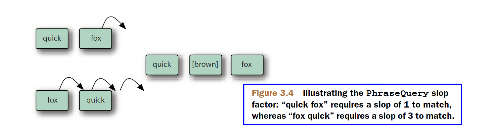
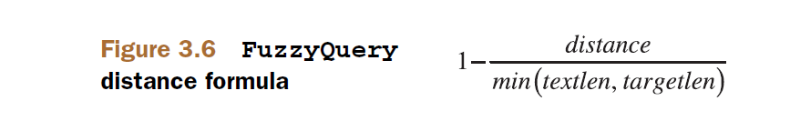

## 3.4 Lucene 丰富的查询类型 ##

&emsp;&emsp;正如 3.2 节所所看到那样，Lucene 的查询最终是要用一个 Query 实例，调用一个 IndexSearcher 的 search() 方法。Query 的具体子类可以直接创建 Query 实例，或者通过一个前端的 QueryParser 对象，将任意一段搜索文本解析成各种的类型的 Query 对象，并最终构建出一个大的 Query 实例。对于每一种查询类型，我们将展示如何以编程方式实例化这种类型的 Query 对象，也会展示 QueryParser 用于创建该种类型 Query 对象的语法。


<br/><br/>
<a id="1"></a>
## 3.4.1 通过词项（term）搜索: TermQuery ##

搜索索引最基本的方式就是通过一个指定的词项（term）进行搜索。词项 term 是被索引信息的最小单位，由 IndexWriter 通过我们所提供的词元（token）创建，并写入索引库，不需要应用程序程序参与。term 是由一个域的名称和一个文本值组成的一对值。程序清单 3.1 中提供了搜索一个指定 term 的示例。下面的代码构建了一个 Term 对象实例：

```
Term t = new Term("contents", "java");
```

TermQuery 接受一个 Term 实例作为构造器参数：

```
Query query = new TermQuery(t);
```

使用这个 TermQuery 对象进行搜索，所有在 "contens" 域中包含 "java" 文本的文档都会返回。注意，term 中的值是大小写敏感的，因此必须保证匹配被索引词项的大小写形式，这可能与索引的原始文件文本不一致，因为分析器可以对被索引的文本所做的处理有所不同。

&emsp;&emsp;TermQuery 在根据关键字查询文档时特别实用。如果文档在索引时使用 **FieldType.setTokenized(false)**选项，使用与索引时相同的值可以检索回这些文档。例如，使用本书提供的测试数据，程序清单 3.4.1 的代码检索出匹配所提供的 isbn 值的单个文档。

程序清单位于本书代码 searching 子模块。

<table width="100%"><tr><td bgcolor=green><font color=black>Listing 3.4.1 使用 TermQuery 查询</td></tr></table>

```
  @Test
  public void testKeyword() throws Exception {
    Directory directory = TestUtil.getBookIndexDirectory();
    DirectoryReader reader = DirectoryReader.open(directory);
    IndexSearcher searcher = new IndexSearcher(reader);

    Term t = new Term("isbn", "9781935182023");
    Query query = new TermQuery(t);
    TopDocs docs = searcher.search(query, 10);
    assertEquals("JUnit in Action, Second Edition", 1, docs.totalHits.value);

    reader.close();
    directory.close();
  }
```

&emsp;&emsp;不过，FieldType.setTokenized(false) 并不意味着对这个域值的索引是唯一的。这取决于我们自己，在索引期间确保这个域的值，在所有的文档中保持唯一性。例如从数据库中取出的数据，其中主键（primary key）的 ID 字段，在数据库中就保证了其唯一性，索引期间自然就保证了 ID 域的值，在所有文档中的唯一性。在我们的测试数据中，每本书的 isbn 号在所有文档中是唯一的，因此上面的代码搜索到 1 个文档的结果。


<br/><br/>
<a id="2"></a>
## 3.4.2 在 term 范围上搜索 Searching within a term range: TermRangeQuery ##

TermRangeQuery 查询在一个 term 定义的范围之内搜索匹配的文档。

>JavaDoc：A Query that matches documents within an range of terms. 

词项 term 在索引库中是按词典排序的（通过 BytesRef.compareTo(BytesRef) 方法），这就允许通过 TermRangeQuery 提供的范围（range），直接对文本词项进行搜索。词项范围的起始词项和结束词项可以包括或不包括在范围上。如果哪一端的值为 null，就表示那一端是开放的（open-ended）。范围的任何一端，或者两个端点，都可以是开发的。例如，值为 null 的 lowerTerm 意思是没有低端边界，因此，所有小于高端边界的词项都包括在范围上。只能将 TermRangeQuery 用在文本范围的搜索上，例如查找所有从 N 开始一直到 Q 范围上的名字。

>**NOTE**：TermRangeQuery 的执行效率比基于 point 定义的范围（range）低得多，因为它需要对每一个包含在范围上的词项都进行一次搜索，最终将它们的匹配结果进行合并。

TermRangeQuery 提供如下构造器：
- **TermRangeQuery(String field, BytesRef lowerTerm, BytesRef upperTerm, boolean includeLower, boolean includeUpper)** 构造范围查询，选择所有大于或等于 lowerTerm，并且小于或等于 upperTerm 的所有词项 term。参数 field：表示域的名称。lowerTerm：词项范围的低端值。upperTerm：词项范围的高端值。includeLower：如果为 true，表示 lowerTerm 包括在词项范围上。includeUpper：如果为 true，表示 upperTerm 包括在词项范围上。

TermRangeQuery 类提供了一个静态工厂方法，用于创建 TermRangeQuery 实例：
- **TermRangeQuery newStringRange(String field, String lowerTerm, String upperTerm, boolean includeLower, boolean includeUpper)** 该方法与构造器类似，只是提供边界的数据类型使用原生的 Java String 类型，而构造器使用的是 Lucene 表示底层数据的 BytesRef 类型。


下面的代码演示 TermRangeQuery 查询，搜索所有的标题从字符 "d" 开始一直到字符 "j" 的书籍。我们的测试数据中有 3 本这样的书籍。注意，在测试数据的索引库中，title2 域的值是对 title 值进行过小写转换的结果，是作为 StringField 类型域进行索引的，StringField 类型域不会对域值进行分析和切分，而是将整体作为一个词元加入到索引库中。

程序清单位于本书代码 searching 子模块。

<table width="100%"><tr><td bgcolor=green><font color=black>Listing 3.4.2 使用 TermRangeQuery 查询</td></tr></table>

```
public class TermRangeQueryTest {

  @Test
  public void testTermRangeQuery() throws Exception {
    Directory directory = TestUtil.getBookIndexDirectory();
    DirectoryReader reader = DirectoryReader.open(directory);
    IndexSearcher searcher = new IndexSearcher(reader);
    
    TermRangeQuery query = TermRangeQuery.newStringRange("title2", "d", "j", true, true);
//  TermRangeQuery query = new TermRangeQuery("title2", new BytesRef("d"), new BytesRef("j"), true, true);

    TopDocs matches = searcher.search(query, 100);
    assertEquals(3, matches.totalHits.value);

    for(int i=0;i<matches.scoreDocs.length;i++) {
      System.out.println("match " + i + ": " + searcher.doc(matches.scoreDocs[i].doc).get("title2"));
    }

    reader.close();
    directory.close();
  }
}
```

运行上面的测试代码，测试通过，并有如下输出：

```
match 0: imperial secrets of health and longevity
match 1: gödel, escher, bach: an eternal golden braid
match 2: extreme programming explained

Process finished with exit code 0
```

输出了 3 条匹配的记录。看得出，每条记录的 "title2" 域的值，起始字符 "i"、"g"、"e" 都在从字符 "d" 开始直到字符 "j" 结束的范围内上。其实在搜索时，要创建这个范围上的每一个词项，例如本例的 [d-j] 范围，需要分别创建："d"、"e"、"f"、"g"、"h"、"i"、"j" 词项，每个词项都单独进行一次查询，然后将每个词项的匹配结果合并为最终的搜索结果。这就是 TermRangeQuery 查询性能低下的原因。缩小 TermRangeQuery 的范围定义，或者使用数值型数据作为范围搜索，可以提升搜索效率。


<br/><br/>
<a id="3"></a>
## 3.4.3 在数值型范围上搜索 Searching within a numeric range ##

上一节我们提到过，TermRangeQuery 的执行效率比基于 point 定义的范围（range）低得多。

2.4.7 节数值数据的维度选项，和 2.6.4 节 IntPoint 子类的阐述中，我们知道，Lucene 对数值类型数据进行索引的演变历史，和最新的 PointValue 实现机制，并由此引入了 **IntPoint**、**LongPoint**、**FloatPoint**、**DoublePoint**、**BinaryPoint** 多维数值域类型。这些表示数值的数据类型都有一个共同的目的，用作快速的范围过滤器。 例如:

>IntPoint JavaDoc：An indexed int field for fast range filters.

我们以 IntPoint 为例来探索在数值范围上执行搜索的方法。

在 2.6.4 节 讨论 IntPoint 类时，我们只关注了它的构造器和 FieldType 选项的设置，这是 IntPoint 类型数据在索引操作方面的特性。现在，我们关注 IntPoint 在搜索操作方面的特性。IntPoint 类为搜索多维 int 类型数据提供了多个创建 Query 对象的静态工厂方法：
- **Query newExactQuery(String field, int value)** 创建一个准确匹配的 int 类型值的 Query 对象。
- **Query newRangeQuery(String field, int[] lowerValue, int[] upperValue)** 创建一个 n 维的 int 型范围查询（range query）。范围查询实际上是通过 \< 或 \<=，或者是 > 或 >= 方式进行查询。范围定义可以是半开的（half-open），设置 lowerValue[i] = Integer.MIN_VALUE 或者 upperValue[i] = Integer.MAX_VALUE。定义的范围是包括边界值的。要排除边界值，可以传入参数 Math.addExact(lowerValue[i], 1)，或者 Math.addExact(upperValue[i], -1)。参数 field：域的名字，必须为非 null 值。lowerValue：范围的低值边界（inclusive），必须为非 null 值。upperValue：范围的高值边界（inclusive），必须为非 null 值。返回值：匹配这个范围所有文档的查询。
- **Query newRangeQuery(String field, int lowerValue, int upperValue)** 创建一个 int 型的范围查询。这是个一维的 int 类型范围查询，是上面方法的简化版本，内容同上。
- **Query newSetQuery(String field, Collection<Integer> values)** 创建一个匹配集合内任意值的一维数值查询，是 point 类型的等价 TermQuery 查询。
- **Query newSetQuery(String field, int... values)** 创建一个匹配提供的 int 型值中任意值的一维数值查询，是 point 类型的等价 TermQuery 查询。

下面的示例代码，基于我们关于书籍的示例数据索引库的 "pubmonth" 域，索引时，将这个域作为以月份为精度的整数进行索引，即 2010 年 3 月被索引为 201003 整数。然后我们就能创建一个 int 类型、包含边界的范围查询：

程序清单位于本书代码 searching 子模块。

<table width="100%"><tr><td bgcolor=green><font color=black>Listing 3.4.3 在数值型范围上搜索</td></tr></table>

```
  @Test
  public void testInclusive() throws Exception {
    Directory directory = TestUtil.getBookIndexDirectory();
    DirectoryReader reader = DirectoryReader.open(directory);
    IndexSearcher searcher = new IndexSearcher(reader);
    // pub date of TTC was September 2006
    Query query = IntPoint.newRangeQuery("pubmonth", 200605, 200609);

    TopDocs matches = searcher.search(query, 10);

    assertEquals(1, matches.totalHits.value);

    for(int i=0; i<matches.scoreDocs.length; i++) {
      System.out.print("match " + i + "  [title]: " + searcher.doc(matches.scoreDocs[i].doc).get("title"));
      System.out.println(" [pubmonth]: " + searcher.doc(matches.scoreDocs[i].doc).get("pubmonth"));
    }

    reader.close();
    directory.close();
  }
```

运行代码，测试通过，并输出：

```
match 0  [title]: Tao Te Ching 道德經 [pubmonth]: 200609

Process finished with exit code 0
```

结果表明，"pubmonth" 为 200609 的文档被搜索到了，并且它还是这个范围的上限值。在上面的方法阐述中我们说过，要把数值型范围的某个边界排除在范围上，可以使用 Math.addExact(lowerValue[i], 1)，或者 Math.addExact(upperValue[i], -1) 做为边界值。下面的代码示例将范围的 int 型最低值和最高值都从范围上排除：

<table width="100%"><tr><td bgcolor=green><font color=black>Listing 3.4.3-2 在数值型范围上搜索，排除边界值</td></tr></table>

```
  @Test
  public void testExclusive() throws Exception {
    Directory directory = TestUtil.getBookIndexDirectory();
    DirectoryReader reader = DirectoryReader.open(directory);
    IndexSearcher searcher = new IndexSearcher(reader);

    // pub date of TTC was September 2006
    Query query = IntPoint.newRangeQuery("pubmonth", Math.addExact(200605, 1), Math.addExact(200609, -1));

    TopDocs matches = searcher.search(query, 10);
    assertEquals(0, matches.totalHits.value);

    reader.close();
    directory.close();
  }
}
```
测试代码验证匹配结果为 0，没有匹配的文档存在，测试通过。

&emsp;&emsp;我们知道，IntPoint 支持多维数据的索引，因此也支持多维数据范围查询的定义。可以通过 IntPoint.newRangeQuery(String field, int[] lowerValue, int[] upperValue) 方法创建一个多维 int 型数据范围的查询，然后将创建的 Query 对象传给 IndexSearcher.search() 方法，即可执行多维整型数据范围的搜索。要创建一个准确匹配某个 int 型值的 Query 对象，通过 IntPoint.newExactQuery(String field, int value) 方法创建。继续扩展 int 类型数据的搜索语义，通过 newSetQuery(String field, Collection<Integer> values) 或 newSetQuery(String field, int... values) 方法创建匹配集合中任意值的 Query 对象，只要把该对象传递给 IndexSearcher 的 search() 方法，就可以搜索到期望的搜索结果。

&emsp;&emsp;与 IntPoint 类型类似，Lucene 还提供了对其它数值型数据的支持：**LongPoint**、**FloatPoint**、**DoublePoint**、**BinaryPoint**。它们有与 IntPoint 类型类似的语义和特性，区别只在表示不同的原生类型：long、float、double、byte[]。当然，每种 \*\*Point 类型也有自己独特的特性。详细内容请分别参阅它们各自的 JavaDoc 文档。 


<br/><br/>
<a id="4"></a>
## 3.4.4 使用 PrefixQuery 搜索具有指定前缀的词项 ##

PrefixQuery 是匹配具有指定前缀词项的查询，QueryParser 对输入类似 "app*" 这样的文本解析为 PrefixQuery 对象。

下面的代码演示，如何使用简单的 PrefixQuery 递归查询一个层次结构。在测试数据中，"category" 域表现为一个层次的结构，非常适合 PrefixQuery 查询，如程序清单 3.4.4 所示：

<table width="100%"><tr><td bgcolor=green><font color=black>Listing 3.4.4 使用 PrefixQuery 查询</td></tr></table>

```
public class PrefixQueryTest {
  @Test
  public void testPrefix() throws Exception {
    Directory directory = TestUtil.getBookIndexDirectory();
    DirectoryReader reader = DirectoryReader.open(directory);
    IndexSearcher searcher = new IndexSearcher(reader);

    Term term = new Term("category", "/technology/computers/programming");

    PrefixQuery query = new PrefixQuery(term);                      //①
    TopDocs matches = searcher.search(query, 10);
    long programmingAndBelow = matches.totalHits.value;
    System.out.println("PrefixQuery matches totalHits: "+ programmingAndBelow);

    for(int i=0; i<matches.totalHits.value; i++) {
      System.out.print("match " + i + "  [title]: " + searcher.doc(matches.scoreDocs[i].doc).get("title"));
      System.out.println(" [category]: " + searcher.doc(matches.scoreDocs[i].doc).get("category"));
    }

    matches = searcher.search(new TermQuery(term), 10);           //②
    long justProgramming = matches.totalHits.value;
    System.out.println("-------------------");
    System.out.println("TermQuery matches totalHits: "+ justProgramming);
    for(int i=0; i<matches.scoreDocs.length; i++) {
      System.out.print("match " + i + "  [title]: " + searcher.doc(matches.scoreDocs[i].doc).get("title"));
      System.out.println(" [category]: " + searcher.doc(matches.scoreDocs[i].doc).get("category"));
    }

    assertTrue(programmingAndBelow > justProgramming);

    reader.close();
    directory.close();
  }
}

```
① PrefixQuery 查询, 搜索结果包括其本身，以及以其为前缀的子分类
② TermQuery 查询, 只搜索结果只包括其本身，不包括以其为前缀的子分类

代码通过测试，并输出：
```
PrefixQuery matches totalHits: 7
match 0  [title]: Ant in Action [category]: /technology/computers/programming
match 1  [title]: Mindstorms: Children, Computers, And Powerful Ideas [category]: /technology/computers/programming/education
match 2  [title]: JUnit in Action, Second Edition [category]: /technology/computers/programming
match 3  [title]: Lucene in Action, Second Edition [category]: /technology/computers/programming
match 4  [title]: Extreme Programming Explained [category]: /technology/computers/programming/methodology
match 5  [title]: Tapestry in Action [category]: /technology/computers/programming
match 6  [title]: The Pragmatic Programmer [category]: /technology/computers/programming
-------------------
TermQuery matches totalHits: 5
match 0  [title]: Ant in Action [category]: /technology/computers/programming
match 1  [title]: JUnit in Action, Second Edition [category]: /technology/computers/programming
match 2  [title]: Lucene in Action, Second Edition [category]: /technology/computers/programming
match 3  [title]: Tapestry in Action [category]: /technology/computers/programming
match 4  [title]: The Pragmatic Programmer [category]: /technology/computers/programming

Process finished with exit code 0
```

代码演示了 PrefixQuery 和 TermQuery 的区别。演示数据中，"category" 域按书籍文件所在的目录作为书籍的品类的域的值，建立索引库。PrefixQuery 查询将 term 定义本身的值 "/technology/computers/programming" 及其子品类的文档都搜索出来，搜索的匹配结果为 7 个文档。而 TermQuery 只搜索出与 term 定义值完全匹配的文档结果，不包括其子品类的文档，匹配结果为 5 个文档。

<br/><br/>
<a id="5"></a>
## 3.4.5 布尔查询 BooleanQuery ##

BooleanQuery 查询是 Lucene 中及其重要的查询结构，它是 Lucene 能够将多种查询类型组合在一起，构建各种复杂查询结构的基础。

&emsp;&emsp;我们在 3.3.2 节讨论 Lucene 评分机制的时候，曾经提过，Lucene 联合使用“信息检索的布尔模型（Boolean model of Information Retrieval，即 BM 模型）”与“信息检索的向量空间模型（Vector Space Model of Information Retrieval，即 VSM 模型）”执行数据搜索。虽然默认的向量空间模型 VSM 的 TF-IDF 算法已被概率空间模型的 BM25 算法所替代，但布尔模型并没有被替代，它仍然是 Lucene 数据搜索模型的重要支柱之一。

&emsp;&emsp;所有的查询类型，都可以通过各种复杂的方法，把他们组合在一起，组成为一个新的 BooleanQuery 实例。BooleanQuery 是表示布尔子句的 BooleanClause 对象的容器，一个 BooleanQuery 包含多个 BooleanClaus，而每一个 BooleanClaus 是一个子查询（sub-query，也是一个 Query 实例），BooleanClaus 通过布尔操作符（ BooleanClause.Occur 枚举值）表示自己如何与其它子句进行联合。
1. **SHOULD** —— 表示可能存在的（can occur），可选的（optional，should），不要求必须存在（not required），具有逻辑上 OR 的含义。SHOULD 操作符的意思是这个子句所包含查询的搜索结果可能，或者说应该出现在结果集中，但不是一定要在结果中存在。如果一个查询（布尔查询）全部是由 SHOULD 子句构成的，那么在最终的搜索结果中，每一个匹配的文档至少要匹配其中一个子句。
2. **MUST** —— 表示必须存在的（must，required to occur），具有逻辑上 AND 的含义。MUST 操作符的意思是这个子句所包含查询的搜索结果必须出现在结果集中，并且这个子句搜索结果的评分，会参与到最终匹配文档的评分。在最终的搜索结果中，每一个匹配的文档，必须匹配所有的带有 MUST 操作符的子句。
3. **MUST_NOT** —— 表示禁止出现（must not occur），一定不能存在，具有逻辑上 NOT 的含义。MUST_NOT 操作符的意思是这个子句所包含查询的搜索结果一定不能存在于最终的搜索结果中。在最终的搜索结果中，没有任何的文档匹配任何 MUST_NOT 子句所表示的子查询。
4. **FILTER** —— 表示过滤，FILTER 操作符的含义与 MUST 操作符含义相同，也具有逻辑上 AND 的语义，只是 FILTER 操作符表示的子句不参与匹配结果的评分。在最终搜索结果中，每一个匹配文档必须匹配所有带有 FILTER 操作符的子句。FILTER 操作符是 Lucene 在 5.1 版引入的，专门用于过滤器子句，替代旧版本的 Filter 系列过滤组件。

每一个 BooleanClause 子句必须使用四个操作符之一，加入到 BooleanQuery 查询中，而 BooleanClause 子句本身也可能是一个 BooleanQuery 对象，因此会构建出非常复杂的查询结构。

&emsp;&emsp;布尔查询可以通过向 BooleanQuery 中添加两个或更多的 BooleanClause 子句构建，如果加入了太多的子句，会在搜索时抛出  TooManyClauses 异常。这通常是在一个 Query 被重写成 BooleanQuery，向其中添加了太多的 TermQuery 子句时会发生，例如 WildcardQuery 通配符查询。默认情况下，BooleanQuery 中子句数量的最大值是 1024，但可以通过 IndexSearcher 的静态方法进行改变：

- **setMaxClauseCount​(int value)** 设置每个 Query 允许的最大子句数量，默认为 1024

为了构建 BooleanQuery 查询，先了解一下它所包含的 BooleanClause 子句特性。BooleanClause 类提供了上述四个操作符，并提供简单的构造器定义：
- **BooleanClause​(Query query, BooleanClause.Occur occur)** 构造一个 BooleanClause 子句实例，指定所包含的子查询，及其所使用的操作符。

Lucene 为 BooleanQuery 提供了建造者模式的 BooleanQuery.Builder 类，通过 Builder 类实现对 BooleanQuery 实例对象的构建。
- **BooleanQuery.Builder 	add​(BooleanClause clause)** 直接向 Builder 中添加 BooleanClause 子句
- **BooleanQuery.Builder 	add​(Query query, BooleanClause.Occur occur)** 通过提供子查询，及其所使用的操作符，向 Builder 中添加 BooleanClause 子句
- **BooleanQuery 	build()** 构建 BooleanQuery 实例
- **BooleanQuery.Builder 	setMinimumNumberShouldMatch​(int min)** 设置可选的 BooleanClauses 必须匹配的最小数量。也就是带有 SHOULD 操作符的子句，必须匹配的最小数量。默认情况下，所有 SHOULD 操作符的子句的查询结果，在最终搜索结果中都是非强制的，除非整个 BooleanQuery 查询中没有强制性的子句，例如 MUST 或 MUST_NOT，这时候就要求搜索结果中，每一个文档至少要匹配所有 SHOULD 子句中的一个。如果使用这个方法设置了一个最小值，那么，就是要求搜索结果中，每一个文档至少要匹配所有 SHOULD 子句中的最小匹配数量 min 个。这个方法所设置的最小匹配数量 min 与任何强制性子句或禁止的子句没有关系，min 数量只比较匹配 SHOULD 操作符子句的数量。

下面看看相关实例代码。代码清单 3.4.5 展示了一个逻辑 AND 关系的 BooleanQuery 查询，用于查找 "subject"域包含 "search"，并且 "pubmonth" 域在201001 至 201012 的书：

程序清单位于本书代码 searching 子模块。

<table width="100%"><tr><td bgcolor=green><font color=black>Listing 3.4.5 利用 BooleanQuery 组合 AND 子查询</td></tr></table>

```
  @Test
  public void testAnd() throws Exception {
    TermQuery searchingBooks = new TermQuery(new Term("subject","search"));                 //①

    Query books2010 = IntPoint.newRangeQuery("pubmonth", 201001,  201012);  //②

    BooleanQuery.Builder builder = new BooleanQuery.Builder();
    builder.add(searchingBooks, BooleanClause.Occur.MUST);  //③
    builder.add(books2010, BooleanClause.Occur.MUST);       //③
    BooleanQuery searchingBooks2010 = builder.build();      //④

    Directory directory = TestUtil.getBookIndexDirectory();
    DirectoryReader reader = DirectoryReader.open(directory);
    IndexSearcher searcher = new IndexSearcher(reader);
    TopDocs matches = searcher.search(searchingBooks2010, 10);

    assertTrue(TestUtil.hitsIncludeTitle(searcher, matches,
                                 "Lucene in Action, Second Edition"));

    for(int i=0; i<matches.scoreDocs.length; i++) {
      System.out.print("match " + i + "  [subject]: " + searcher.doc(matches.scoreDocs[i].doc).get("subject"));
      System.out.println(" [pubmonth]: " + searcher.doc(matches.scoreDocs[i].doc).get("pubmonth"));
    }

    reader.close();
    directory.close();
  }
}
```

① 匹配 "subject" 域包含 "search"
② 匹配出版日期 "pubmonth" 域在 [201001, 201012] 区间
③ 使用 MUST 操作符联合两个子查询
④ 构建 BooleanQuery 实例对象

代码中使用了 TestUtil.hitsIncludeTitle() 工具方法，为了方便代码测试，位于本书代码 common 子模块，实现如下：

```
  public static boolean hitsIncludeTitle(IndexSearcher searcher, TopDocs hits, String title)
    throws IOException {
    for (ScoreDoc match : hits.scoreDocs) {
      Document doc = searcher.doc(match.doc);
      if (title.equals(doc.get("title"))) {
        return true;
      }
    }
    System.out.println("title '" + title + "' not found");
    return false;
  }
```

执行测试代码，测试通过，并输出：

```
match 0  [subject]: lucene search java [pubmonth]: 201005
```

可以看出，匹配文档按我们预期的结果匹配。


代码清单 3.4.5-2 展示了一个逻辑 OR 关系的 BooleanQuery 查询。

<table width="100%"><tr><td bgcolor=green><font color=black>Listing 3.4.5-2 利用 BooleanQuery 组合 OR 子查询</td></tr></table>

```
  @Test
  public void testOr() throws Exception {
    TermQuery methodologyBooks = new TermQuery(                       // ①
               new Term("category",                                   // ①
                 "/technology/computers/programming/methodology"));   // ①

    TermQuery easternPhilosophyBooks = new TermQuery(                 // ②
        new Term("category",                                          // ②
            "/philosophy/eastern"));                                  // ②

    BooleanQuery.Builder builder = new BooleanQuery.Builder();        // ③
    builder.add(methodologyBooks, BooleanClause.Occur.SHOULD);        // ③
    builder.add(easternPhilosophyBooks, BooleanClause.Occur.SHOULD);  // ③
    BooleanQuery enlightenmentBooks = builder.build();                // ④

    Directory directory = TestUtil.getBookIndexDirectory();
    DirectoryReader reader = DirectoryReader.open(directory);
    IndexSearcher searcher = new IndexSearcher(reader);

    TopDocs matches = searcher.search(enlightenmentBooks, 10);
    System.out.println("or = " + enlightenmentBooks);

    assertTrue(TestUtil.hitsIncludeTitle(searcher, matches,
                                         "Extreme Programming Explained"));
    assertTrue(TestUtil.hitsIncludeTitle(searcher, matches,
                                         "Tao Te Ching \u9053\u5FB7\u7D93"));

    for(int i=0; i<matches.scoreDocs.length; i++) {
      System.out.print("match " + i + "  [title]: " + searcher.doc(matches.scoreDocs[i].doc).get("title"));
      System.out.println(" [category]: " + searcher.doc(matches.scoreDocs[i].doc).get("category"));
    }
    reader.close();
    directory.close();
  }
}
```

① 匹配第一个 "category" 的 TermQuery
② 匹配第二个 "category" 的 TermQuery
③ 使用 SHOULD 操作符联合两个 TermQuery
④ 构建 BooleanQuery 对象

执行测试代码，测试通过，并输出：

```
match 0  [title]: Tao Te Ching 道德經 [category]: /philosophy/eastern
match 1  [title]: Extreme Programming Explained [category]: /technology/computers/programming/methodology

Process finished with exit code 0
```

代码输出了匹配任意一个 SHOULD 子查询的结果文档。

BooleanQuery 是一个强大的工具，通过简单地指定每个子句的操作符，混合并匹配多个不同的子句，通过这种方式，可以创建出非常强大的查询。查询分析器 QueryParser 就是通过 BooleanQuery 将各个子查询最终联合到一起，作为一个 Query 实例返回给调用者的。


<br/><br/>
<a id="6"></a>
## 3.4.6 通过短语搜索：PhraseQuery ##

在 2.4.1 节，讨论域的索引选项时，我们探讨过，域的索引选项通过 **FieldType.setIndexOptions(IndexOptions value)** 方法配置，控制哪些信息存储到倒排索引的倒排表（posting lists）中，搜索时可以利用这个域的哪些信息。**IndexOptions** 是枚举值，不同的索引选项类型会直接影响查询和评分效果。其中 **DOCS_AND_FREQS_AND_POSITIONS** 和 **DOCS_AND_FREQS_AND_POSITIONS_AND_OFFSETS** 选项会将词项的位置信息（positional information of term）保存到索引中。短语查询 PhraseQuery 就是利用位置信息来定位文档，一个词项与另一个词项间的位置距离在一定的范围之内。

>JavaDoc: A Query that matches documents containing a particular sequence of terms. 

PhraseQuery 查询可以与其它查询联合成 BooleanQuery。QueryParser 对输入类似 "new york" 的文本解析为 PhraseQuery 对象。

&emsp;&emsp;例如，假设有一个域包含这样的语句 *"the quick brown fox jumped over the lazy dog"*。即使不知道这个语句的完整内容，我们仍然可以通过搜索含有彼此相邻的 "quick" 和 "fox" 的域，找到这个文档。确实，使用普通的 TermQuery 查询加上一些小技巧，也可以通过这两个词项定位到文档，例如用 BooleanQuery 将 "quick" 和 "fox" 的 TermQuery 子查询用 MUST 操作符连起来，就可以定位到这个文档。而我们的情况是，只想找到包含这样的短语：其中的词项或者一个紧挨着一个（如 "quick fox"），或者其中间可以有一个词（例如 quick [irrelevant] fox）。

&emsp;&emsp;可以被认定是匹配的两个词项的位置之间所允许的最大位置距离（positional distance），或者说是最大编辑距离（maximum edit distance），称为 slop。这里的位置距离（distance）是指一个词项用于以正确的排列，重新构建短语所需移动的位置数量（the number of positional）。

PhraseQuery 类提供了四个构造器：
- **PhraseQuery(int slop, String field, BytesRef... terms)**
- **PhraseQuery(int slop, String field, String... terms)**
- **PhraseQuery(String field, BytesRef... terms)** 
- **PhraseQuery(String field, String... terms)** 

为了灵活构建 PhraseQuery 对象，Lucene 为 PhraseQuery 提供了建造者模式的 PhraseQuery.Builder：
- **add(Term term)** 在查询短语结尾位置添加一个词项，新词项的相对位置是最后一个词项之后 1 个位置。
- **add(Term term, int position)** 在查询短语结尾位置添加一个词项，新词项在短语中的相对位置由 position 参数显式指定，但是必须大于或等于前一个 term 的位置。比较大的位置意思是短语带有空隙（例如，有停用词连接）。如果位置与前一个 term 位置相同，那么要考虑使用 MultiPhraseQuery 来替代 PhraseQuery。
- **setSlop(int slop)** 设置 slop 值。
- **PhraseQuery build()** 基于所添加的 term 构建 PhraseQuery 实例。


让我们用上面提到的短语案例来观察 slop 因子是如何工作的，代码如程序清单 3.4.6 所示。

<table width="100%"><tr><td bgcolor=green><font color=black>Listing 3.4.6 使用 PhraseQuery</td></tr></table>

```
public class PhraseQueryTest {
  private final String indexPath = "indexes";
  private Directory directory;
  private DirectoryReader reader;
  private IndexSearcher searcher;

  @Before
  public void setUp() throws IOException {
    directory = FSDirectory.open(Paths.get(indexPath));
    IndexWriterConfig config = new IndexWriterConfig(new WhitespaceAnalyzer());
    config.setCommitOnClose(true);
    IndexWriter writer = new IndexWriter(directory, config);

    Document doc = new Document();
    doc.add(new TextField("field",                           // ①
              "the quick brown fox jumped over the lazy dog",
              Field.Store.YES ));
    writer.addDocument(doc);
    writer.close();

    reader = DirectoryReader.open(directory);
    searcher = new IndexSearcher(reader);
  }

  @After
  public void tearDown() throws IOException {
    reader.close();
    directory.close();
    deleteDir(new File(indexPath));
  }

  public static void deleteDir(File dir) {
    if (dir.isDirectory()) {
      String[] children = dir.list();
      for (int i = 0; i < children.length; i++) {
        new File(dir, children[i]).delete();
      }
    }
    dir.delete();
  }
  private boolean matched(String[] phrase, int slop)
      throws IOException {

    PhraseQuery.Builder builder = new PhraseQuery.Builder();
    builder.setSlop(slop);                   // ②

    for (String word : phrase) {
      builder.add(new Term("field", word));  // ③
    }
    PhraseQuery query = builder.build();
    TopDocs matches = searcher.search(query, 10);

    return matches.totalHits.value > 0;
  }

  @Test
  public void testSlopComparison() throws Exception {
    String[] phrase = new String[] {"quick", "fox"};

    assertFalse("exact phrase not found", matched(phrase, 0));

    assertTrue("close enough", matched(phrase, 1));
  }
}

```

① 索引库中添加一个测试文档
② 创建 PhraseQuery.Builder 实例并设置 slop 值
③ 按顺序添加 term 

PhraseQuery 及 PhraseQuery.Builder 的 slop 的默认值都是 0，即默认 PhraseQuery 指定为精确短语匹配，所有匹配文档必须包含 PhraseQuery 中的准确的词项和位置。

&emsp;&emsp;虽然词项加入短语查询的次序不必和域中次序相同，但添加的次序会影响 slop 因子的考量。例如，短语查询中的 term 反转加入的（fox 在前，然后是 quick），那么，匹配文档，词项需要移动的位置数量应该是 3，而不是 1。为了形象些描述，考虑要经过多少次移动才能将 "fox" 物理移动到 "quick" 之后两个位置处。我们会发现，需要一次移动将 "fox" 移动到与 "quick" 相同的位置，然后再移动两次才能将 "fox" 移动到 "quick" 之后足够的位置，以匹配 "quick brown fox"。

图 3.4 展示了 {"quick" "fox"} 和 {"fox" "quick"} 这两个短语查询情况下，slop 位置是如何工作的（图片来源 Lucene in action second edition）：

<div align=center></div>
<div align=center style="font-weight:bold;color:black;font-size:17px;">图 3.4</div>

下面的用例展示了反转后的短语查询测试代码{"fox" "quick"}：

```
  @Test
  public void testReverse() throws Exception {
    String[] phrase = new String[] {"fox", "quick"};

    assertFalse("hop flop", matched(phrase, 2));
    assertTrue("hop hop slop", matched(phrase, 3));
  }
```

代码验证通过。{"fox", "quick"} 短语查询需要 slop 为 3 才能匹配我们的测试文档："the quick brown fox jumped over the lazy dog"。

<br/>
#### <font color=green>多词项短语查询 Multiple-Term Phrase</font> ####

PhraseQuery 支持多词项短语。不管短语使用多少个词项，slop 因子（factor）是允许将多个词项移动到匹配位置总次数的最大值。看看下面的多词项短语查询：

```
  @Test
  public void testMultiple() throws Exception {
    assertFalse("not close enough",
        matched(new String[] {"quick", "jumped", "lazy"}, 3));

    assertTrue("just enough",
        matched(new String[] {"quick", "jumped", "lazy"}, 4));

    assertFalse("almost but not quite",
        matched(new String[] {"lazy", "jumped", "quick"}, 7));

    assertTrue("bingo",
        matched(new String[] {"lazy", "jumped", "quick"}, 8));
  }
```

代码测试通过。


<br/>
#### <font color=green>短语查询评分 PhraseQuery Scoring</font> ####

短语查询评分是基于匹配短语所需要的编辑距离（edit distance）。更准确匹配比需要更多移动次数的匹配计入更高的权重。短语查询的评分因子如图 3.5 所示，编辑距离的倒数关系保证了，更大的编辑距离获得更低的评分。

<div align=center></div>
<div align=center style="font-weight:bold;color:black;font-size:17px;">图 3.5</div>

**注**：在 QueryParser 解析的查询表达式中，由双引号 "" 包裹的表达式文本被解析为 PhraseQuery 查询。slop 因子默认是 0。但可以通过在双引号之后添加(~)符号和一个正数对 slop 因子进行调整。例如，表达式：

&emsp;&emsp;**"quick fox"~3** 

被解析为包含 {"quick" "fox"} 词项，slop 因子为 3 的 PhraseQuery。

<br/><br/>
<a id="7"></a>
## 3.4.7 通过通配符搜索：WildcardQuery ##

通配符（wildcard）查询让我们能够通过缺失一部分内容的词项，仍能找到匹配的结果。Lucene 有两个标准的通配符字符：
- **\*** ：表示 0 或者多个字符
- **?**：表示 0 或者 1 个字符


下面程序清单演示 WildcardQuery 的用法及其表现。

<table width="100%"><tr><td bgcolor=green><font color=black>Listing 3.4.7 使用 WildcardQuery</td></tr></table>

```
public class WildcardQueryTest {
    private final String indexPath = "indexes";
    private Directory directory;
    private DirectoryReader reader;
    private IndexWriter writer;
    private IndexSearcher searcher;

    @Before
    public void setUp() throws IOException {
        directory = FSDirectory.open(Paths.get(indexPath));
        IndexWriterConfig config = new IndexWriterConfig(new WhitespaceAnalyzer());
        writer = new IndexWriter(directory, config);
    }

    @After
    public void tearDown() throws IOException {
        reader.close();
        directory.close();
        deleteDir(new File(indexPath));
    }
    public static void deleteDir(File dir) {
        if (dir.isDirectory()) {
            String[] children = dir.list();
            for (int i = 0; i < children.length; i++) {
                new File(dir, children[i]).delete();
            }
        }
        dir.delete();
    }

    private void indexSingleFieldDocs(Field[] fields) throws Exception {
        for (Field f : fields) {
            Document doc = new Document();
            doc.add(f);
            writer.addDocument(doc);
        }
        writer.close();
    }

    @Test
    public void testWildcard() throws Exception {
        indexSingleFieldDocs(new Field[]
                {
                    new TextField("contents", "wild", Field.Store.YES),
                    new TextField("contents", "child", Field.Store.YES),
                    new TextField("contents", "mild", Field.Store.YES),
                    new TextField("contents", "mildew", Field.Store.YES)
                });
        reader = DirectoryReader.open(directory);
        searcher = new IndexSearcher(reader);
        Query query = new WildcardQuery(new Term("contents", "?ild*")); //①

        TopDocs matches = searcher.search(query, 10);
        assertEquals("child no match", 3, matches.totalHits.value);

        assertEquals("score the same", matches.scoreDocs[0].score,
                matches.scoreDocs[1].score, 0.0);
        assertEquals("score the same", matches.scoreDocs[1].score,
                matches.scoreDocs[2].score, 0.0);

        for(int i=0; i<matches.scoreDocs.length; i++) {
            System.out.print("match " + i + "  [contents]: " + searcher.doc(matches.scoreDocs[i].doc).get("contents"));
            System.out.println(" [score]: " + matches.scoreDocs[i].score);
        }
    }
}
```

① 创建 WildcardQuery 实例

执行代码测试，测试通过，并输出：
```
match 0  [contents]: wild [score]: 1.0
match 1  [contents]: mild [score]: 1.0
match 2  [contents]: mildew [score]: 1.0
```

可以看出，只有 "child" 这个文档不匹配，因为在 "ild" 前有 2 个字符，不是通配符 "?ild*" 要求的 1 个字符。还有个令人奇怪的现象是，通配符查询结果的评分都是相同的 1.0。这说明 Lucene 并没有对通配符查询设计什么评分机制，这似乎是可以理解的，在一个复合的 BooleanQuery 中，通配符查询子句的作用本就是很低的。


>**警告**：使用 WildcardQuery 查询会导致性能降低。长一些的前缀（第一个通配符之前的字符）会减少查找匹配结果的词项数量，有利于提升性能。极端情况下，以通配符开始的 WildcardQuery 查询，会强制列举索引库中所有的词项进行搜索，造成效率最低的搜索，可能会引发内存耗尽异常。通过构造器：**WildcardQuery(Term term, int determinizeWorkLimit)** 设定一个限制值，会对这种情况有所改善。determinizeWorkLimit 的默认值为 Operations.DEFAULT_DETERMINIZE_WORK_LIMIT 常量，值为 	10000。

<br/><br/>
<a id="8"></a>
## 3.4.8 使用模糊查询搜索类似词项：FuzzyQuery ##

Lucene 的模糊查询 FuzzyQuery 用于匹配与指定的词项相似的词项。相似度（the similarity measurement）是基于 Damerau-Levenshtein (最佳字符串校正)算法的，但是，可以通过给构造器的 transpositions 参数传递 false 值来显式选择经典 Levenshtein 算法。

&emsp;&emsp;**莱文斯坦距离（Levenshtein distance）**，是编辑距离的一种。是指两个字串之间，由一个字符串转成另一个字符串所需的最少编辑操作次数。允许的编辑操作包括将一个字符替换成另一个字符，插入一个字符，删除一个字符。例如，kitten 和 sitting 的莱文斯坦距离是 3，将 kitten 变为 sitting 的最小（最佳）处理方式如下：

1. sitten （替换 k→s）
2. sittin （替换 e→i）
3. sitting （插入 →g）

这是俄罗斯科学家弗拉基米尔·莱文斯坦在 1965 年提出这个概念。再例如，three 到 tree 的编辑距离是 1，因为只需删除一个字符 h 就可以了。

编辑距离（Edit distance）是莱文斯坦距离（Levenshtein distance）的另一个同义术语，它是两个字符串间相似程度的度量值。

&emsp;&emsp;**Damerau-Levenshtein** 距离是一种莱文斯坦距离的变种，但允许以单一操作交换相邻的两个字符（称为字符转置），如 AB→BA 的距离是 1（交换）而非 2（先删除再插入、或者两次替换）。FuzzyQuery 默认就是基于这种算法进行匹配的。

&emsp;&emsp;FuzzyQuery 查询匹配最多 2 个编辑距离。更高的编辑距离（特别是启用变换），通常没有什么用，会匹配很大数量的 term 词典。

FuzzyQuery 构造器：

- **FuzzyQuery(Term term, int maxEdits, int prefixLength, int maxExpansions, boolean transpositions)** 创建 FuzzyQuery 实例，匹配编辑距离最大为 maxEdits，如果 prefixLength > 0，则要求有 prefixLength 长度的普通前缀。参数 term：要搜索的 term。maxEdits：最大编辑距离，必须 >= 0 并且 <= LevenshteinAutomata.MAXIMUM_SUPPORTED_DISTANCE，该常量值为 2。prefixLength：普通前缀（非模糊）的长度。maxExpansions：最大数量的匹配词项。transpositions：如果为 true，使用 Damerau-Levenshtein 距离算法，如果为 false，使用经典的莱文斯坦编辑距离。
- **FuzzyQuery(Term term, int maxEdits, int prefixLength)** 调用 FuzzyQuery(term, maxEdits, prefixLength, defaultMaxExpansions, defaultTranspositions)，defaultMaxExpansions 值为 50。defaultTranspositions 值为 true。
- **FuzzyQuery(Term term, int maxEdits)** 调用 FuzzyQuery(term, maxEdits, defaultPrefixLength)，defaultPrefixLength 值为 0。
- **FuzzyQuery(Term term)** 调用 FuzzyQuery(term, defaultMaxEdits)，defaultMaxEdits 值是 2。

下面的代码清单，演示 FuzzyQuery 的使用方法及其表现：

<table width="100%"><tr><td bgcolor=green><font color=black>Listing 3.4.8 使用 FuzzyQuery</td></tr></table>

```

public class FuzzyQueryTest {
    private final String indexPath = "indexes";
    private Directory directory;
    private DirectoryReader reader;
    private IndexWriter writer;
    private IndexSearcher searcher;

    @Before
    public void setUp() throws IOException {
        directory = FSDirectory.open(Paths.get(indexPath));
        IndexWriterConfig config = new IndexWriterConfig(new WhitespaceAnalyzer());
        writer = new IndexWriter(directory, config);
    }

    @After
    public void tearDown() throws IOException {
        reader.close();
        directory.close();
        deleteDir(new File(indexPath));
    }
    public static void deleteDir(File dir) {
        if (dir.isDirectory()) {
            String[] children = dir.list();
            for (int i = 0; i < children.length; i++) {
                new File(dir, children[i]).delete();
            }
        }
        dir.delete();
    }

    private void indexSingleFieldDocs(Field[] fields) throws Exception {
        for (Field f : fields) {
            Document doc = new Document();
            doc.add(f);
            writer.addDocument(doc);
        }
        writer.close();
    }

    @Test
    public void testFuzzy() throws Exception {
        indexSingleFieldDocs(new Field[] {
                new TextField("contents", "fuzzy", Field.Store.YES),
                new TextField("contents", "wuzzy", Field.Store.YES)
        });
        reader = DirectoryReader.open(directory);
        IndexSearcher searcher = new IndexSearcher(reader);

        Query query = new FuzzyQuery(new Term("contents", "wuzza")); // ①
        TopDocs matches = searcher.search(query, 10);

        assertEquals("both close enough", 2, matches.totalHits.value);
        assertTrue("wuzzy closer than fuzzy",
                matches.scoreDocs[0].score != matches.scoreDocs[1].score);
        Document doc = searcher.doc(matches.scoreDocs[0].doc);
        assertEquals("wuzza bear", "wuzzy", doc.get("contents"));

        for(int i=0; i<matches.scoreDocs.length; i++) {
            System.out.print("match " + i + "  [contents]: " + searcher.doc(matches.scoreDocs[i].doc).get("contents"));
            System.out.println(" [score]: " + matches.scoreDocs[i].score);
        }
    }
}

```

① 创建 FuzzyQuery 实例

代码通过测试，并输出：

```
match 0  [contents]: wuzzy [score]: 0.2520535
match 1  [contents]: fuzzy [score]: 0.18904014

Process finished with exit code 0
```

可以看出，使用 "wuzza" 创建 FuzzyQuery 查询，但 "wuzza" 并没有加入索引库，但搜索结果还是匹配了 "wuzzy" 和 "fuzzy" 两个结果文档。

编辑距离影响了评分结果，较小的编辑距离获得更改的评分值。图 3.6 展示了编辑距离参与的评分计算公式：

<div align=center></div>
<div align=center style="font-weight:bold;color:black;font-size:17px;">图 3.6</div>

>**警告**：FuzzyQuery 会尽可能地枚举索引中 maxExpansions 所允许数量（默认为 50）的词项。因此，最好尽量少地使用 FuzzyQuery 查询，即便要使用，至少要了解其工作原理和它可能对性能造成的影响。


<br/><br/>
<a id="9"></a>
## 3.4.9 匹配所有文档：MatchAllDocsQuery ##

MatchAllDocsQuery 查询，顾名思义，就是匹配索引中所有的文档。默认情况下，它给所有匹配文档分配一个常量评分，查询的加权值（boost），默认为 1.0。


