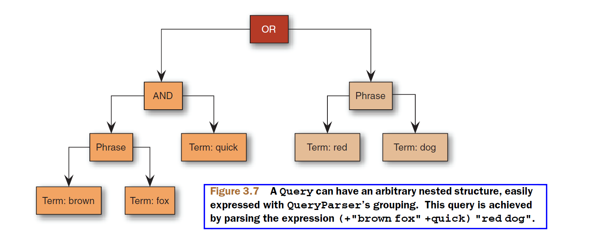

## 3.5 解析查询表达式：QueryParser ## 

&emsp;&emsp;尽管基于 API 创建的查询对象很强大，但是，如果所有的查询对象都必须通过 Java 代码显式构建的话，也是不合理的。使用人类可读的（human-readable）的文本查询形式，Lucene 的 QueryParser 能够构建出前面讨论过的 Query 子类对象。由于 QueryParser 已经能够识别出标准的搜索语法，得益于像 Google 这类 web 搜索引擎的贡献，标准的搜索语法已经非常普及，利用 QueryParser 的简单快捷方式，使我们的搜索程序符合用户的期望。QueryParser 也很容易自定义，详细内容参加 6.3 节。

我们创建的 Query 对象可能是一个复杂的实体，它可能由嵌套的 BooleanQuery 对象，以及各种类型的 Query 对象组成，但由用户输入的表达式可能是下面这样易读的文本：

&emsp;&emsp;**+pubdate:[20100101 TO 20101231] Java AND (Lucene OR Apache)**

这个查询搜索所有关于 Java 的书籍，并且在它们的 "contents" 域包含 "Lucene" 或 "Apache"，并且是 2010 年出版的。

>**注**：当有特殊字符用于查询表达式时，需要提供一个转义机制来将特殊字符用于常规方式。QueryParser 使用反斜杠（\）来转义词项中的特殊字符。需要转义的字符如下：**\ + - ! ( ) : ^ ] { } ~ \* ?**


注意，QueryParser 不是线程安全的类。


<br/><br/>
<a id="1"></a>
## 3.5.1 Query.toString ##

通过 QueryParser 对查询表达式进行解析后，看起来会发生某些变化。如何能说明表达式到底发生了什么变化？它解析的结果确实是我们所要的吗？一种查看结果 Query 实例的途径是使用 Query 的 toString() 方法。

&emsp;&emsp;所有的具体的核心 Query 类型，都有特定的 toString() 方法的实现。标准的 Object.toString() 方法被重写(override)并委托给 toString(String field) 方法，其中，field 是默认的域名称。调用无参数的 toString() 方法使用空的默认的域名称，会导致输出显式使用能表示所有词项的域选择器标记。下面的代码示例展示 toString() 方法的使用：

程序清单位于本书代码 searching 子模块。

<table width="100%"><tr><td bgcolor=green><font color=black>Listing 3.5.1 Query.toString()</td></tr></table>

```java
public class QueryToStringTest {
    @Test
    public void testToString() throws Exception {
        BooleanQuery.Builder builder = new BooleanQuery.Builder();

        builder.add(new FuzzyQuery(new Term("field", "kountry")),
                BooleanClause.Occur.MUST);
        builder.add(new TermQuery(new Term("title", "western")),
                BooleanClause.Occur.SHOULD);

        BooleanQuery query = builder.build();

        assertEquals("both kinds", "+kountry~2 title:western",
                query.toString("field"));

        System.out.println("query: " + query.toString());
        System.out.println("query: " + query.toString("field"));
    }
}

```

运行测试，测试通过，并输出：

```shell
query: +field:kountry~2 title:western
query: +kountry~2 title:western

Process finished with exit code 0
```

toString() 方法（特别是带有一个参数的）是调试复杂 API 查询的便利工具，也是了解 QueryParser 解析查询表达式结果的一种方法。但不要过分依赖这种能力，反复在 Query.toString() 的表现和 QueryPaser 解析的表达式之间进行比较。这个转换通常比较准确，但分析器是复杂的，并且可能使某些事情变得难以理解，这个问题在第 4.1.2 节进一步深入讨论。

<br/><br/>
<a id="2"></a>
## 3.5.2 QueryParser 词项解析：TermQuery ##

正如我们所预期的那样，一个单词默认情况下，会被 QueryPaser 解析为一个 TermQuery 对象，只要它不是被其它查询类型识别的另一个更大表达式边界的一部分。例如：

<table width="100%"><tr><td bgcolor=green><font color=black>Listing 3.5.2 QueryParser: TermQuery</td></tr></table>

```java
  @Test
  public void testTermQuery() throws Exception {
    QueryParser parser = new QueryParser("subject", analyzer);
    Query query = parser.parse("computers");
    System.out.println("term: " + query);
  }

```

输出：

```shell
term: subject:computers
```

注意 QueryPaser 是如何构建词项查询的，它是把实例化 QueryPaser 时我们提供的默认域 "subject"，作为分析的单词 "computers" 的域构建新的词项。还要注意，在构建 TermQuery 之前，单词的文本经过了分析过程。在我们的 QueryParserTest 类中，使用了 WhitespaceAnalyzer 分析器，该分析器只是简单地在空白处切分单词。如果我们使用一个更复杂些的分析器，会产生不同的词项，例如去掉复数形式后缀，或者转换至其词根形式在传递给 TermQuery。**让 QueryParser 使用的分析与索引期间所使用的分析相匹配，这是至关重要的**。


<br/><br/>
<a id="3"></a>
## 3.5.3 QueryParser 范围解析：TermRangeQuery ##

文本范围查询使用括号语法，在范围的起始词项和结束词项间，使用 TO 连接。注意，"TO" 必须是全部大写形式。括号的类型决定了范围边界是包含的（方括号[]）还是排除的（花括号{}）。注意，不能像编程方式构建 TermRangeQuery 那样，混合使用包含边界和排除边界：开始和结束边界，要么都是包含的，要么都是排除的。

看程序清单 3.5.3，演示包含边界和排除边界。

<table width="100%"><tr><td bgcolor=green><font color=black>Listing 3.5.3 QueryParser: TermRangeQuery</td></tr></table>

```java
  @Test
  public void testTermRangeQuery() throws Exception {
    Query query = new QueryParser("subject", analyzer).parse("title2:[q TO v]"); //①
    assertTrue(query instanceof TermRangeQuery);
    System.out.println("query type: " + query.getClass().getName());

    TopDocs matches = searcher.search(query, 10);
    System.out.println("matches count: "+ matches.totalHits.value);

    assertTrue(TestUtil.hitsIncludeTitle(searcher, matches, "Tapestry in Action"));

    for (ScoreDoc match : matches.scoreDocs){
      Document doc = searcher.doc(match.doc);
      System.out.println("title: " + doc.get("title"));
    }

    System.out.println("-------------");

    query = new QueryParser("subject", analyzer)
                            .parse("title2:{q TO \"tapestry in action\"}");       //②
    matches = searcher.search(query, 10);
    System.out.println("matches count: "+ matches.totalHits.value);

    assertFalse(TestUtil.hitsIncludeTitle(searcher, matches,  "Tapestry in Action"));//③

    for (ScoreDoc match : matches.scoreDocs){
      Document doc = searcher.doc(match.doc);
      System.out.println("title: " + doc.get("title"));
    }
  }
```
  
① 验证包含边界的范围 range
② 验证排除边界的范围 range
③ 验证排除 "Tapestry in Action"
  
运行测试代码，测试通过，并输出：

```shell
query type: org.apache.lucene.search.TermRangeQuery
matches count: 3
title: Tao Te Ching 道德經
title: Tapestry in Action
title: The Pragmatic Programmer
-------------
matches count: 1
title 'Tapestry in Action' not found
title: Tao Te Ching 道德經

Process finished with exit code 0
```

从运行结果可以看出，在第二次使用排除符号 {} 时，将范围上边界 'Tapestry in Action' 排除在搜索结果之外。

>**NOTE**：如果范围的开始边界或结束边界包含有空格，它们必须使用双引号 "" 将其包围起来，否则解析失败，如示例代码中的 \"Tapestry in Action\" 所示。还有，在字符串中，双引号需要转义。


<br/><br/>
<a id="4"></a>
## 3.5.4 QueryParser 数值型范围解析 ##

QueryParser 不支持对数值型范围的解析。是因为当前版本的 Lucene 无法跟踪哪些域是使用 IntPoint、LongPoint、DoublePoint、FloatPoint 域类型索引的，即使是最新的 Lucene 9.3 版本，也没有解除该限制。所有的范围表达式都被解析为 TermRangeQuery 查询，以字典顺序排序。


<br/><br/>
<a id="5"></a>
## 3.5.5 QueryParser 解析前缀和通配符查询 ##

如果一个词项中包含星号 * 或者问号 ?，它被当做通配符查询 WildcardQuery。如果这个词项只包含一个尾部星号 *，QueryParser 优先使用前缀查询 PrefixQuery 解析。

QueryParser 在默认情况下，通配符在词项的开头是不允许的，但可以通过 **QueryParser.setAllowLeadingWildcard(boolean allowLeadingWildcard)** 方法解开这种限制，设置为 true 允许词项开头为通配符字符，注意，对于较大的索引库，这会导致非常慢的查询性能。默认为 false。


<br/><br/>
<a id="6"></a>
## 3.5.6 QueryParser 解析布尔操作符 ##

通过 QueryParser 以文本形式构建布尔查询，使用 **AND、"+"、OR、NOT、"-"** 操作符。注意，这些操作符必须全部为大写形式。没有明确指定操作符的词项使用隐式操作符，默认为 OR。查询 abc xyz 被解析为 abc OR xyz，或者 abc AND xyz，由隐式操作符的设置决定。设置隐式操作符，通过 QueryParser 的

&emsp;&emsp;**setDefaultOperator(QueryParser.Operator op)** 

方法设置。其中 QueryParser.Operator 枚举值为 **AND** 或者 **OR**。

<br />
#### <font color=green>OR 或 || </font> ####

**OR** 操作符是 QueryParser 默认的隐式连接操作符，如上所述。由 OR 操作符连接的词项，在搜索结果中，匹配的文档至少匹配其中一个词项，等同于集合并集。符号 || 可用于替换 OR 操作符。例如，搜索包含 "jakarta apache"  just "jakarta" 的文档，使用如下查询：

```shell
"jakarta apache" jakarta
```

或者

```shell
"jakarta apache" OR jakarta
```

<br />
#### <font color=green>AND 或 && </font> ####

**AND** 操作符匹配的文档中，必须同时匹配操作符两侧的词项，等同于集合交集。符号 && 可以替换 AND 的位置。例如，搜索包含 "jakarta apache" 和 "Apache Lucene" 的文档，使用如下搜索：

```shell
"jakarta apache" AND "Apache Lucene"
```

<br />
#### <font color=green>+</font> ####

**\+** 操作符或称为必须的操作符（required operator），在 "+" 符号之后的词项，必须存在于每一个匹配文档中。例如，搜索必须包含 "jakarta" 并且可能包含 "lucene" 的文档，使用如下查询：

```shell
+jakarta lucene
```

<br />
#### <font color=green>NOT 或 !</font> ####

**NOT** 操作符表示在搜索结果中排除匹配 NOT 操作符后面词项的文档。等同于集合差集。符号 **!** 可用于替换 NOT 所在位置。例如，搜索包含 "jakarta apache" 但不包含 "Apache Lucene" 的文档，使用如下查询：

```shell
"jakarta apache" NOT "Apache Lucene"
```

注意：NOT 操作符不能用于只有一个词项。例如，下面的搜索不会返回结果：

```shell
NOT "jakarta apache"
```

<br />
#### <font color=green>-</font> ####

**"-"** 操作符或者禁止操作符，在搜索结果中排除包含 "-" 符号后面的词项。例如，搜索包含 "jakarta apache" 但不包含 "Apache Lucene" 的文档，使用如下查询：

```shell
"jakarta apache" -"Apache Lucene"
```


<br/><br/>
<a id="7"></a>
## 3.5.7 QueryParser 解析短语查询 ##

由双引号 "" 包围的词项解析为 PhraseQuery。双引号之间的文本会被解析，因此解析出来的 PhraseQuery 可能不会与原始文本完全一样。这个分析过程一直以来都是给我们带来困惑的主要原因。举例来说，查询语句 "This is Some Phrase*"，当被 StandardAnalyzer 分析时，解析出的 PhraseQuery 使用的短语是 "some phrase"。StandardAnalyzer 进行分析时，会移除 this 和 is 单词，因为它们存在于默认的停用词列表中，并且会保留它们位置，以记录单词被移除了。一个经常被提到的问题是，为什么这里星号 * 没有被解释为通配符查询，记住，由双引号包围的文本，会导致包围的文本被分析，并将其转换为 PhraseQuery。单个词项的短语会被优化为 TermQuery。下面的代码演示在一个短语查询表达式上分析效果，以及 TermQuery 优化。

<table width="100%"><tr><td bgcolor=green><font color=black>Listing 3.5.7 QueryParser: TermRangeQuery</td></tr></table>

```java
  @Test
  public void testPhraseQuery() throws Exception {
    Query q = new QueryParser("field", new StandardAnalyzer(EnglishAnalyzer.ENGLISH_STOP_WORDS_SET))
                .parse("\"This is Some Phrase*\"");

    assertEquals("analyzed",
        "\"? ? some phrase\"", q.toString("field"));
    
    System.out.println("q.toString(): " + q.toString());
    System.out.println("q.type: " + q.getClass().getName());


    q = new QueryParser("field", analyzer).parse("\"term\"");
    assertTrue("reduced to TermQuery", q instanceof TermQuery);

    System.out.println("q type: " + q.getClass().getName());
  }

```

运行测试代码，测试通过，并输出：

```shell
q.toString(): field:"? ? some phrase"
q.type: org.apache.lucene.search.PhraseQuery
q type: org.apache.lucene.search.TermQuery

Process finished with exit code 0
```

从输出结果可以看出，短语 "This is Some Phrase*" 被解析后，创建出 PhraseQuery 类型实例，其内容变成了 "? ? some phrase"。以短语形式表示的单词 "\"term\""，被解析后，被优化为 TermQuery 类型实例。

被分析器移除的单词，留下了位置占位符（positional hole），每个单词使用一个 ? 字符占位。默认的 slop 因子是 0，但是可以通过 **PhraseQuery.setPhraseSlop(int phraseSlop)** 方法来改变默认值 slop 因子。单个短语查询的表达式文本的slop 因子，也可以在表达式中指定，使用 ~ 符号，后面跟上指定的 slop 值。看下面的代码示例：

<table width="100%"><tr><td bgcolor=green><font color=black>Listing 3.5.7-2 QueryParser: TermRangeQuery</td></tr></table>

```java
  @Test
  public void testSlop() throws Exception {
    Query q = new QueryParser("field", analyzer)
            .parse("\"exact phrase\"");
    assertEquals("zero slop",
        "\"exact phrase\"", q.toString("field"));

    QueryParser qp = new QueryParser("field", analyzer);
    qp.setPhraseSlop(5);
    q = qp.parse("\"sloppy phrase\"");

    assertEquals("sloppy, implicitly",
        "\"sloppy phrase\"~5", q.toString("field"));
    
    System.out.println("q.toString(): " + q.toString());
  }

```

运行测试代码，测试通过，并输出：

```shell
q.toString(): field:"sloppy phrase"~5

```

正如上一级我们探讨的，一个松散的 PhraseQuery 并不要求词项按照同样的顺序进行匹配。但 SpanNearQuery 具有保证按次序匹配的能力。6.3.5 节讨论扩展 QueryParser 并且在进行短语查询解析时，替代 SpanNearQuery，允许松散查询按次序进行短语匹配。


<br/><br/>
<a id="8"></a>
## 3.5.8 QueryParser 解析模糊查询 ##

一个尾部 ~ 字符在它前面的词项上创建一个模糊查询，该模糊查询是基于默认的 Damerau-Levenshtein 算法。注意，这个 ~ 字符也用于指明松散的短语查询，但使用环境是不同的。双引号表明是一个短语查询，而不会用作模糊查询。可以选择性地在 ~ 符号的尾部指定一个整数值，来指明最大编辑距离。看下面的示例代码：

<table width="100%"><tr><td bgcolor=green><font color=black>Listing 3.5.8 QueryParser: TermRangeQuery</td></tr></table>

```java
  @Test
  public void testFuzzyQuery() throws Exception {
    QueryParser parser = new QueryParser("subject", analyzer);
    Query query = parser.parse("kountry~");
    System.out.println("fuzzy: " + query);
    System.out.println("query type: " + query.getClass().getName());

    query = parser.parse("kountry~1");
    System.out.println("fuzzy 2: " + query);
    System.out.println("query type: " + query.getClass().getName());
  }
```

运行测试代码，测试通过，并输出：

```shell
fuzzy: subject:kountry~2
query type: org.apache.lucene.search.FuzzyQuery
fuzzy 2: subject:kountry~1
query type: org.apache.lucene.search.FuzzyQuery

Process finished with exit code 0
```

从输出结果看得出，默认没有指定末尾的编辑距离时，使用默认的 2 作为解析结果 FuzzyQuery 的编辑距离。在使用 ~1 指定编辑距离后，结果 FuzzyQuery 的编辑距离为指定的 1。


<br/><br/>
<a id="9"></a>
## 3.5.9 QueryParser 解析 MatchAllDocsQuery 查询 ##

QueryParser 将文本 **\*:\*** 解析为 MatchAllDocsQuery 对象。


<br/><br/>
<a id="10"></a>
## 3.5.10 QueryParser 解析布尔查询分组 ##

Lucene 支持使用圆括号 **()** 分组子句以构成子查询。这对控制查询的布尔逻辑非常实用。例如，要搜索包含 "jakarta" 或者 "apache"，并且必须包含 "website" 的文档，使用如下查询：

```
(jakarta OR apache) AND website
```

看下面的示例代码：

<table width="100%"><tr><td bgcolor=green><font color=black>Listing 3.5.10 QueryParser: TermRangeQuery</td></tr></table>

```java
  @Test
  public void testGrouping() throws Exception {
    Query query = new QueryParser("subject", analyzer)
            .parse("(agile OR extreme) AND methodology");
    TopDocs matches = searcher.search(query, 10);

    assertTrue(TestUtil.hitsIncludeTitle(searcher, matches,
                                         "Extreme Programming Explained"));
    assertTrue(TestUtil.hitsIncludeTitle(searcher,
                                         matches,
                                         "The Pragmatic Programmer"));

    for(int i=0; i<matches.scoreDocs.length; i++) {
      System.out.println("match " + i + "  [subject]: " + searcher.doc(matches.scoreDocs[i].doc).get("subject"));
    }
  }
```

运行测试代码，测试通过，并输出：

```shell
match 0  [subject]: extreme programming agile test driven development methodology
match 1  [subject]: pragmatic agile methodology developer tools

Process finished with exit code 0

```
可以使用这种方法，将任意的查询嵌入到其它查询中，构建出真正令人惊奇的查询组合。如图 3.7 展示了这样一个嵌入结构的示例。


<div></div>
<div align=center style="font-weight:bold;color:black;font-size:17px;">图 3.7</div>


<br/><br/>
<a id="11"></a>
## 3.5.11 QueryParser 解析域的选择 ##

在构建查询的时候，QueryParser 需要知道域的名称，但在搜索时要求用户指定域来进行搜索是很不友好的。最终用户不需要也不想知道域的名称。正如我们所看到的，当创建 QueryParser 实例时，为实例提供了默认的域名称。然而，解析的查询并不限于只使用所提供的默认域。使用域选择器语法，可以指定词项使用非默认的域。例如，如果我们设置查询分析器默认使用一个全向域（catchall）进行搜索，用户仍然能使用 title:lucene 语法限制在 title 域上进行搜索。Lucene 使用圆括号 **()** 把多个子句划分为一个域的值。我们可以在多个子句上分组域的选择。例如，使用 field:(a b c) 语法将建立使用 OR （默认）操作符将这三个词项连接在一起的查询，域中必须出现至少其中一个词项。

在举个例子：搜索包含单词 "return" 和短语 "pink panther" 的 "title" 域，使用如下查询：

```shell
title:(+return +"pink panther")
```


<br/><br/>
<a id="12"></a>
## 3.5.12 QueryParser 为子查询设置相对权重（boost） ##

**^** 字符之后跟随一个浮点数，对符号前面的查询设置相对权重因子（boost factor）。例如，查询表达式 junit^2.0 testing 设置 junit 这个 TermQuery 查询的 boost 为 2.0，并保持 testing 这个 TermQuery 的 boost 为默认的 1.0。

可以给任何查询添加权重，包括用括号括起来的分组查询。


<br/><br/>
<a id="13"></a>
## 3.5.13 用查询解析还是不用查询解析 To QueryParse or not to QueryParse ##

QueryParser 能够快捷有效地为用户提供强大的查询构建，但它并不适用于所有场景。QueryParser 不能创建所有的 API 方式创建的查询类型。在第 5 章，我们将详细介绍只能用 API 创建的查询，这些查询没有 QueryParser 查询表达式表示能力。必须考虑，当向最终用户提供自由的查询解析能力时所有的可能性，有些查询本身就有其潜在的性能瓶颈，并且 QueryParser 所使用的语法可能并不适合我们的需要。我们可以通过子类化 QueryParser 来施加一些有限的控制。

通过将使用 QueryParser 解析的查询和 API 创建的查询作为 BooleanQuery 子句联合起来，从而可以获得一种折中的效果。举例来说，如果用户需要将搜索范围限制在特定的类别里，或者缩小在某个日期范围上，可以使用用户 UI 元素单独将选择设计到一个类别选择器上，或将日期范围转到日期范围域。


