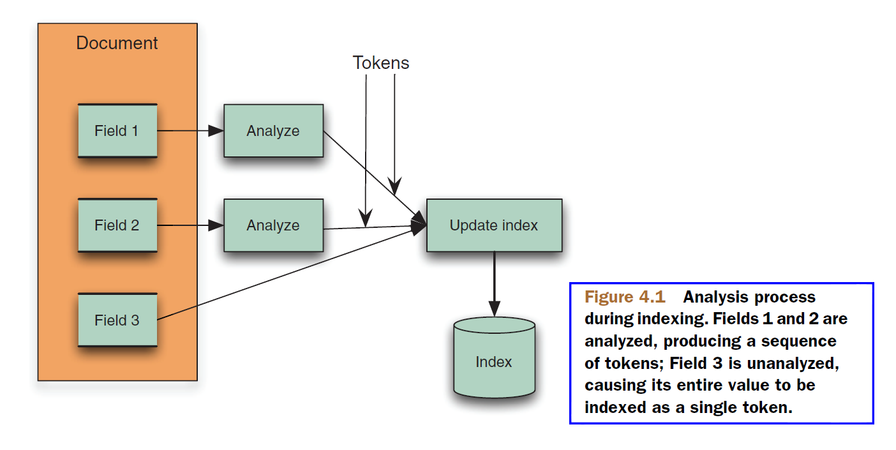

## 4.1 使用分析器 ##

在深入了解分析器内部繁琐的细节之前，先看看分析器在 Lucene 中是如何使用的。分析过程发生在文本需要被转换为词项的任何时间点上，对于 Lucene 的核心来说，发生在两个时间点上：索引期间和使用 QueryParser 进行搜索的时候。如果要在搜索结果中高亮显示命中内容，这个时间点上也需要文本分析。高亮显示是我们强烈建议使用的特性，因为它会给最终用户更好的体验。高亮显示特性在第 8 章讨论。

&emsp;&emsp;在开始任何代码细节之前，先看看分析过程总体上是什么样的。首先，用四个不同的分析器对短语 "The quick brown fox jumped over the lazy dog" 进行分析：

```
Analyzing "The quick brown fox jumped over the lazy dog"
  WhitespaceAnalyzer:
    [The] [quick] [brown] [fox] [jumped] [over] [the] [lazy] [dog] 

  SimpleAnalyzer:
    [the] [quick] [brown] [fox] [jumped] [over] [the] [lazy] [dog] 

  StopAnalyzer:
    [quick] [brown] [fox] [jumped] [over] [lazy] [dog] 

  StandardAnalyzer:
    [quick] [brown] [fox] [jumped] [over] [lazy] [dog] 

```

其中每个词元（token）显示在一对方括号 [] 之间，以使其明显分离开来。在索引期间，词元 token 在分析过程中抽取出来，索引为词项 term。并且，**最重要的是，只有被索引的词项 term 才是可搜索的！**

下一步，使用同样的四个分析器对语句 "XY&Z Corporation - xyz@example.com" 进行分析：

```
Analyzing "XY&Z Corporation - xyz@example.com"
  WhitespaceAnalyzer:
    [XY&Z] [Corporation] [-] [xyz@example.com] 

  SimpleAnalyzer:
    [xy] [z] [corporation] [xyz] [example] [com] 

  StopAnalyzer:
    [xy] [z] [corporation] [xyz] [example] [com] 

  StandardAnalyzer:
    [xy] [z] [corporation] [xyz] [example.com] 
```

可以看得出，分析的结果词元是完全取决于所使用的分析器。在这些例子中，发生了一些有意思的现象。看看单词 the 是怎么处理的，同样看看公司的名称 XY&Z，email 地址 xyz@exmaple.com，特殊的连字符（-），以及每个词元。这里，总结一下这几个分析器：

- **WhitespaceAnalyzer** 顾名思义，WhitespaceAnalyzer 分析器通过空白符将文本切分成词元，并且不会对词元做任何规范化处理，不对词元进行小写转换。
- **SimpleAnalyzer** 首先，用非字母字符将文本切分成词元，然后将每个词项转换为小写形式。小心，这个分析器会去掉数字字符，但保留其它字符。
- **StopAnalyzer** 与 SimpleAnalyzer 分析器作用相同，另外，它还会移除常用的单词。如 the, a, an, and, is 等。
- **StandardAnalyzer** Lucene 最复杂的核心分析器。它内部含有大量的逻辑来识别特定类型的词元，例如公司名称、email 地址、主机名等。它会将词元转换成小写形式，并去除停用词和标点符号。

>**注意**，从 Lucene 4.0 开始，除了 StandardAnalyzer 之外，其它分析器已经从 Lucene 包分离出来，构建到独立的 lucene-analyzers-common 模块中。

Lucene 没有将分析过程的结果对最终用户可见。从原始文本抽取出来的词项会立刻被编入到索引中。**搜索期间匹配的就是这些词项**。当使用 QueryParser 进行搜索时，分析过程再次发生在搜索查询的文本部分，以保证最佳的匹配效果。

<br/><br/>
<a id="1"></a>
## 4.1.1 索引过程分析 Indexing analysis ##

在索引期间，包含在文档的域值中的文本必须被转换成词元，如图 4.1 所示（图片来源 Lucene in action second edition）:

<div align=center></div>
<div align=center style="font-weight:bold;color:black;font-size:17px;">图 4.1</div>

IndexWriter 由 IndexWriterConfig 提供分析器，IndexWriterConfig 通过构造器提供分析器实例：
- **IndexWriterConfig()** 使用 StandardAnalyzer 创建 IndexWriterConfig 实例
- **IndexWriterConfig(Analyzer analyzer)** 使用所提供的分析器创建 IndexWriterConfig 实例

IndexWriterConfig 实例一经创建，分析器就不能再修改了。IndexWriter 也是如此，实例一经创建，其 IndexWriterConfig 就不能修改，因此也就无法修改分析器。这里的分析器似乎对文档中所有的域都使用同一个分析器，但事实上并非如此，可以通过 PerFieldAnalyzerWrapper 封装类给不同的域指定使用不同的分析器，详细内容参考 4.7 节。

```
IndexWriterConfig config = new IndexWriterConfig(new SimpleAnalyzer());
IndexWriter writer = new IndexWriter(directory, config);
```

要确保域的文本值被分析，需要设置 Field 的 FieldType 通过 **setTokenized(boolean value)** 设置的分词选项，默认为 true，表示对该域的值进行分析。如果把整个域的值当做一个单独的词元来处理，如图 4.1 中 Field 3 所示，就要设置该选项为 false 值，表示不对该域的值进行分析。Field 的语法糖子类 StringField 就是这样处理的：

```
TYPE_NOT_STORED.setTokenized(false);
TYPE_STORED.setTokenized(false);
```

StringField 表示一个索引但不分词的文本域，它把整个字符串值作为一个词元进行索引。

下面的代码片段演示了索引一个文档，其中一个域要进行分析和存储，另一个域只分析，但不存储。

```
static final FieldType Type1 = new FieldType();
static final FieldType Type2 = new FieldType();
Type1.setStored(true);
Type2.setStored(false);

Document doc = new Document();
doc.add(new Field("title", "This is the title",Type1));
doc.add(new Field("contents", "...document contents...", Type2));
writer.addDocument(doc);
```

"title" 和 "contents" 域都由 IndexWriter 提供的分析器进行分析。


<br/><br/>
<a id="2"></a>
## 4.1.2 QueryParser 分析 ##

为最终用户提供自由形式查询，QueryParser 是绝佳的选项。为了使其工作，QueryParser 利用分析器将接收到的文本切分成可以搜索的词项。在创建 QueryParser 实例时为其提供分析器选项：
- **QueryParser(String f, Analyzer a)**

用法示例：

```
QueryParser parser = new QueryParser("contents", analyzer);
Query query = parser.parse(expression);
```

分析器接收表达式单独连续的文本片段，而不是整个表达式，一般可能包括操作符、圆括号、以及其它表达式特殊语法表示的范围、通配符、模糊查询等。例如，下面的查询文本：

```
"president obama" +harvard +professor
```

QueryParser 会分三次调用分析器，首先是处理文本 "president obama"，然后是文本 harvard，最后是 professor。QueryParser 以同样的方式分析所有文本，而没有任何它怎样被索引的信息。这在查询没有进行分词索引的域时，是一个特别棘手的问题。我们会在 4.7.3 节处理这种情况。

使用 QueryParser 时，应该使用和索引期间所用相同的分析器吗？这要视情况而定。如果坚持使用基本的分析器，可能在这两种情况下使用相同的分析器比较好。但当我们使用更加复杂的分析器时，更离奇的问题可能会发生，那么在索引时和使用 QueryParser 时使用不同的分析器就有必要了。第 4.5 节更深入地讨论这个问题。

<br/><br/>
<a id="3"></a>
## 4.1.3 解析 vs 分析：分析器何时不再适用 Parsing vs. analysis: when an analyzer isn't appropriate ##

关于分析器的一个很重要的点是，它们用于在文本域内部开启分析。文件格式如 HTML，MS word，XML，及其它格式，包含元数据信息，例如作者（author）、标题（title）、最后修改日期（last modifieddate）、以及其它更多的元数据。在索引富文本文件时，要将这些元数据信息分割开来，并被索引到单独的域中。分析器一次只能分析一个特定域，并且只能在这个域之内切分词元，在分析器内部创建新的域是不可能的。

&emsp;&emsp;分析器无助于域的划分，因为它们的作用范围是一次处理一个域。相反，在进行分析之前必须要对这些文件进行解析。例如，一个常见的实践做法是，在处理 HTML 文件之前，至少要把\<title> 和 \<body> 标签的内容划分到单独的域中。在这些情况下，文件应该被解析（parsed）或者说预处理过（preprocessed），用单独的文本块表示每一个域。第 7 章深入探讨预处理的步骤问题。


