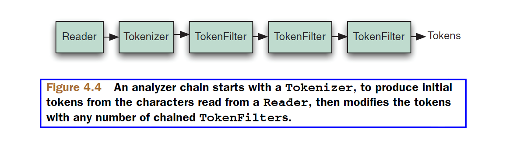

## 4.2 分析器内部剖析 What’s inside an analyzer? ##

为了理解分析过程，我们需要掀开神秘的面纱进入其内部一探究竟。因为我们要构建自己的分析器，因此了解分析器的结构及其所提供的构建块是至关重要的。

Analyzer 用于分析文本，构建词元流 TokenStream。因此，它表示为一种从文本提取索引词项的策略。

&emsp;&emsp;Analyzer 类是一个抽象基类。非常优雅地，它将一段文本转换为可以通过 TokenStream 类进行枚举的词元流（stream of tokens）。子类分析器唯一要求实现的方法签名是：

&emsp;&emsp;**protected abstract Analyzer.TokenStreamComponents createComponents(String fieldName)**

该方法定义了分析的处理过程。而 TokenStreamComponents 提供了对 Consumer<Reader> 和 TokenStream 两个组件的封装。Consumer<Reader> 组件表示数据的来源，TokenStream 组件则表示产出的词元流。TokenStreamComponents 对象并不为用户代码调用，而由 Analyzer 内部使用。用户代码通过 Analyzer 对象的如下方法获取分析结果：
- **TokenStream tokenStream(String fieldName, Reader reader)** 获取适用于 fieldName 的 TokenStream 对象，将 reader 的内容切分成词元返回。
- **TokenStream tokenStream(String fieldName, String text)** 获取适用于 fieldName 的 TokenStream 对象，将 text 的内容切分成词元返回。

下面是一个简单是分析器示例:

```
 Analyzer analyzer = new Analyzer() {
  @Override
   protected TokenStreamComponents createComponents(String fieldName) {
     Tokenizer source = new FooTokenizer(reader);
     TokenStream filter = new FooFilter(source);
     filter = new BarFilter(filter);
     return new TokenStreamComponents(source, filter);
   }
   @Override
   protected TokenStream normalize(TokenStream in) {
     // Assuming FooFilter is about normalization and BarFilter is about
     // stemming, only FooFilter should be applied
     return new FooFilter(in);
   }
 };
```


我们再来看一个具体实例，看看简单的 SimpleAnalyzer 分析器是怎样工作的。SimpleAnalyzer 类源码如下：

```
/** An {@link Analyzer} that filters {@link LetterTokenizer} 
 *  with {@link LowerCaseFilter} 
 *
 * @since 3.1
 **/
public final class SimpleAnalyzer extends Analyzer {

  /**
   * Creates a new {@link SimpleAnalyzer}
   */
  public SimpleAnalyzer() {
  }
  
  @Override
  protected TokenStreamComponents createComponents(final String fieldName) {
    Tokenizer tokenizer = new LetterTokenizer();
    return new TokenStreamComponents(tokenizer, new LowerCaseFilter(tokenizer));
  }

  @Override
  protected TokenStream normalize(String fieldName, TokenStream in) {
    return new LowerCaseFilter(in);
  }
}
```

从 SimpleAnalyzer 的 createComponents() 方法实现可以看出，TokenStreamComponents 组件由两部分组成，一个是词元分词器，LetterTokenizer 将文本在非字母字符位置进行切分（Character.isLetter()），移除非字母字符。另一个是词元过滤器，LowerCaseFilter，正如其名字所暗示的那样，将每个字母转换为小写形式。而这个过滤器也是以先前的分词器作为输入组件构建的，因为它需要一个 TokenStream 作为参数。

从 normalize() 方法实现可以看出，SimpleAnalyzer 的规范化，是将词元流通过 LowerCaseFilter 转换为小写形式。


<br/><br/>
<a id="1"></a>
## 4.2.1 词元是什么 What's in a token? ##

一个词元流是分析过程的基本输出。在索引时，被指明分析的域通过指定的分析器处理，并且每一个词项的重要属性也被写入到索引中。

&emsp;&emsp;例如，分析文本 "the quick brown fox"，每个词项表示为文本中一个单词。一个词元带有它的一个文本值（单词本身），以及一些元数据：开始和结束字符在原始文本中偏移量（offsets in the original text），一个词元类型（a token type）、以及一个位置增量（a position increment）。词元也可以选择性地包含应用程序定义的位标志（bit flags），以及任意 byte[] 类型的附加数据（payload），并且能非常容易地扩展以包括应用程序特定的属性。图 4.2 展示了通过 SimpleAnalyzer 分析上述短语所产生的词元流的细节（图片来源于 Lucene in action second edition）:

<div align=center></div>
<div align=center style="font-weight:bold;color:black;font-size:17px;">图 4.2</div>


**起始偏移量（start offset）** 是词元文本的起始字符在原始文本中的位置，**结束偏移量（end offset）** 是词元文本结束字符正好下一个的位置。偏移量对于在搜索结果中高亮显示匹配词元非常有用，具体细节在第 8 章探讨。**词元类型（token type）** 是一个字符串，默认为 "word"，如果需要，可以控制并用于词元过滤处理过程（token-filtering process）。因为文本是被词元化的，相对于前一个词元的位置被记录为 **“位置增量值（position increment value）”**。很多现有的分析器将位置增量设为默认的值 1，指明所有的词项都在连续的位置上，一个接着一个。每一个词项也可选地有一个 **标志值（flag）**，一个标志是一个 32 位值（存储在一个 int 值中），在 Lucene 提供的分析器中没有使用，但可能用于我们的应用程序。同样地，没一个词项可以由一个 byte[] 的数据记录到索引中，称作 **附加数据 payload**。使用 payload 是一个高级主题，在 6.5 节讨论。


<br/>
#### <font color=green>词元转到词项 Tokens into Terms</font> ####

在索引期间，文本被分析之后，每一个词元 token 会被作为词项 term 传递给索引。与某个词项关联的元数据，其中只有位置增量（position increment）、起始偏移量（start offset）、结束偏移量（end offset）、以及附加数据（payload）被记录到索引中。词项类型（token type）和标志（flag）都被丢弃——它们只在分析过程中使用。

<br/>
#### <font color=green>位置增量 Position Increment</font> ####

词项的位置增量值，将当前词项的位置域前一个词项的位置关联起来。位置增量值总是 1，指明在域中，每一个单词处于唯一且连续的位置上。位置增量因子直接影响短语查询（phrase query）和跨度查询（span query）的执行，因为它们需要知道域中的词项与其它词项间的距离。

&emsp;&emsp;如果位置增量大于 1，会认为词项间有空隙并用于指明那个位置有单词被移除了。在 4.6.1 小节移除停用词的例子中，利用位置增量保留了移除停用词后产生的空隙。

&emsp;&emsp;一个带有 0 位置增量的词元，把该词元置于与前一个词元相同的位置。注入同义词的分析器，为同义词使用 0 值位置增量。这种效果，不管在查询中使用什么同义词，短语查询可以工作。


<br/><br/>
<a id="2"></a>
## 4.2.2 TokenStream 探秘 TokenStream uncensored ##

**TokenStream** 是在请求时能产生一系列词项的类，但有风格两种截然不同的 TokenStream：**词项分词器 Tokenizer** 类和 **词项过滤器 TokenFilter** 类。它们都从抽象的 TokenStream 继承而来，如图 4.3 所示（图片来源于 Lucene in action second edition）：

<div align=center></div>
<div align=center style="font-weight:bold;color:black;font-size:17px;">图 4.3</div>

注意，TokenFilter 的组合模式是封装另一个 TokenStream（当然，也可以是另一个 TokenFilter）。Tokenizer 从 java. io.Reader 读取字符并创建词元，而 TokenFilter 将词元作为输入，然后向其添加或移除整个词元、或者改变词元属性，以产生新的词元。

当分析器从它的 tokenStream() 方法返回 TokenStream 对象时，一般是以一个 Tokenizer 开始，创建初始的词元序列，然后将一定数量的 TokenFilter 链接在一起来修改这些词项，这被称为**分析器链（analyzer chain）**。图 4.4 展示了包含三个 TokenFilter 的分析器链（图片来源于 Lucene in action second edition）。


<div align=center></div>
<div align=center style="font-weight:bold;color:black;font-size:17px;">图 4.4</div>

&emsp;&emsp;Lucene 核心提供了几个内置的分析器，能让我们方便快捷地写出索引和 QueryParser 的分析测试代码。而大量的分析器实现则从 Lucene 核心包分离出来，构建在独立的 Jar 包中，其中 **analyzers-common** 模块包含了大量的核心分析器和基础性分析器构建组件。而与语系相关的一些分析器则划分到自己独立的语言模块中，如下所示：

- **analyzers-icu** 将分析与 ICU（International Components for Unicode）集成
- **analyzers-kuromoji** 日语语系的分析器
- **analyzers-morfologik** 字典词干分析器，内置波兰语词典
- **analyzers-nori** 韩语语系分析器
- **analyzers-opennlp** 分析器与 OpenNLP 库集成
- **analysis-phonetic** 索引语音签名分析器（近音搜索），
- **analysis-stempel** 波兰语分析器
- **analyzers-smartcn** 中文分析器

现在我们大致看一看 Lucene 核心模块和 analyzers-common 模块所提供的一些核心的分析组件，如表 4.1 所示。
<br/>
<div align=center>表 4.1 Lucene 提供的分析器构建组件 Analyzer building blocks provided in Lucene’s core API</div>

<table>
    <tr bgcolor=#AA0000>
        <th align=center>类</th>
        <th align=center>描述</th>
    </tr>
    <tr>
      <td>TokenStream</td>
      <td>Tokenizer 和 TokenFilter 的抽象基类，枚举词元序列</td>
    </tr>
    <tr>
      <td>Tokenizer</td>
      <td>TokenStream 的一个直接子类，表示词元分词器。是一个输入为 Reader 的 TokenStream。</td>
    </tr>
    <tr>
      <td>CharTokenizer</td>
      <td>简单的面向字符分词器的抽象基类。该基类也提供了通过 Java 8 拉姆达表达式或方法引用创建 CharTokenizer 实例的工厂方法。使用该类也可以创建与 LetterTokenizer 行为完全类似的实例：Tokenizer tok = CharTokenizer.fromTokenCharPredicate(Character::isLetter); CharTokenizer 利用其 isTokenChar(int c) 方法返回 true 输出词元连续的块，直到返回 false 表示到达词元边界。默认词元最大长度为 255 个字符</td>
    </tr>
    <tr>
      <td>WhitespaceTokenizer</td>
      <td>CharTokenizer 的具体子类。对于所有的非空白字符，WhitespaceTokenizer 的 isTokenChar(int c) 方法都返回 true 值，实际上调用 !Character.isWhitespace(c) 方法返回的值。</td>
    </tr>
    <tr>
      <td>KeywordTokenizer</td>
      <td>将整个输入字符作为一个单一词元的分词器</td>
    </tr>
    <tr>
      <td>LetterTokenizer</td>
      <td>CharTokenizer 的具体子类，以非字母位置切分词项的分词器。LetterTokenizer 的 isTokenChar(int c) 方法由 java.lang.Character.isLetter() 定义。</td>
    </tr>
    <tr>
      <td>StandardTokenizer</td>
      <td>复杂的基于语法的分词器，用于输出高级别类型的词元，如 email 地址。每一个输出的词元被标记为一个特定的类型，如 &lt;ALPHANUM&gt;</td>
    </tr>
    <tr>
      <td>TokenFilter</td>
      <td>TokenStream 的另一个直接子类，表示词元过滤器。是一个输入为另一个 TokenStream 的 TokenStream。</td>
    </tr>
    <tr>
      <td>LowerCaseFilter</td>
      <td>将词元文本转换为小写形式的过滤器</td>
    </tr>
    <tr>
      <td>CapitalizationFilter</td>
      <td>使用规范化首字母大写规则转换词项流中所有的词项，它转换时，将每个词项的首字母大写，其余字符都小写。</td>
    </tr>
    <tr>
      <td>StopFilter</td>
      <td>从词元流中移除停用词，如英语语系中的 "a", "an", "and", "are", "as" 等</td>
    </tr>
    <tr>
      <td>PorterStemFilter</td>
      <td>对每一个词项，使用 Porter（马丁·波特 Martin Porter）词干提取算法进行词干提取。例如 country 和 countries 这两个词项被提取为词干 countri。</td>
    </tr>
    <tr>
      <td>TeeSinkTokenFilter</td>
      <td>可以称之为分叉词元过滤器。该词项过滤器的作用是，保持已分析的属性状态不变。这个能力在多个域具有一些通用的分析步骤，然后再分别执行自己分析过程很有用。也就是说，开始几个域的分析完全相同，然后再执行各自不同的部分，所以是分叉的。</td>
    </tr>
    <tr>
      <td>ASCIIFoldingFilter</td>
      <td>将带音调的字符映射为不带音调的对应字符。</td>
    </tr>
    <tr>
      <td>CachingTokenFilter</td>
      <td>这个词元过滤器用于，对一个 TokenStream 的使用多于一次。在首次调用 incrementToken() 方法时，它把词项的属性状态通过 List 缓存起来，后续通过 reset() 再次调用的时候，使用缓存中的内容。</td>
    </tr>
    <tr>
      <td>LengthFilter</td>
      <td>长度过滤器在构造器上指定一个范围，太短或者太长的词元，都会从词元流中移除掉。</td>
    </tr>

</table>

<br />
图 4.5 展示 Tokenizer 和 TokenFilter 及其子类的继承关系（图片来源于 Lucene in action second edition）：

<div align=center></div>
<div align=center style="font-weight:bold;color:black;font-size:17px;">图 4.5</div>


<br/><br/>
&emsp;&emsp;为了演示代码中的分析器链，这里观察 StopAnalyzer 分析器 createComponents() 方法的代码实现：

```
  @Override
  protected TokenStreamComponents createComponents(String fieldName) {
    final Tokenizer source = new LetterTokenizer();
    return new TokenStreamComponents(source, new StopFilter(new LowerCaseFilter(source), stopwords));
  }
```

可以看出，StopAnalyzer 使用一个 LetterTokenizer 分词器，以及 LowerCaseFilter 和 StopFilter 两个词元过滤器构成的分析器链。

在 StopAnalyzer 分析器中，LetterTokenizer 从 Reader 中产生初始的词元流，其中非字母字符作为词元边界被剔除。然后把初始词元流作为过滤器的源输入给 LowerCaseFilter 过滤器，经 LowerCaseFilter 小写转换后的词元流，又连同 stopwords 列表被传递给 StopFilter 过滤器。StopFilter 将词元流中的停用词移除，将最终的词元流返回给分析器的 tokenStream() 方法。


&emsp;&emsp;大多数 Lucene 提供的 TokenFilter 都对输入的词元流进行了某种程度的修改，而其中之一，TeeSinkTokenFilter 更是如此。该过滤器克隆输入的词元流到任意数量的输出流，称为 sink。它从一个单一的输入源读取词元，然后把它们作为副本发送给它所有的 sink 输出流，以及它自己的输出流。每一个 sink 流再通过其自己的进一步处理。这对两个或多个域共享同一个初始化分析步骤，但最终的词元处理过程又存在差异时，非常用用。


<br/><br/>
<a id="3"></a>
## 4.2.3 观察分析器 Visualizing analyzers ##

通常情况下，由分析产生的词元都静静地被索引过程接收。然而看到产生的词元，是具体理解分析过程的一个非常好的途径，本节将展示如何做到这一点。特别是，展示生成 4.1 节示例的源代码，也会看到，一个词元有几个有趣的属性组成，包括词 term、 position increment、offset、type、flag 以及 payload。

从代码清单 4.2.1 开始，AnalyzerDemo 类，使用 Lucene 的预定义分析器来分析两个预定义的短语。每一个短语被所有的四个分析器进行分析，然后每一个词元使用方括号 [] 括起来输出，说明被索引的文本。


<table width="100%"><tr><td bgcolor=green><font color=black>Listing 4.2.1 AnalyzerDemo: 观察分析实战</td></tr></table>

```
public class AnalyzerDemo {
  private static final String[] examples = {
    "The quick brown fox jumped over the lazy dog",
    "XY&Z Corporation - xyz@example.com"
  };


  private static final Analyzer[] analyzers = new Analyzer[] { 
    new WhitespaceAnalyzer(),
    new SimpleAnalyzer(),
    new StopAnalyzer(EnglishAnalyzer.ENGLISH_STOP_WORDS_SET),
    new StandardAnalyzer(EnglishAnalyzer.ENGLISH_STOP_WORDS_SET)
  };

  public static void main(String[] args) throws IOException {

    String[] strings = examples;
    if (args.length > 0) {    // ①
      strings = args;
    }

    for (String text : strings) {
      analyze(text);
    }
  }

  private static void analyze(String text) throws IOException {
    System.out.println("Analyzing \"" + text + "\"");
    for (Analyzer analyzer : analyzers) {
      String name = analyzer.getClass().getSimpleName();
      System.out.println("  " + name + ":");
      System.out.print("    ");
      AnalyzerUtils.displayTokens(analyzer, text); // ②
      System.out.println("\n");
    }
  }
}

```

① 如果指定，分析命令行参数
② 真正分析和显示分析结果的工作

真正的工作发生在 AnalyzerUtils 类，单个的分析器对一段具体的文本进行分析，提取出词元。AnalyzerUtils 传递文本给分析器，没有执行索引操作，而是以 IndexWriter 在索引期间类似的形式将分析结果抽取出来。

<table width="100%"><tr><td bgcolor=green><font color=black>Listing 4.2.2 AnalyzerUtils: 探索分析器</td></tr></table>

```
public class AnalyzerUtils {
  public static void displayTokens(Analyzer analyzer,
                                   String text) throws IOException {
    displayTokens(analyzer.tokenStream("contents", new StringReader(text)));  //①
  }

  public static void displayTokens(TokenStream stream)
    throws IOException {

    CharTermAttribute term = stream.addAttribute(CharTermAttribute.class);
    stream.reset();
    while(stream.incrementToken()) {
      System.out.print("[" + term.toString() + "] ");    //②
    }
    stream.end();
    stream.close();
  }
}
```

① 调用分析过程
② 使用方括号 [] 包围，打印词元文本

直接运行 AnalyzerDemo，输出：

```
Analyzing "The quick brown fox jumped over the lazy dog"
  WhitespaceAnalyzer:
    [The] [quick] [brown] [fox] [jumped] [over] [the] [lazy] [dog] 

  SimpleAnalyzer:
    [the] [quick] [brown] [fox] [jumped] [over] [the] [lazy] [dog] 

  StopAnalyzer:
    [quick] [brown] [fox] [jumped] [over] [lazy] [dog] 

  StandardAnalyzer:
    [quick] [brown] [fox] [jumped] [over] [lazy] [dog] 

Analyzing "XY&Z Corporation - xyz@example.com"
  WhitespaceAnalyzer:
    [XY&Z] [Corporation] [-] [xyz@example.com] 

  SimpleAnalyzer:
    [xy] [z] [corporation] [xyz] [example] [com] 

  StopAnalyzer:
    [xy] [z] [corporation] [xyz] [example] [com] 

  StandardAnalyzer:
    [xy] [z] [corporation] [xyz] [example.com] 
```

通常，我们不需要显式调用分析器的 tokenStream() 方法，除非像本例这样出于诊断和信息查看的目的。这里注意，域的名字 contents 在 displayTokens() 中是随便定义的。建议保留类似这样的一个实用程序，便于查看选择分析器输出词元信息。实际上，不用自己写，可以直接使用 AnalyzerUtils 和 AnalyzerDemo 代码尝试体验。AnalyzerDemo 程序让我们可以从命令行输入一个或多个字符串进行分析，而不必一定用程序内部嵌入的样例字符串。程序已通过 maven-shade-plugin 插件进行了配置，将 \<mainClass> 元素配置为 net.mvnindex.demo.lucene.analysis.AnalyzerDemo>，然后通过如下命令进行打包：

```
$ mvn clean install
```

之后通过如下命令提供字符串进行分析：

```
$ java -jar target/lucene-analysis-1.0-SNAPSHOT-shaded.jar "No Fluff, Just Stuff"
```

结果输出如下：

```
Analyzing "No Fluff, Just Stuff"
  WhitespaceAnalyzer:
    [No] [Fluff,] [Just] [Stuff]

  SimpleAnalyzer:
    [no] [fluff] [just] [stuff]

  StopAnalyzer:
    [fluff] [just] [stuff]

  StandardAnalyzer:
    [fluff] [just] [stuff]

```
<br/>


#### <font color=green>深入词元 Looking inside tokens</font> ####

我们已经看到了 TokenFilter 访问和修改流经它们的词元属性。但是确切地说，一个词元 tokern 到底是哪些属性组成的呢？在 AnalyzerUtils 工具类中增加了一个 displayTokensWithFullDetails() 方法，如程序清单 4.2.3 所示，该方法清晰地阐明这个问题：


<table width="100%"><tr><td bgcolor=green><font color=black>Listing 4.2.3 查看每一个词元的 term, offsets, type, position increment 属性</td></tr></table>

```

  public static void displayTokensWithFullDetails(Analyzer analyzer,
                                                  String text) throws IOException {

    TokenStream stream = analyzer.tokenStream("contents",                       // ①
                                              new StringReader(text));

    CharTermAttribute term = stream.addAttribute(CharTermAttribute.class);      // ②
    PositionIncrementAttribute posIncr =  stream.addAttribute(PositionIncrementAttribute.class); // ②
    OffsetAttribute offset = stream.addAttribute(OffsetAttribute.class);  // ②
    TypeAttribute type = stream.addAttribute(TypeAttribute.class);        // ②

    stream.reset();

    int position = 0;
    while(stream.incrementToken()) {                                  // ③

      int increment = posIncr.getPositionIncrement();                 // ④
      if (increment > 0) {                                            // ④
        position = position + increment;                              // ④
        System.out.println();                                         // ④
        System.out.print(position + ": ");                            // ④
      }

      System.out.print("[" +                                 // ⑤
                       term.toString() + ":" +               // ⑤
                       offset.startOffset() + "->" +         // ⑤
                       offset.endOffset() + ":" +            // ⑤
                       type.type() + "] ");                  // ⑤
    }
    stream.end();
    stream.close();

    System.out.println();
  }
```

① 执行分析
② 获得感兴趣的属性 attribute
③ 迭代所有的词项
④ 计算位置并输出位置值 position
⑤ 打印出所有的词元 token 细节信息

使用 SimpleAnalyzer 分析器，将示例短语的所有词元信息显式出来：


```
  public static void main(String[] args) throws IOException {
    System.out.println("SimpleAnalyzer");
    displayTokensWithFullDetails(new SimpleAnalyzer(),
        "The quick brown fox....");
  }
}

```

运行代码，输出如下：

```
SimpleAnalyzer

1: [the:0->3:word] 
2: [quick:4->9:word] 
3: [brown:10->15:word] 
4: [fox:16->19:word] 
```

每一个词元都在一个连续的位置上，相对于前一个词元的位置增量为 1（通过递增的数字 1，2，3，4 指出）。单词 'the' 起始于原始文本中偏移量 0，结束于偏移量 3 之前的一个位置。每一个词项都有一个值为 word 的类型。词元的每一个方面的信息都记录在它自己的 Attribute 类中。


<br/>
#### <font color=green>属性 Attributes</font> ####

我们已经注意到了，TokenStream 没有显式地创建一个持有所有属性的词项。相反，对于词项的每个元素，我们与之交互的是一个单独可重用的特性接口（term, offset, position increment 等等）。旧版本的 Lucene 曾经使用一个单独的 Token 对象来持有词项的这些特性数据，但为了更好的可扩展性，以及通过重用提供更好的分析性能，Lucene 从 2.9 版本开始，使用基于特性的 API 来持有这些词元特性数据。

&emsp;&emsp;TokenStream 从 AttributeSource 继承。AttributeSource 是一个非常有用且以通用的方式，在不需要运行时类型转换的情况下，提供强类型的完全可扩展特性，这导致了非常好的性能。Lucene 在分析期间使用了一些预定义的特性，如表 4.2 所示，但是我们的应用程序，完全可以通过创建一个实现 Attribute 接口的具体类，来自由添加自己的特性。注意，在索引期间，Lucene 对我们新建的特性不会执行任何操作。

<br/>
<div align=center>表 4.2 Lucene 内置 token attribute</div>

<table>
    <tr bgcolor=#AA0000>
        <th align=center>Token attribute 接口</th>
        <th align=center>描述</th>
    </tr>
    <tr>
      <td>TermAttribute</td>
      <td>Token 的文本内容</td>
    </tr>
    <tr>
      <td>PositionIncrementAttribute</td>
      <td>位置增量，默认值为 1</td>
    </tr>
    <tr>
      <td>OffsetAttribute</td>
      <td>起始和结束字符偏移量</td>
    </tr>
    <tr>
      <td>TypeAttribute</td>
      <td>Token 的类型，默认值是 'word'</td>
    </tr>
    <tr>
      <td>FlagsAttribute</td>
      <td>32位标志</td>
    </tr>
    <tr>
      <td>PayloadAttribut</td>
      <td>每个词项的 byte[] payload 特性</td>
    </tr>
</table>
<br/>

利用这些可重用 API，第一步是通过调用 AttributeSource 的 addAttribute() 方法获得感兴趣的特性，该方法返回实现所请求接口的一个具体类。然后，通过 TokenStream.incrementToken() 方法迭代 TokenStream 中所有的词项，如果该词元流中还有未处理的新词项，方法返回 true，一旦到达了该词元流的结尾，返回 false 值。我们与在第一步中获得到的特性进行交互，来获得每个词项的特性值。当 incrementToken() 返回 true 时，其中的所有特性都会将其内部状态变为下一个 token 的状态。

&emsp;&emsp;如果只对位置增量感兴趣，可以这样做：

```
  TokenStream stream = analyzer.tokenStream("contents", new StringReader(text));
  PositionIncrementAttribute posIncr = stream.addAttribute(PositionIncrementAttribute.class);

  stream.reset();
  while (stream.incrementToken()) {
    System.out.println("posIncr=" + posIncr.getPositionIncrement());
  }
```

注意，表 4.2 中的核心特性类是双向的：即可以使用它们来获取，也可以设置特性的值。因此，一个只改变位置增量的 TokenFilter，应该在初始化时，从它的输入 TokenStream 中获取并保存 PositionIncrementAttribute 特性对象，然后实现其 incrementToken() 方法，在该方法的实现中，首先在它的输入流上调用 incrementToken() 方法，然后调用 PositionIncrementAttribute.setPositionIncrement() 来改变它的值。

&emsp;&emsp;有些时候，需要获得当前词项所有细节的完全拷贝，并且在之后恢复它。可以通过调用 TokenStream.captureState() 方法来获取一个 State 对象持有所有状态，之后通过调用其 restoreState(AttributeSource.State state) 方法恢复其状态。注意，这会导致比较慢的性能，因此在创建自己的 TokenFilter 时，应该尽可能避免这么做。


<br/>
#### <font color=green>起始和结束偏移量的好处 What good are start and end offsets</font> ####

起始和结束偏移量值，记录每一个词元文本的起始和结束字符在原始文档中的偏移量，没有在 Lucene 核心中使用。而是被当做每个词元的不透明整数记录，只要我们愿意，可以给它们设置任意的整数。

&emsp;&emsp;如果对词向量 TermVector 进行了索引，如 2.4.3 节所述，并且指定了存储偏移量，那么在搜索时就能够检索给定文档的词向量，并访问偏移量。通常，偏移量用于高亮显示（highlighting）匹配查询，在第 8 章讨论。没有对 TermVector 进行存储，通过重新分析文本进行高亮显示也是可能的，这种情况下，起始和结束偏移量被分析器重新计算，然后实时使用。


<br/>
#### <font color=green>词元类型的作用 Token type Usefulness</font> ####

可以通过词项类型 token type 为词项标明特殊的语汇类型。在 StandardAnalyzer 分析器之下是 StandardTokenizer，根据 语法将输入文本解析为不同类型。使用 StandardAnalyzer 分析短语 "I'll email you at xyz@example.com" 会产生如下有趣的输出：

```
1: [i'll:0->4:<APOSTROPHE>]
2: [email:5->10:<ALPHANUM>]
3: [you:11->14:<ALPHANUM>]
5: [xyz@example.com:18->33:<EMAIL>]
```

注意，每个词元的词元类型 token type。其中 i'll 是省略符号的简写形式，StandardAnalyzer 把它标注为 \<APOSTROPHE> 类型，目的是将它保持在一起作为一个单元；类似于 email 地址的 \<EMAIL> 类型。'at' 在分析结果中没有出现，因为它是个停用词，已经被 StandardAnalyzer 移除。StandardAnalyzer 是 Lucene 内置分析器中唯一利用词元类型的分析器。默认情况下，Lucene 不会将 token type 记录到索引中，因此，它只用于分析期间。但我们可以使用 TypeAsPayloadTokenFilter 过滤器将每个词元的类型作为 payload 记录到索引中。


<br/><br/>
在对词元及其特性数据有了比较全面的了解之后，我们通过另一种简单方式再次观察一下分析器分析出词元的真面目：

<table width="100%"><tr><td bgcolor=green><font color=black>Listing 4.2.4 分析词元 Token</td></tr></table>

```
public class AnalysisDebug {

    public static void main(String[] args) throws Exception {
        Analyzer analyzer = new SimpleAnalyzer();;
        String contents = "The quick brown fox jumped over the lazy dog";
        try (TokenStream tokenStream = analyzer.tokenStream("contents", contents)) {
            tokenStream.reset();

            while (tokenStream.incrementToken()) {
                System.out.println("token: " + tokenStream.reflectAsString(false));
            }
            tokenStream.end();
        }
    }
}
```

代码使用 "The quick brown fox jumped over the lazy dog" 作为待分析文本。运行代码，输出：

```
token: term=the,bytes=[74 68 65],startOffset=0,endOffset=3,positionIncrement=1,positionLength=1,type=word,termFrequency=1
token: term=quick,bytes=[71 75 69 63 6b],startOffset=4,endOffset=9,positionIncrement=1,positionLength=1,type=word,termFrequency=1
token: term=brown,bytes=[62 72 6f 77 6e],startOffset=10,endOffset=15,positionIncrement=1,positionLength=1,type=word,termFrequency=1
token: term=fox,bytes=[66 6f 78],startOffset=16,endOffset=19,positionIncrement=1,positionLength=1,type=word,termFrequency=1
token: term=jumped,bytes=[6a 75 6d 70 65 64],startOffset=20,endOffset=26,positionIncrement=1,positionLength=1,type=word,termFrequency=1
token: term=over,bytes=[6f 76 65 72],startOffset=27,endOffset=31,positionIncrement=1,positionLength=1,type=word,termFrequency=1
token: term=the,bytes=[74 68 65],startOffset=32,endOffset=35,positionIncrement=1,positionLength=1,type=word,termFrequency=1
token: term=lazy,bytes=[6c 61 7a 79],startOffset=36,endOffset=40,positionIncrement=1,positionLength=1,type=word,termFrequency=1
token: term=dog,bytes=[64 6f 67],startOffset=41,endOffset=44,positionIncrement=1,positionLength=1,type=word,termFrequency=1

```

其中 positionLength 特性数据前面没有提到过，它表示词元跨了多少个位置。很少有分析器真产生这个特性值，并且在索引时这个数据会被丢弃。该属性是可选的，默认值是 1，大多数分析器不会改变它。


<br/><br/>
<a id="4"></a>
## 4.2.4 过滤器次序的重要性 TokenFilter order can be significant ##

对某些 TokenFilter 来说，在分析过程中对事件的处理次序是非常重要的，其中的每一步都依赖于前一步的工作才能完成。一个基本的例子是停用词移除过滤器，StopFilter 对每个词元在一个给定的停用词集合中，执行大小写敏感的查找，这一步依赖于输入的已小写转换的词元。作为一个例子，我们首先写一个与 StopAnalyzer 功能上等同的变体，稍后将通过它编写一个执行次序反转的有缺陷变体。

代码位于示例代码的 analysis 子模块。

```
public class StopAnalyzer2 extends Analyzer {
  private final CharArraySet stopWords;

  public StopAnalyzer2() {
    stopWords = EnglishAnalyzer.ENGLISH_STOP_WORDS_SET;
  }

  public StopAnalyzer2(String[] stopWords) {
    this.stopWords = StopFilter.makeStopSet(stopWords);
  }

  @Override
  protected TokenStreamComponents createComponents(String fieldName) {
    LetterTokenizer src = new LetterTokenizer();
    TokenStream tokenStream = new LowerCaseFilter(src);
    tokenStream = new StopFilter(tokenStream, stopWords);

    return new TokenStreamComponents(r -> {
      src.setReader(r);
    }, tokenStream);
  }
}

```

其中返回的 TokenStreamComponents 实例创建使用了它本身的构造器，TokenStreamComponents 类提供了如下三个重载构造器：

- **TokenStreamComponents(Consumer<Reader> source, TokenStream result)** 创建 TokenStreamComponents 实例。参数 source：数据源 result：分析器的结果词元流。
- **TokenStreamComponents(Tokenizer tokenizer)** 从分词器参数 tokenizer 创建 TokenStreamComponents 实例。tokenizer 是数据源，也是最终的结果词元流。
- **TokenStreamComponents(Tokenizer tokenizer, TokenStream result)** 创建 TokenStreamComponents 实例。参数 tokenizer：分词器，result：分析器的结果词元流。


StopAnalyzer2 类使用 LetterTokenizer 分词器作为构造器参数提供给 LowerCaseFilter。下面的测试用例证明我们的 StopAnalyzer2 类可以正常工作，代码使用了 AnalyzerUtils.assertAnalyzesTo() 方法并且断言分析结果移除了停用词 'the'。

```
public class StopAnalyzerAlternativesTest extends TestCase {
  @Test
  public void testStopAnalyzer2() throws Exception {
    AnalyzerUtils.assertAnalyzesTo(new StopAnalyzer2(),
                                   "The quick brown...",
                                   new String[] {"quick", "brown"});
  }
}
```

给之前的 AnalyzerUtils 工具类添加 assertAnalyzesTo() 工具方法，此方法断言分析器输出的词元与所期望的词元列表匹配。代码如下所示：

```
  public static void assertAnalyzesTo(Analyzer analyzer, String input,
                                      String[] output) throws Exception {
    TokenStream stream = analyzer.tokenStream("field", new StringReader(input));

    CharTermAttribute termAttr = stream.addAttribute(CharTermAttribute.class);
    stream.reset();

    for (String expected : output) {
      assertTrue(stream.incrementToken());
      assertEquals(expected, termAttr.toString());
    }
    assertFalse(stream.incrementToken());
    stream.end();
    stream.close();
  }
```

代码测试通过。

为了演示过滤次序对词元影响的重要性，我们编写一个有问题的分析器 StopAnalyzerFlawed，将 StopAnalyzer2 中的 StopFilter 和 LowerCaseFilter 的次序调换，代码如下：

```
public class StopAnalyzerFlawed extends Analyzer {
  private CharArraySet stopWords;

  public StopAnalyzerFlawed() {
    stopWords = EnglishAnalyzer.ENGLISH_STOP_WORDS_SET;
  }

  public StopAnalyzerFlawed(String[] stopWords) {
    this.stopWords = StopFilter.makeStopSet(stopWords);
  }

  /**
   * Ordering mistake here
   */
  @Override
  protected TokenStreamComponents createComponents(String fieldName) {
    LetterTokenizer src = new LetterTokenizer();

    TokenStream tokenStream = new StopFilter(src, stopWords);
    tokenStream = new LowerCaseFilter(tokenStream);

    return new TokenStreamComponents(r -> {
      src.setReader(r);
    }, tokenStream);
  }

  /**
   * Illustrates that "the" is not removed, although it is lowercased
   */

  public static void main(String[] args) throws Exception {
    AnalyzerUtils.displayTokens(
            new StopAnalyzerFlawed(), "The quick brown...");
  }
}
```

这个类定义，我们直接在其内部提供了一个 main() 方法，直接运行可以看到如下输出：

```
[the] [quick] [brown] 

Process finished with exit code 0
```

StopFilter 过滤器假定所有的词元都已经被转换为小写形式，并且执行大小写敏感的查找。因此，词元 [The] 在经过 StopFilter 过滤时，没有被移除。之所以最后词元变成了 [the]，是因为 StopFilter 之后，词元流又经历了 LowerCaseFilter 的过滤，将所有词元转换为小写形式。下面的测试用例再次验证了这一点：

```
  @Test
  public void testStopAnalyzerFlawed() throws Exception {
    AnalyzerUtils.assertAnalyzesTo(new StopAnalyzerFlawed(),
                                   "The quick brown...",
                                   new String[] {"the", "quick", "brown"});
  }
```

小写转换只是过滤器次序影响的一个案例，过滤器往往假设前面的处理工作已经完成。在排列过滤器次序时，也可能有性能方面的考虑。考虑这样一个分析器，移除停用词并且向词元流注入同义词，那么先移除停用词，在同义词注入时就会处理比较少是词元，这样就会更有效率。

&emsp;&emsp;到此，我们对分析过程的内部机制应该有了一个坚实的理解，一个分析器简单地定义了一个特定的分词器链，这个链从初始数据源创建新词元流开始，后面跟随任意数量的词元过滤器 TokenFilter 来改变流中的词元。一个词元 Token 由一系列感关注的特性值组成，Lucen 使用不同的方式存储这些特性值。最后，通过 displayTokens()、displayTokensWithFullDetails()、以及 TokenStream 自带的 reflectAsString() 等帮助方法，以可视化的方式观察了分析器的分析结果词元 Token。


