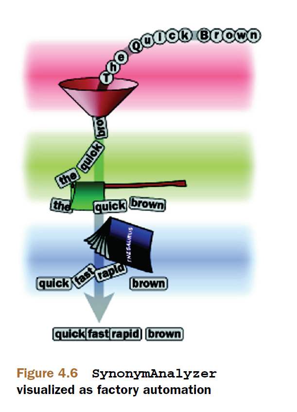

## 4.5 同义词、别名、以及含义相同的单词 Synonyms, aliases, and words that mean the same ##

我们认识到这样一种状况：自然语言出于某些原因，已演变为通过多种途径表达同一事物。因此，搜索过程中必须处理同义词问题，否则用户就不能找到包含同义词的文档。

&emsp;&emsp;我们下一个自定义分析器，在索引过程中将单词的同义词注入到输出的词元流，并且将同义词置于和原始单词相同的位置上。通过索引时加入同义词，搜索将会找到不包含原始搜索词项，但匹配同义词的文档。还是从测试用例开始，展示我们期望的新分析器要怎样工作，如代码清单 4.5.1 所示。

<table width="100%"><tr><td bgcolor=green><font color=black>Listing 4.5.1 测试同义词分析器 synonym analyzer</td></tr></table>

```
  @Test
  public void testJumps() throws Exception {
    TokenStream stream = synonymAnalyzer.tokenStream("contents", new StringReader("jumps")); // ①

    CharTermAttribute term = stream.addAttribute(CharTermAttribute.class);
    PositionIncrementAttribute posIncr = stream.addAttribute(PositionIncrementAttribute.class);

    int i = 0;
    String[] expected = new String[]{"jumps",              // ②
                                     "hops",               // ②
                                     "leaps"};             // ②

    stream.reset();
    while(stream.incrementToken()) {
      assertEquals(expected[i], term.toString());

      int expectedPos;      // ③
      if (i == 0) {         // ③
        expectedPos = 1;    // ③
      } else {              // ③
        expectedPos = 0;    // ③
      }                     // ③
      assertEquals(expectedPos,                      // ③
                   posIncr.getPositionIncrement());  // ③
      i++;
    }
    assertEquals(3, i);
    stream.end();
    stream.close();
  }

```

① 使用 SynonymAnalyzer 进行分析
② 检查正确的同义词
③ 验证同义词位置 position

注意到，此单元测试不仅展示了 SynonymAnalyzer 分析器输出单词 'jumps' 的同义词，而且也验证了同义词被放置在与原始单词相同的位置上，通过位置增量为 0 验证了这一点。


<br/><br/>
<a id="1"></a>
## 4.5.1 创建 SynonymAnalyzer 分析器 ##

SynonymAnalyzer 分析器的目的是，首先检测出有同义词的单词，第二步将同义词插入到与原始单词相同的位置。图 4.6 以图形的方式展示 SynonymAnalyzer 对输入文本所做的处理过程（图片来源于 Lucene in action second edition）。


<div align=center></div>
<div align=center style="font-weight:bold;color:black;font-size:17px;">图 4.6</div>


程序清单 4.5.2 展示 SynonymAnalyzer 的实现。

<table width="100%"><tr><td bgcolor=green><font color=black>Listing 4.5.2 SynonymAnalyzer 实现</td></tr></table>

```
public class SynonymAnalyzer extends Analyzer {
  private SynonymEngine engine;

  public SynonymAnalyzer(SynonymEngine engine) {
    this.engine = engine;
  }

  @Override
  protected TokenStreamComponents createComponents(String fieldName) {
    StandardTokenizer source = new StandardTokenizer();

    TokenStream tokenStream = new LowerCaseFilter(source);
    tokenStream = new StopFilter(tokenStream, EnglishAnalyzer.ENGLISH_STOP_WORDS_SET);
    tokenStream = new SynonymFilter(tokenStream, engine);

    return new TokenStreamComponents(r -> {
      source.setReader(r);
    }, tokenStream);
  }
}
```

再次看到，分析器代码很短小，简单地将分词器 Tokenizer 和一系列的词元过滤器 TokenFilter 链接在一起。最后的过滤器是新创建的 SynonymFilter，如代码清单 4.5.3 所示，我们重点讨论的核心内容。注入词项时需要进行缓存，本过滤器使用栈 Stack 作为缓存。

<table width="100%"><tr><td bgcolor=green><font color=black>Listing 4.5.3 SynonymFilter 实现：缓存词元并且一次输出一个</td></tr></table>

```
public class SynonymFilter extends TokenFilter {
  public static final String TOKEN_TYPE_SYNONYM = "SYNONYM";

  private Stack<String> synonymStack;
  private SynonymEngine engine;
  private State current;

  private final CharTermAttribute termAtt;
  private final PositionIncrementAttribute posIncrAtt;

  public SynonymFilter(TokenStream in, SynonymEngine engine) {
    super(in);
    synonymStack = new Stack<String>();                     // ①
    this.engine = engine;

    this.termAtt = addAttribute(CharTermAttribute.class);
    this.posIncrAtt = addAttribute(PositionIncrementAttribute.class);
  }

  public final boolean incrementToken() throws IOException {
    if (synonymStack.size() > 0) {                          // ②
      String syn = synonymStack.pop();                      // ②
      restoreState(current);                                // ②
      termAtt.setEmpty();
      termAtt.append(syn);
      posIncrAtt.setPositionIncrement(0);                   // ③
      return true;
    }

    if (!input.incrementToken())                            // ④
      return false;

    if (addAliasesToStack()) {                              // ⑤ 
      current = captureState();                             // ⑥
    }

    return true;                                            // ⑦
  }

  private boolean addAliasesToStack() throws IOException {
    String[] synonyms = engine.getSynonyms(termAtt.toString()); // ⑧
    if (synonyms == null) {
      return false;
    }
    for (String synonym : synonyms) {                           // ⑨
      synonymStack.push(synonym);
    }
    return true;
  }
}
```

① 定义同义词缓存，创建了一个 Stack\<String> 类型的字符串栈，来容纳某个词元的同义词。
② 弹出缓存的同义词。代码会持续地将最后流入词元缓存起来的同义词弹出栈，直到栈为空。
③ 设置位置增量为 0
④ 读取下一个词元。在上一个词元的所有同义词全部被输出之后，读取词元流的下一个词元。
⑤ 将当前词元的所有同义词压入缓存栈
⑥ 保存当前词元状态，即如果当前词元有同义词，将它的所有细节保存起来
⑦ 在返回当前词元关联的同义词之前，返回当前（原始的）词元。
⑧ 从 SynonymEngine 检索出当前词元的所有同义词
⑨ 将检索到的每一个同义词压入到缓存栈

SynonymAnalyzer 考虑到可插拔的 SynonymEngine 实现，SynonymEngine 是只有一个方法的接口：

```
public interface SynonymEngine {
    String[] getSynonyms(String s) throws IOException;
}
```

使用接口设计很容易进行测试实现，在示例中，我们通过几个硬编码的同义词，实现简单的测试。如果代码清单 4.5.4 所示：

<table width="100%"><tr><td bgcolor=green><font color=black>Listing 4.5.4 TestSynonymEngine：实现 SynonymEngine 接口</td></tr></table>

```
public class TestSynonymEngine implements SynonymEngine {
  private static HashMap<String, String[]> map = new HashMap<String, String[]>();

  static {
    map.put("quick", new String[] {"fast", "speedy"});
    map.put("jumps", new String[] {"leaps", "hops"});
    map.put("over", new String[] {"above"});
    map.put("lazy", new String[] {"apathetic", "sluggish"});
    map.put("dog", new String[] {"canine", "pooch"});
  }

  public String[] getSynonyms(String s) {
    return map.get(s);
  }
}

```

对于生成级同义词实现，在第 9.3.2 节，我们利用 WordNet 数据库实现了一个强大的 SynonymEngine 实现。

&emsp;&emsp;注意到 TestSynonymEngine 生成的同义词是单方向的：例如 quick 有 fast 和 speedy 同义词，但是 fast 没有同义词。在真实的生产环境中，应该确保所有同义词列表互为同义词。因为现在进行的是简单测试，所以这样就很好了。

&emsp;&emsp;设置位置增量看起来很强大，而且事实上也确实如此。不过，我们应该只有在搞清楚搜索时发生某些反常的问题时才修改位置增量。因为同义词索引与其它词项类似，TermQuery 可以如期工作。此外，将同义词放在与原始词元相同的位置，PhraseQuery 也可以正常工作。程序清单 4.5.5 中的 SynonymAnalyzerTest 测试用例，演示了使用 API 创建的查询可以工作得很好。


<table width="100%"><tr><td bgcolor=green><font color=black>Listing 4.5.5 SynonymAnalyzerTest：展示同义词查询正常工作</td></tr></table>

```
public class SynonymAnalyzerTest {
  private final String indexPath = "indexes";
  private Directory directory;
  private DirectoryReader reader;
  private IndexSearcher searcher;

  private static SynonymAnalyzer synonymAnalyzer = new SynonymAnalyzer(new TestSynonymEngine());

  @Before
  public void setUp() throws IOException {
    directory = FSDirectory.open(Paths.get(indexPath));
    IndexWriterConfig config = new IndexWriterConfig(synonymAnalyzer);
    IndexWriter writer = new IndexWriter(directory, config);

    Document doc = new Document();
    doc.add(new TextField("content",
            "The quick brown fox jumps over the lazy dog",
            Field.Store.YES));
    writer.addDocument(doc);

    writer.close();

    reader = DirectoryReader.open(directory);
    searcher = new IndexSearcher(reader);
  }

  @After
  public void tearDown() throws IOException {
    reader.close();
    directory.close();
    deleteDir(new File(indexPath));
  }

  public static void deleteDir(File dir) {
    if (dir.isDirectory()) {
      String[] children = dir.list();
      for (int i = 0; i < children.length; i++) {
        new File(dir, children[i]).delete();
      }
    }
    dir.delete();
  }


  @Test
  public void testSearchByAPI() throws Exception {

    TermQuery tq = new TermQuery(new Term("content", "hops"));  // ①
    assertEquals(1, TestUtil.hitCount(searcher, tq));

    TopDocs docs = searcher.search(tq, 1);
    System.out.println("content: "+ searcher.doc(docs.scoreDocs[0].doc).get("content"));

    PhraseQuery.Builder builder = new PhraseQuery.Builder();

    builder.add(new Term("content", "fox"));    // ②
    builder.add(new Term("content", "hops"));   // ②
    PhraseQuery pq = builder.build();

    assertEquals(1, TestUtil.hitCount(searcher, pq));

    docs = searcher.search(pq, 1);
    System.out.println("content: "+ searcher.doc(docs.scoreDocs[0].doc).get("content"));
  }
}
```

① 搜索 "hops" 匹配索引的文档
② 搜索 "fox hops" 也匹配索引的文档

运行测试，测试通过，并看到如下输出：

```
content: The quick brown fox jumps over the lazy dog
content: The quick brown fox jumps over the lazy dog

Process finished with exit code 0
```

两个搜索都匹配到了之前索引的文档。

setUp() 方法对短语 "...fox jumps..." 进行了索引，SynonymAnalyzer 在 'jumps' 相同的位置注入了同义词 'hops'。TermQuery 成功完成对词项 'hops' 的搜索，PhraseQuery 对短语 "fox hops" 也准确搜索到。

&emsp;&emsp;通过 QueryParser 对 SynonymAnalyzer 进行测试。将运行两个测试，第一个通过 SynonymAnalyzer 创建 QueryParser 对象，第二个使用 StandardAnalyzer 创建 QueryParser。如代码清单 4.5.6 所示：

<table width="100%"><tr><td bgcolor=green><font color=black>Listing 4.5.6 使用 QueryParser 测试 SynonymAnalyzer</td></tr></table>

```
  @Test
  public void testWithQueryParser() throws Exception {
    Query query = new QueryParser("content", synonymAnalyzer).parse("\"fox jumps\"");  // ①
    assertEquals(1, TestUtil.hitCount(searcher, query));                   // ①
    System.out.println("With SynonymAnalyzer, \"fox jumps\" parses to " +
                                         query.toString("content"));

    query = new QueryParser("content",                                          // ②
                            new StandardAnalyzer()).parse("\"fox jumps\"");
    assertEquals(1, TestUtil.hitCount(searcher, query));                  // ②
    System.out.println("With StandardAnalyzer, \"fox jumps\" parses to " +
                                         query.toString("content"));
  }
}
```

① SynonymAnalyzer 搜索到索引文档
② StandardAnalyzer 也搜索到索引文档

两个分析器都找到了匹配的文档，漂亮！执行测试会有如下输出：

```
With SynonymAnalyzer, "fox jumps" parses to "fox (jumps hops leaps)"
With StandardAnalyzer, "fox jumps" parses to "fox jumps"
```

如我们所期望的那样，使用 SynonymAnalyzer 分析器，查询被词项的扩充。QueryParser 足够智能，能够意识到分析器产生的 0 位置增量的词元，并且当发生在一个短语查询内部时，它会创建一个 MultiPhraseQuery 查询，详细信息参考 5.3 节。

&emsp;&emsp;但这是浪费且没有必要的：我们只需要在索引期间或搜索期间进行同义词扩充，而不是在两个期间都进行扩充。如果选择在索引期间进行扩充，索引会消耗更多的磁盘空间，但搜索可能更快，因为需要访问比较少的词项。同义词已经被编入到索引库中，因此，在搜索时就不能随意改变它们并查看改变带来的影响。如果在搜索时扩充同义词，就能在测试时很快看到这种改变带来的效果。这是简单的权衡方案，哪种选项更好，要依据应用程序的约束做出自己的决策。


<br/><br/>
<a id="2"></a>
## 4.5.2 显示词元位置 Visualizing token positions ##

AnalyzerUtils.displayTokens() 方法，在处理分析器设置位置增量不为 1 时，没有向我们展示所有信息。为了获得这类分析器更好的显示，应该给 AnalyzerUtils 增加工具方法 displayTokensWithPositions()，如 代码清单 4.5.7 所示：

<table width="100%"><tr><td bgcolor=green><font color=black>Listing 4.5.7 displayTokensWithPositions：查看词元的位置信息</td></tr></table>

```

  public static void displayTokensWithPositions(Analyzer analyzer, String text)
          throws IOException {

    TokenStream stream = analyzer.tokenStream("contents", new StringReader(text));
    CharTermAttribute term = stream.addAttribute(CharTermAttribute.class);
    PositionIncrementAttribute posIncr = stream.addAttribute(PositionIncrementAttribute.class);

    stream.reset();

    int position = 0;
    while(stream.incrementToken()) {
      int increment = posIncr.getPositionIncrement();
      if (increment > 0) {
        position = position + increment;
        System.out.println();
        System.out.print(position + ": ");
      }

      System.out.print("[" + term.toString() + "] ");
    }
    System.out.println();
    stream.end();
    stream.close();
  }
```

下面的代码利用 displayTokensWithPositions() 方法来查看 SynonymAnalyzer 分析器的工作，如代码清单 4.5.8 所示：

<table width="100%"><tr><td bgcolor=green><font color=black>Listing 4.5.8 SynonymAnalyzerViewer 查看词元的位置信息</td></tr></table>

```
public class SynonymAnalyzerViewer {

  public static void main(String[] args) throws IOException {
    SynonymEngine engine = new TestSynonymEngine();

    AnalyzerUtils.displayTokensWithPositions(new SynonymAnalyzer(engine),
            "The quick brown fox jumps over the lazy dog");
}

```

现在就可以可视化的方式查看同义词被放置在与原始词元相同的位置上，运行程序，可以看到如下输出：

```
2: [quick] [speedy] [fast] 
3: [brown] 
4: [fox] 
5: [jumps] [hops] [leaps] 
6: [over] [above] 
8: [lazy] [sluggish] [apathetic] 
9: [dog] [pooch] [canine] 
```

每一行左侧的数字表示词元的位置。这里的数字是连续的，但如果分析器保留移除词元的空位，就不连续了。位于同一个位置显示多个词项，表示这个位置上添加了同义词。


