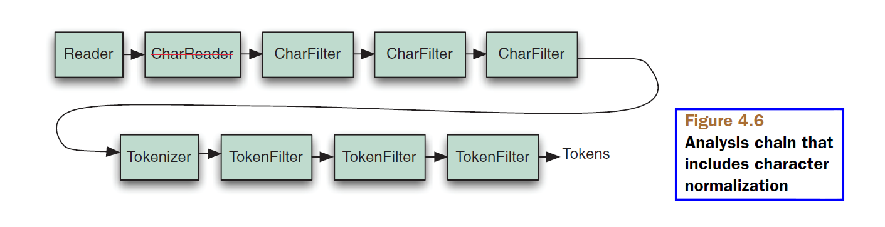

## 4.8 语言分析 Language analysis issues ##

Lucene 中处理语言是个值得关注且多方面的问题。如何索引各种语言的文本并且之后能被检索出来？作为构建基于 Lucene 的  Unicode 感知的应用程序开发者，应该考虑什么问题？

&emsp;&emsp;在分析各种语言的文本时，我们必须面对几个方面的问题。首要的问题是必须确保正确处理语言编码的字符集，这样外部的数据，例如文件，才能将被正确读入到 Java 中。在分析过程中，不同的语言有不同的停用词，以及特定于语言的词干还原算法。也许还有重音符和其它语言标志也要从字符上移除，这些都是特定于语言的。最后，如果不能确定使用的是哪种语言，可能还要求语言检测功能。这里列出的每个问题最终都要由开发者去处理，Lucene 只提供基本的构建块支持。不过最新版本的 Lucene 为不同语言的分析提供了大量的支持，并根据不同的语系，分别构建到自己独立的模块中，如 4.2.2 节所述。第 8.2 节深入探讨这些模块方面的内容。


<br/><br/>
<a id="1"></a>
## 4.8.1 Unicode 和编码 ##

在 Lucene 内部，所有的字符都是以标准的 UTF-8 编码方式存储的。Java 通过在 String 对象内部自动处理 Unicode，把我们从繁琐的字符编码处理中解脱出来，String 对象的字符表示为 UTF16 代码点，并且提供了从各种编码形式的外部数据读取的方法。我们则负责获取外部文本到 Java 中，然后交给 Lucene 使用。如果索引的数据存在于文件系统，我们需要知道文件是以什么编码方式保存的，这样才能正确读取它们。如果是从 HTTP 服务器读取 HTML 或 XML 文件，编码问题稍微有点复杂。编码可以通过 HTTP content-type 头指定，也可以在文档内部由其自身的 XML 头或者 HTML 的 \<meta> 标签指定。

后面的几节假设文本是以 Unicode 编码的，继续探讨 Lucene 关于语言方面的主题。


<br/><br/>
<a id="2"></a>
## 4.8.2 分析非英语语言 Analyzing non-English languages ##

在处理非英语语言文本时，分析处理的所有细节全部适用。分析文本的目的就是从中提取出所有的词项，对于西方语言，空白和标点符号用于切分单词，对于所分析文本使用的语言，必须调整其停用词和词干还原算法。可能会用到 ASCIIFoldingFilter 过滤器将非 ASCII 编码的 Unicode 字符替换为对等的 ASCII 字符。4.2.2 节列出的语言分析模块，提供了语言特定的分析器，这些分析器利用语言特定的词干还原和停用词。还有 SnowballAnalyzer 词干还原算法家族，用于支持很多欧洲语言。


<br/><br/>
<a id="3"></a>
## 4.8.3 字符规范化 Character normalization ##

从 2.9 版本开始，Lucene 可以对 Tokenizer 分词器看到的字符流进行规范化处理。规范化是在 Reader 和 Tokenizer 之间，对 Reader 产生的字符进行过滤，如图 4.7 所示（图片来源于 Lucene in action second edition）。

<div align=center></div>
<div align=center style="font-weight:bold;color:black;font-size:17px;">图 4.6</div>

这个 API 最重要的是，过滤器无论何时添加或移除字符，它都能正确计算出词元的起始和结束偏移量。这意味着高亮显示能够正确工作，准确显示其在原始输入文本中正确位置。

&emsp;&emsp;什么时候应该使用字符过滤？一个可能的使用案例是，在日语字符流中对平假名和片假名之间建立映射关系。另一个案例是繁体中文和简体中文之间建立映射关系。大多数应用程序不需要过滤字符流，但如果使用，就会发现它非常简单。

&emsp;&emsp;不管出于什么原因使用字符过滤，Lucene 提供了一系列的字符过滤类来映射它们基于词元的对等字符。CharFilter 是抽象基类，它不是 TokenFilter 的子类，而是 java.io.Reader 的子类，并且以 java.io.Reader 作为构造器参数：

- **CharFilter(Reader input)** 

因此，CharFilter 的具体子类可以将 Reader 和 CharFilter 链接起来构建成字符过滤器链。从一个 Reader 开始，后面是任意数量的 CharFilter 过滤器，结束于 Tokenizer 分词器，如图 4.6 所示：从一个 Reader 开始，其后链接了三个 CharFilter 过滤器。图中的 CharReader 是旧版本的实现，Lucene 4.0 版之后已被移除，CharFilter 直接通过 Reader 创建并链接在一起。

&emsp;&emsp;Lucene 提供了一个 CharFilter 的具体实现，MappingCharFilter 类，位于 analyzers-common 模块的 org.apache.lucene.analysis.charfilter 包。MappingCharFilter 是 CharFilter 的最简单实现，利用包含在  NormalizeCharMap 中的映射，对字符流中的字符进行过滤，并修正结果对偏移量造成的改变。

- **MappingCharFilter(NormalizeCharMap normMap, Reader in)** 

MappingCharFilter 用于接收输入，并输出子字符串对。输入字符流中看到一个输入子串时，MappingCharFilter 将其替换为对应的输出字符串。如果要执行简单的字符串替换，虽然我们可以理所当然地使用这个类，但是注意，它可能会有很高的性能消耗。这是因为当前的实现在分析时分配了很多的临时对象。

&emsp;&emsp;没有核心分析器执行字符过滤。必须创建自定义的分析器来构建从 Reader 开始的字符过滤器链，后面链接一定数量的 CharFilter，然后是 Tokenizer 分词器，以及一定数量的 TokenFilter 分词过滤器，构建出一个完整的分析器链。


<br/><br/>
<a id="4"></a>
## 4.8.4 分析亚洲语言 Analyzing Asian languages ##

亚洲语言，例如中文 Chinese、日文 Japanese、韩文 Korean（也被记为 CJK），使用表意文字，而非使用字母来表示单词。这类象形文字的单词不是以空白字符划分的，因此需要不同类型的分析来识别词元的切分。Lucene 的内置分析器中，唯一有能力处理亚洲语种文本的分析器，只有 StandardAnalyzer，该分析器可以将一定范围内的 Unicode 编码识别为 CJK 字符，并将它们拆分为独立的词元。

&emsp;&emsp;在 Lucene 提供的分析模块中，CJKAnalyzer 位于 analyzers-common 模块的 org.apache.lucene.analysis.cjk 包，可以支持包括中文、日文和韩文的亚洲语系。analyzers-smartcn 模块的 SmartChineseAnalyzer 是专门为支持中文而设计的分析器。

在我们的样例书籍数据中，对 Tao Te Ching（道德经）这本书，使用中文字符作为书名，加入到 title 属性。因为样例数据面向 Java 的属性文件，因此使用 Unicode 的转义序列：

```
title=Tao Te Ching \u9053\u5FB7\u7D93
```

我们在索引中对所有分词的域使用 StandardAnalyzer 分析器，对每个英文单词进行了正确的切分，对每个中文字符也切分为词项，即便词元之间没有空白：

```
[道][德][经]
```

测试代码 ChineseTest 演示了用中文表示的单词进行搜索，如代码清单 4.8.1 所示：

<table width="100%"><tr><td bgcolor=green><font color=black>Listing 4.8.1 StandardAnalyzer：中文搜索</td></tr></table>

```
public class ChineseTest {
  @Test
  public void testChinese() throws Exception {
    Directory directory = TestUtil.getBookIndexDirectory();
    DirectoryReader reader = DirectoryReader.open(directory);
    IndexSearcher searcher = new IndexSearcher(reader);

    Query query = new TermQuery(new Term("contents", "道"));
    assertEquals("tao", 1, TestUtil.hitCount(searcher, query));

    TopDocs docs = searcher.search(query, 1);
    int doc = docs.scoreDocs[0].doc;
    System.out.println("matched [title]: " + searcher.doc(doc).get("title"));

    reader.close();
    directory.close();
  }
}

```

代码测试通过，并输出：

```
matched [title]: Tao Te Ching 道德經

Process finished with exit code 0
```

注意，ChineseTest.java 文件保存为 UTF-8 格式，并让编译器使用 UTF-8 编码进行编译（编译选项中使用 -encoding utf8）。我们已经对中文字符的表示进行了编码，并且能够正确读取。

>**注**：java.util.Properties 加载属性文件使用的是 ISO-8859-1 编码，但是可以使用标准的 Java Unicode \u 语法将字符编码。Java 中有一个 native2ascii 的工具程序可以将本地编码的文件编码为正确的格式。

下面创建一个 ChineseDemo 程序，演示各种分析器对中文本的分析效果。如代码清单 4.8.2 所示。

代码位于示例代码的 analysis 子模块 net.mvnindex.demo.lucene.analysis.i18n 包。

<table width="100%"><tr><td bgcolor=green><font color=black>Listing 4.8.2 ChineseDemo: 演示各种分析器对中文文本的分析效果</td></tr></table>

```
public class ChineseDemo {
  private static String[] strings = {"道德經"};  // ①

  private static Analyzer[] analyzers = {       // ②
    new SimpleAnalyzer(),
    new StandardAnalyzer(),
    new CJKAnalyzer (),
    new SmartChineseAnalyzer()
  };

  public static void main(String args[]) throws Exception {

    for (String string : strings) {
      for (Analyzer analyzer : analyzers) {
        analyze(string, analyzer);
      }
    }
  }

  private static void analyze(String string, Analyzer analyzer)
         throws IOException {
    StringBuffer buffer = new StringBuffer();

    TokenStream stream = analyzer.tokenStream("contents", new StringReader(string));
    CharTermAttribute term = stream.addAttribute(CharTermAttribute.class);

    stream.reset();
    while(stream.incrementToken()) {   // ③
      buffer.append("[");
      buffer.append(term.toString());
      buffer.append("] ");
    }
    stream.end();
    stream.close();

    String output = buffer.toString();

    System.out.println(analyzer.getClass().getSimpleName() + " : " + string);
    System.out.println(output);         // ④
    System.out.println("-------------");

  }

  private static int getWidth(FontMetrics metrics, String s) {
    int size = 0;
    int length = s.length();
		for (int i = 0; i < length; i++) {
      size += metrics.charWidth(s.charAt(i));
    }
    size = size + 50;

    return size;
  }
}

```

① 分析这段中文文本
② 测试这 4 个分析器
③ 检索分析出来的词元
④ 显示分析结果

运行程序，输出如下：

```
SimpleAnalyzer : 道德經
[道德經] 
-------------
StandardAnalyzer : 道德經
[道] [德] [經] 
-------------
CJKAnalyzer : 道德經
[道德] [德經] 
-------------
SmartChineseAnalyzer : 道德經
[道德] [經] 
-------------

Process finished with exit code 0
```

可以看出，SmartChineseAnalyzer 对简体中文的表现更加优异。


<br/><br/>
<a id="5"></a>
## 4.8.5 再见 Zaijian ##

在一个索引中处理多语种的主要问题仍然是：处理文本编码。即便考虑 CJK 字符，StandardAnalyzer 仍然是最好的内置通用分析器，然而 SmartChineseAnalyzer 看起来更适用于中文语言分析。

&emsp;&emsp;在将多语种文档索引到单一的索引库时，也可以给文档添加一个域来指明它所使用的语种，这个域可用于过滤搜索结果，或者在检索时用于显示该结果所使用的语种。

&emsp;&emsp;最后一个主题是语言检测。它也和字符编码类似，已超出 Lucene 的领域，但对应用程序来说可能很重要。本书没有涉及语言检测方面的技术，但它是很活跃的研究领域，有多种实现可以选择（参考附录 D）。


