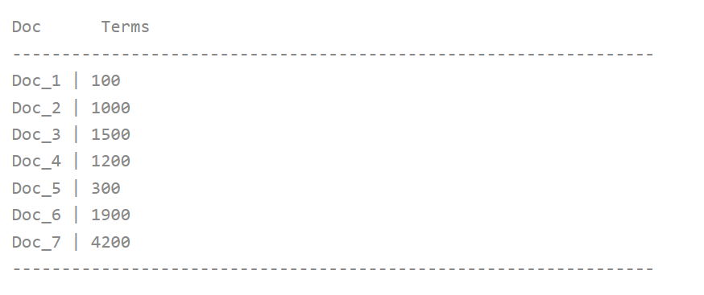

## 5.1 Lucene 的 DocValues 特性 ##

有时候，我们需要访问每一个文档某个特定域的值。Lucene 的倒排索引（inverted index）无法做到这一点，因为它是为了快速访问包含某个特定词项的所有文档而优化的。存储域和词向量让我们可以通过文档号访问全部的域值，但是它们的加载速度很慢。

&emsp;&emsp;早期版本的 Lucene，使用专门设计的 FieldCache 组件解决这一需求，通过将域值载入缓存以加快操作速度。但是 FieldCache 也有其天生的缺陷，它需要在搜索时加载倒排索引来构建 FieldCache，而且要求有足够大的内存以满足 FieldCache 的需要，因此性能并不理想。从 4.0 版开始，Lucene 引入了由 Michael McCandless 提供的新特性 DocValues，它更加快速、高效并且内存友好，全面替代 FieldCache 组件，从 Lucene 5.0 开始，Lucene 完全移除了 FieldCache 相关内容。

第 2.4.5 节，以及第 2.6.15 —— 2.6.27 节初步探讨了 Lucene 在索引期间对 DocValues 特性的支持，本节以及后续章节将进一步探究 DocValues 在搜索期间的应用。

<br /><br />
<a id="1"></a>

## 5.1.1 深入理解 DocValues ##

DocValues 是在索引时与倒排索引同时生成。也就是说 DocValues 和倒排索引一样，基于索引段生成并且是不可变的。同时 DocValues 和倒排索引一样序列化到磁盘，这样对性能和扩展性有很大帮助。

&emsp;&emsp;DocValues 通过序列化把数据结构持久化到磁盘，我们可以充分利用操作系统的内存，而不是 JVM 的 Heap。当工作集远小于系统可用内存时，系统会自动将 DocValues 驻留在内存中，使得其读写十分快速；当工作集远大于可用内存时，系统会根据需要从磁盘读取 DocValues，然后选择性放到分页缓存中。很显然，这样性能会比在内存中差很多，但是它的大小就不再局限于服务器的内存。如果是使用 JVM 的堆内存来实现，那么会导致 OutOfMemory 异常，令程序崩溃。即在大量结果集里通过少量字段进行大规模筛选过滤候选文档时，DocValues 可以显著减少 IO 时间和降低运算量。

&emsp;&emsp;DocValues 是通过 DocId 能快速找到对应 Value 的数据结构，每一个文档对应的值存储在一个单一的数据结构中，它的功能就是维护 DocID 到 Value 之间的关系，即 document-to-value 的映射。DocValues 本质上是一个序列化的列式存储，列式存储适用于聚合、排序、facet 等操作，但它不适用于过滤。

这种列式存储方式也非常便于压缩，特别是数字类型。这样可以减少磁盘空间并且提高访问速度。现代 CPU 的处理速度要比磁盘快几个数量级。所以我们必须减少直接对磁盘的读写操作，尽管这样需要额外消耗 CPU 运算进行解压。

要了解它如何压缩数据的，来看一组数字类型的 DocValues，如下图所示：

<div align=center></div>
<div align=center style="font-weight:bold;color:black;font-size:17px;">数值型 DocValues</div>

按列布局意味着有一个连续的数据块：[100,1000,1500,1200,300,1900,4200]。因为已经知道它们都是数字，而不是像文档或行中看到的异构集合，所以可以使用统一的偏移来将它们紧凑排列。

针对这样的数字有很多种压缩技巧。注意到这里每个数字都是 100 的倍数，DocValues 会检测一个段里面的所有数值，并使用一个最大公约数，方便做进一步的数据压缩。如果保存 100 作为此段的除数，可以对每个数字都除以 100，然后得到：[1,10,15,12,3,19,42]。现在这些数字变小了，只需要很少的位就可以存储下，也减少了磁盘存放的大小。

DocValues 在压缩过程中使用如下技巧。依次检测以下压缩模式:

1. 如果所有的数值各不相同（或缺失），设置一个标记并记录这些值
2. 如果这些值小于 256，将使用一个简单的编码表 
3. 如果这些值大于 256，检测是否存在一个最大公约数 
4. 如果没有存在最大公约数，从最小的数值开始，统一计算偏移量进行编码 

这些压缩模式不是传统的通用的压缩方式，比如 DEFLATE 或是 LZ4。因为列式存储的结构是严格且良好定义的，可以通过使用专门的模式来达到比通用压缩算法（如 LZ4 ）更高的压缩效果。

&emsp;&emsp;对于字符串类型的压缩，也有类似的编码方式。字符串类型是去重之后存放到顺序表的，通过分配一个 ID，然后通过数字类型的 ID 构建 DocValues。这样 String 类型和数值类型可以达到同样的压缩效果。

顺序表本身也有很多压缩技巧，比如固定长度、变长或是前缀字符编码等等。
<br /><br />

#### <font color=green>DocValues 适用的域值类型</font> ####

DocValues 维护着 document-to-value 的映射关系，因此它只能用于对单值域的处理，比如数字、日期、地理坐标、IP、email 地址等，对于文本类型的域值，必须是不被分析的，即通过 **FieldType.setTokenized(false)** 方法设置的分析选项。尽管可以通过特殊的分析器，例如，KeywordAnalyzer 只产生一个词元，也是不可以的。StringField 类型域是可以的，因为 StringField 类内部的域类型设置了 FieldType.setTokenized(false) 选项。TextField 类型域则不支持 DocValues 处理，因其内部域类型设置了 FieldType.setTokenized(true)。
<br /><br />

#### <font color=green>DocValues 应用场景</font> ####

一般情况下，应用程序不直接调用 DocValues 提供的 API，只有在使用高级功能时才用得到，例如 5.2 节讨论的通过域值对结果进行排序，其底层利用了 DocValues 特性。5.7 节的阐述的功能查询，也利用了 DocValues 特性。下面对 DocValues 的应用场景进行简要的概括：

- Sort：通过指定的域对匹配结果进行排序
- Group By：分组，即按域的值进行分组。
- Facet：切面检索，对搜索结果，通过指定域的值进行分类统计
- FunctionQuery：功能查询，即通过提供的功能函数来计算匹配文档的评分，替代默认的按文档的相似度计算评分值

但，DocValues 不适用于文档过滤操作。

也有一些直接使用 DocValues API 的现实应用场景。例如，每一个文档都有一个唯一的标识符，需要在搜索时访问，要检索的值存储在另外的数据库或者别的地方。或许想要根据文档最近发布时间对文档加权，那么就需要对每个文档的发布日期进行快速访问。5.7.2 节展示这个案例。再例如，在一个商业环境中，文档对应产品，每一个文档都包含一个装运重量（以单精度或双精度浮点数存储），想要在每一个搜索结果中访问对应的搬运费用。这些需求都能够通过 Lucene 的 DocValues 提供的 API 轻易解决。


<br /><br />
<a id="2"></a>

## 5.1.2 加载所有文档的 DocValues 域值 Loading field values for all documents ##

Lucene 提供了 DocValues 工具类，其中包含了多个静态方法，用于从索引段 reader 获取关于某个域所有文档的 DocValues 值，每一种 DocValues 类型都对应一个工具方法，如下所示：

- **static BinaryDocValues 	getBinary(LeafReader reader, String field)**
- **static NumericDocValues getNumeric(LeafReader reader, String field)**
- **static SortedDocValues 	getSorted(LeafReader reader, String field)**
- **static SortedNumericDocValues getSortedNumeric(LeafReader reader, String field)** 
- **static SortedSetDocValues getSortedSet(LeafReader reader, String field)**

实际上，这些静态方法调用的是传入的段 reader 对应的实例方法，也就是说，真正读取 DocValue 值，是由单独的索引段 reader 实现的。表示段 reader 的 SegmentReader 类型，是 LeafReader 的间接具体子类，对应的实例方法如下所示：

- **BinaryDocValues getBinaryDocValues(String field)** 返回给定域的 BinaryDocValues 值，如果该域没有被索引为 BinaryDocValues，返回 null 值。返回的 BinaryDocValues 实例只能用于一个线程。
- **NumericDocValues getNumericDocValues(String field)** 返回指定域的 NumericDocValues 值，如果该域没有被索引为 NumericDocValues，返回 null 值。返回的 NumericDocValues 实例只能用于一个线程。
- **SortedDocValues getSortedDocValues(String field)** 返回指定域的 SortedDocValues 值，如果该域没有被索引为 SortedDocValues，返回 null 值。返回的 SortedDocValues 实例只能用于一个线程。
- **SortedNumericDocValues getSortedNumericDocValues(String field)** 返回指定域的 SortedNumericDocValues 值，如果该域没有被索引为 SortedNumericDocValues，返回 null 值。返回的 SortedNumericDocValues 实例只能用于一个线程。
- **SortedSetDocValues getSortedSetDocValues(String field)** 返回指定域的 SortedSetDocValues 值，如果该域没有被索引为 SortedSetDocValues，返回 null 值。返回的 SortedSetDocValues 实例只能用于一个线程。

例如，如果在索引时通过 NumericDocValuesField 类型域，或者其子类 DoubleDocValuesField 或 FloatDocValuesField 域类型向索引文档加入了浮点型 DocValues 域 "weight"：

```java
doc.add(new FloatDocValuesField("weight", Float.parseFloat(weight))); 
```

那么，在搜索时，既可以通过如下代码获取某个索引段中所有文档的 "weight" 域值：

```java
NumericDocValues weightValues = DocValues.getNumeric(reader, "weight");
```

NumericDocValues 是 DocIdSetIterator 的子类，因此可以迭代访问该集合中所有文档对应的 weight 值：

```java
int id;
while ((id = weightValues.nextDoc()) != DocIdSetIterator.NO_MORE_DOCS) {
    long w = weightValues.longValue();
    Long W = new Long(w);
    float weight = intBitsToFloat(W.intValue());
}
```

如果已经获得了某个具体的文档编号 docId，可以直接通过 advanceExact(int target) 方法定位到该文档上，target 指定的 docID 必须大于或等于当前的 docID，如下所示：

```java
if(weightValues.advanceExact(docId)) {
    long w = weightValues.longValue();
    Long W = new Long(w);
    float weight = intBitsToFloat(W.intValue());
}
```


<br /><br />
<a id="3"></a>

## 5.1.3 每个索引段对应的 reader ##

从 2.9 版本开始，Lucene 对每一个索引段执行搜索，并依次对每个段的搜索结果进行排序，最后操纵所有的段搜索结果合集。这意味着，由 Lucene 核心功能传递给 DocValues 类的 `get***()` 方法的 reader 总是对应单个索引段的。当重新打开一个 IndexReader 时，这个处理方式能带来很大的好处，只有新生成的段才必须加载至 DocValues 缓存。

&emsp;&emsp;这意味着，应该避免传递顶级的 IndexReader 给 DocValues 类的 `get***()` 方法，这会导致意想不到的效果。典型地，在高级的自定义实现中可能会要求 DocValues 值，例如实现一个自定义的 Collector 接口时，Lucene 核心功能会给该接口提供单一段的（single-segment）reader，而正是这个 reader 应该转而传递给 DocValues 类的 `get***()` 方法来检索 `***DocValues` 值。如果发现 DocValues 占用了大量的内存，并且猜测可能是不小心将顶级的 IndexReader 传递给了检索 DocValues 的方法，尝试使用 setInfoStream API 来开启调试输出。像这种问题，以及其它情况，都会使程序将详细信息输出到所提供的 PrintStream 上。


&emsp;&emsp;有了对 DocValues 的深入理解和直接使用 API 访问 DocValues 的体验，可以将 DocValues 构建到自己的应用程序中。下一节，讨论一个 Lucene 中非常有价值的能力，域排序（Field Sort）功能，在其内部利用了 DocValues 特性。


