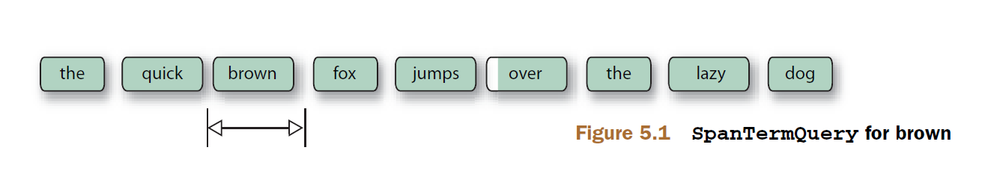
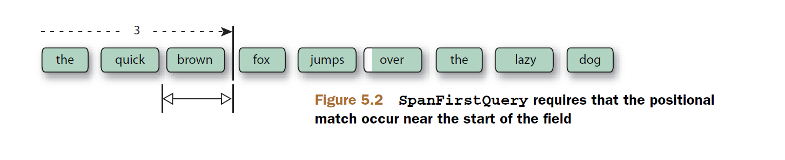
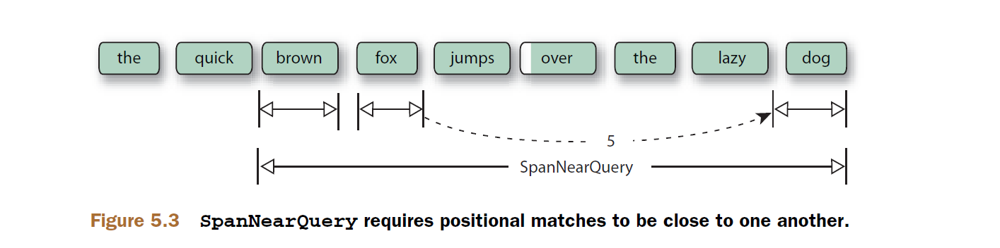
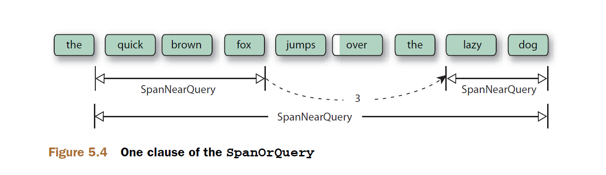

## 5.5 跨度查询 Span queries ##

Lucene 包含一个基于 SpanQuery 的完整查询体系，大致与常规的 Lucene Query 类相对应。在这种上下文中，跨度是指在一个域内部，起始和结束词元的位置。回顾 4.2.1 节，分析过程产生的词元包含一个相对于前一个词元的位置。这个位置信息，与 SpanQuery 子类结合，使得查询更具辨别力也更加复杂巧妙，例如查询所有包含 "President Obama" 且位置靠近 "health care reform" 的文档。

&emsp;&emsp;使用我们迄今为止讨论的查询类型，不可能构造出这种位置感知的（position-aware）查询。可能构造比较接近的类似于 "president obama" AND "health care reform" 的查询表达式，但对于我们搜索目标的相关性来说，文档中的这些语句可能彼此相距太远了。在典型的应用中，SpanQuery 用于提供比 PhraseQuery 更加丰富、更富于表现力的位置感知功能。它们通常也与 payload 联合使用，以访问索引时创建的 payload。

&emsp;&emsp;在搜索时，跨度查询不仅仅跟踪它匹配的文档：每个单独的跨度，或许每个域有多于一个的跨度，也会被跟踪。与 TermQuery 不同，只简单地匹配文档，SpanTermQuery 准确地匹配同一文档，但是也保持对每个匹配词项出现位置的跟踪。总的来说，跨度查询通常是更加计算密集的（compute-intensive）操作。例如，在 TermQuery 查找包含其词项的文档时，它记录那个匹配的文档，并立即继续执行后面的代码。而 SpanTermQuery 必须列举出文档中所有那个词项出现的位置。

Lucene 的核心提供了多个 SpanQuery 的子类，如表 5.1 所示。

<div align=center>表 5.1 SpanQuery 体系</div>

<table>
    <tr bgcolor=#AA0000>
        <th align=center>SpanQuery 类型</th>
        <th align=center>描述</th>
    </tr>
    <tr>
      <td>SpanTermQuery</td>
      <td>用于和其他跨度查询联合使用。对于其本身，它的功能与 TermQuery 相同。</td>
    </tr>
    <tr>
      <td>SpanFirstQuery</td>
      <td>匹配出现在域开始部分的跨度</td>
    </tr>
    <tr>
      <td>SpanNearQuery</td>
      <td>匹配出现在与另一个跨度靠近的跨度</td>
    </tr>
    <tr>
      <td>SpanNotQuery</td>
      <td>匹配不与另一个跨度发生重叠的跨度</td>
    </tr>
    <tr>
      <td>FieldMaskingSpanQuery</td>
      <td>封装另一个 SpanQuery，但是伪装为匹配一个不同的域。对于横跨多个域的跨度匹配很有用，否则是不可能的。</td>
    </tr>
   <tr>
      <td>SpanOrQuery</td>
      <td>聚合多个跨度查询匹配。</td>
    </tr>
    <tr>
      <td>FieldMaskingSpanQuery</td>
      <td>通过欺骗（lying），允许不同域的跨度查询嵌入到单一域跨度查询中</td>
    </tr>
    <tr>
      <td>SpanPositionRangeQuery</td>
      <td>将指定范围之内的匹配作为最终匹配结果</td>
    </tr>
</table>

通过一个简单的示例来讨论 SpanQuery 类型，如程序清单 5.4 所示，索引两个文档，一个使用短语 "the quick brown fox jumps over the lazy dog"，另一个是与之类似的短语 "the quick red fox jumps over the sleepy cat"。为这些文档中的每个词项创建单独 SpanTermQuery，以及三个 assert 帮助方法。最后创建不同类型的跨度查询演示它们的功能。

<table width="100%"><tr><td bgcolor=green><font color=black>Listing 5.4 SpanQuery 演示基础结构</td></tr></table>

```java
public class SpanQueryTest {
  private ByteBuffersDirectory directory;
  private DirectoryReader reader;
  private IndexSearcher searcher;

  private SpanTermQuery the;
  private SpanTermQuery quick;
  private SpanTermQuery brown;
  private SpanTermQuery red;
  private SpanTermQuery fox;
  private SpanTermQuery lazy;
  private SpanTermQuery sleepy;
  private SpanTermQuery dog;
  private SpanTermQuery cat;
  private Analyzer analyzer;

  @Before
  public void setUp() throws Exception {
    directory = new ByteBuffersDirectory();

    analyzer = new WhitespaceAnalyzer();
    IndexWriterConfig config = new IndexWriterConfig(analyzer);
    IndexWriter writer = new IndexWriter(directory, config);

    Document doc = new Document();
    doc.add(new TextField("f",
        "the quick brown fox jumps over the lazy dog",
        Field.Store.YES));
    writer.addDocument(doc);

    doc = new Document();
    doc.add(new TextField("f",
        "the quick red fox jumps over the sleepy cat",
        Field.Store.YES));
    writer.addDocument(doc);

    writer.close();

    reader = DirectoryReader.open(directory);
    searcher = new IndexSearcher(reader);

    the = new SpanTermQuery(new Term("f", "the"));
    quick = new SpanTermQuery(new Term("f", "quick"));
    brown = new SpanTermQuery(new Term("f", "brown"));
    red = new SpanTermQuery(new Term("f", "red"));
    fox = new SpanTermQuery(new Term("f", "fox"));
    lazy = new SpanTermQuery(new Term("f", "lazy"));
    sleepy = new SpanTermQuery(new Term("f", "sleepy"));
    dog = new SpanTermQuery(new Term("f", "dog"));
    cat = new SpanTermQuery(new Term("f", "cat"));
  }

  @After
  public void tearDown() throws Exception {
    reader.close();
    directory.close();
  }

  private void assertOnlyBrownFox(Query query) throws Exception {
    TopDocs hits = searcher.search(query, 10);
    assertEquals(1, hits.totalHits.value);
    assertEquals("wrong doc", 0, hits.scoreDocs[0].doc);
  }

  private void assertBothFoxes(Query query) throws Exception {
    TopDocs hits = searcher.search(query, 10);
    assertEquals(2, hits.totalHits.value);
  }

  private void assertNoMatches(Query query) throws Exception {
    TopDocs hits = searcher.search(query, 10);
    assertEquals(0, hits.totalHits.value);
  }
}

```

<br/><br/>
<a id="1"></a>

## 5.5.1 跨度查询基础构建块：SpanTermQuery ##

跨度出查询需要一个初始的着力点，而 SpanTermQuery 正是如此。在内部，SpanQuery 对它的匹配保持跟踪：为每一个匹配的文档持有一系列的起始/结束位置。对于其本身，SpanTermQuery 匹配文档正如 TermQuery 所做的一样，但是它也持有同一个词项出现在每一个文档中的位置跟踪。一般来说我们不会单独使用 panTermQuery 查询本身，而是把它用作其它 SpanQuery 类型的输入。

图 5.1 演示了如下代码 SpanTermQuery 的匹配过程：

```java
  @Test
  public void testSpanTermQuery() throws Exception {
    assertOnlyBrownFox(brown);
    dumpSpans(brown);
  }
```

<div align=center></div>
<div align=center style="font-weight:bold;color:black;font-size:17px;">图 5.1</div>

SpanTermQuery 构造器：

- **SpanTermQuery(Term term)** 创建匹配 term 的跨度（span）查询


类中定义了一个 dumpSpans() 方法用于以可视化的方式展示跨度匹配的细节。dumpSpans() 方法利用低级别的 SpanQuery API 访问跨度信息。每个 SpanQuery 子类都支持一个很有用的 toString() 方法，用于诊断目的，dumpSpans() 方法也是用于此目的，如代码清单 5.5.1 所示：

<table width="100%"><tr><td bgcolor=green><font color=black>Listing 5.5.1 dumpSpans 方法，用于观察任何 SpanQuery 匹配的所有跨度信息</td></tr></table>

```java
 private void dumpSpans(SpanQuery query) throws IOException {
    System.out.println(query + ":");

    SpanWeight spanWeight = query.createWeight(searcher, ScoreMode.COMPLETE, 0.0f);
    Spans spans = spanWeight.getSpans(reader.getContext().leaves().get(0), 
            SpanWeight.Postings.POSITIONS);

    int numSpans = 0;

    TopDocs hits = searcher.search(query, 10);
    float[] scores = new float[2];
    for (ScoreDoc sd : hits.scoreDocs) {
      scores[sd.doc] = sd.score;
    }

    int id;
    while ((id = spans.nextDoc()) != Spans.NO_MORE_DOCS) {                 // ①

      Document doc = reader.document(id);                                  // ②
      numSpans++;

      while (spans.nextStartPosition() != Spans.NO_MORE_POSITIONS){

        TokenStream stream = analyzer.tokenStream("contents",     // ③
                new StringReader(doc.get("f")));

        CharTermAttribute term = stream.addAttribute(CharTermAttribute.class);
        stream.reset();

        int startPos = spans.startPosition();
        int endPos = spans.endPosition();
        System.out.println("[start position, end position]: [" + startPos + ", " + endPos + "]");

        StringBuilder buffer = new StringBuilder();
        buffer.append("   ");

        int i = 0;
        while (stream.incrementToken()) {     // ④
          if (i == startPos) {                // ⑤
            buffer.append("<");               // ⑤
          }                                   // ⑤
          buffer.append(term.toString());     // ⑤
          if (i + 1 == endPos) {              // ⑤
            buffer.append(">");               // ⑤
          }

          buffer.append(" ");
          i++;
        }
        stream.end();
        stream.close();

        buffer.append("(").append(scores[id]).append(") ");
        System.out.println(buffer);
      }
    }
    if (numSpans == 0) {
      System.out.println("   No spans");
    }
    else {
      System.out.println("numSpans: " + numSpans);
    }
    System.out.println();
  }

```

① 迭代每一个 span
② 检索当前的匹配文档
③ 重新分析文本
④ 迭代所有词元
⑤ 在 span 周围打印 < 和 >

`dumpSpans(brown)` 的输出如下：

```shell
f:brown:
[start position, end position]: [2, 3]
   the quick <brown> fox jumps over the lazy dog (0.31506687) 
numSpans: 1
```

更有意思的是 dumpSpans() 对单词 "the" 的 SpanTermQuery 输出：

```java
dumpSpans(the);
```

dumpSpans() 输出：

```shell
f:the:
[start position, end position]: [0, 1]
   <the> quick brown fox jumps over the lazy dog (0.113950975) 
[start position, end position]: [6, 7]
   the quick brown fox jumps over <the> lazy dog (0.113950975) 
[start position, end position]: [0, 1]
   <the> quick red fox jumps over the sleepy cat (0.113950975) 
[start position, end position]: [6, 7]
   the quick red fox jumps over <the> sleepy cat (0.113950975) 
numSpans: 2
```

不仅匹配了两个文档，而且每个文档有两个匹配的 span 有尖括号 `<>` 高亮显示出来。这个基本的 SpanTermQuery 用于构建其它 SpanQuery 类型的构建块。

<br/><br/>
<a id="2"></a>

## 5.5.2 在域开始部分查找跨度 Finding spans at the beginning of a field ##

要查询出现在域的最开头指定数量位置之内的的跨度，使用 SpanFirstQuery 查询。图 5.2 演示了一个 SpanFirstQuery 查询过程。

<div align=center></div>
<div align=center style="font-weight:bold;color:black;font-size:17px;">图 5.2</div>

SpanFirstQuery 构造器如下：

- **SpanFirstQuery(SpanQuery match, int end)** 创建匹配 match 的跨度，且跨度的结束位置小于或等于 end 的 SpanFirstQuery 实例。它实际上是跨度位置范围查询 SpanPositionRangeQuery 的简化版本，假设范围的起始位置为 0，而只检查结束边界。

下面的测试代码展示了匹配和不匹配的查询：

```java
  @Test
  public void testSpanFirstQuery() throws Exception {
    SpanFirstQuery sfq = new SpanFirstQuery(brown, 2);
    assertNoMatches(sfq);

    dumpSpans(sfq);

    sfq = new SpanFirstQuery(brown, 3);
    dumpSpans(sfq);
    assertOnlyBrownFox(sfq);

    sfq = new SpanFirstQuery(brown, 4);
    dumpSpans(sfq);
    assertOnlyBrownFox(sfq);
  }
```

第一个查询没有找到匹配，因为范围结束位置 2 对查找 brown 来说太短了，但范围结束位置为 3 和 4 就足够长了，因此，第二和第三个查询都找到了一个匹配，如图 5.2 所示，只要匹配词项的跨度在指定的范围之内就满足匹配条件。

&emsp;&emsp;任何 SpanQuery 都可以用于 SpanFirstQuery 中，只要匹配的跨度结束位置在开头的指定数量位置之内（例子中的 3 和 4）即可。结果跨度匹配与源 SpanQuery 的跨度相同，本例与 5.4.1 中的例子相同，都是 [2, 3]。下面是本例 dumpSpans() 的输出：

```shell
spanFirst(f:brown, 2):
   No spans

spanFirst(f:brown, 3):
[start position, end position]: [2, 3]
   the quick <brown> fox jumps over the lazy dog (0.31506687) 
numSpans: 1

spanFirst(f:brown, 4):
[start position, end position]: [2, 3]
   the quick <brown> fox jumps over the lazy dog (0.31506687) 
numSpans: 1
```

<br/><br/>
<a id="3"></a>

## 5.5.3 搜索彼此邻近的跨度 Spans near one another ##

短语查询 PhraseQuery 匹配词项间彼此相邻的文档，通过一个 slop 因子，允许词项间的中间项（位置 position）在一定数量的范围之内，包括词项间顺序的倒转。SpanNearQuery 的操作类似于 PhraseQuery，但存在一些重要的不同之处。SpanNearQuery 匹配词项彼此间的跨度在一定数量的位置范围之内，通过一个单独的标志指明跨度必须按指定的顺序或者倒转顺序排列。结果匹配的跨度，横跨从第一个跨度的起始位置，持续到最后一个跨度的结束位置。一个给定三个 SpanTermQuery 的 SpanNearQuery 对象如图 5.3 所示：

<div align=center></div>
<div align=center style="font-weight:bold;color:black;font-size:17px;">图 5.3</div>

SpanNearQuery 构造器如下：

- **SpanNearQuery(SpanQuery[] clausesIn, int slop, boolean inOrder)**

用 SpanTermQuery 对象作为 SpanNearQuery 的 SpanQuery 与 PhraseQuery 中的 TermQuery 类似。但 SpanQuery[] 数组内元素的次序很重要，它确定了其内部词项跨度的次序。inOrder 就是用于控制这个次序的标志，如果为 true，表示按 SpanQuery[] 数组内的次序匹配，如果为 false，则按 SpanQuery[] 数组内次序相反的次序匹配。slop 参数表示跨度间允许的位置数量范围，小于或者等于这个范围之内的跨度匹配，否则不匹配。

为了便于 SpanNearQuery 的构建，SpanNearQuery 提供了建造者模式内部类 SpanNearQuery.Builder，构造器如下：

- **Builder(String field, boolean ordered)**  参数 field：搜索的域，ordered：次序标志，指明加入的子句是否必须按正向次序匹配，还是按相反次序匹配。

之后就可以通过 `Builder.addClause(SpanQuery clause)` 方法向 Builder 中添加任意数量的 SpanQuery 子句，最后通过 `Builder.build()` 方法构建 SpanNearQuery 实例。

代码清单 5.5.3 演示了几个 SpanNearQuery 的使用方法，并展示了与其相关的 PhraseQuery 示例：

<table width="100%"><tr><td bgcolor=green><font color=black>Listing 5.5.3 通过 SpanNearQuery 查找匹配彼此邻近的匹配</td></tr></table>

```java
 @Test
  public void testSpanNearQuery() throws Exception {
    SpanQuery[] quick_brown_dog = new SpanQuery[]{quick, brown, dog};
    SpanNearQuery snq = new SpanNearQuery(quick_brown_dog, 0, true);// ①
    assertNoMatches(snq);
    dumpSpans(snq);

    snq = new SpanNearQuery(quick_brown_dog, 4, true);              // ②
    assertNoMatches(snq);
    dumpSpans(snq);

    snq = new SpanNearQuery(quick_brown_dog, 5, true);              // ③
    assertOnlyBrownFox(snq);
    dumpSpans(snq);

    // interesting - even a sloppy phrase query would require
    // more slop to match
    snq = new SpanNearQuery(new SpanQuery[]{lazy, fox}, 3, false); // ④
    assertOnlyBrownFox(snq);
    dumpSpans(snq);

    PhraseQuery.Builder builder = new PhraseQuery.Builder();
    builder.setSlop(4);

    builder.add(new Term("f", "lazy"));                                // ⑤
    builder.add(new Term("f", "fox"));                                 // ⑤
    PhraseQuery pq = builder.build();                                  // ⑤
    assertNoMatches(pq);

    builder.setSlop(5);                                                // ⑥
    pq = builder.build();
    assertOnlyBrownFox(pq);                                            // ⑥
  }

```

① 三个连续词项的 SpanNearQuery 查询，slop 为 0，表示三个词项按连续的位置排列，结果是索引中的两个文档都不匹配
② 相同的三个词项，slop 为 4，表示 4 个位置范围之内，仍然没有匹配的文档
③ 相同的三个连续的词项，slop 为 5，表示 5 个位置范围之内，SpanNearQuery 有一个匹配结果
④ 内嵌的 SpanTermQuery 对象，以相反的次序查询，inOrder 标志设为 false，要匹配 slop 至少要设为 3
⑤ 和短语查询 PhraseQuery 比较，slop 设为 4，也没有匹配
⑥ 短语查询 PhraseQuery, slop 设为 5，有了结果匹配

代码只展示了使用 SpanTermQuery 嵌入到 SpanNearQuery，实际上，SpanNearQuery 可以嵌入任何 SpanQuery 类型对象，正如它的构造器所定义的那样。

<br/><br/>
<a id="4"></a>

## 5.5.4 排除重叠的跨度 Excluding span overlap from matches ##

SpanNotQuery 查询，移除匹配一个 SpanQuery 但与另一个 SpanQuery 匹配结果重叠的部分，或者在另一个 SpanQuery 匹配结果的前 x 个词元之内，或者后 y 个词元之内。

SpanNotQuery 有三个重载构造器：

- **SpanNotQuery(SpanQuery include, SpanQuery exclude)** 构造一个匹配 include 中的跨度，但是没有与 exclude 匹配跨度重叠的 SpanNotQuery 实例
- **SpanNotQuery(SpanQuery include, SpanQuery exclude, int dist)** 构造一个匹配 include 中的跨度，但是没有与 exclude 匹配跨度重叠 include 的 dist 个词元范围之内的 SpanNotQuery 实例
- **SpanNotQuery(SpanQuery include, SpanQuery exclude, int pre, int post)** 构造一个匹配 include 中的跨度，但是没有与 exclude 匹配跨度重叠 include 的前 pre 个词元，或者后 post 个词元之内的 SpanNotQuery 实例

看下面的代码清单 5.5.4 演示：

<table width="100%"><tr><td bgcolor=green><font color=black>Listing 5.5.4 通过 SpanNotQuery 排除重叠的匹配</td></tr></table>

```java
  @Test
  public void testSpanNotQuery() throws Exception {
    SpanNearQuery quick_fox = new SpanNearQuery(new SpanQuery[]{quick, fox}, 1, true);
    assertBothFoxes(quick_fox);
    dumpSpans(quick_fox);

    SpanNotQuery quick_fox_dog = new SpanNotQuery(quick_fox, dog);
    assertBothFoxes(quick_fox_dog);
    dumpSpans(quick_fox_dog);

    SpanNotQuery no_quick_red_fox = new SpanNotQuery(quick_fox, red);
    assertOnlyBrownFox(no_quick_red_fox);
    dumpSpans(no_quick_red_fox);
  }
```

SpanNotQuery 构造器的第一个参数是包含的跨度，第二个参数是要排除的跨度。下面是 `dumpSpans(...)` 的输出：

```shell
spanNear([f:quick, f:fox], 1, true):
[start position, end position]: [1, 4]
   the <quick brown fox> jumps over the lazy dog (0.10724798) 
[start position, end position]: [1, 4]
   the <quick red fox> jumps over the sleepy cat (0.10724798) 
numSpans: 2

spanNot(spanNear([f:quick, f:fox], 1, true), f:dog, 0, 0):
[start position, end position]: [1, 4]
   the <quick brown fox> jumps over the lazy dog (0.10724798) 
[start position, end position]: [1, 4]
   the <quick red fox> jumps over the sleepy cat (0.10724798) 
numSpans: 2

spanNot(spanNear([f:quick, f:fox], 1, true), f:red, 0, 0):
[start position, end position]: [1, 4]
   the <quick brown fox> jumps over the lazy dog (0.10724798) 
numSpans: 1
```

SpanNearQuery 匹配两个文档是因为，两个文档都包含 quick 和 fox 在 1 个位置范围之内。第一个 SpanNotQuery, quick_fox_dog，也匹配两个文档，因为在 quick_fox 和 dog 跨度之间没有重叠的部分。The second SpanNotQuery, no_quick_red_fox，排除了第二个文档，因为 red 与 quick_fox 跨度有重叠。注意，最终的结果跨度匹配是原来包含的跨度，即构造器中第一个参数的跨度。排除的跨度只是用于确定是否有重叠，并且把重叠部分排除在原始匹配之外，最终的匹配结果就是排除之后剩余的匹配部分。

<br/><br/>
<a id="5"></a>

## 5.5.5 SpanOrQuery ##

SpanOrQuery 合并 SpanQuery 数组的匹配结果，所有的子句必须使用同一个域。构造器如下：

- **SpanOrQuery(SpanQuery... clauses)** 

我们的示例查询，所有文档都有 "quick fox" 邻近 "lazy dog"，或者 "quick fox" 邻近 "sleepy cat"。测试代码的 SpanOrQuery 由两个 SpanNearQuery 子句组成，每个 SpanNearQuery 又由两个 SpanNearQuery 组成，分别由两个 SpanTermQuery 组成。第一个子句 qf_near_ld 如图 5.4 所示：

<div align=center></div>
<div align=center style="font-weight:bold;color:black;font-size:17px;">图 5.4</div>


测试的完整代码如代码清单 5.5.5 所示：

<table width="100%"><tr><td bgcolor=green><font color=black>Listing 5.5.5 SpanOrQuery 合并匹配结果</td></tr></table>

```java
  @Test
  public void testSpanOrQuery() throws Exception {
    SpanNearQuery quick_fox =
        new SpanNearQuery(new SpanQuery[]{quick, fox}, 1, true);

    SpanNearQuery lazy_dog =
        new SpanNearQuery(new SpanQuery[]{lazy, dog}, 0, true);

    SpanNearQuery sleepy_cat =
        new SpanNearQuery(new SpanQuery[]{sleepy, cat}, 0, true);

    SpanNearQuery qf_near_ld =
        new SpanNearQuery(
            new SpanQuery[]{quick_fox, lazy_dog}, 3, true);
    assertOnlyBrownFox(qf_near_ld);
    dumpSpans(qf_near_ld);

    SpanNearQuery qf_near_sc =
        new SpanNearQuery(
            new SpanQuery[]{quick_fox, sleepy_cat}, 3, true);
    dumpSpans(qf_near_sc);

    SpanOrQuery or = new SpanOrQuery(
        new SpanQuery[]{qf_near_ld, qf_near_sc});
    assertBothFoxes(or);
    dumpSpans(or);
  }
```

代码使用 dumpSpans() 方法跟踪每一个步骤的执行过程，直到最后的 SpanOrQuery 通过 OR 逻辑将两个匹配结果合并起来，下面是其输出：

```shell
spanNear([spanNear([f:quick, f:fox], 1, true), spanNear([f:lazy, f:dog], 0, true)], 3, true):
[start position, end position]: [1, 9]
   the <quick brown fox jumps over the lazy dog> (0.30188584) 
numSpans: 1

spanNear([spanNear([f:quick, f:fox], 1, true), spanNear([f:sleepy, f:cat], 0, true)], 3, true):
[start position, end position]: [1, 9]
   the <quick red fox jumps over the sleepy cat> (0.30188584) 
numSpans: 1

spanOr([spanNear([spanNear([f:quick, f:fox], 1, true), spanNear([f:lazy, f:dog], 0, true)], 3, true), spanNear([spanNear([f:quick, f:fox], 1, true), spanNear([f:sleepy, f:cat], 0, true)], 3, true)]):
[start position, end position]: [1, 9]
   the <quick brown fox jumps over the lazy dog> (0.54090214) 
[start position, end position]: [1, 9]
   the <quick red fox jumps over the sleepy cat> (0.54090214) 
numSpans: 2

```

SpanNearQuery 的 qf_near_ld 子句用于匹配 "quick fox" 邻近 "lazy dog"，qf_near_sc 子句用于匹配 "quick fox" 邻近 "sleepy cat"，最后这两个 SpanNearQuery 实例通过 SpanOrQuery 组合在一起，聚合所有匹配跨度：

```java
    SpanOrQuery or = new SpanOrQuery(new SpanQuery[]{qf_near_ld, qf_near_sc});
```

SpanNearQuery 和 SpanOrQuery 都接受任何其它类型的 SpanQuery，因此可以创建任意嵌入的查询。比如，要执行 “短语在另一个短语之内” 的查询，例如子短语查询 "Bob Dylan"，设置 slop 因子为 0 以进行准确匹配，并且外层短语查询通过单词 "sings" 匹配这个子短语，使用非 0 的 slop 因子。这样的查询使用 PhraseQuery 是不可能的，因为它只接受词项。但是可以轻易的通过将一个 SpanNearQuery 嵌入到另一个 SpanNearQuery 实例中构建。

<br/><br/>
<a id="6"></a>

## 5.5.6 使用 FieldMaskingSpanQuery 进行多域跨度查询 ##

对于复合的跨度查询 SpanQuery 来说，例如 SpanNearQuery 或 SpanOrQuery 查询，要求其嵌入的所有 SpanQuery 子句必须使用同一个域（single-field）。FieldMaskingSpanQuery 的作用就是通过欺骗（lying），允许不同域的跨度查询嵌入到单一域跨度查询中。被伪装的（masked）SpanQuery 以正常方式工作。

构造器：

- **FieldMaskingSpanQuery(SpanQuery maskedQuery, String maskedField)** 

注意，getField() 方法返回的是构造器中所提供的 maskedField 字符串，不是 maskedQuery 的中的域名称。

测试代码如代码清单 5.5.6 所示：

<table width="100%"><tr><td bgcolor=green><font color=black>Listing 5.5.6 使用 FieldMaskingSpanQuery 进行多域跨度查询</td></tr></table>

```java

public class FieldMaskingSpanQueryTest {
    private ByteBuffersDirectory directory;
    private DirectoryReader reader;
    private IndexSearcher searcher;
    private Analyzer analyzer;

    @Before
    public void setUp() throws Exception {
        directory = new ByteBuffersDirectory();

        analyzer = new WhitespaceAnalyzer();
        IndexWriterConfig config = new IndexWriterConfig(analyzer);
        IndexWriter writer = new IndexWriter(directory, config);

        Document doc = new Document();
        doc.add(new StringField("teacherid", "1", Field.Store.YES));
        doc.add(new TextField("studentfirstname", "james", Field.Store.YES));
        doc.add(new TextField("studentsurname", "jones", Field.Store.YES));
        writer.addDocument(doc);

        doc = new Document();
        doc.add(new StringField("teacherid", "2", Field.Store.YES));
        doc.add(new TextField("studentfirstname", "james", Field.Store.YES));
        doc.add(new TextField("studentsurname", "smith", Field.Store.YES));
        doc.add(new TextField("studentfirstname", "sally", Field.Store.YES));
        doc.add(new TextField("studentsurname", "jones", Field.Store.YES));
        writer.addDocument(doc);

        writer.close();

        reader = DirectoryReader.open(directory);
        searcher = new IndexSearcher(reader);
    }

    @After
    public void tearDown() throws Exception {
        reader.close();
        directory.close();
    }

    @Test
    public void testFieldMaskingSpanQuery() throws IOException {
        SpanQuery q1  = new SpanTermQuery(new Term("studentfirstname", "james"));
        SpanQuery q2  = new SpanTermQuery(new Term("studentsurname", "jones"));
        SpanQuery q2m = new FieldMaskingSpanQuery(q2, "studentfirstname");
        Query query = new SpanNearQuery(new SpanQuery[]{q1, q2m}, -1, false);

        TopDocs hits = searcher.search(query, 10);
        assertEquals(1, hits.totalHits.value);

        for (ScoreDoc sd : hits.scoreDocs) {
            Document doc = searcher.doc(sd.doc);
            System.out.println("[teacherid]: " + doc.get("teacherid"));
            System.out.println("[studentfirstname]: " + doc.get("studentfirstname"));
            System.out.println("[studentsurname]: " + doc.get("studentsurname"));
            System.out.println();
        }
    }
}
```

下面是代码输出：

```shell
[teacherid]: 1
[studentfirstname]: james
[studentsurname]: jones
```

FieldMaskingSpanQuery 成功欺骗了 SpanNearQuery 的构建，使得代码能够正常运行。搜索 'studentfirstname:james studentsurname:jones' 匹配了 teacherid 为 1 的文档，没有匹配 teacherid 为 2 的文档，'james' 在位置为 0 处，'jones' 在位置为 1 处。


<br/><br/>
<a id="7"></a>

## 5.5.7 位置范围跨度查询 SpanPositionRangeQuery ##

检查 SpanPositionCheckQuery.getMatch() 方法是否在指定的开始和结束位置范围之内。SpanFirstQuery 从 SpanPositionRangeQuery 类继承，是假设起始位置为 0 的优化版本。

SpanPositionRangeQuery 构造器：

- **SpanPositionRangeQuery(SpanQuery match, int start, int end)**

start 参数指定了跨度范围的起始位置，end 参数指定了跨度范围的结束位置，SpanQuery match 在这个范围之内的匹配作为最终匹配结果。


<br/><br/>
<a id="8"></a>

## 5.5.8 跨度查询 和 QueryParser ##

QueryParser 不支持任何类型的 SpanQuery 类型。

回顾 3.4.6 节，在设置 slop 值足够大时，PhraseQuery 可以公正地处理词项次序，或正向，或反向，由 PhraseQuery 根据实际的域值确定。有趣的是，可以使用 SpanNearQuery 通过 SpanTermQuery 很容易扩展 PhraseQuery，强制短语查询对域的词项只按指定的次序匹配，6.3.5 节演示这一技术。


