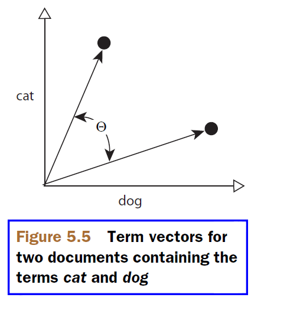
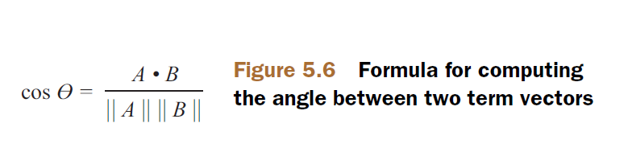

## 5.9 利用词项向量 Leveraging term vectors ##

词向量（term vector）是以高级方式存储的与每个文档的倒排索引相同的信息。它们是更高级的话题，并且可以利用词向量做很多的事情。本节通过两个具体的实例演示，一旦在索引中包含了词向量，在搜索时可以做哪些操作：查找相似的文档和自动给文档分类。

&emsp;&emsp;从技术上讲，词向量是“词项-频率”对的集合（a collection of termfrequency pairs），可选地包含每个词项出现的位置信息。大多数的我们很难想象多维空间向量，因此出于可视化的目的，看一下有两个文档，只包含两个词项 cat 和 dog 的情况，这两个单词在每个文档中出现多次。在 X,Y 坐标系标出每个文档的词项频率，看起来类似图 5.5 所示的样子，我们感兴趣的是词向量间的夹角（图片来源于 Lucene in Action Second Edition）。

<div align=center></div>
<div align=center style="font-weight:bold;color:black;font-size:17px;">图 5.5</div>
<br />

在第 3.4.3 节讨论了如何在索引时开启索引词项。在索引关于书籍的测试数据时，已经对 title, author, subject, contents 这几个域进行了词向量索引。获取词向量，可以通过 IndexReader 如下两个方法：

- **Terms 	getTermVector(int docID, String field)** 获取 docID 标识文档的 field 域词向量，如果该域没有对词向量进行存储，返回 null 值。
- **Fields 	getTermVectors(int docID)** 获取 docID 标识文档的词向量，如果该文档没有对词向量进行存储，返回 null 值。

例如，要获取某个给定文档的 "subject" 的词向量，调用：

```java
Terms terms = reader.getTermVector(int docID, "subject");
```

Terms 实例有多个方法用于获取某个域的向量信息，其中最重要的是 iterator() 方法，它返回 TermsEnum 枚举器，通过这个枚举器，可以迭代访问词向量中的每个词项-词频对信息。TermsEnum 的 `attributes()` 返回当前词项元数据信息，`term()` 方法返回文本信息。

可以利用词向量做出一些有趣的效果，例如查找与某个特定文档类似的文档，这是个进行潜在语义分析的例子。我们要展示如何通过一本已存在的书，找到与此书类似的书籍，以及一个概念验证阶段的分类器，它能告诉我们将一本新书放到最合适的分类中。

<br/><br/>
<a id="1"></a>

## 5.9.1 查找类似的书籍 Books like this ##

在顾客查看某本书时，如果我们的书店能够提供一些其它可供选择的书籍会更好一些。这些提供的书籍应该与原来的书密切相关，但是，手工把这些书籍关联起来必定会是劳动密集的，并且要求持续付出努力以保持更新。相反，我们利用 Lucene 的布尔查询能力以及从一本书中获取的信息，来查找与这本书类似的书籍。程序清单 5.9.1 演示了从我们的样例数据，查找与每一本书类似书籍的基本的方法：

<table width="100%"><tr><td bgcolor=green><font color=black>Listing 5.9.1 为每一本书查找类似的书籍</td></tr></table>

```java
public class BooksLikeThis {
  private IndexReader reader;
  private IndexSearcher searcher;

  public static void main(String[] args) throws IOException {
//    Directory directory = TestUtil.getBookIndexDirectory();
    Directory directory = FSDirectory.open(Paths.get("index"));
    IndexReader reader = DirectoryReader.open(directory);

    int numDocs = reader.maxDoc();

    BooksLikeThis blt = new BooksLikeThis(reader);
    for (int i = 0; i < numDocs; i++) {                    // ①
      System.out.println();
      Document doc = reader.document(i);
      System.out.println(doc.get("title"));

      Document[] docs = blt.docsLike(i, 10);               // ②
      if (docs.length == 0) {
        System.out.println("  None like this");
      }
      for (Document likeThisDoc : docs) {
        System.out.println("  -> " + likeThisDoc.get("title"));
      }
    }
    reader.close();
    directory.close();
  }

  public BooksLikeThis(IndexReader reader) {
    this.reader = reader;
    searcher = new IndexSearcher(reader);
  }

  public Document[] docsLike(int id, int max) throws IOException {
    Document doc = reader.document(id);

    String[] authors = doc.getValues("author");                               // ③
    BooleanQuery.Builder builder = new BooleanQuery.Builder();                // ③
    for (String author : authors) {
      builder.add(new TermQuery(new Term("author", author)), BooleanClause.Occur.SHOULD);
    }
    BoostQuery authorQuery = new BoostQuery(builder.build(), 2.0f);           // ③

    Terms vector = reader.getTermVector(id, "subject");                       // ④
    TermsEnum termsEnum = vector.iterator();

    BooleanQuery.Builder subjectBuilder = new BooleanQuery.Builder();

    while (termsEnum.next() != null) {                                        // ④
      TermQuery tq = new TermQuery(new Term("subject", termsEnum.term().utf8ToString())); 
      subjectBuilder.add(tq, BooleanClause.Occur.SHOULD);                     // ④
    }
    BooleanQuery subjectQuery = subjectBuilder.build();

//     System.out.println("  Query: " +
//        likeThisQuery.toString("contents"));

    BooleanQuery.Builder likeThisBuilder = new BooleanQuery.Builder();
    likeThisBuilder.add(authorQuery, BooleanClause.Occur.SHOULD);             // ⑤
    likeThisBuilder.add(subjectQuery, BooleanClause.Occur.SHOULD);            // ⑤
    likeThisBuilder.add(new TermQuery(                                        // ⑥
        new Term("isbn", doc.get("isbn"))), BooleanClause.Occur.MUST_NOT);    // ⑥

    BooleanQuery likeThisQuery = likeThisBuilder.build();

    TopDocs hits = searcher.search(likeThisQuery, 10);
    int size = max;
    if (max > hits.scoreDocs.length) size = hits.scoreDocs.length;

    Document[] docs = new Document[size];
    for (int i = 0; i < size; i++) {
      docs[i] = reader.document(hits.scoreDocs[i].doc);
    }

    return docs;
  }
}

```

① 迭代索引中所有的书籍，并找到与每一本书类似的书籍

② 查找类似这本书的其它书籍

③ 为具有相同作者的查询加权，考虑到具有相同作者的书籍更加类似，因此对相同作者的查询提升权限，这样，这类书籍就很可能排列在其他作者类似书籍的前面

④ 利用从当前文档的 "subject" 域词向量获取的所有词项，把它们加入到另一个布尔查询

⑤ 联合作者 author 和主题内容 subject 创建最终布尔查询

⑥ 排除当前书籍，这样更加明确地最优匹配其他判断条件

在 ③，我们通过不同的方法获取 author 域，它被索引为多个域，原始的 author 字符串是逗号分隔的作者列表，如下所示：

```java
    FieldType tvStringStoredType = new FieldType(StringField.TYPE_STORED);
    tvStringStoredType.setStoreTermVectors(true);
    tvStringStoredType.setStoreTermVectorOffsets(true);
    tvStringStoredType.setStoreTermVectorPositions(true);

    tvStringStoredType.setOmitNorms(false);

    // split multiple authors into unique field instances
    String[] authors = author.split(",");
    for (String a : authors) {                                
      doc.add(new Field("author", a, tvStringStoredType));
    }
```

程序的输出显式了每一本书通过作者 author 和主题 subject 关联起来：

```shell
A Modern Art of Education
  -> Mindstorms: Children, Computers, And Powerful Ideas

Imperial Secrets of Health and Longevity
  None like this

Lipitor, Thief of Memory
  None like this

Nudge: Improving Decisions About Health, Wealth, and Happiness
  None like this

Tao Te Ching 道德經
  None like this

Gödel, Escher, Bach: an Eternal Golden Braid
  None like this

Ant in Action
  -> Lucene in Action, Second Edition
  -> JUnit in Action, Second Edition
  -> Extreme Programming Explained

Mindstorms: Children, Computers, And Powerful Ideas
  -> A Modern Art of Education

JUnit in Action, Second Edition
  -> Ant in Action

Lucene in Action, Second Edition
  -> Ant in Action

Extreme Programming Explained
  -> The Pragmatic Programmer
  -> Ant in Action

Tapestry in Action
  None like this

The Pragmatic Programmer
  -> Extreme Programming Explained
```

要观察每一次实际的查询，解除代码中关于输出查询的注释。

&emsp;&emsp;没有词向量 books-like-this 实例就无法工作，并且在这个例子中没有把它作为向量使用。只是把它作为获取某个域词项的便捷方法。没有词向量，subject 域可能要重新进行分析或者索引，这样单个的 subject 词项被分别加入到索引，这样才能获取该域的词项列表。下一个实例会用到词向量的频率组件，以更复杂的形式利用词向量。

&emsp;&emsp;Lucene 的 queries 类库提供了一个非常有用的 MoreLikeThis 类，与我们的 BooksLikeThis 类完成一样的功能，但它更加通用。BooksLikeThis 类，很明显是对域的名称进行硬编码的，例如书籍索引的 subject 和 author 域。但是 MoreLikeThis 类可以设置域的名称，这样，它就可以工作在任何索引库上。第 8.6.1 节进行更详细的阐述。另外，关于高亮的模块，第 8.3 和 8.4 节讨论的内容，为高亮显示，也利用词向量来查找词项。

<br/><br/>
<a id="2"></a>

## 5.9.2 分类 What category ##

样例书籍数据索引中，每一本书都给了一个主类别：例如，本书被分类为 "/technology/computers/programming"。对于一本新书来说，被放置到最合适的类别可能相对明显，也可能有几个类别看起来合理。我们利用词向量自动做出决策。我们已经写了一些代码来构建每个已存在的类别的 subject 向量表示。这个表现形式，原型的，向量是每一个文档 subject 域向量的总和。

有了这些预先计算的向量表示，我们的最终目标是能计算，为一本新书给出一些 subject 的关键字，告诉我们最适合的类别。测试用例使用两个示例 subject 字符串：

```java
  @Test
  public void testCategorization() throws Exception {
    assertEquals("/technology/computers/programming/methodology",
        getCategory("extreme agile methodology"));
    assertEquals("/education/pedagogy",
        getCategory("montessori education philosophy"));
  }
```

第一个断言是说，基于样例数据，如果一本新书在它的 subject 中有 "extreme agile methodology" 关键字，则最合适的类别是 "/technology/computers/programming/methodology"。最合适的类别，由查找新书的 subject 在向量空间最近类别的角度确定。

测试的 setUp() 方法为所有的类别构建向量：

```java
  @Before
  public void setUp() throws Exception {
    categoryMap = new TreeMap<>();
    buildCategoryVectors();
    dumpCategoryVectors();
  }
```

代码通过便利索引中的每个文档构建类别向量，将书籍的 subject 向量聚合为一个向量作为书籍的关联类别。类别向量存储在一个 map 对象中，以类别的名称作为 key，值是另一个 map，以词项作为 key，值是一个整数，表示它的频率，如代码清单 5.9.2 所示：

<table width="100%"><tr><td bgcolor=green><font color=black>Listing 5.9.2 通过聚合每一个类别来构建类别向量 Build category vectors by aggregating for each category</td></tr></table>

```java

  private void buildCategoryVectors() throws IOException {
    Directory directory = TestUtil.getBookIndexDirectory();
    IndexReader reader = DirectoryReader.open(directory);

    int maxDoc = reader.maxDoc();

    for (int i = 0; i < maxDoc; i++) {
      Document doc = reader.document(i);
      String category = doc.get("category");

      Map<String, Integer> vectorMap = categoryMap.get(category);
      if (vectorMap == null) {
        vectorMap = new TreeMap<>();
        categoryMap.put(category, vectorMap);
      }

      Terms terms = reader.getTermVector(i, "subject");
      addTermFreqToMap(vectorMap, terms);
    }
  }
```

每本书的 "subject" 域的词频向量通过 addTermFreqToMap() 方法被加入到书类别 "category" 向量。terms.iterator() 获取词向量迭代器，通过迭代器获取向量中的每个词项。termsEnum.postings() 方法获取当前词项的位置迭代器 PostingsEnum，从位置迭代器可以调用 PostingsEnum.freq() 方法获取当前词项的词频，以及位置和偏移量等信息。如代码清单 5.9.2-1 所示：

<table width="100%"><tr><td bgcolor=green><font color=black>Listing 5.9.2-1 为每个类别聚合词项频率 Aggregate term frequencies for each category</td></tr></table>

```java

  private void addTermFreqToMap(Map<String, Integer> vectorMap, Terms terms) throws IOException {
    TermsEnum termsEnum = terms.iterator();
    PostingsEnum postingsEnum = null;
    while (termsEnum.next() != null) {
      String term = termsEnum.term().utf8ToString();
      postingsEnum = termsEnum.postings(postingsEnum);

      int doc = 0;
      int freq = 0;
      while ((doc = postingsEnum.nextDoc()) != DocIdSetIterator.NO_MORE_DOCS){
        freq += postingsEnum.freq();
        System.out.println("doc: " + doc +", freq: "+ freq);
      }

      System.out.println("term: "+ term+ ", freq: "+ freq);

      if (vectorMap.containsKey(term)) {
        Integer value = vectorMap.get(term);
        vectorMap.put(term, (value + freq));
      } else {
        vectorMap.put(term, freq);
      }
    }
    System.out.println();
  }

```

这是比较简单的部分，构建类别 category 向量的 map 结构，其中只涉及到 map 结构的 Integer 型 value 的加法运算。计算向量间的角度是更加复杂的数学运算。对于最简单的二维空间，如图 5.5 所展示的那样，两个类别（A 和 B）通过聚合之后，各自有自己唯一的向量。一本新书的主题最接近的类别是角度感知的，与我们的选择匹配。图 5.6 展示计算两个向量间的角度公式：

<div align=center></div>
<div align=center style="font-weight:bold;color:black;font-size:17px;">图 5.6</div>

getCategory() 方法迭代所有的类别，计算出每个类别的 subject 向量与新书的 subject 向量间的角度。最小的角度就是最接近的匹配，并返回匹配的类别 category 名，如代码清单 5.9.2-2 所示：

<table width="100%"><tr><td bgcolor=green><font color=black>Listing 5.9.2-2 找到最接近的向量来匹配最合适的类别 Finding the closest vector to match the best category</td></tr></table>

```java

  private String getCategory(String subject) {
    String[] words = subject.split(" ");
    double bestAngle = Double.MAX_VALUE;
    String bestCategory = null;

    for(Map.Entry<String, Map<String, Integer>> entry : categoryMap.entrySet()){
      String category = entry.getKey();
      System.out.println(category);

      double angle = computeAngle(words, category);
      System.out.println(" -> angle = " + angle + " (" + Math.toDegrees(angle) + ")");

      if (angle < bestAngle) {
        bestAngle = angle;
        bestCategory = category;
      }
    }

    return bestCategory;
  }
```

这里假设新书的 subject 字符串是空白分隔的形式，并且每个单词只出现一次。另外利用 String.split() 方法来从新书的 subject 字符串提取词元，这是不改变词元文本的分析器唯一要做的事情。如果要使用一个会改变词元的分析器，例如其中包含 PorterStemFilter 过滤器的分析器，则需要将 String.split() 换成调用分析器来执行分词操作。

角度的计算做了一些假定来简化部分计算过程。最后，计算两个单词向量间的角度由 computeAngle() 方法实现，如代码清单 5.9.2-3 所示：

<table width="100%"><tr><td bgcolor=green><font color=black>Listing 5.9.2-3 计算一本新书和一个给定类别的 subject 词向量间的角度 Computing term vector angles for a new book against a given category</td></tr></table>

```java

  private double computeAngle(String[] words, String category) {
    Map<String, Integer> vectorMap = categoryMap.get(category);

    int dotProduct = 0;
    int sumOfSquares = 0;
    for (String word : words) {
      int categoryWordFreq = 0;

      if (vectorMap.containsKey(word)) {
        categoryWordFreq = vectorMap.get(word);
      }

      dotProduct += categoryWordFreq;         //①
      sumOfSquares += categoryWordFreq * categoryWordFreq;
    }


    double denominator;
    if (sumOfSquares == words.length) {
      denominator = sumOfSquares;             // ②
    } else {
      denominator = Math.sqrt(sumOfSquares) *
                    Math.sqrt(words.length);
    }

    double ratio = dotProduct / denominator;

    return Math.acos(ratio);
  }

}
```

① 计算是经过简化的，假设 words 数组里每个单词的频率为 1
② 域数值 N 的平方根乘以 N 的平方根得到 N。程序的这种简便方法避免了比值大于 1 的情况（这在余弦函数中是非法值），从而解决精度问题。

我们应该注意到，计算两个文档的向量之间的角度，或者像这个例子一样，计算一个文档和一个典型类别之间的角度，是计算密集的。它需要计算平方根和反余弦函数，而这对海量数据的索引可能禁止使用。


