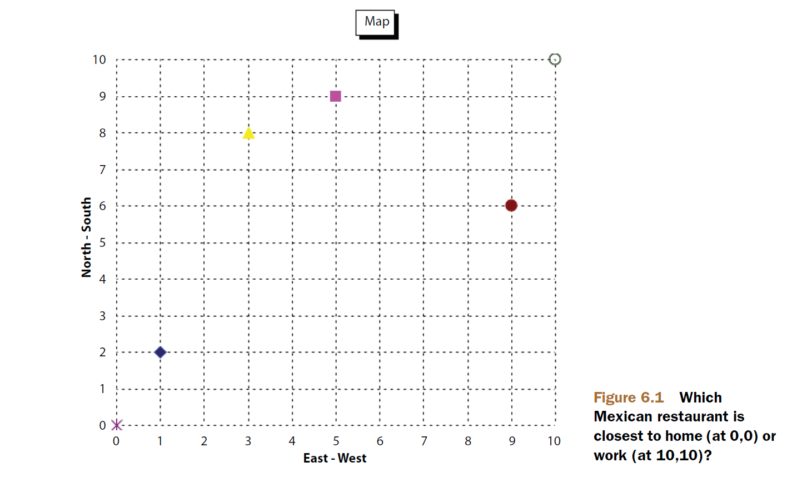

## 6.1 利用自定义排序方法 Using a custom sort method ##

如果按评分、docID、域值进行排序无法满足需要，Lucene 让我们通过提供 FieldComparatorSource 抽象基类的子类，来实现自定义排序机制。自定义排序实现在索引期间无法确定排序依据的情况最实用。

在上一章探讨根据域值进行排序主题时，了解到，排序类型 Sort 可以通过无参数构造器创建，产生搜索按相关性排序的对象，也可以通过一个或多个 SortField 对象创建，用于按自定义方式对匹配结果排序。SortField​ 提供如下构造器：

- **SortField​(String field, FieldComparatorSource comparator)** 创建带有自定义比较功能的排序
- **SortField​(String field, FieldComparatorSource comparator, boolean reverse)** 创建带有自定义比较功能的排序，并通过 reverse 参数指明是否倒转所提供排序功能的自然顺序
- **SortField​(String field, SortField.Type type)** 通过排序类型创建排序
- **SortField​(String field, SortField.Type type, boolean reverse)** 通过排序类型创建排序，并通过 reverse 参数指明是否倒转该排序类型的自然顺序

其中 **FieldComparatorSource** 是提供 **FieldComparator&lt;T&gt;** 对象以实现自定义域排序规则的抽象基类，为搜索提供完全的自定义排序，就从子类化 FieldComparatorSource 类开始。

&emsp;&emsp;在本节，将创建一个自定义的排序，将搜索结果按到一个给定位置的地理距离进行排列次序。这个给定的位置只能在搜索的时候才能知道，例如，如果用户通过内部装有全球定位服务（global positioning service，GPS）的移动设备执行搜索，就是用户正在执行搜索的地理位置。首先，展示索引时要求的步骤，然后，阐述如何在搜索时实现自定义排序。最后，将学习如何访问涉及排序的域值以实现展示的目的。

<br/><br/>
<a id="1"></a>

## 6.1.1 为地理位置排序索引文档 Indexing documents for geographic sorting ##

通过一个广为人知的问题创建一个简化的概念演示，“What Mexican food restaurant is nearest to me?（距我最近的墨西哥餐馆是哪个）”。图 6.1 展示了餐馆位置的样例，并在 10x10 的网格上虚构它们的网格坐标（图片来源于 Lucene in Action Second Edition）：

<div align=center></div>
<div align=center style="font-weight:bold;color:black;font-size:17px;">图 5.5</div>
<br />

Lucene 的 spatial3d 和 spatial-extras 模块提供了根据地理距离过滤和排序的通用功能，第 9.7 节阐述。

测试数据的索引过程如代码清单 6.1.1 所示，对每一个位置定义了一个名称 name，位置 location 用 X、Y 坐标表示，还有一个类型 type。通过使用 type 域，使测试数据便于接受其它业务类型，并且它还允许对特定类型的位置过滤搜索结果。

一下代码位于随书代码 extsearch 模块。

<table width="100%"><tr><td bgcolor=green><font color=black>Listing 6.1.1 索引地理数据 Indexing geographic data</td></tr></table>

```java
public class DistanceSortingTest{
  private Directory directory;
  private DirectoryReader reader;
  private IndexSearcher searcher;
  private Query query;

  @Before
  public void setUp() throws Exception {
    directory = new ByteBuffersDirectory();
    IndexWriterConfig config = new IndexWriterConfig(new WhitespaceAnalyzer());
    IndexWriter writer = new IndexWriter(directory, config);

    addPoint(writer, "El Charro", "restaurant", 1, 2);
    addPoint(writer, "Cafe Poca Cosa", "restaurant", 5, 9);
    addPoint(writer, "Los Betos", "restaurant", 9, 6);
    addPoint(writer, "Nico's Taco Shop", "restaurant", 3, 8);

    writer.close();

    reader = DirectoryReader.open(directory);
    searcher = new IndexSearcher(reader);

    query = new TermQuery(new Term("type", "restaurant"));
  }

  private void addPoint(IndexWriter writer, String name, String type, int x, int y)
      throws IOException {
    Document doc = new Document();
    doc.add(new StringField("name", name, Field.Store.YES));
    doc.add(new StringField("type", type, Field.Store.YES));
    doc.add(new IntPointDocValuesField("location", x, y));
    writer.addDocument(doc);
  }

  @After
  public void tearDown() throws Exception {
    reader.close();
    directory.close();
  }
}
```

坐标数据被索引为一个单独的 IntPointDocValuesField 类型域。IntPointDocValuesField 是自定义的二维点坐标的 DocValues 域，代码如代码清单 6.1.1-2 所示：

<table width="100%"><tr><td bgcolor=green><font color=black>Listing 6.1.1-2 自定义的  IntPointDocValuesField 域类型</td></tr></table>

```java

public class IntPointDocValuesField extends Field {
    public static final FieldType TYPE = new FieldType();
    static {
        TYPE.setDocValuesType(DocValuesType.SORTED_NUMERIC);
        TYPE.freeze();
    }

    public IntPointDocValuesField(String name, int x, int y) {
        super(name, TYPE);
        setLocationValue(x, y);
    }

    public void setLocationValue(int x, int y) {
        fieldsData = Long.valueOf((((long) x) << 32) | (y & 0xFFFFFFFFL));
    }
    /** helper: checks a fieldinfo and throws exception if its definitely not a IntPointDocValuesField */
    static void checkCompatible(FieldInfo fieldInfo) {
        // dv properties could be "unset", if you e.g. used only StoredField with this same name in the segment.
        if (fieldInfo.getDocValuesType() != DocValuesType.NONE && fieldInfo.getDocValuesType() != TYPE.docValuesType()) {
            throw new IllegalArgumentException("field=\"" + fieldInfo.name + "\" was indexed with docValuesType=" + fieldInfo.getDocValuesType() +
                    " but this type has docValuesType=" + TYPE.docValuesType() +
                    ", is the field really a IntPointDocValuesField?");
        }
    }
    @Override
    public String toString() {
        StringBuilder result = new StringBuilder();
        result.append(getClass().getSimpleName());
        result.append(" <");
        result.append(name);
        result.append(':');

        long currentValue = (Long)fieldsData;
        result.append((int)(currentValue >> 32));
        result.append(',');
        result.append((int)(currentValue & 0xFFFFFFFF));

        result.append('>');
        return result.toString();
    }
}

```

IntPointDocValuesField 域将表示位置的 (int x, int y) 坐标编码为一个 Long 型对象编入索引库，通过代码 `TYPE.setDocValuesType(DocValuesType.SORTED_NUMERIC)`，将数据作为 DocValues 类型进行索引。


<br/><br/>
<a id="2"></a>

## 6.1.2 实现自定义地理排序 Implementing custom geographic sort ##

在深入探索执行自定义排序的类之前，先看一下用于确认其能正确工作的测试用例。

```java
  @Test
  public void testNearestRestaurantToHome() throws Exception {
    Sort sort = new Sort(new SortField("unused", new DistanceComparatorSource(0, 0)));

    TopFieldDocs hits = searcher.search(query, 10, sort);

    assertEquals("closest",
                 "El Charro", searcher.doc(hits.scoreDocs[0].doc).get("name"));
    assertEquals("furthest",
                 "Los Betos", searcher.doc(hits.scoreDocs[3].doc).get("name"));
  }
```

家的坐标是 (0,0)。测试展示了返回结果中的第一个和最后一个文档分别是距家最近和最远的餐厅。如果没有使用自定义排序方式，这些文档将会按照插入的先后顺序返回，因为对餐厅类型的查询，所返回的命中文档具有相同的评分。距离的计算，使用最基本的距离计算公式，通过我们的自定义 DistanceComparatorSource 类实现，如代码清单 6.1.2 所示：

<table width="100%"><tr><td bgcolor=green><font color=black>Listing 6.1.2 自定义的 FieldComparatorSource 实现：DistanceComparatorSource</td></tr></table>

```java
public class DistanceComparatorSource extends FieldComparatorSource { // ①
  private int x;
  private int y;

  public DistanceComparatorSource(int x, int y) {                     // ②
    this.x = x;
    this.y = y;
  }

  @Override
  public FieldComparator<?> newComparator(String fieldname,           // ③
                                          int numHits,
                                          int sortPos,
                                          boolean reversed) {
    return new DistanceScoreDocLookupComparator(fieldname, x, y, numHits);
  }

  public String toString() {
    return "Distance from ("+x+","+y+")";
  }
}

```

① 继承自 FieldComparatorSource 类
② 通过构造器传递基位置
③ 实现 FieldComparatorSource 中唯一的虚方法 newComparator()，创建比较器返回。其中 fieldname 参数是从哪个域获取相关数据，numHits 参数表明存储在最高评分值列表中的命中数量，sortPos 参数表明这个 SortField 在 Sort 中位置，如果是主比较器，`sortPos==0`，第二比较器 `sortPos==1`，以此类推。有些比较器在作为主比较器时能够对其自身进行优化。reversed 参数表明是否对其自然顺序进行倒转

在 Lucene 中，排序的基础架构是通过与 **FieldComparatorSource** 类以及 **FieldComparator** 类 API 的交互实现对匹配文档的排序。出于性能的考虑，这个 API 比我们想象的更加复杂，特别是，在 Lucene 中让比较器知晓被跟踪队列的大小，通过 numHits 参数传递给 newComparator() 方法。另外，每当搜索一个新索引段时，比较器会接收到通知，**FieldComparator** 类通过 **getLeafComparator(LeafReaderContext context)** 方法来接收搜索新段通知，比较器需要返回一个 **LeafFieldComparator** 接口的实例对象。

&emsp;&emsp;DistanceComparatorSource 构造器提供了起点位置，用于计算索引中的每个匹配文档的位置与该位置的距离。每当 FieldComparator.getLeafComparator(LeafReaderContext context) 方法被调用时，从当前索引段获取域的 DocValues 对象，以用于获取存储在该段中所有表示位置的的 (x, y) 值，如代码清单 6.1.2-1 所示：

<table width="100%"><tr><td bgcolor=green><font color=black>Listing 6.1.2-1 自定义 FieldComparator 实现: DistanceComparatorSource</td></tr></table>

```java

public class DistanceScoreDocLookupComparator extends FieldComparator<Double>
        implements LeafFieldComparator {        // ①
    final String field;
    final int x;
    final int y;

    SortedNumericDocValues currentDocs;         // ②

    // distances needs to be calculated with square root to
    // avoid numerical issues (square distances are different but
    // actual distances are equal)
    final double[] values;                      // ③

    double bottom;                              // ④
    double topValue;

    // current bounding box(es) for the bottom distance on the PQ.
    // these are pre-encoded with XYPoint's encoding and
    // used to exclude uncompetitive hits faster.
    int minX = Integer.MIN_VALUE;
    int maxX = Integer.MAX_VALUE;
    int minY = Integer.MIN_VALUE;
    int maxY = Integer.MAX_VALUE;

    // the number of times setBottom has been called (adversary protection)
    int setBottomCounter = 0;

    private long[] currentValues = new long[4];
    private int valuesDocID = -1;

    public DistanceScoreDocLookupComparator(String fieldName, int x, int y, int numHits) {
        this.field = fieldName;
        this.x = x;
        this.y = y;

        this.values = new double[numHits];
    }

    @Override
    public LeafFieldComparator getLeafComparator(LeafReaderContext context) throws IOException {
        LeafReader reader = context.reader();
        FieldInfo info = reader.getFieldInfos().fieldInfo(field);
        if (info != null) {
            IntPointDocValuesField.checkCompatible(info);
        }
        currentDocs = DocValues.getSortedNumeric(reader, field); // ⑤
        valuesDocID = -1;
        return this;
    }

    double sortKey(int doc) throws IOException {                 // ⑥
        if (doc > currentDocs.docID()) {
            currentDocs.advance(doc);
        }
        double minValue = Double.POSITIVE_INFINITY;
        if (doc == currentDocs.docID()) {
            setValues();
            int numValues = currentDocs.docValueCount();
            for (int i = 0; i < numValues; i++) {
                long encoded = currentValues[i];
                double docX = (int)(encoded >> 32);
                double docY = (int)(encoded & 0xFFFFFFFF);
                final double diffX = x - docX;
                final double diffY = y - docY;
                double distance =  Math.sqrt(diffX * diffX + diffY * diffY);
                minValue = Math.min(minValue, distance);
            }
        }
        return minValue;
    }

    @Override
    public int compare(int slot1, int slot2) {                   // ⑦
        return Double.compare(values[slot1], values[slot2]);
    }

    @Override
    public void setTopValue(Double value) {
        topValue = value.doubleValue();
    }

    @Override
    public void setBottom(int slot) throws IOException {         // ⑧
        bottom = values[slot];
        // make bounding box(es) to exclude non-competitive hits, but start
        // sampling if we get called way too much: don't make gobs of bounding
        // boxes if comparator hits a worst case order (e.g. backwards distance order)
        if (bottom < Float.MAX_VALUE && (setBottomCounter < 1024 || (setBottomCounter & 0x3F) == 0x3F)) {

            XYRectangle rectangle = XYRectangle.fromPointDistance((float) x, (float) y, (float) bottom);
            // pre-encode our box to our integer encoding, so we don't have to decode
            // to double values for uncompetitive hits. This has some cost!
            this.minX = XYEncodingUtils.encode(rectangle.minX);
            this.maxX = XYEncodingUtils.encode(rectangle.maxX);
            this.minY = XYEncodingUtils.encode(rectangle.minY);
            this.maxY = XYEncodingUtils.encode(rectangle.maxY);
        }
        setBottomCounter++;
    }

    private void setValues() throws IOException {
        if (valuesDocID != currentDocs.docID()) {
            assert valuesDocID < currentDocs.docID(): " valuesDocID=" + valuesDocID + " vs " + currentDocs.docID();
            valuesDocID = currentDocs.docID();
            int count = currentDocs.docValueCount();
            if (count > currentValues.length) {
                currentValues = new long[ArrayUtil.oversize(count, Long.BYTES)];
            }
            for(int i=0;i<count;i++) {
                currentValues[i] = currentDocs.nextValue();
            }
        }
    }

    @Override
    public int compareBottom(int doc) throws IOException {       // ⑨
        if (doc > currentDocs.docID()) {
            currentDocs.advance(doc);
        }
        if (doc < currentDocs.docID()) {
            return Double.compare(bottom, Double.POSITIVE_INFINITY);
        }

        setValues();

        int numValues = currentDocs.docValueCount();

        int cmp = -1;
        for (int i = 0; i < numValues; i++) {
            long encoded = currentValues[i];

            // test bounding box
            int xBits = (int)(encoded >> 32);
            if (xBits < minX || xBits > maxX) {
                continue;
            }
            int yBits = (int)(encoded & 0xFFFFFFFF);
            if (yBits < minY || yBits > maxY) {
                continue;
            }

            // only compute actual distance if its inside "competitive bounding box"
            double docX = xBits;
            double docY = xBits;
            final double diffX = x - docX;
            final double diffY = y - docY;
            double distance =  Math.sqrt(diffX * diffX + diffY * diffY);
            cmp = Math.max(cmp, Double.compare(bottom, distance));
            // once we compete in the PQ, no need to continue.
            if (cmp > 0) {
                return cmp;
            }
        }
        return cmp;
    }

    @Override
    public void setScorer(Scorable scorer) throws IOException {}

    @Override
    public void copy(int slot, int doc) throws IOException {        // ⑩
        values[slot] = sortKey(doc);
    }

    @Override
    public int compareTop(int doc) throws IOException {
        return Double.compare(topValue, sortKey(doc));
    }

    @Override
    public Double value(int slot) {                                 // ⑪
        return values[slot];
    }
}

```

① FieldComparator 实现，同时实现 LeafFieldComparator 接口
② 临时保存当前段内域的 SortedNumericDocValues 对象
③ 队列中每个文档表示距离数组
④ 表示队列中最低距离的值
⑤ 从索引中获取位置的 DocValues 对象
⑥ 为一个文档计算距离
⑦ 在 top N 列表中比较两个距离
⑧ 在 top N 列表中记录最低评分文档
⑨ 将新文档与最低评分文档比较
⑩ 将新文档评分插入到 top N 列表指定位置，slot 参数表示列表中的某个指定位置，在本类的实现中，就是表示距离列表的 values 数组的索引，doc 参数表示一个匹配文档
⑪ 从 top N 列表中取出指定位置的值

使用 DocValues 要确定理解它与性能的关系，如第 5.1 节所述。DocValues 值由 sortKey(int doc) 方法使用，用于计算文档的实际距离，继而由 value(int slot) 获取，由 Lucene 调用以获取实际的值进行排序。

&emsp;&emsp;在搜索时，在文档出现更有竞争力时，它会被插入到队列给定的位置，由 Lucene 确定。我们的比较器被请求比较队列内的命中文档，通过 compare() 方法，如 ⑦ 所示，通过 setBottom(int slot) 方法设置队列内最低评分文档（即最低的评分项），通过 compareBottom(int doc) 方法比较一个命中文档与队列中最低评分，以及通过 copy(int slot, int doc) 将一个新的命中文档值复制到队列中。values 数组存储队列中所有文档的距离。

&emsp;&emsp;通过运行时信息进行排序，例如用户的位置，是个极为强大的特性。尽管如此，这方面仍然还有需要完善的部分，如每家餐厅与我们所处位置的距离是多少？。当使用返回的 TopDocs 对象结果的 search() 方法时，并不能获取那些已经计算出的距离值。不过，我们可以使用一个更为底层的 API 来访问这些用于排序的值。


<br/><br/>
<a id="3"></a>

## 6.1.3 访问用于自定义排序中的值 Accessing values used in custom sorting ##

在进行自定义排序时使用的 IndexSearcher.search() 方法，比普通的相关性排序返回更多的信息，如 5.2 节所述，完整的方法定义如下：

- **TopFieldDocs search(Query query, int n, Sort sort)**
- **TopFieldDocs search(Query query, int n, Sort sort, boolean doDocScores)** 

TopFieldDocs 是 TopDocs 子类，其中加入了每个命中结果排序时计算出的值。这个计算出的值是通过 FieldDoc 类型加入的，它是 ScoreDoc 的子类，包含在返回的结果数组中。FieldDoc 封装了排序计算出的原始值，文档 ID，以及文档的评分值。详细信息可以查阅 JavaDoc 或 FieldDoc 源码。其中公开的 Object[] fields 数组保存着文档排序时计算出的值。因为文档可能是通过域进行排序的，即 Sort 对象的创建可以通过多个 SortField 进行，因此，fields 通过数组表示，数组内元素的次序与构建 Sort 对象时提供的 SortField 对象次序相同。每个元素的 Object 对象，是通过用于排序的域对应的 FieldComparator 实例的 value(int slot) 方法，然后经过装箱处理得到的，类型有可能是 Integer，Float，Double，String，取决于 FieldComparator&lt;?&gt; 在进行排序时所定义的值的类型。

代码清单 6.1.3 的测试用例演示了利用 TopFieldDocs 和 SortField 对象来检索排序时计算的距离，这一次，以工作地点坐标(10, 10) 对距离进行排序：

<table width="100%"><tr><td bgcolor=green><font color=black>Listing 6.1.3 Accessing custom sorting values for search results</td></tr></table>

```java

  @Test
  public void testNeareastRestaurantToWork() throws Exception {
    Sort sort = new Sort(new SortField("location", new DistanceComparatorSource(10, 10)));

    TopFieldDocs topDocs = searcher.search(query, 3, sort);     // ①

    assertEquals(4, topDocs.totalHits.value);             // ②
    assertEquals(3, topDocs.scoreDocs.length);            // ③

    FieldDoc fieldDoc = (FieldDoc) topDocs.scoreDocs[0];          // ④

    assertEquals("(10,10) -> (9,6) = sqrt(17)",
            Math.sqrt(17),
            fieldDoc.fields[0]);                                  // ⑤

    Document document = searcher.doc(fieldDoc.doc);               // ⑥
    assertEquals("Los Betos", document.get("name"));

    dumpDocs(sort, topDocs);
  }

  private void dumpDocs(Sort sort, TopFieldDocs docs) throws IOException {
    System.out.println("Sorted by: " + sort);
    ScoreDoc[] scoreDocs = docs.scoreDocs;
    for (int i = 0; i < scoreDocs.length; i++) {
      FieldDoc fieldDoc = (FieldDoc) scoreDocs[i];
      Double distance = (Double) fieldDoc.fields[0];
      Document doc = searcher.doc(fieldDoc.doc);
      System.out.println("   " + doc.get("name") + " -> " + distance);
    }
  }
```

① 指定最大返回命中数量
② 验证命中总数
③ 验证实际返回的匹配文档总数
④ 返回最高分的匹配文档的 FieldDoc 对象。topDocs.scoreDocs[0] 返回一个 ScoreDoc 对象，
必须将它强制转换为 FieldDoc 类型来获取排序时计算出的结果值。
⑤ 取回第一个计算的值，并验证其结果与 Math.sqrt(17) 计算的值相同
⑥ 获取文档，并验证其 name 值为 "Los Betos"

如我们所见，在通过基本的相关性或域值排序无法满足需求的情况下，Lucene 的自定义排序方法增强了构建任意排序逻辑的能力。除此之外，Lucene 还专门为 XYDocValuesField 和 LatLonDocValuesField 表示二维空间和地理位置空间的类型域，提供了直接创建按给定点距离排序的 SortField 方法，供我们直接使用。


<br/><br/>
<a id="4"></a>

## 6.1.4 使用 XYDocValuesField 实现位置排序 ##

在第 2.6.26 探索 XYDocValuesField 域时，曾经说过，XYDocValuesField 按距离排序非常高效。这是通过它的静态 newDistanceSort() 方法实现的：

- **static SortField newDistanceSort(String field, float x, float y)** 为根据到达某个点的距离排序创建一个 SortField 排序对象。这个排序按到达指定位置的距离升序排序文档。计算出的距离，保留在命中文档的 FieldDoc 对象的 Double 实例，表示的是以米（meter）为单位的距离。如果某个文档不存在 field 参数提供的域，则默认它的距离值定义为  Double.POSITIVE_INFINITY （无值的文档排序在最后）。如果某个文档对应的 field 域包含有多个值，则使用与给定位置最近的距离值。表示点的坐标通过 float 类型的 (x, y) 值表示。

可以看出，这个静态方法的参数与我们上一节提供给的 DistanceScoreDocLookupComparator 类的构造器很类似`DistanceScoreDocLookupComparator(String fieldName, int x, int y, int numHits)`。事实上，DistanceScoreDocLookupComparator 类的实现，就是参考 XYDocValuesField.newDistanceSort() 源码创建的，并根据示例数据类型，创建了一个简单的 IntPointDocValuesField 域类型，将位置数据编入索引。

代码清单 6.1.4 演示了通过 XYDocValuesField.newDistanceSort() 方法创建按距离排序执行的搜索过程：

<table width="100%"><tr><td bgcolor=green><font color=black>Listing 6.1.4 通过 XYDocValuesField.newDistanceSort() 方法创建距离排序</td></tr></table>

```java

public class XYDocValuesFieldDistanceSortingTest {
    private Directory directory;
    private DirectoryReader reader;
    private IndexSearcher searcher;
    private Query query;

    @Before
    public void setUp() throws Exception {
        directory = new ByteBuffersDirectory();
        IndexWriterConfig config = new IndexWriterConfig(new WhitespaceAnalyzer());
        IndexWriter writer = new IndexWriter(directory, config);

        addPoint(writer, "El Charro", "restaurant", 1.f, 2.f);
        addPoint(writer, "Cafe Poca Cosa", "restaurant", 5.f, 9.f);
        addPoint(writer, "Los Betos", "restaurant", 9.f, 6.f);
        addPoint(writer, "Nico's Taco Shop", "restaurant", 3.f, 8.f);

        writer.close();

        reader = DirectoryReader.open(directory);
        searcher = new IndexSearcher(reader);

        query = new TermQuery(new Term("type", "restaurant"));
    }

    private void addPoint(IndexWriter writer, String name, String type, float x, float y)
            throws IOException {
        Document doc = new Document();
        doc.add(new StringField("name", name, Field.Store.YES));
        doc.add(new StringField("type", type, Field.Store.YES));
        doc.add(new XYDocValuesField("location", x, y));
        writer.addDocument(doc);
    }

    @After
    public void tearDown() throws Exception {
        reader.close();
        directory.close();
    }

    @Test
    public void testNearestRestaurantToHome() throws Exception {
        Sort sort = new Sort(XYDocValuesField.newDistanceSort("location", 0.f, 0.f));
        TopFieldDocs hits = searcher.search(query, 10, sort);

        assertEquals("closest",
                "El Charro", searcher.doc(hits.scoreDocs[0].doc).get("name"));
        assertEquals("furthest",
                "Los Betos", searcher.doc(hits.scoreDocs[3].doc).get("name"));
    }


    @Test
    public void testNeareastRestaurantToWork() throws Exception {
        Sort sort = new Sort(XYDocValuesField.newDistanceSort("location",10.f, 10.f));

        TopFieldDocs topDocs = searcher.search(query, 3, sort);       // ①

        assertEquals(4, topDocs.totalHits.value);                     // ②
        assertEquals(3, topDocs.scoreDocs.length);                    // ③

        FieldDoc fieldDoc = (FieldDoc) topDocs.scoreDocs[0];          // ④

        assertEquals("(10,10) -> (9,6) = sqrt(17)",
                Math.sqrt(17),
                fieldDoc.fields[0]);                                  // ⑤

        Document document = searcher.doc(fieldDoc.doc);               // ⑥
        assertEquals("Los Betos", document.get("name"));

        dumpDocs(sort, topDocs);
    }
  /*
    ① 指定最大返回命中数量
    ② 验证命中总数
    ③ 验证实际返回的匹配文档总数
    ④ 返回最高分的匹配文档的 FieldDoc 对象。topDocs.scoreDocs[0] 返回一个 ScoreDoc 对象，
    必须将它强制转换为 FieldDoc 类型来获取排序时计算出的结果值。
    ⑤ 取回第一个计算的值，并验证其结果与 Math.sqrt(17) 计算的值相同
    ⑥ 获取文档，并验证其 name 值为 "Los Betos"
  */

    private void dumpDocs(Sort sort, TopFieldDocs docs) throws IOException {
        System.out.println("Sorted by: " + sort);
        ScoreDoc[] scoreDocs = docs.scoreDocs;
        for (int i = 0; i < scoreDocs.length; i++) {
            FieldDoc fieldDoc = (FieldDoc) scoreDocs[i];
            Double distance = (Double) fieldDoc.fields[0];
            Document doc = searcher.doc(fieldDoc.doc);
            System.out.println("   " + doc.get("name") + " -> " + distance);
        }
    }
}

```


<br/><br/>
<a id="5"></a>

## 6.1.5 通过 LatLonDocValuesField 实现位置排序 ##

LatLonDocValuesField 用于将二维地理平面每文档存储的点位置存储为 DocValues 索引，在第 2.6.27 节 探索 LatLonDocValuesField 域时曾经提过，LatLonDocValuesField 按距离排序非常高效。与 XYDocValuesField 类似，也是通过它的静态 newDistanceSort() 方法实现的：

- **static SortField newDistanceSort(String field, double latitude, double longitude)** 为根据到达某个点的距离排序创建一个 SortField 排序对象。这个排序按到达指定位置的距离升序排序文档。计算出的距离，保留在命中文档的 FieldDoc 对象的 Double 实例，表示的是以米（meter）为单位的距离。如果某个文档不存在 field 参数提供的域，则默认它的距离值定义为  Double.POSITIVE_INFINITY （无值的文档排序在最后）。如果某个文档对应的 field 域包含有多个值，则使用与给定位置最近的距离值。

LatLonDocValuesField 表示真实世界的地理位置的点，由 double 类型的纬度值 latitude 和 double 类型的经度值 longitude 表示，它们有着自身现实的约束。纬度值 latitude，必须在坐标系边界的 +/-90 度范围内，经度值 longitude 必须在坐标系的 +/-180 度范围内。 

通过经纬度计算出来的距离，不是逻辑平面简单的平方根算法，实际的计算要复杂一些，因此只输出结果以展示排序时计算的地理距离。代码清单 6.1.5 演示了这一自定义排序的搜索过程：

<table width="100%"><tr><td bgcolor=green><font color=black>Listing 6.1.4 通过 LatLonDocValuesField.newDistanceSort() 方法创建地理距离排序</td></tr></table>

```java

public class LatLonDocValuesFieldDistanceSortingTest {
    private Directory directory;
    private DirectoryReader reader;
    private IndexSearcher searcher;
    private Query query;

    @Before
    public void setUp() throws Exception {
        directory = new ByteBuffersDirectory();
        IndexWriterConfig config = new IndexWriterConfig(new WhitespaceAnalyzer());
        IndexWriter writer = new IndexWriter(directory, config);

        addPoint(writer, "El Charro", "restaurant", 1.0D, 2.0D);
        addPoint(writer, "Cafe Poca Cosa", "restaurant", 5.0D, 9.0D);
        addPoint(writer, "Los Betos", "restaurant", 9.0D, 6.0D);
        addPoint(writer, "Nico's Taco Shop", "restaurant", 3.0D, 8.0D);

        writer.close();

        reader = DirectoryReader.open(directory);
        searcher = new IndexSearcher(reader);

        query = new TermQuery(new Term("type", "restaurant"));
    }

    private void addPoint(IndexWriter writer, String name, String type, double x, double y)
            throws IOException {
        Document doc = new Document();
        doc.add(new StringField("name", name, Field.Store.YES));
        doc.add(new StringField("type", type, Field.Store.YES));
        doc.add(new LatLonDocValuesField("location", x, y));
        writer.addDocument(doc);
    }

    @After
    public void tearDown() throws Exception {
        reader.close();
        directory.close();
    }

    @Test
    public void testNearestRestaurantToHome() throws Exception {
        Sort sort = new Sort(LatLonDocValuesField.newDistanceSort("location", 0.0D, 0.0D));
        TopFieldDocs topDocs = searcher.search(query, 10, sort);

        assertEquals("closest",
                "El Charro", searcher.doc(topDocs.scoreDocs[0].doc).get("name"));
        assertEquals("furthest",
                "Los Betos", searcher.doc(topDocs.scoreDocs[3].doc).get("name"));

        dumpDocs(sort, topDocs);
    }


    @Test
    public void testNeareastRestaurantToWork() throws Exception {
        Sort sort = new Sort(LatLonDocValuesField.newDistanceSort("location",10.0D, 10.0D));

        TopFieldDocs topDocs = searcher.search(query, 3, sort);     // ①

        assertEquals(4, topDocs.totalHits.value);             // ②
        assertEquals(3, topDocs.scoreDocs.length);            // ③

        FieldDoc fieldDoc = (FieldDoc) topDocs.scoreDocs[0];          // ④

        Document document = searcher.doc(fieldDoc.doc);               // ⑤
        assertEquals("Los Betos", document.get("name"));

        dumpDocs(sort, topDocs);
    }
  /*
    ① 指定最大返回命中数量
    ② 验证命中总数
    ③ 验证实际返回的匹配文档总数
    ④ 返回最高分的匹配文档的 FieldDoc 对象。topDocs.scoreDocs[0] 返回一个 ScoreDoc 对象，必须将它强制转换为 FieldDoc 类型来获取排序时计算出的结果值。
    ⑤ 获取文档，并验证其 name 值为 "Los Betos"
  */

    private void dumpDocs(Sort sort, TopFieldDocs docs) throws IOException {
        System.out.println("Sorted by: " + sort);
        ScoreDoc[] scoreDocs = docs.scoreDocs;
        for (int i = 0; i < scoreDocs.length; i++) {
            FieldDoc fieldDoc = (FieldDoc) scoreDocs[i];
            Double distance = (Double) fieldDoc.fields[0];
            Document doc = searcher.doc(fieldDoc.doc);
            System.out.println("   " + doc.get("name") + " -> " + distance);
        }
    }
}
```


