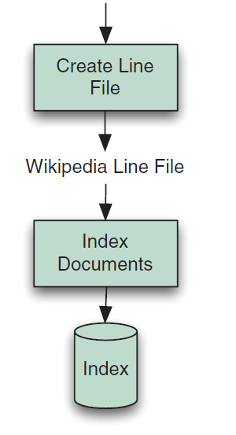

## 10.1 性能调优 Performance tuning ##

许多应用程序利用 Lucene 开箱即用功能达到令人惊叹的性能。但可能发现，随着索引库变得更大，或者向应用程序添加新的特性，或者甚至在我们的 web 站点流行起来，并且要处理越来越高的流量时，性能可能最终变成一个问题。所幸的是，我们能够从几个个方面做出努力来提升 Lucene 的性能。

&emsp;&emsp;但是首先，要确保应用程序真的需要从 Lucene 获得更快的性能。性能调优可能是一个耗时的，并且，坦率地说，更是个令人着迷的事儿。它也可能给应用程序增加复杂性，引入 bug 并给应用带来更高的维护成本。诚实地问问自己，是把时间花费在提升用户界面体验上，还是用来调整性能。总是可以通过简单地部署更多更快的硬件来提升性能，因此，应该总是考虑把这作为第一个选项。永远不要牺牲用户体验来换取性能提升：通过尽可能提供最好的人类经验来保持用户使用愉快，应该永远作为我们的首要任务。性能调优是有成本的，因此在开始之前，要确定确实需要提升更优的性能。

&emsp;&emsp;我们从一些基本的步骤开始，不管优化哪方面性能都需要从这些这些基本的步骤开始。然后，假如还需要进一步调整，我们简要地涉及测试方法论方面的最佳实践。没有一个固定且严格的测试方法，就无法衡量性能调优的进展。最后，将接触搜索程序中每一种重要的性能指标：索引到搜索延迟（index-to-search delay）、索引吞吐量（indexing throughput）、搜索时延（search latency），以及搜索吞吐量（search throughput），将列举每种指标的调节选项。

&emsp;&emsp;具体哪种指标更重要取决于应用并且随着时间而变化。通常，在首次构建索引时，索引吞吐量（indexing throughput）是关键指标，但之后，一旦初始索引库构建完成，索引到搜索延迟（index-to-search delay）以及搜索时延（search latency）就变得更加重要了。确保知道那个指标对我们来说更重要，因为调整一个指标经常会影响另一个指标的开销，到处充满权衡取舍。

<br/><br/>
<a id="1"></a>

## 10.1.1 简单的性能调优步骤 Simple performance-tuning steps ##

不管需要调整那个具体的指标，在进入具体的性能指标之前，需要执行几个简单的步骤：

**■** 使用 solid-state disk (SSD)，而不要使用磁盘作为底层存储设备。虽然固态硬盘每 GB 贵很多，但能获得极好的性能，对大多数应用来说这是个不需要多考虑的取舍方案，并且随着时间的推移 SSD 存储设备价格很快会降下来。

**■** 把 Lucene 更新为最新版本。Lucene 总是会变得越来越好：性能的提升，bug 修复，以及增加新的特性。Lucene 开发社区明确承诺 API 的向后兼容性：跨次级版本严格保持兼容，但不保证跨主版本兼容。一个新次级版本的发布是随时进行的，因此可以放心使用它们。

**■** 更新到最新的 Java 版本，然后尝试调整 JVM 的性能设置。

**■** 使用 -server 开关运行 JVM，这通常是配置 JVM 为更快的网络吞吐量，但可能有较高的启动成本。

**■** 用本地文件系统存储索引。本地文件系统通常比远程文件系统快得多。如果担心本地硬盘驱动可能会损坏，使用带冗余的 RAID 阵列。任何情况下，都要确保备份索引：某一天，某些事情会不可避免地出现极其可怕的错误（墨菲定律）。

**■** 运行 Java profiler 分析工具，或者利用 System.nanoTime 收集自己大致的计时操作，来验证性能问题实际上来自 Lucene 而非应用程序栈的其它地方。很多应用程序，从数据库或者文件系统载入文档，将原始文档数据过滤为纯文本，并切分这些文本，这是个耗时的过程。在搜索期间，渲染来自 Lucene 的结果也可能很耗时。

**■** 不要过多频繁地重新打开 IndexWriter 或 IndexReader/IndexSearcher。长期共享单个实例，并且只有在必要的时候才重新打开。

**■** 使用多线程。现代计算机具有令人惊奇的并发 CPU，I/O，RAM，并且这种并发能力与日俱增。

**■** 使用更快的硬件。更快的 CPU 和 更快的 I/O 系统，对于庞大的索引总会有益。

**■** 给计算机配置尽可能大的物理内存，并且配置 Lucene 能够全部利用这些内存。但要确保 Lucene 不占用过多的内存，以至于计算机强制不断地进行内存交换（swap），或者 JVM 强制不断地运行垃圾回收。

**■** 预留出足够多的内存、CPU、和文件描述符用于高峰期使用。这通常是在高峰流量期间打开一个新的 searcher，也或许是在索引一大批文档的时候使用。

**■** 关闭我们的应用程序不再使用的任何功能或特性。一定要做到底！

**■** 将多个文本域组合为一个单独的文本域。之后，就能只对这个单独域执行搜索。

这些最佳实践会耗费我们很长过程才能趋近更好的性能。在遵循这些步骤后，可能获得了良好的性能提升，如果是，那么恭喜，如果还没有达到理想的性能，也不用担心：还有很多选项可以尝试。我们首先需要一个一致的方法来测试性能。


<br/><br/>
<a id="2"></a>

## 10.1.2 测试方法 Testing approach ##

需要建立一个简单可重复的测试，来衡量要提升的具体指标。没有这个测试，就无法知道是否提升了这方面的性能。测试需要精确反映出我们的应用。尝试使用从原始内容提取的实际的文档，并且，如果可行，从搜索日志中拿到实际的搜索。下一步，建立性能指标基线。如果每次运行测试看到很大的不同，可能要运行测试三次或更多，并记录下最好的结果，这通常具有较少的杂音。

&emsp;&emsp;最后，利用开明的（open-minded）迭代方法：性能调优是经验性的，并且经常令人意外。让计算机告诉我们什么工作了而什么没有工作。每次只改变一个地方，测试它，并且只有指标提升了，才把它保留下来。在没有论证其实际价值之前，不要陷入某些全面调整的陷阱。某些调整会意外地降低性能，因此不要保留这些调整。做一个尝试计划列表，并根据它们投资回报的最优评估进行排序：对这些改变计划进行快速的测试，并且最大的改变计划应该先被测试。一旦对性能指标进行了足够的提升，既可停止，并把工作转移到其它重要的事情上去。之后可以经常返回到这个计划列表进行迭代调优。

&emsp;&emsp;如果其它一切都失败了，将遇到的挑战带到 Lucene java 用户列表(java-user@lucene.apache.org)。很可能有人已经遇到过但已经解决了与我们类似的问题，而且我们的问题也可能导致如何改进 Lucene 进行大量的讨论。

&emsp;&emsp;对于本章的测试，将使用 Lucene 的 benchmark 模块提供的框架。这是创建和运行可重复性能测试的优秀工具。它已经支持对每一个测试案例进行多次运行，改变 Lucene 配置参数，衡量性能指标，以及打印完全测试运行的简要报告。有大量的内置任务和文档资源可供选择。利用自己的任务来扩展这个框架简单直接。具体实现时，利用简单的自定义脚本语言，简单地编写一个算法文件（扩展名为 .alg），来描述测试任务。然后按如下方式运行它：

```shell
cd benchmark
run-task -Dtask -alg=<file.alg> -Dtask.mem=XXXM
```

上面的代码打印出测试的每一个步骤非常详细的指标。算法文件也让其他人重新产生相同的测试结果变得简单：只是把算法文件发送给他们并运行就可以了。


<br/><br/>
####<font color=green>风马牛不相及 Apples and Oranges</font> ####

在运行索引测试时，有几件事情需要引起注意。第一，因为 Lucene 定期合并索引段，在通过不同的设置来运行两个索引测试时，非常有可能每个结果索引以不同的合并状态结束。可能第一个索引只有 3 个索引段，因为它只是完成了一个大的合并，但另外一个索引有 17 个索引段。对这两个测试比较性能指标是不合理的，因为第一种情况 Lucene 做了跟多的工作来将索引变得更加紧凑，因此这样的比较不具有参考意义。

为了解决这个问题，可以将合并策略设置为 NoMergeScheduler，彻底关闭合并操作。这样至少能让测试具有可比性，但是要注意，结果数值不是绝对精确的，因为在实际的应用程序中，不可能关闭合并操作。这个方法只有在一开始就不能试图比较合并操作的成本时才有意义。

第二个问题是要确保测试包括它在 IndexWriter 上调用 close() 方法的时间。在 close() 期间，IndexWriter 刷新文档，可能启动新的段合并，并等待任何后台运行的合并操作结束。尝试编写算法文件，使 CloseIndex 任务被包含在报告中。


<br/><br/>
<a id="3"></a>

## 10.1.3 索引到搜索延迟的调优（Tuning for index-to-search delay） ##

index-to-search 延迟是从对索引库进行添加、删除、更新文档，到反映到用户的搜索中，能看到这些变化所用的时间。对于很多应用程序来说，这个是个重要的指标。但是因为一个 reader 总是把索引库表现为打开那一刻的时间点（point of time），因此唯一降低 index-to-search 延迟的方法是频繁地重新打开这个 reader。

&emsp;&emsp;所幸的是，新的近实时搜索特性是个将转换时间保持最小的有效方法，参考第 2.8 节和 3.2.5 节所阐述，在实践中，只有几十毫秒的延迟。利用 IndexWriter 对索引库做出改变之后，可以通过 DirectoryReader 的如下静态方法重新打开 reader:

- **open(IndexWriter writer, boolean applyAllDeletes, boolean writeAllDeletes)** 
- **open(IndexWriter writer)**

但过于频繁地重新打开会降低索引操作的吞吐量，因为每次 IndexWriter 都必须要将缓存刷新到硬盘存储器。下面是一些降低转换时间的提示：

**■** 在创建 IndexWriter 时，应调用 IndexWriterConfig 的 **setMergedSegmentWarmer(IndexWriter.IndexReaderWarmer mergeSegmentWarmer)** 方法，设置段合并操作的加热器。**IndexWriter.IndexReaderWarmer** 是一个函数式接口，其中包含唯一的 **warm(LeafReader reader)** 方法。如果通过 DirectoryReader.open(IndexWriter) 方法调用得到一个近实时的 reader，这个 writer 运行在近实时模式，那么在一个合并操作完成之后，这个接口上的 **warm(LeafReader reader)** 方法会被调用，在这个新合并的索引段提交之前，在新段上对近实时的 reader 进行加热。在加热发生时（如果使用默认的 ConcurrentMergeScheduler 合并调度器，是由后台线程执行的），新的近实时reader 能够继续打开，使用合并之前的索引段。这对近实时搜索不是必须的，但会在一个合并完成之后，对打开一个新近实时 reader 降低搜索延迟。这对大型段的合并操作特别重要，会对近实时 reader 上的新搜索降低后续的延迟。

**■** 也可能通过 **IndexWriterConfig.setMaxBufferedDocs(int maxBufferedDocs)** 方法设置下一些的值。通过这种方法，即便在没有重新打开近实时的 reader，小的索引段仍然可以被刷新到硬盘存储器。虽然这可能会降低网络索引率，但在实践中，它也可以保持重新打开时间最小化。

**■** 如果知道只向索引库增加索引，要确保使用 **addDocument()** 方法，而不要使用 **updateDocument()** 方法。在使用 updateDocument() 方法时，即便是具体的 term 不删除任何文档，在创建新的近实时的 reader 时，IndexWriter 也必须搜索每一个被删除的 term。

从好的方面来说，很多应用程序在创建初始索引，或者批量更新索引时，只需要很高的索引吞吐量。在此期间，index-to-search 延迟不是什么问题，因为还没有发生搜索操作。然而一旦索引构建完成，应用程序开始正常使用，文档处理量就会减少，这时，index-to-search 延迟就变得重要了。下一节，看看如何为高索引吞吐量，对 Lucene 进行调优。


<br/><br/>
<a id="4"></a>

## 10.1.4 为高索引吞吐量调优（Tuning for indexing throughput） ##

索引吞吐量（indexing throughput）衡量每秒有多少文档能加入到索引库，用于确定需要耗费多少时间来构建或者更新索引库。在 benchmark 框架中，有几个内置的内容源可以选择，包括路透社文集 Reuters corpus (ReutersContentSource)、维基百科文章 Wikipedia articles (EnwikiContentSource），以及一个简单的文档源，从一个目录（DirContentSource）递归查找所有 *.txt 文件。我们利用维基百科作为所有测试的文档源。很明显，这是一个非常庞大且内容各异的文档集合，因此它能表现一个真实世界的测试。对于我们的测试，通过子类化 ContentSource 创建一个文档源，然后使用它来进行所有的测试。

&emsp;&emsp;为了最小化文档构建成本，首先将 XML 内容预处理为一个庞大的文本文件，其中每行包含一篇文章。遵循图 10.1 所示的步骤（图片来源于 Lucene in Action Second Edition）：

<div align=center></div>
<div align=center style="font-weight:bold;color:black;font-size:17px;">图 10.1 对维基百科文章测试索引吞吐量步骤</div>

<br/>

有一个内置的 WriteLineDoc 任务正好可用于此目的。从 https://dumps.wikimedia.org/enwiki/latest/enwiki-latest-pages-articles.xml.bz2 下载最新的维基 dumps，保持其压缩 bzip2(.bz2) 文件格式。benchmark 框架能够对它进行智能解压。

下一步，把下面的算法保存到 createLineFile.alg 文件中：

```perl
content.source = org.apache.lucene.benchmark.byTask.feeds.EnwikiContentSource
docs.file = /x/lucene/enwiki-20090724-pages-articles.xml.bz2
line.file.out = wikipedia.lines.txt
content.source.forever = false
{WriteLineDoc() >: *

```

这个算法使用内置的 EnwikiContentSource 内容源，它知道如何从 Wikipedia 解析 XML 格式内容，一次产生一个文档。然后，它一遍一遍地运行 WriteLineDoc 任务，直到没有更多的文档，一行一行地把文档保存到 wikipedia.lines.txt 文件。

通过在 shell 中运行如下命令：

```shell
ant run-task -Dtask.alg=create-LineFile.alg
```

来执行这个任务。运行过程会持续一段时间，它会完成所有艰难的工作，我们可以袖手旁观并享受硬盘驱动寻道的声音，当然，如果仍没有使用固态硬盘的话。在运行时，它会打印出已处理完多少个文档，并在最后产生一个庞大的文件：wikipedia.lines.txt，其中每一行为一个文档。

现在已经完成了一次性的设置工作，让我们通过高效的 LineDocSource 作为内容源，来运行真正的测试。在下面的测试中，最好是将 wikipedia.lines.txt 文件保存在一个与 benchmark/work/index 目录不同的驱动器上，该目录用于创建索引，这样读取文章的 I/O 就不会影响写入索引的 I/O。运行的算法如代码清单 10.1.4 所示：

<table width="100%"><tr><td bgcolor=green><font color=black>Listing 10.1.4 使用维基百科文档测试索引吞吐量</td></tr></table>

```perl
analyzer=org.apache.lucene.analysis.standard.StandardAnalyzer
content.source=org.apache.lucene.benchmark.byTask.feeds.LineDocSource

directory=FSDirectory

doc.stored = true
doc.term.vectors = true

docs.file=/x/lucene/enwiki-20090306-lines.txt

{ "Rounds"
    ResetSystemErase

    { "BuildIndex"
        -CreateIndex
        { "AddDocs" AddDoc > : 200000
            -CloseIndex
    }
    NewRound

} : 3

RepSumByPrefRound BuildIndex
```

这个算法使用维基百科的前 200000 个文章构建索引，使用 StandardAnalyzer 分析器。在每一次运行结束时打印一行的概要信息。如果为 Wikipedia 构建实际的索引，应该使用基于 analyzers-common 模块中的 Wikipedia 分词器 **WikipediaTokenizer** 的分析器。这个分词器能理解 Wikipedia 文档格式的自定义元素，例如 `[[Category:…]]`。因为这里我们只是衡量索引吞吐量，StandardAnalyzer 分析器非常适合我们的目的。

最终的测试报告类似如下输出：

```shelll

```

去掉最慢和最块的运行结果，我们的基线索引吞吐量是 557.3 文档/秒（documents/second），效果还不错。

下面提供一些进一步提升应用程序索引吞吐量的具体方案：

**■** 使用多线程。这可能是我们能做的对改变影响最大的单独方案，特别是如果计算机硬件很大的并发能力的时候。参阅 9.2.1 节，使用内置的多线程 IndexWriter 替代方案。


**■** 设置 IndexWriter 通过内存使用量来触发刷新缓存，而不使用文档数量来触发刷新。这是 IndexWriterConfig 的默认配置，并且内存使用量默认设置为 16.0MB。但是，应用程序可以通过调用 **IndexWriterConfig.setMaxBufferedDocs(int maxBufferedDocs)** 方法改变默认设置。测试不同的 RAM 缓存大小对索引吞吐量指标的影响。一般来说，越大越好。要确保不要设置得过高，造成 JVM 强制执行太频繁的 GC 操作，或者造成计算机强行启动内存交换。在算法文件中使用如下选项来改变 IndexWriter 的 RAM 缓存：

```perl
ram.flush.mb
```


**■** 通过为 **IndexWriterConfig.setUseCompoundFile(boolean useCompoundFile)** 方法，提供 false 参数，来关闭复合文件格式。创建复合文件会在索引期间占用一定的时间消耗。关闭复合文件之后，搜索操作时也会获得小幅度性能提升。但是要注意，这使 reader 的打开需要更多的文件描述符，因此必须要降低合并因子以避免触发文件描述符限制异常。通过如下选项关闭复合文件格式：

```perl
compound=false
```


**■** 重用 Document 和 Field 实例。Field 实例允许改变它的值，如果文档是高度规则的（大多数情况下如此），创建单个 Document 实例并保持其 Field 实例。只创建域的值，然后使用同一个 Document 实例调用 addDocument() 方法。DocMaker 就是这样实现的，但可以在算法文件中通过如下选项将其关闭：

```perl
doc.reuse.fields=false
```

**■** 如果 IndexWriterConfig 使用的 LogMergePolicy 合并策略，测试不同的 mergeFactor 值对索引吞吐量的影响。较高的值意味着索引时耗费较少的合并代价，但会使搜索操作变慢，因为这样索引库会有更多的索引段。要小心，如果把这个值设置得太高，并且如果关闭了复合文件格式，可能会导致触发操作系统上文件描述符限制异常。索引期间，段合并操作是在后台线程运行的，因此这是自动利用并发优势的方法。使用较高的 mergeFactor 值，可能会看到更快的性能。但如果在结束时对索引进行优化，一个较低的 mergeFactor 值会更快，因为索引时，合并会操作会并发趋向完成。在应用程序中使用高值和低值分别进行测试，并且让计算机告诉我们哪个更好。


**■** 在算法文件中通过 ReadTokens 任务，测试创建文档和对其分词的速度。这个任务逐一遍历文档中的每一个域，并使用一个具体的分析器对它进行分词，文本并不进行索引。值是单独衡量文档创建和分词成本的优秀方法。利用 StandardAnalyzer 运行下面这个算法，来对 Wikipedia 的前 200000 个文档进行分词：

```
analyzer=org.apache.lucene.analysis.standard.StandardAnalyzer
content.source=org.apache.lucene.benchmark.byTask.feeds.LineDocSource
docs.file=/x/lucene/enwiki-20090306-lines.txt

{ "Rounds"
    ResetSystemErase
    { ReadTokens > : 200000
    NewRound
} : 3

RepSumByPrefRound ReadTokens
```

将产生类如下的输出：

```shell

```

**■** 去掉最快和最慢的运行，可以看到，简单地检索和分词这些文档耗用了 129.03 秒，大约是我们索引基线整个索引时间的 27%。这个数值非常低，因为使用了 LineDocSource 作为内容源。在实际的应用中，创建、过滤、对文档分词会耗用更高的代价。使用自己的 ContentSource 试试。


联合使用前面介绍的这些建议。对相同的 Wikipedia 的前 200000 个文档进行索引，但改变设置以提升索引吞吐量。关闭复合文件，提升 mergeFactor 为 30，将 ram.flush.mb 设置为 128，并用 5 个线程执行索引。结果算法文件如程序清单 10.1.4-2 所示：

<table width="100%"><tr><td bgcolor=green><font color=black>Listing 10.1.4-2 多线程索引、复合文件、大内存、以及更大的 mergeFactor</td></tr></table>

```perl
analyzer=org.apache.lucene.analysis.standard.StandardAnalyzer
content.source=org.apache.lucene.benchmark.byTask.feeds.LineDocSource
directory=FSDirectory

docs.file=/x/lucene/enwiki-20090306-lines.txt

doc.stored = true
doc.term.vector = true
ram.flush.mb = 128
compound = false
merge.factor = 30
log.step=1000

{ "Rounds"
    ResetSystemErase
    { "BuildIndex"
        -CreateIndex
        [ { "AddDocs" AddDoc > : 40000] : 5
        -CloseIndex
    }
    NewRound
} : 3

RepSumByPrefRound BuildIndex

```

运行代码清单 10.1.4-2 的算法，会产生类似如下的输出：

```shell

```

从结果看得出，性能更好了：899.7 个文档/秒！在自己的测试中，应该对每一个改变进行测试，一次一个，并保留那些有助于性能提升的改变。

如我们所见，Lucene 的开箱即用索引吞吐量表现本身就非常好。但利用一些简单的调优方案，可以使它变得更好。


<br/><br/>
<a id="5"></a>

## 10.1.5 为搜索延迟和吞吐量调优（Tuning for search latency and throughput） ##


