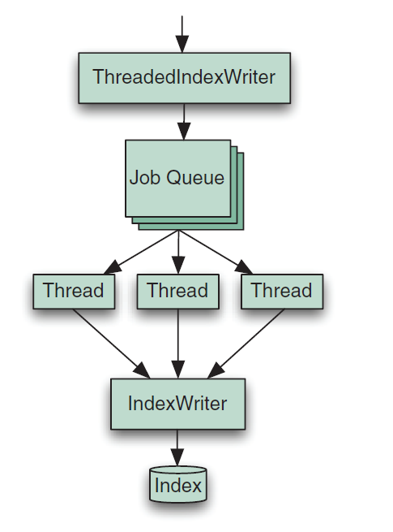

## 10.2 多线程和并发处理 Threads and concurrency ##

现代计算机具有高并发的硬件。摩尔定律（Moore’s law）继续适用，但不是更快的时钟速度，而是更多的 CPU 内核数量。不仅仅是 CPU，硬盘驱动器现在提供本地命令队列能力（native command queuing），可以同时接受很多 I/O 请求，并对它们重新排序以高效地利用硬盘磁头。即便是固态硬盘也支持该功能，并且更深入地利用多通道并发访问底层硬件闪存（raw flash storage）。同样，内存 RAM 接口也使用多通道处理方式。既然如此，那么横跨这些硬件资源的访问也同样具有并发性：当一个线程正阻塞等待一个 I/O 请求完成时，另一个线程可以利用 CPU 执行计算任务，从而获得并发能力。

&emsp;&emsp;因此，利用多线程进行索引和搜索操作是至关重要的，否则，就无法完全利用当代计算机的硬件资源。正如购买了一艘快艇却让它的航行速度不超过 20 英里那样。很可能，使用多线程方式是唯一最能提高程序性能的方案。我们必须根据经验进行测试以找到对应用最合适的线程数量，并在搜索或索引的延迟和吞吐量之间做出平衡。总的来说，首先，在增加更多的线程时，延迟会大致不变，但吞吐量会提升。当线程数到达某个平衡点时，再增加线程数也不会提升吞吐量了，而且还会由于线程环境切换开销对某些方面造成损害，而延迟也会增加。

&emsp;&emsp;然而不幸的是，使用多线程也有不利的一面（dark side），如果之前探索过多线程编程，会毫无疑问地发现：它们会给应用程序增加大量的复杂性。必须万分小心地对方法同步进行正确的处理，但是又不能过渡使用，改变性能测试以使用多线程，管理线程池，以及在合适的时间点上产生线程以及将线程加入主线程的等待队列（Thread.join() 方法）。要花费大量的时间研究 java.util.concurrent 包的 JavaDoc。在使用多线程时，完全可能会出现新的一些间歇性 bug，例如，如果不同的线程不是按照一定的顺序获取锁就会造成死锁，或者触发 ConcurrentModificationException 异常，而且，如果没有进行同步处理引发的其它问题。由于每次运行测试时，线程是由 JVM 在不同的时间点上调度的，这使得测试也变得非常困难。综上所述，有这么多艰难的问题，多线程机制是否还值得引入呢？

&emsp;&emsp;使得，当然值得！Lucene 已通过精心设计以使它在多线程环境下工作良好。Lucene 是线程安全的：它完美地在多线程间共享 IndexSearcher、IndexReader、IndexWriter 等对象。Lucene 还是线程友好的：它将同步代码模块压缩到最小，以便多线程能够充分利用计算机并发机制。事实上，Lucene 2.3 版本就已能很好地利用多线程机制了：ConcurrentMergeScheduler 合并调度器，就是利用多个后台线程进行索引段的合并操作，因此在 IndexWriter 上进行添加和删除文档操作，不会被合并操作阻塞。在自己的算法文件中，可以通过设置 merge.scheduler 属性来选择合并调度器。例如，SerialMergeScheduler，这是 Lucene 2.3 版之前旧的段合并调度机制。在算法文件中设置：

```pl
merge.scheduler = org.apache.lucene.index.SerialMergeScheduler
```

本节，将展示在索引和搜索期间，如何利用多线程技术，并提供两个类来简化获取并发能力。


<br/><br/>
<a id="1"></a>

## 10.2.1 使用多线程进行索引 Using threads for indexing ##

图 10.2 展示了 ThreadedIndexWriter 简单的实用类实现，该类继承自 IndexWriter 并利用 java.util.concurrent 包来管理多线程，进行添加和更新索引文档操作。

图片来源于 Lucene in Action Second Edition：

<div align=center></div>
<div align=center style="font-weight:bold;color:black;font-size:17px;">图 10.2 ThreadedIndexWriter manages multiple threads for you</div>

<br/>

ThreadedIndexWriter 简化了多线程的索引操作，因为它对我们隐藏了全部的多线程管理细节。该类也可以应用于任何使用 IndexWriter 类的场合。

ThreadedIndexWriter 类完整代码如代码清单 10.2.1 所示。

<table width="100%"><tr><td bgcolor=green><font color=black>Listing 10.2.1 用于多线程索引的  ThreadedIndexWriter 类</td></tr></table>

```java

public class ThreadedIndexWriter extends IndexWriter {

  private ExecutorService threadPool;

  private class Job implements Runnable {                       //①
    Document doc;
    Term delTerm;
    public Job(Document doc, Term delTerm) {
      this.doc = doc;
      this.delTerm = delTerm;
    }
    public void run() {                                         //②
      try {
        if (delTerm != null) {
          ThreadedIndexWriter.super.updateDocument(delTerm, doc);
        } else {
          ThreadedIndexWriter.super.addDocument(doc);
        }
      } catch (IOException ioe) {
        throw new RuntimeException(ioe);
      }
    }
  }

  public ThreadedIndexWriter(Directory dir, IndexWriterConfig config,
                             int numThreads, int maxQueueSize)
       throws CorruptIndexException, IOException {
    super(dir, config);

    threadPool = new ThreadPoolExecutor(                        //③
          numThreads, numThreads,
          0, TimeUnit.SECONDS,
          new ArrayBlockingQueue<Runnable>(maxQueueSize, false),
          new ThreadPoolExecutor.CallerRunsPolicy());
  }

  public void addDocument(Document doc) {                       //④
    threadPool.execute(new Job(doc, null));              //④
  }

  public void updateDocument(Term term, Document doc) {         //④
    threadPool.execute(new Job(doc, term));                     //④
  }

  public void close()
      throws CorruptIndexException, IOException {
    finish();
    super.close();
  }


  public void rollback()
      throws CorruptIndexException, IOException {
    finish();
    super.rollback();
  }

  private void finish() {                                       // ⑤
    threadPool.shutdown();
    while(true) {
      try {
        if (threadPool.awaitTermination(Long.MAX_VALUE, TimeUnit.SECONDS)) {
          break;
        }
      } catch (InterruptedException ie) {
        Thread.currentThread().interrupt();
        throw new RuntimeException(ie);
      }
    }
  }
}

```

① 持有一个被加入索引的文档
② 执行真正的添加和更新文档操作
③ 创建线程池
④ 让线程池执行工作
⑤ 结束线程池

在对 ThreadedIndexWriter 类进行实例化时，指定要使用多少个线程，以及线程池最大工作队列的大小，这是内部线程池所需的两个重要参数。测试使用不同的值以找到应用程序最合适的平衡点，一个很好的经验法则是，将 numThreads 的值设为当前计算机的 CPU 核心数量加 1，作为索引操作上消耗的线程数量，并用 4*numThreads 的值作为 maxQueueSize 的值。在使用更多的线程进行索引时，会发现更大的 RAM 缓存会有助于性能提升，因此，确保测试不同的线程数量和 RAM 缓存组合，以达到最好的性能。利用进程管理器观察，例如 Unix/Linux 上的 top 或 ps 工具，Windows 上的任务管理器，或者 Mac OS X 上的 Activity Monitor，验证 CPU 利用率接近 100% 值。

&emsp;&emsp;ThreadedIndexWriter 重写了 addDocument() 和 updateDocument() 方法：当其中一个调用时，一个 Job 实例被创建，并把它加入到线程池的工作队列中。如果线程池的工作队列没有满，控制权会立即返回给调用者。否则，调用者线程会被用于立即执行这个 Job 对象。在后台，一个工作线程被唤醒，从工作队列的头部获取作业对象 job，然后执行真正的工作。在使用 ThreadedIndexWriter 时，不能重用 Document 或 Field 实例，因为不可能精确控制一个 Document 什么时候完成索引操作。该类重写了 close() 和 rollback() 方法，首先关闭线程池，以确保工作队列中全部的添加和更新操作都已完成，然后再执行父类的 close() 或 rollback() 操作。 

下面在 benchmark 框架内使用 ThreadedIndexWriter 类来对它进行测试，如代码清单 10.2.1-1 所示。注意，要把类创建在 org.apache.lucene.benchmark.byTask.tasks 包下：

<table width="100%"><tr><td bgcolor=green><font color=black>Listing 10.2.1-1 利用 ThreadedIndexWriter 类向 benchmark 模块添加自定义任务</td></tr></table>

```java

package org.apache.lucene.benchmark.byTask.tasks;

public class CreateThreadedIndexTask extends CreateIndexTask {

  public CreateThreadedIndexTask(PerfRunData runData) {
    super(runData);
  }

  public int doLogic() throws IOException {
    PerfRunData runData = getRunData();
    Config config = runData.getConfig();
    
    IndexWriterConfig iwconfig = createWriterConfig(config, runData,
            IndexWriterConfig.OpenMode.CREATE,
            null);
    IndexWriter writer = new ThreadedIndexWriter(
                                runData.getDirectory(), iwconfig,
                                config.get("writer.num.threads", 4),
                                config.get("writer.max.thread.queue.size", 20));

    runData.setIndexWriter(writer);

    return 1;
  }
}

```

以代码清单 10.1.4 为基础创建一个算法文件，做如下修改：

- 使用 CreateThreadedIndex 替换 CreateIndex 。
- 增加 doc.reuse.fields = false 属性配置，告诉 DocMaker 不要重用 Document 和 Field 实例。
- 可选的设置 writer.num.threads 和 writer.max.thread.queue.size 两个属性值，以测试不同的值对基线测试结果的影响，默认值分别是 4 和 20。
  
代码清单如 10.2.1-2 所示：

<table width="100%"><tr><td bgcolor=green><font color=black>Listing 10.2.1-2 利用 CreateThreadedIndexTask 任务类测试索引吞吐量：enwiki-throughput-with-CreateThreadedIndexTask.alg</td></tr></table>

```perl
analyzer=org.apache.lucene.analysis.standard.StandardAnalyzer
content.source=org.apache.lucene.benchmark.byTask.feeds.LineDocSource

directory=FSDirectory

doc.stored = true
doc.term.vectors = true
merge.factor = 2000
content.source.forever = false
docs.file=K:\\wikimedia.org\\enwiki-latest-pages-articles.lines.txt

doc.reuse.fields = false
writer.num.threads = 4
writer.max.thread.queue.size = 20

{ "Rounds"
    ResetSystemErase

    { "BuildIndex"
        -CreateThreadedIndex
        { "AddDocs" AddDoc > : 200000
            -CloseIndex
    }
    NewRound

} : 3

RepSumByPrefRound BuildIndex

```

编译我们的 CreateThreadedIndexTask.java 类，然后按如下命令运行算法文件，以使其找到我们的自定义 CreateThreadedIndexTask 任务类：

```shell
ant run-task -Dtask.alg=enwiki-throughput-with-CreateThreadedIndexTask.alg -Dtask.mem=2048M -Dbenchmark.ext.classpath=/path/to/my/classes
```

应该会看到，它结束时比原始的基线测试更快一些。如果应用已经使用了多线程索引，就没有必要使用这个类了。对于还没有使用多线程索引的应用，为充分利用多线程带来的益处，这个类非常适用于作为一个随时可用的方案。现在，就可以将这个类用在任何使用 IndexWriter 的地方，充分利用它的并发能力。


<br/><br/>
<a id="2"></a>

## 10.2.2 使用多线程进行搜索 Using threads for searching ##

所幸的是，现代 web 服务器或者应用服务器为我们解决了大多数线程处理问题：它们维护一个先进先出的（first in, first out）请求队列，以及一个线程池以队列中的请求提供服务。这意味着大多数艰难的工作已经做好了。我们所需要做的就是创建基于用户请求的查询对象，然后调用 IndexSearcher，并对搜索结果进行渲染。非常简单！如果没有在一个 web 应用中运行 Lucene，那么 java.util.concurrent 包中的线程池支持也会为我们提供帮助。

&emsp;&emsp;诚然，可以通过调节线程池的大小来完全利用计算机的并发能力。但也要为搜索操作调整请求队列的最大准许尺度：在我们的 web 站点突然变得流行时，每秒钟会到来非常巨大的收起请求，这时可能想要新到来的请求快速收到 HTTP 500 Server Too Busy 错误，而不是让它在请求队列里无休止地等待。这样也会保证一旦流量再次恢复正常时，web 应用能优雅地恢复到之前的状态。运行一个安全压力测试（redline stress test）来验证这种能力。

&emsp;&emsp;还有一个应用程序服务器没有为我们解决的棘手的问题是：当索引发生变化时，需重新打开我们的 searcher 对象。因为 IndexReader 只能看到它被打开那一时间点上的索引数据，一旦索引发生了变化，必须重新打开 IndexReader 才能搜索到它。不幸的是，这是个有代价的操作，会消耗 CPU 和 I/O 资源。然而，对有些应用程序来说，为了最小化 index-to-search 延迟，这个代价是值得的，这就意味着我们的 searcher 必须频繁地重新打开。

&emsp;&emsp;多线程使得重新打开我们的 searcher 面临挑战，因为直到全部对旧 searcher 的搜索执行完毕，我们不能关闭它，包括对 IndexSearcher.search() 方法返回的命中结果进行遍历。除此之外，可能还要为所有搜索会话（最初的搜索，加上所有后续的操作，例如点击全部页面），对旧 searcher 保持足够长的时间将其结束或者到期结束。例如，考虑某个用户正在搜索结果上一页一页地通过点击翻阅搜索结果，而每一页在服务器上都是一个新的搜索。如果在页面之间突然切换到一个新的 searcher 上，那么分配给每个页面上的文档就会发生偏离，导致用户看到页面间的结果发生重复或者丢失某些结果。这种非期望的结果会消减用户对程序的信任——对任何搜索程序来说，这跟死亡之吻差不多。为防止这种情况的发生，如果可能，要使用新的 searcher 为之前对原始 searcher 返回的搜索结果发送新的结果。

代码清单 10.2.2 展示了一个有用的实用类 SearcherManager，它隐藏了在多线程情况下重新打开 searcher 难办的技术细节。它可以或者从一个 Directory 实例打开，这种情况下没有直接可以访问的使索引发生变化的 IndexWriter，或者从一个 IndexWriter 获得一个近实时的 reader。 

<table width="100%"><tr><td bgcolor=green><font color=black>Listing 10.2.2 在多线程环境下，安全地重新打开 IndexSearcher</td></tr></table>

```java

public class SearcherManager {

  private IndexSearcher currentSearcher;                            // ①
  private IndexWriter writer;

  public SearcherManager(Directory dir) throws IOException {
    currentSearcher = new IndexSearcher(DirectoryReader.open(dir));  //②
    warm(currentSearcher);
  }

  public SearcherManager(IndexWriter writer) throws IOException {
    this.writer = writer;
    currentSearcher = new IndexSearcher(DirectoryReader.open(writer));//③
    warm(currentSearcher);

    writer.getConfig().setMergedSegmentWarmer(                        // ③
        new IndexWriter.IndexReaderWarmer() {
          public void warm(LeafReader reader) throws IOException {
            SearcherManager.this.warm(new IndexSearcher(reader));
          }
        });
  }

  public void warm(IndexSearcher searcher)    // ④
    throws IOException                        // ④
  {}                                          // ④

  private boolean reopening;

  private synchronized void startReopen()
    throws InterruptedException {
    while (reopening) {
      wait();
    }
    reopening = true;
  }

  private synchronized void doneReopen() {
    reopening = false;
    notifyAll();
  }

  public void maybeReopen()                      //⑤
    throws InterruptedException,                 //⑤
           IOException {                         //⑤

    startReopen();

    try {
      final IndexSearcher searcher = get();
      try {
        IndexReader newReader = DirectoryReader.openIfChanged(
                (DirectoryReader) currentSearcher.getIndexReader());

        if (newReader != null && newReader != currentSearcher.getIndexReader()) {
          IndexSearcher newSearcher = new IndexSearcher(newReader);
          if (writer == null) {
            warm(newSearcher);
          }
          swapSearcher(newSearcher);
        }
      } finally {
        release(searcher);
      }
    } finally {
      doneReopen();
    }
  }

  public synchronized IndexSearcher get() {                      //⑥
    currentSearcher.getIndexReader().incRef();
    return currentSearcher;
  }    

  public synchronized void release(IndexSearcher searcher)       //⑦
    throws IOException {
    searcher.getIndexReader().decRef();
  }

  private synchronized void swapSearcher(IndexSearcher newSearcher)
    throws IOException {
    release(currentSearcher);
    currentSearcher = newSearcher;
  }

  public void close() throws IOException {
    swapSearcher(null);
  }
}

```

① 当前 IndexSearcher
② 从 Directory 创建 searcher 实例
③ 从近实时的 reader 创建 searcher 实例
④ 在子类中实现
⑤ 重新打开 searcher
⑥ 获取当前的 searcher
⑦ 释放 searcher

SearcherManager 类使用 DirectoryReader.openIfChanged(DirectoryReader oldReader) API 高效地打开一个新的 DirectoryReader 对象，因为它在内部会尽可能与所提供的 oldReader 对象共享资源，比如，下级的 Segmentreader。在应用中一旦实例化了该类，例如命名为 searcherManager 变量，然后在需要执行搜索时使用它来访问 IndexSearcher 对象。

&emsp;&emsp;如果可以直接访问对索引做出改变的 IndexWriter 对象，最好是使用接受 IndexWriter 参数的构造器创建 SearcherManager 实例。通过这种方式创建的实例会获得更快的重新打开性能：SearcherManager 通过 DirectoryReader.open(IndexWriter writer) 方法，使用 IndexWriter 获取近实时的 DirectoryReader 实例，而且在重新打开之前，不需要调用 IndexWriter.commit() 方法。SearcherManager 类也调用 writer 上的 LiveIndexWriterConfig 对象的 setMergedSegmentWarmer() 方法，保证新合并的段传递给预处理 warm() 方法。

&emsp;&emsp;否则，使用接受 Directory 实例的构造器创建 SearcherManager 实例，这会直接创建 IndexSearcher 对象。

在需要一个 searcher 时，这样做：

```java
IndexSearcher searcher = searcherManager.get()
try {
    // do searching & rendering here…
} finally {
    searcherManager.release(searcher);
}

```

每次调用 get() 方法都必须由对应的 realease() 调用向匹配，理想的方法是使用 try/finally 子句。


&emsp;&emsp;注意，这个类其本身不会对重新打开做任何操作。相反，根据应用程序的需要的频率，每次必须调用 maybeReopen() 方法。例如，在通过 IndexWriter 对索引做出改变操作之后，是调用该方法的合适时机。如果传递 Directory 实例给 SearcherManager 构造器，确保在调用 maybeReopen() 方法之前，要先提交 IndexWriter 做出的变化。也可以简单地在请求搜索时调用 maybeReopen() 方法，如果是在测试过程中，可以观察到重新打开时间是足够快的。使用一个专用的后台线程来调用 maybeReopen() 也是可行的。

&emsp;&emsp;不管在哪种情况下，都应该创建一个子类来实现 warm() 方法，以对新 searcher 在执行正常的搜索之前，使用新 searcher 有目标地执行针对性初始搜索，例如，针对旧 searcher 之前的搜索进行搜索，也就是对前面所述最后一个严重问题在 warm() 方法中进行处理。

总结：虽然给应用添加多线程支持有时会带来不必要的复杂性，但这里提供的两个随处可用的类，可以在索引和搜索操作时获得计算机硬件提供的多线程并发能力。


