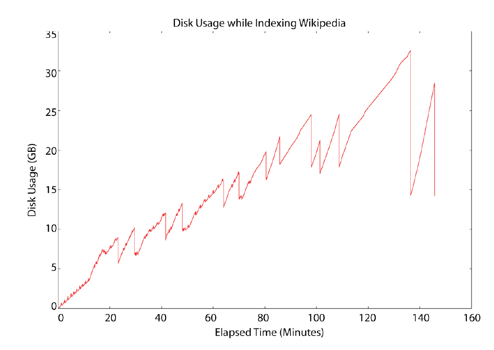
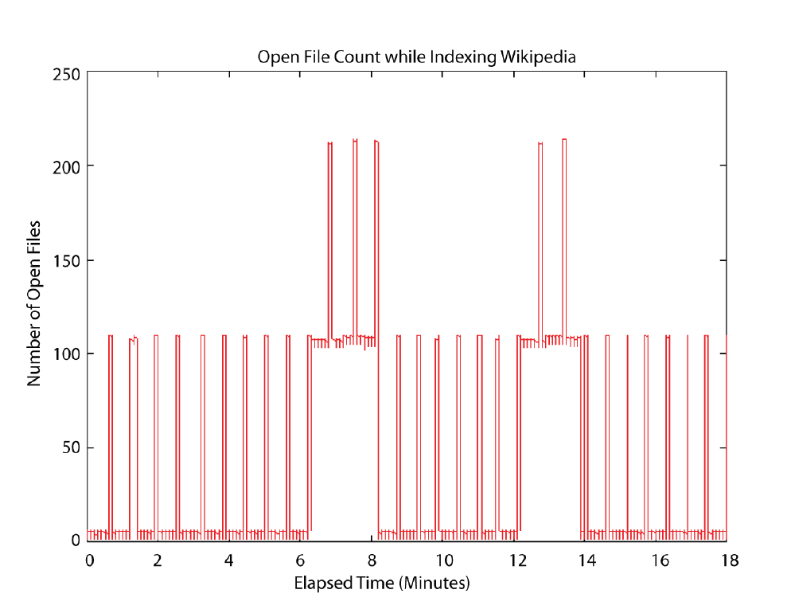
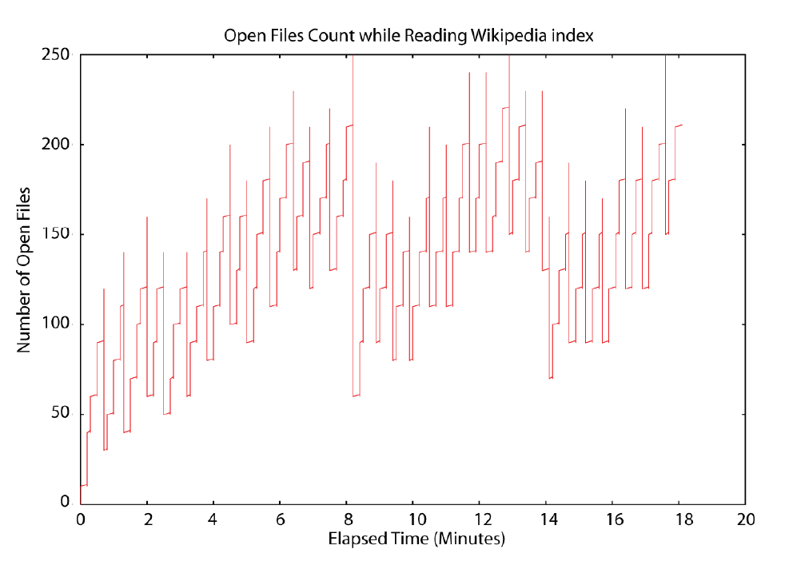

## 10.3 资源消耗管理 Managing resource consumption ##

与所有软件类似，Lucene 需要一定宝贵的计算机资源以完成它的工作。计算机提供有限的资源，例如硬盘存储，文件描述符，内存容量。通常，Lucene 必须与其它应用共享这些有限的资源。理解 Lucene 如何使用资源，以及我们能做什么控制来保持搜索程序健康运行。可能猜测 Lucene 对磁盘的使用是和所添加的文档总量成正比的，但会惊奇地发现这远非真实的情况。类似地，Lucene 对同时打开文件描述符的使用数量是令人出乎意料的：改变几个 Lucene 配置选项可以彻底改变所需的打开文件数量。最后，为了管理 Lucene 的内存消耗，会发现为什么给 Lucene 访问计算机上全部的内存并不总是最合适的。

<br/><br/>
<a id="1"></a>

## 10.3.1 硬盘空间管理 ##

Lucene 对硬盘空间的使用状况取决于多个因素。对于只索引一个纯文本域的索引来说，它占用的硬盘空间只有原始文本大小的 1/3。在另一种极端的情况下，一个索引有存储的域和带有偏移量和位置信息的词向量，以及很多删除的文档，加上一个在索引上打开的 reader，能轻易地消耗 10 倍于原始文本大小的硬盘空间。这种大跨度变化范围和似乎不可预测性，使我们有必要对 Lucene 索引所占用的磁盘空间进行管理。

图 10.3 展示了在对维基百科全部文件进行索引时，随时间变化的硬盘空间使用情况（图片来源于 Lucene in Action Second Edition）：

<div align=center></div>
<div align=center style="font-weight:bold;color:black;font-size:17px;">图 10.3 Disk usage while
building an index of all Wikipedia documents</div>

最终的硬盘使用量是 14.2GB，但峰值硬盘使用达到了 32.4GB，这是几个大的并发合并运行时到达的值。一眼就看得出，该图存在一些不稳定性：曲线不是随时间平滑递增的，在向索引中添加索引时，在合并期间，硬盘使用量会陡然上升，一旦合并操作结束，又快速地再次恢复到原来的状态，创建了一个锯齿状图案。跳跃的尺度对应于合并有多大（被合并的全部段的净大小）。更深入一步，就是 ConcurrentMergeScheduler，可以同时运行几个大合并，而这会造成增加更大的临时硬盘使用空间。

&emsp;&emsp;在硬盘使用空间如此剧烈波动的情况下，该如何进行管理呢？所幸的是，有种方法可以解决这个问题。只要理解了程序在后台具体运行了什么，那么就可以预测和理解 Lucene 对硬盘的使用。同时，也应该明白，在 Lucene 向索引写入的时候，发生硬盘空间填满的情况，索引是不会损坏的。

&emsp;&emsp;对搜索应用来说，重要的是区分索引构建期间的瞬时硬盘空间使用量，和索引全部构建完成的最终硬盘使用量。从最终大小开始分配硬盘空间是最简单的。这里给出一个粗略的公式来基于文档的全部文本大小评估最终硬盘占用空间大小：

```java
1/3 x indexed + 1 x stored + 2 x term vectors
```

举例来说，如果文档只有一个单独的域被索引，并且带有词向量，同时还是存储域，那么可以将索引库的硬盘占用空间预估为全部文档文本总大小的 3又1/3 倍。注意，这个公式是粗略的。例如，如果文档非常的不同或者是唯一性词项，像一个庞大的的电子表格包含很多唯一的商品 SKU 码，会占用更多的硬盘空间。

通过关闭 norms 减少一些硬盘使用量，对不需要词频信息（term frequency information）的域，关闭它，在对词向量进行索引时，关闭位置和偏移量信息，并且每个文档索引和存储尽量少的域。

瞬时硬盘使用量取决于很多因素。随着索引越来越大，硬盘使用量曲线中每个锯齿图形也变得越来越大，因为需要完成更大的合并操作。更大的合并操作也意味着需要更长的时间完成，也因此会滞留瞬时硬盘空间更长的时间。下面是影响瞬时硬盘使用量的其它因素。

**■** 打开的 reader 会阻止它们所使用的段文件删除。除了在重新打开 reader 时，否则应该在同一时刻只保留一个打开的 reader，并且确保关闭旧的 reader。

**■** 在 IndexWriter 首次打开时，所有已存在的索引段，以及由当前提交点引用的段，会保留在目录中。如果频繁地进行提交操作，会减少瞬时硬盘空间使用量，但提交过程是代价较大的操作，因此会影响索引吞吐量。

**■** 如果频繁地替换文档，由被删除的旧文档占用的硬盘空间不会被回收，直到这些段被合并为止。


**■** 索引中含有越多的索引段，就会占用越多的硬盘空间，如果段被合并，就会占用更多的瞬时硬盘空间。这意味着高的 mergeFactor 会导致要使用更多的硬盘空间（如果使用的是 LogMergePolicy 合并策略）。

**■** 给定相同的净文本数量，多个小文档会导致比少量大文档更大的索引。


**■** 不要的运行合并时打开一个新的 reader，这样做会导致这个新打开的 reader 持有要被删除的索引段。相反，应该在提交或关闭 IndexWriter 之后打开新 reader。


**■** 一定要在 IndexWriter 完成更改之后再打开一个新的 reader，然后关闭旧 reader。如果不这样做，现有 reader 会持有 IndexWriter 由于执行合并操作要删除文件的引用，这会阻止这些文件被删除。进一步说，现有 reader 会继续很好地工作，但它不会看到由 IndexWriter 新近提交的改变，直到它被重新打开。


**■** 如果正在运行热备份，要被复制的快照中的文件也会消耗硬盘空间，直到备份完成并且释放快照为止。


&emsp;&emsp;注意，在 Unix/Linux 上，可能会觉得硬盘空间已经释放了，因为 writer 已经删除了就的索引段文件，可事实上只要这些文件还被一个 IndexReader 保持打开，就仍旧会消耗硬盘空间。如果用 ls 命令查看索引目录，不会看到这些文件，这就令人疑惑了，可这些文件仍在消耗硬盘空间。这是由于 Unix 系统的 “最后关闭时删除（delete on last close）” 语义导致的。Windows 系统不允许删除打开的文件，因此仍然可以在索引目录中看到这些文件。因此不要被操作系统间的差异所迷惑。

&emsp;&emsp;搞清楚这些内容了吗？一个很好的经验法则是评估索引的总体大小，把它称为 X，然后确保在任何使用期间，确保存储索引库的文件系统上，有两倍的空闲硬盘空间。


<br/><br/>
<a id="2"></a>

## 10.3.2 文件描述符管理 ##

假设已对应用程序做了合适的调节，以最大化索引吞吐量。关闭了复合文件格式，调高了 mergeFactor 并获得了显著的速度提升，因此想要把 mergeFactor 值推向更高。遗憾的是，要做出这个改变必须面临一个隐秘的代价：这要求大幅度增加 Lucene 必须同时打开的文件数量。起初，这种改变还令人欣喜，所有的事情都看起来很好。然而，当添加更多的文档，索引库会增长，Lucene 需要越来越多地打开文件，终于有一天，会遇到令人恐惧的 “Too manay open files” 异常，并且操作系统终止我们的应用进程。面对这个隐秘并且突发风险，如何在这种文件打开数量有限的情况下，尽可能地将索引性能调到最优呢？

所幸的是，还是有希望的！通过几个简单的步骤，可以对这种情况进行控制。从运行下面的测试程序开始：

<table width="100%"><tr><td bgcolor=green><font color=black>Listing 10.3.2 对打开文件数量进行检查程序</td></tr></table>

```java

public class OpenFileLimitCheck {
  public static void main(String[] args) throws IOException {
    List<RandomAccessFile> files = new ArrayList<RandomAccessFile>();
    try {
      while(true) {
        files.add(new RandomAccessFile("tmp" + files.size(), "rw"));
      }
    } catch (IOException ioe) {
      System.out.println("IOException after  " + files.size() + " open files:");
      ioe.printStackTrace(System.out);
      int i = 0;
      for (RandomAccessFile raf : files) {
      	raf.close();
      	new File("tmp" + i++).delete();
      }
    }
  }
}

```

运行这个测试，它总会失败，并输出在操作系统终止程序之前，可以打开多少个文件。不同的操作系统和 JVM 有很大的不同，在 Windows 7 和 JDK 11 上甚至没有发生失败现象。

&emsp;&emsp;下一步，增加操作系统最大许可限制，根据不同的操作系统和 shell 命令，或者配置文件，也有所不同。调整完成之后，再次运行这个测试程序，以验证其在调整后的限制上终止程序。

&emsp;&emsp;最后，监视 JVM 实际使用多少打开的文件。可以使用操作系统级别的工具做这件事。在 Unix/Linux 上，使用 lsof，Windows 上使用任务管理器。在任务管理器上，选择查看\>选择列菜单，选择文件句柄列。

图 10.4 展示在构建维基百科文件集索引时打开的文件描述符数量，使用关闭复合文件格式和默认的 mergeFactor 值 10，（图片来源于 Lucene in Action Second Edition）：

<div align=center></div>
<div align=center style="font-weight:bold;color:black;font-size:17px;">图 10.4 File descriptor consumption while building an index of Wikipedia articles</div>

可以看得出，曲线呈现有峰值图案，刷新索引段时呈现低使用量，而在执行合并操作时呈现高使用量（因为 writer 对全部要被合并的段持有打开的文件，加上一个要创建的新索引段）。mergerFactor 的含义是，设置一次合并操作要合并的索引段的数量，直接控制索引期间打开文件的数量（使用 LogMergePolicy 合并策略的情况）。在两个合并操作立即执行时，一个发生在图中大约 7 分钟的位置开始三个小段的合并，另一个在图中大约 13 分钟的位置开始合并两个小段，可以观察到，大约消耗了两倍的文件描述符。

&emsp;&emsp;与索引操作不同，峰值位置是打开文件数量简单地与 mergeFactor 相乘，搜索操作可能需要更多打开的文件。如果没有使用复合文件格式，在没有索引词向量的情况下，需要 7 个文件，否则需要 10 个文件。对于快速改变和增长的索引，这个数量还会随实际情况增加。图 10.5 展示了 IndexReader 在处理图 10.4 同一个索引时所打开的文件数量，在索引构建过程中，每 10 秒钟重新打开一次 reader。在打开 reader 过程中，如果索引因为一个合并的完成已经发生改变，打开文件的数量会达到首个峰值，因为此时新、旧两个 reader 实际上都打开文件。一旦旧 reader 关闭，打开文件的数量就会降下来，与索引中有多少个段成正比。（图片来源于 Lucene in Action Second Edition）：


<div align=center></div>
<div align=center style="font-weight:bold;color:black;font-size:17px;">图 10.5 File
descriptor usage by an IndexReader reopening every 30 seconds while Wikipedia articles are indexed</div>


如果使用 DirectoryReader.openIfChanged(DirectoryReader oldReader) 方法打开新的 reader，曲线的尖顶峰值会小很多，因为对没有发生变化索引段的文件描述符是新、旧 reader 共享的。在索引变得更大时，使用量也会增加，因此它不会是一条直线，因为有时候只要一个大合并结束之后，reader 就会捕获到索引。有了关于打开文件消耗的知识，这里给出一些简单的提示，在仍能保证索引性能的前提下对文件描述符的使用量进行控制：

**■** 增大 IndexWriter 的缓存，使用 IndexWriterConfig.setRAMBufferSizeMB(double ramBufferSizeMB) 方法，默认为 16MB。更大的缓存意味着 writer 越小的频率将缓存内容刷新的索引段，索引中就会更少的索引段。

**■** 使用 DirectoryReader.openIfChanged(DirectoryReader oldReader) 方法打开新的 reader，这会在很大程度上降低打开文件数量的峰值。

**■** 降低 mergeFactor 值，但不要降低的太多，以至于它会损害索引吞吐量。对于 LogMergePolicy 策略，使用LogMergePolicy.setMergeFactor(int mergeFactor) 方法。对于 TieredMergePolicy 策略，使用 TieredMergePolicy.setSegmentsPerTier(double v) 方法，默认值为 10.0。

**■** 考虑降低同时合并线程的最大数量。通过 ConcurrentMergeScheduler.setMaxMergesAndThreads(int maxMergeCount, int maxThreadCount) 方法。

**■** 随时对文件描述符的使用量进行预算。这个峰值经常是在打开和对新 reader 进行预处理，关闭旧 reader 之前发生。

**■** 如果在一个 JVM 上运行索引和搜索，必须把两者打开文件数量的峰值加在一起。峰值经常发生在几个并发合并操作正在运行时，并且这时又重新打开 reader。如果可能，可以在重新打开 reader 之前，关闭 writer，以防止打开文件数量发生叠加效应（perfect storm）。

**■** 双倍检查其它运行在同一个 JVM 上的代码，没有使用过多打开文件描述符，如果是，考虑将它运行到另外一个 JVM 上。

**■** 双倍检查确实关闭了旧 IndexReader 实例。如果发现仍然比预期过早地耗尽文件描述符，尤其要做这个检查。

在程序性能和令人畏惧的文件描述符使用量之间找到合适的权衡感觉就像是一门艺术。但现在理解了 Lucene 如何使用打开文件，如何测试并在操作系统上增加这个限制，以及如何精确衡量哪些文件被 Lucene 打开，我们有了全部找到完美平衡的工具，它现在更加科学而不是艺术了。


<br/><br/>
<a id="3"></a>

## 10.3.3 内存管理 ##

在之前的 Lucene 应用中，肯定遇到过 OutOfMemoryError 错误。如果还没有，将来会遇到的，特别是 Lucene 的很多性能调优方法会增加内存使用量。因此会想，没问题，增加 JVM 的堆内存并继续。这里不会看到任何问题。如果这样做了，而且事情看起来运行正常了，但可能还不知道，这样做会影响程序性能，因为计算机因此需要在磁盘上建立更大的交换内存。这样也许过段时间再次碰到同样的错误。究竟发生了什么，我们如何控制这种隐秘的错误并仍能保持程序获得高性能呢？

&emsp;&emsp;对内存使用的管理是令人激动的，因为有两个不同级别的内存。首先，必须控制 JVM 如何从操作系统使用内存。第二，必须控制 Lucene 如何从 JVM 使用内存。并且，这两个级别的内存必须一起正确地调节。一旦理解了这两个级别的内存，同时防止内存错误和最大化性能就没有任何问题。

&emsp;&emsp;通过告诉 JVM 应使用多大的堆内存来管理它。-Xms size 选项设置堆内存启动大小，-Xmx size 设置最大允许的堆内存。在生产服务器环境，应将这两个值设为相同的值，这样 JVM 就不必花时间增长和收缩堆内存。同时，如果程序在运行期间内存达到最大设定值（例如，计算机必须极度进行内存交换），在启动 JVM 时能很快发现这些问题，而不是在几个小时之后，在应用程序突然需要使用全部内存时。堆内存应用足够大以给 Lucene 所需的内存，但也不能太大以至于强制计算机极度交换内存。通常情况下，不应该把全部的内存都给了 JVM：最好留出额外的空闲内存允许操作系统使用 I/O 缓存。

如何能能知道计算机正在进行频繁的内存交换呢？下面给出一些线索：

**■** 听听硬盘转动声响。如果计算机进行内存切换操作，硬盘会明显地发出声响，除非使用固态硬盘，这个方法就不适用了。

**■** 对于 Unix 系统来说，可以运行 vmstat l 命令打印出计算机的虚拟内存适用状况，每秒一次。然后在 pages swapped in (si) 和 pages swapped out (so) 列查看。对于 Windows，可以使用任务管理器查看，点击查看 \> 选择列菜单，在选择列对话框中选择“页错误增量”列。在该列中点击较高的值即可（如大于 20 的值）。

**■** 普通的交互式进程，像 shell 或 cmd 命令提示行，或者文本编辑器，或者 Windows 资源管理器，不响应操作。


**■** 在 Unix 中使用 top 命令，检查 Mem: 行，检查是否空闲数量和缓存数量都接近于 0。在 Windows 系统，使用任务管理器并切换到性能标签页，在物理内存下面检查空闲和已缓存数量是否都接近于 0。这个数量告诉我们计算机上有多少的内存用于 I/O 缓存。

**■** 我们的进程对 CPU 的使用率出乎意料地低。

值得注意的是，现代的操作系统会合理地在系统看起来空闲时执行内存交换过程，以将释放出来的 RAM 用于 I/O 缓存（cache）。如果感觉这个过程计算机太过活跃，可以尝试调节它。例如，在 Linux 系统上，有一个内核参数 swappiness，将这个值设为 0 强制操作系统不为 I/O cache 进行内存页交换（参考 https://www.cnblogs.com/linhaifeng/articles/13960093.html）。某些版本的 Windows 系统提供了选项用以将程序或系统缓存调整到最佳性能。但也要认识到，一定数量的内存交换是正常的。但过多的内存交换操作，特别是在索引或者搜索过程中，就不好了。

&emsp;&emsp;要管理 Lucene 从 JVM 中使用多少内存，首先要衡量 Lucene 需要多少内存。有很多种方法可以使用，最简单的是在运行 Java 命令时指定 **-verbose:gc** 和 **-XX:+PrintGCDetails** 选项，然后观察收集到的堆内存总数。这个方法很实用，因为它排除了还没有被收集到的垃圾对象消耗的内存。如果 Lucene 应用程序需要的内存接近于全部分配给 JVM 的最大堆内存大小，就会导致过渡频繁的 GC 操作，这会使运行减慢。如果使用的内存比这个值还大，最终会遇到 OutOfMemoryError 错误。

&emsp;&emsp;在索引期间，使用 RAM 最大的地方就是 IndexWriter 使用的缓存了，可以通过 IndexWriterConfig.setRAMBufferSizeMB(double ramBufferSizeMB) 方法设。不要把这个值设得太低，因为它会降低索引吞吐量。在段合并运行时，还要求一些额外的内存，与要合并的索引段的大小成正比。

搜索操作是更加内存相关的。下面是一些搜索期间降低内存使用的提示：

**■** 优化索引以净化被删除的文档。调用 IndexWriter.forceMergeDeletes() 方法，强制对有删除文档的索引段进行合并。

**■** 尽量不要使用字符串文本存储并载入 DocValues 域，因为它们会消耗更多的内存，尽量使用数值型域存储和利用 DocValues 域，例如 NUMERIC 或 SORTED_NUMERIC 的 DocValues 类型，它们的效率更高，并占用较少的内存。

**■** 限制排序域的数量，类似地，也尽量不要使用文本域。


**■** 关闭域的 norms 选项。默认情况下 norms 选项是开启的，可以通过 FieldType.setOmitNorms(true) 方法来禁用该选项。norms 是索引时对域的长度加权值编码存储，对于一个具体的词项，每个文档一个字节。即使没有这个域也会消耗 1 个字节，因为 norms 会存储为一个连续的数组。如果索引了很多个域，那么很快就会占用大量的内存。通常来说，norms 实际上不会对相关性评分起到太大的作用。例如，如果域值都有类似的长度（比如，title 域），那么 norms 就不是很必要。参考 2.4.6 节的论述。

**■** 使用单独 "catchall" 文本域，将来自多个源的文本联合在一起索引，例如 title, body, keyword 这些源，而不是给每个源分配一个域进行索引。这能使 Lucene 减少对内存的使用，也能加快搜索速度。


**■** 确保分析器产生合理的词项。使用 Luke 工具观察索引中的词项，并验证这些词项是用户可以搜索的合法词项。很容易偶尔对二进制文档进行索引，产生大量伪造出来的二进制词项，这些词项不会被搜索用到。这些词项一旦进入索引，就会导致全部的排序出现问题，因此最好是及早地找到它们，在索引期间忽略掉或者完全过滤掉这些二进制内容，以避免它们进入索引。


**■** 仔细检查关闭并释放了之前打开的 IndexReader 实例。偶尔保留一个以前的实例，很快就会耗尽内存、文件描述符，甚至是硬盘使用量。


**■** 使用 Java 内存 profiler 工具观察是什么占用了大量的内存。


&emsp;&emsp;确保对搜索期间打开新的 reader 时的内存需求进行测试，因为这是程序的峰值使用量。如果有 IndexWriter 共享该 JVM，要争取在 IndexWriter 进行索引及合并操作时进行测试，这样才能获得其峰值使用量。

&emsp;&emsp;现在回过来再次运行之前关于维基百科的算法文件，有意将堆内存设置一个很小的值，来看看如果没有对内存适当地调优会发生什么事情。上一次运行使用的是 512MB 的堆内存，并获得了 899.7 doc/sec 的吞吐量。这一次给它只设置 145MB 的堆内存，比这个再低的值很可能遇到 OutOfMemoryError 错误。通过如下命令运行该算法文件：

```shell
ant run-task -Dtask.alg=parallel-enwiki-throughput.alg -Dtask.mem=145M
```

将看到类似如下的输出：

```shell
Operation   round runCnt recsPerRun rec/s   elapsedSec avgUsedMem     avgTotalMem
BuildIndex    0     1     200002    323.4     618.41    150,899,008   151,977,984
BuildIndex -  1 -   1 -   200002    344.0 -   581.36    150,898,992   151,977,984
BuildIndex    2     1     200002    334.4     598.05    150,898,976   151,977,984
```

吞吐量为 334.4 个文档每秒，大概比之前的运行慢了 2.7 倍。减慢的原因是由于 JVM 必须要保持内存的使用量低于 145MB 而进行过渡频繁的 GC 操作。可以看得出给 Lucene 提供足够内存的重要性。

与任何软件类似，Lucene 需要各种计算机资源才能完成工作，但现在我们已加强了对 Lucene 使用资源的理解和控制。下一步，要转到对任何高可用性应用都至关重要的主题：备份索引（backing up index）。

