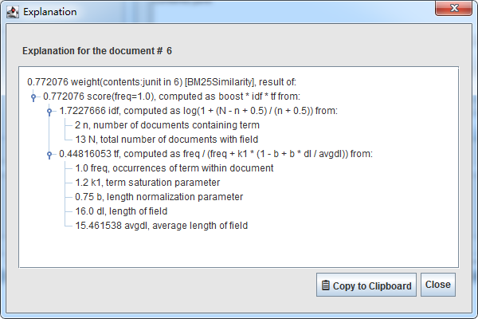

## 8.1 Luke：Lucene 索引库工具箱 ##

Luke 工具箱由 Andrzej Bialecki 创建，最初发布在 http://code.google.com/p/luke，后转到 github，现在作为 Lucene 项目的一个模块，位于 Lucene 主目录下：

**lucene/luke**

Luke 是一个桌面 Java 应用程序，为基于文件系统的索引库提供内部视图。强烈建议在使用 Lucene 开发时，将 Luke 作为常用工具，因为它考虑到随时可以进行的查询，并提供观察索引库的词项和结构。

&emsp;&emsp;Luke 已经变成 Lucene 开发工具包的一个组成部分。它使用选项卡组织界面，优秀的 UI 集成可以进行快速地浏览和实验。这是个面向程序员和管理员的优秀工具。

Luke 的使用很简单，只需配备 JRE 1.8 及以上版本就可以（Lucene 8.x 使用 Java 1.8）。Luke 自带独立的 jar 包和适应 Unix 或 Linux 系统的 luke.sh 脚本文件，以及适应 Windows 系统的 luke.bat 批处理文件。在不同的系统上运行相应的脚本文件即可启动 Luke 的 GUI 桌面程序。Luke 所需的第一个必要的条件就是索引库文件路径，如图 8.1 的文件选择对话框所示：

 

图 8.1 Luke 打开索引库提供路径和选项的对话框

 

  

## 8.1.1 Overview 选项卡: 查看索引库全局信息 ##

Luke 的 **Overview** 选项卡展示索引库整体方面信息，包括索引库的文件系统路径，域的数量，文档数量，词项的数量，如图 8.2 所示：

 

图 8.2 Luke 的 Overview 选项卡可以浏览域和词项

 

比较大的索引，某个域可能会有几万甚至上十万个词项，Luke 按每个词项在域中出现的频率从大到小的顺序排列。在左边的面板选择某个词项后，点击 **[Show top terms\>]** 按钮，Luke 会选择 "Num of terms" 数值框中所表示数量的前 N 个词项，展示在右侧的 Top Ranking Terms 面板中。这些频率靠前的 N 个词项，被称为 "top terms"。在右侧的 Top Ranking Terms 面板中双击任意词项，会呼出一个菜单，包含两个选项：

- **Browse docs by this term** 为选择的词项打开 Document 选项卡。
- **Search docs by this term** 以当前域和所选择的词项组成查询，在索引上执行搜索，并打开 Search 选项卡。

  

## 8.1.2 文档浏览 ##

**Document** 选项卡是 Luke 最复杂的窗口，在其中，可以通过文档号和词项浏览文档，如图 8.3 所示：
 

 

图 8.3 Luke 的 Document 选项卡显示所选择文档所有的域

 

通过文档号浏览简单直接，在窗口中间区域，可以使用箭头按钮依序导航全部文档，窗口底部的表格显示当前选择文档全部存储的域。

&emsp;&emsp;通过词项浏览有些巧妙，可以通过几种方法实现。单击 **[First Term]** 按钮，将词项选择导航到指定域在索引中的第一个词项。通过单击 **[Next Term]** 按钮可以逐项浏览全部的词项。包含当前词项的文档数显示在右侧的 "in n docs" 文本中。在文本框中输入一个词项的全部字符，除了最后一个字符，然后单击 **[Next Term]** 按钮，会向前导航，直到找到理想的词项。

&emsp;&emsp;词项浏览器 **[Browse terms in field:]** 区域下方是 **词项文档浏览器**。在右侧的文档浏览器 **[Browse documents by term]** 区域，可以逐个导航包含所选词项的文档。**[First Doc]** 按钮选择第一个包含所选词项的文档，和浏览词项操作一样，**[Next Doc]** 按钮导航到下一个文档。

&emsp;&emsp;**Document** 选项卡的另一个特性是，复制值到剪切板特性。在底部的文档域列表中，选择部分或全部的域，然后单击 **[Copy values]** 按钮，会将所选择的当前文档存储的域值复制到剪切板中。

>NOTE: Luke 只能工作在一个 Lucene 索引库的约束中，并且未存储的域不包含其原始形式的文本。这些域的词项可以通过 Luke 进行导航，但这些域不能在文档视图中显示，或者复制到剪切板，本例中索引的 "contens" 域既是如此。

双击 **词项文档浏览器** 中的一个域，呼出一个菜单，有四个菜单项：

- **Show term vector** 只有索引时存储了词向量的域，才能显示 Term Vector 对话框，展示当前文档当前域的词向量内容。
- **Show doc values** 只有索引时存储了 Doc values 才能显示 Doc Values 对话框，并显示该域的 Doc values 类型，以及该域在索引中的 Doc values 内容。
- **Show stored value** 在 Term Vector 对话框内显示存储的内容。如果没有则不显示。
- **Copy stored value to clipboard** 将该域存储的原始内容复制到剪切板，没有则不复制。

单击 **[Add docmuent]** 按钮，会调出 Add document 对话框，可以创建一个新文档，编入索引库。
单击 **[More like this]** 按钮，会将视图切换到 **Search** 选项卡，显示与当前选择的文档类似的文档。

  

## 8.1.3 使用 QueryParser 进行搜索 Using QueryParser to search ##

已经展示了两种方法自动转到 **Search** 选项卡：在 Overview 选项卡中，双击右下角的 **Top Ranking Terms:**表格中的任意词项，然后弹出的菜单上选择 **Search docs by this term** 菜单项，另一种方法是在 **Document** 选项卡右侧的词项浏览器上，单击 **[More like this]** 按钮。

&emsp;&emsp;也可以手动切换到 **Search** 选项卡，在右侧的 **[Quey expression]** 区域输入 QueryParser 表达式语法，选择合适的分析器和默认域。表达式和其他域选好后，单击 **[Search]** 按钮执行搜索操作。底部的表格显示出搜索命中结果的全部文档，如图 8.4 所示：

 

 

图 8.4 Luke Search 选项卡：一个利用查询分析器执行试验性搜索的便利方法

 

双击底部搜索结果列表中任意的文档，弹出上下文菜单，有两个菜单项：

- **Explain** 查看当前命中文档的评分解释，如图 8.5 所示。
- **Show all fields** 选择该菜单项，将携带当前选择的文档回退到 **Documents** 选项卡，把当前文档作为**词项文档浏览器**表格的当前文档，表格的内容立刻显示这个文档内全部的域及其值。

 

 

图 8.5 Luke 评分解释细节，指定文档的评分是如何被计算的

 

Luke 搜索相关的内容非常丰富，Search 选项卡被划分为三个个部分：右侧上部是搜索表达式和三个命令按钮：**[Parse]**、**[Search]**、**[More Like This]**。底部是搜索结果列表，包括匹配文档的 [DocID]、评分 [Score]、全部的域值 [Field Values]。左侧上部是搜索设置 **Query setttings** 部分，内嵌了另一个多选项卡界面，其中包括：

- 查询分析器 **Query Parser** 设置：Luke 支持两个查询分析器：StandardQueryParser 和 Classic QueryParser，选择不同的分析，会对应不同查询分析器的选项细节，Luke 在这个选项卡中提供了大量的分析器细节设置，包括默认域选择、默认操作符选择，短语查询、模糊查询、日期分辨率、区域、时区等分析器细节设置。
- 分析器 **Analyzer** 设置：Luke 为分析器设置提供分析器选择列表，单击分析器名右侧的 **Change** 链接，转到主窗口的 Analysis 选项卡，可以改变当前查询所使用的分析器。单击右侧的 **[Parse]** 按钮，使用当前分析器对查询表达式进行解析。 
- 相关度算法 **Similarity** 设置：Luke 默认使用 BM25 相关度算法进行相对计算，可以是这个页面修改 BM25 的 k1 参数值和 b 参数值。也可以切换到传统的 TFIDF 相似度算法。
- 排序 **Sort** 设置：默认使用相关度算法排序，可以在这个选项卡内设置按不同的域和类型排序
- 域值 **Field Values** 设置：设置在搜索结果中显示的域值的域，默认显示全部域值
- 更多类似 **More Like This** 设置：More Like This 查询选项设置。

  

## 8.1.4 Luke 分析选项卡 Analysis ##

分析器选择及测试，如图 8.6 所示：

 

 

图 8.6 Luke 分析器选择和及测试

 

Luke 支持一大堆 Lucene 核心以及其它分析器模块提供的预定义分析器，同时还支持在线自定义分析器。在 Analysis 选项卡中，对任意选择的分析器可以执行在线测试：输入一段文本，然后点击 **[Test Analyzer] 按钮** 会对输入的文本进行解析，并将分析结果显示在下方的 **Hit** 表格中。双击任意一个词元，会打开一个对话框窗口，其中显示该词元的全部元数据特性值。默认选择的是 StandardAnalyer 分析器。

对于自定义分析器，luke 支持在线定义分析器，如图 8.7 所示：

 

 

图 8.7 Luke 自定义分析器

 

可以通过 **load external jars** 连接定位到自定义分析器的 jar 包将完整的分析器载入 luke。或者一步一步手工添加 Tokenizer 和 TokenFilter 构建。

  

## 8.1.5 Luke 提交选项卡 Commits ##

提交选项卡 **Commits** 显示索引库全部提交的索引段和对应的索引文件信息。如图 8.8 所示：

 

 

图 8.8 Luke 提交选项卡 Commits

 

提交选项卡显示索引库中每个提交的信息。一个代 generation 代表一个提交，从选择代 **Select generation** 列表中选择任何一个提交，下方右侧的索引段列表就会列出当前提交中包含的全部索引段，单击选择任意一个索引段，左侧的文件 **Files** 表格就会显示出当前段的全部索引文件，同时会在索引段列表的下方显示该段的详细信息，可以选择查看 **诊断信息 Diagnostics**、**特性信息 Attribute**、**编码信息 Codec**。

  

## 8.1.6 Luke 日志 Logs##

日志选项卡 Logs 记录了在操作 luke 过程中记录的 Lucene 日志，如图 8.9 所示：

 

 

图 8.9 Luke 操作的 Lucene 日志

 

