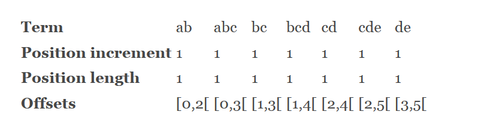

## 8.2 分析器、分词器、以及词元过滤器 Analyzers, tokenizers, and TokenFilters ##

人们常说，分析器多多益善。Lucene 没有令人失望，除了核心模块中的几个简单的分析器，它还通过独立的模块提供了大量针对不同自然语言的分析器，一些相关的词元过滤器和分词器，以及优秀的 Snowball 算法分析器。这些分析器列于表 8.1 中，如下所示：

<br/>
<div align="center" style="font-weight:bold;">表 8.1 独立模块提供的分析器</div>

<table>
    <tr bgcolor=#AA0000>
        <th align=center>分析器</th>
        <th align=center>模块</th>
        <th align=center>分词器和词元过滤器链</th>
    </tr>
    <tr>
      <td>ArabicAnalyzer 阿拉伯语分析器</td>
      <td>analyzers-common</td>
      <td>ArabicLetterTokenizer > LowerCaseFilter > StopFilter > ArabicNormalizationFilter > ArabicStemFilter.</td>
    </tr>
    <tr>
      <td>BrazilianAnalyzer 巴西语分析器</td>
      <td>analyzers-common</td>
      <td>StandardTokenizer > StandardFilter >StopFilter(custom stop table) > BrazilianStemFilter > LowerCaseFilter.</td>
    </tr>
    <tr>
      <td>CJKAnalyzer 中日韩分析器</td>
      <td>analyzers-common</td>
      <td>CJKTokenizer > StopFilter (自定义英文停止词)。对中文文本进行索引时，使用相邻汉字双字结构作为词元</td>
    </tr>
    <tr>
      <td>SmartChineseAnalyzer 智能中文分析器</td>
      <td>analyzers-smartcn</td>
      <td>中文分析器，利用基于词典的方法，将中文文本切分为单词</td>
    </tr>
    <tr>
      <td>compound.*</td>
      <td>analyzers-common</td>
      <td>两个不同的德语词元过滤器，用于将德语文本中的复合词语解构为单词部分。一种通过基于连字符的语法检测，另一种是使用基于单词的词典</td>
    </tr>
   <tr>
      <td>CzechAnalyzer 捷克语分析器</td>
      <td>analyzers-common</td>
      <td>StandardTokenizer > StandardFilter > LowerCaseFilter > StopFilter (自定义停止词列表)</td>
    </tr>
    <tr>
      <td>GermanAnalyzer 德语分析器</td>
      <td>analyzers-common</td>
      <td>StandardTokenizer > StandardFilter > LowerCaseFilter > StopFilter (custom stop list) > GermanStemFilter</td>
    </tr>
    <tr>
      <td>GreekAnalyzer 希腊语分析器</td>
      <td>analyzers-common</td>
      <td>StandardTokenizer > GreekLowerCaseFilter > StopFilter (custom stop list).</td>
    </tr>
    <tr>
      <td>PersianAnalyzer 波斯语（伊朗）分析器</td>
      <td>analyzers-common</td>
      <td>ArabicLetterTokenizer > LowerCaseFilter > ArabicNormalizationFilter > PersianNormalizationFilter > StopFilter.</td>
    </tr>
    <tr>
      <td>FrenchAnalyzer 法语分析器</td>
      <td>analyzers-common</td>
      <td>StandardTokenizer > StandardFilter > StopFilter(custom stop table) > FrenchStemFilter >
LowerCaseFilter.</td>
    </tr>
    <tr>
      <td>miscellaneous.* 杂项</td>
      <td>analyzers-common</td>
      <td>各种词元过滤器集合，还包括一个 LimitTokenCountAnalyzer 分析器</td>
    </tr>
    <tr>
      <td>ngram.*</td>
      <td>analyzers-common</td>
      <td>将单词拆分成字符 ngram 序列，适用于拼写修正和实时自动完成</td>
    </tr>
    <tr>
      <td>DutchAnalyzer 荷兰语分析器</td>
      <td>analyzers-common</td>
      <td>StandardTokenizer > StandardFilter > StopFilter (custom stop table)> DutchStemFilter.</td>
    </tr>
    <tr>
      <td>RussianAnalyzer 俄语分析器</td>
      <td>analyzers-common</td>
      <td>RussianLetterTokenizer > RussianLowerCaseFilter > StopFilter (自定义停止词列表) > RussianStemFilter</td>
    </tr>
    <tr>
      <td>ThaiAnalyzer 泰语分析器</td>
      <td>analyzers-common</td>
      <td>StandardFilter > ThaiWordFilter > StopFilter (英语停用词)</td>
    </tr>
    <tr>
      <td>WikipediaTokenizer 维基百科分词器</td>
      <td>analyzers-common</td>
      <td>类似于 StandardTokenizer，除此之外，加入了进一步处理出现在 XML 导出到维基文集的维基百科特定的标记，这会产生额外的基于维基百科的词元类型</td>
    </tr>
    <tr>
      <td>shingle.*</td>
      <td>analyzers-common</td>
      <td>创建 shingle 的词元过滤器，ngram 来自多个词元</td>
    </tr>
    <tr>
      <td>DateRecognizerFilter</td>
      <td>analyzers-common</td>
      <td>日期识别词元过滤器</td>
    </tr>
    <tr>
      <td>payloads.*</td>
      <td>analyzers-common</td>
      <td>处理带有 payload 特性的词元过滤器</td>
    </tr>
    <tr>
      <td>QueryAutoStopWordAnalyzer</td>
      <td>analyzers-common</td>
      <td>给其它分析器添加 StopFilter 的分析器</td>
    </tr>
   <tr>
      <td>SnowballFilter</td>
      <td>analyzers-common</td>
      <td>Snowball 过滤器</td>
    </tr>
    <tr>
      <td></td>
      <td></td>
      <td></td>
    </tr>
</table>

特定语言分析器的不同在于它们如何进行分词。巴西语和法语分析器使用语言特定的词干还原和自定义的停止词列表。捷克语分析器使用标准分词，不过也结合一个自定义的停止词列表。CJKAnalyzer 和 SmartChineseAnalyzer 智能中文分析器使用不同的方法，参阅 4.8.4 节。


<br/><br/>
<a id="1"></a>

## 8.2.1 SnowballFilter ##

词干还原在 4.6 节做了阐述，由 Martin Porter 博士创建的 Porter 词干还原算法，之后又创建了 Snowball 词干还原算法。Porter 算法是专门为英语设计的，另外，很多 “声称” 实现该算法的实现并没有严格遵循该算法的定义。为了解决这些问题，Porter 博士严格定义了词干还原的 Snowball 体系。通过这些算法的定义，可以产生精确的实现。事实上，Lucene 的 analyzers-common 模块包含一个构建过程，能够从 Porter 的网站获取该算法的定义，并生成对应的 Java 实现。

&emsp;&emsp;Lucene 的早期版本包含一个 SnowballAnalyzer 分析器，用于利用 Snowball 算法实现词干还原。但因为词干还原是各种自然语言分析器的重要组成部分，因此它已经完全融入到特定语言分析器的实现中。因此，在 4.0 版，Lucene 将其标注为弃用 @Deprecated，并从 Lucene 5.0 版开始将其移除。但利用 analyzers-common 模块提供的 SnowballFilter 完全可以自定义实现一个 SnowballAnalyzer 以验证 Snowball 词干还原算法的表现。

&emsp;&emsp;**SnowballFilter**利用 Snowball 生成的词干还原器（stemmer）对单词进行词干还原的词元过滤器。所有已实现的词干还原器位于 analyzers-common 模块的 org.tartarus.snowball.ext 包。

注意，SnowballFilter 过滤器要求转换为小写字符的文本，通过如下所示的小写化词元过滤器过滤：

- 对于土耳其语，使用 **TurkishLowerCaseFilter** 过滤器转换
- 其它语言，使用 **LowerCaseFilter** 过滤器转换

另外要注意的是，SnowballFilter 过滤器自动感知词元的 KeywordAttribute 特性，要防止某些词项被传递到词干还原器，在前一个 TokenStream 中应让 KeywordAttribute.isKeyword() 方法的返回值为 true 值。

SnowballFilter 有两个构造器，如下所示：

- **SnowballFilter(TokenStream input, SnowballProgram stemmer)**
- **SnowballFilter(TokenStream in, String name)**

构造命名的词干还原过滤器，所有可用的 stemmer 列于 analyzers-common 模块的 org.tartarus.snowball.ext 包中。一个词干还原器 stemmer 的名字，是其类名去掉尾部的 "Stemmer" 之前的部分，例如 EnglishStemmer 的名字为 English。每一个 SnowballProgram 的实现都是针对一个特定自然语言的，但不包括 CJK（中文、日文、韩文，因为这三种亚洲语言是形意字，不存在词根、词干、词性变形，因此也就无需词干还原）。org.tartarus.snowball.ext 包中实现了这些语言的词干还原器：英语 EnglishStemmer、阿拉伯语 ArabicStemmer、亚美尼亚语 ArmenianStemmer、巴斯克语 BasqueStemmer、加泰罗尼亚语 CatalanStemmer、丹麦语 DanishStemmer、荷兰语 DutchStemmer、爱沙尼亚语 EstonianStemmer、芬兰语 FinnishStemmer、法语 FrenchStemmer、德语 GermanStemmer、德语2 German2Stemmer、匈牙利语 HungarianStemmer、意大利语 ItalianStemmer、KpStemmer（荷兰语的 Kraaij-Pohlmann 算法）、挪威语 NorwegianStemmer、葡萄牙语  PortugueseStemmer、罗马尼亚语 RomanianStemmer、俄语 RussianStemmer、西班牙语 SpanishStemmer、瑞典语 SwedishStemmer、土耳其语 TurkishStemmer。这些类名，去掉尾部的 "Stemmer" 之前的部分就是其词干还原器的名字。

下面按照 4.6 节介绍的方法创建一个利用 SnowballFilter 过滤器的分析器 EnglishSnowballAnalyzer，如代码清单 8.2.1 所示。

本代码在源码 tools 模块中：

<table width="100%"><tr><td bgcolor=green><font color=black>Listing 8.2.1 利用 SnowballFilter 构建分析器：EnglishSnowballAnalyzer</td></tr></table>

```java

public class EnglishSnowballAnalyzer extends StopwordAnalyzerBase {
    public EnglishSnowballAnalyzer() {
        this(EnglishAnalyzer.ENGLISH_STOP_WORDS_SET);
    }
    public EnglishSnowballAnalyzer(CharArraySet stopwords) {
        super(stopwords);
    }

    @Override
    protected TokenStreamComponents createComponents(String fieldName) {
        final Tokenizer source = new StandardTokenizer();
        TokenStream result = new EnglishPossessiveFilter(source);
        result = new LowerCaseFilter(result);
        result = new StopFilter(result, stopwords);

        result = new SnowballFilter(result, "English");

        return new TokenStreamComponents(source, result);
    }
}

```

测试用例，如代码清单 Listing 8.2.1-1 所示：

<table width="100%"><tr><td bgcolor=green><font color=black>Listing 8.2.1-1 测试 EnglishSnowballAnalyzer</td></tr></table>

```java
public class SnowballTest{

  @Test
  public void testEnglish() throws Exception {
    Analyzer analyzer = new EnglishSnowballAnalyzer();
    AnalyzerUtils.assertAnalyzesTo(analyzer, "stemming algorithms", new String[] {"stem", "algorithm"});
  }
}

```

经过 EnglishSnowballAnalyzer 分析，词元 "stemming" 被还原为 "stem"，"algorithms" 被还原为 "algorithm"。


<br/><br/>
<a id="2"></a>

## 8.2.2 N-Gram 分词器和过滤器 ##


**N-gram** 是一种基于统计语言模型的算法。它的基本思想是将文本里面的内容按照字节进行大小为 N 的滑动窗口操作，形成了长度是 N 的字节片段序列。

每一个字节片段称为 gram，对所有 gram 的出现频度进行统计，并且按照事先设定好的阈值进行过滤，形成关键 gram 列表，也就是这个文本的向量特征空间，列表中的每一种 gram 就是一个特征向量维度。

该模型基于这样一种假设，第 N 个词的出现只与前面 N-1 个词相关，而与其它任何词都不相关，整句的概率就是各个词出现概率的乘积。这些概率可以通过直接从语料中统计 N 个词同时出现的次数得到。常用的是二元的 Bi-Gram 和三元的 Tri-Gram。

N-gram 是基于字母的。

Lucene 通过 **NGramTokenizer** 分词器和 **NGramTokenFilter** 词项过滤器对 N-Gram 算法提供支持。
<br/><br/>

#### <font color=green>NGramTokenizer</font> ####

**NGramTokenizer** 将输入的文本按给定的大小切分成 n-gram 词元。与 NGramTokenFilter 相对应，NGramTokenizer 类设置偏移量，因此在原始流中 startOffset 和 endOffset 之间的字符与词项字符相同。

例如，字符串 "abcde" 会被分词为如下词元(minGram=2, maxGram=3)，如下图所示：

<div align=center></div>
<br />
<div align=center style="font-weight:bold;color:black;font-size:17px;">图 8.10 NGramTokenizer 示例</div>
<br />

<!--
**Term**                    ab      abc     bc      bcd     cd      cde     de
**Position increment**      1       1       1       1       1       1       1
**Position length**         1       1       1       1       1       1       1
**Offset**                  [0,2  [	[0,3  [	[1,3  [	[1,4  [	[2,4  [	[2,5  [	[3,5[
-->

NGramTokenizer 从 Lucene 4.4 以来发生了很大的变化，目的是为了：

- 以流的方式分词以支持超过 1024 个字符的流
- gram 的计数基于 unicode 代码点，取代之前的 java 字符
- 在计算 n-gram 之前，给流预分词（pre-tokenize）能力

NGramTokenizer 不截断尾部空白，也不会以不同的顺序输出词元。在通过提升长度输出词元时，以提升起始偏移量的方式输出词元，这样防止支持很大的输入流。

NGramTokenizer 构造器如下：

- **NGramTokenizer()** 通过默认的最小值和最大值 n-gram 创建 NGramTokenizer 实例。默认的最小值是 1，最大值为 2。
- **NGramTokenizer(AttributeFactory factory, int minGram, int maxGram)** 通过属性工厂以及最小值和最大值 n-gram 创建。
- **NGramTokenizer(int minGram, int maxGram)** 通过提供的最小值和最大值 n-gram 创建。


<br/>

#### <font color=green>NGramTokenFilter</font> ####

NGramTokenFilter 将输入的文本按给定的大小切分成一系列 n-gram 词元，组合相邻的字符作为另一个词元。这个过滤器可以：

- 正确处理所提供的字符
- 对同一个词元在同一个位置输出所有的 n-gram
- 不修改偏移量
- 先通过在原始词元中的偏移量对 n-gram 排序，然后按长度递增。这意味着 "abc" 会输出 "a","ab","abc","b","bc","c"。

如果使用这个词元过滤器执行特定的高亮显示，不能正常工作，因为过滤器不会更新偏移量。应该使用 NGramTokenizer 修改分析链，并且有可能需要重写 NGramTokenizer.isTokenChar(int) 方法以执行预分词。

构造器如下：

- **NGramTokenFilter(TokenStream input, int gramSize)** 以指定的大小创建 NGramTokenFilter 词元过滤器
- **NGramTokenFilter(TokenStream input, int minGram, int maxGram, boolean preserveOriginal)** 创建 NGramTokenFilter 词元过滤器，对于一个给定的词元，产生包含的 n-gram 长度 \>= minGram 并且 <= maxGram。preserveOriginal 指明在其长度超出定义的范围时，是否保留原始词项。必须小心选择 minGram 和 maxGram 值，取决于输入的词元大小，这个过滤器可能会产生数量庞大的词项。


<br/>
&emsp;&emsp;&emsp;&emsp;*&emsp;&emsp;&emsp;&emsp;&emsp;&emsp;&emsp;&emsp;*&emsp;&emsp;&emsp;&emsp;&emsp;&emsp;&emsp;&emsp;*
<br /><br />

代码清单 8.2.2 展示 NGramTokenizer 和 NGramTokenFilter 的用法：

<table width="100%"><tr><td bgcolor=green><font color=black>Listing 8.2.2 利用 NGramTokenizer 或者 NGramTokenFilter 构建分析器</td></tr></table>

```java

public class NGramTest {
    private static class NGramAnalyzer extends Analyzer {
        @Override
        protected TokenStreamComponents createComponents(String fieldName) {
            final Tokenizer source = new NGramTokenizer(2, 4);
            TokenStream result = new LowerCaseFilter(source);

            return new TokenStreamComponents(source, result);
        }
    }

    private static class NGramAnalyzer2 extends Analyzer {

        @Override
        protected TokenStreamComponents createComponents(String fieldName) {
            final Tokenizer source = new StandardTokenizer();
            TokenStream result = new NGramTokenFilter(source, 2, 4, true);

            return new TokenStreamComponents(source, result);
        }
    }

    @Test
    public void testNGramTokenizer() throws IOException {
        AnalyzerUtils.displayTokensWithFullDetails(new NGramAnalyzer(), "lettuce");
    }

    @Test
    public void testNGramTokenFilter() throws IOException {
        AnalyzerUtils.displayTokensWithFullDetails(new NGramAnalyzer2(), "lettuce");
    }
}
```

代码通过 NGramTokenizer 和 NGramTokenFilter 两种方式，相同的最大值最小值参数创建分析器。测试方法都是在单词 "lettuce" 上以 2、3、4 长度，生成所有字符 ngram。testNGramTokenizer() 测试方法产生如下输出：

```shell
1: [le:0->2:word] 
2: [let:0->3:word] 
3: [lett:0->4:word] 
4: [et:1->3:word] 
5: [ett:1->4:word] 
6: [ettu:1->5:word] 
7: [tt:2->4:word] 
8: [ttu:2->5:word] 
9: [ttuc:2->6:word] 
10: [tu:3->5:word] 
11: [tuc:3->6:word] 
12: [tuce:3->7:word] 
13: [uc:4->6:word] 
14: [uce:4->7:word] 
15: [ce:5->7:word] 
```

输出产生了 15 个词元，并准确定位了位置和偏移量。

testNGramTokenFilter() 测试方法产生如下输出：

```shell
1: [le:0->7:<ALPHANUM>] [let:0->7:<ALPHANUM>] [lett:0->7:<ALPHANUM>] [et:0->7:<ALPHANUM>] [ett:0->7:<ALPHANUM>] [ettu:0->7:<ALPHANUM>] [tt:0->7:<ALPHANUM>] [ttu:0->7:<ALPHANUM>] [ttuc:0->7:<ALPHANUM>] [tu:0->7:<ALPHANUM>] [tuc:0->7:<ALPHANUM>] [tuce:0->7:<ALPHANUM>] [uc:0->7:<ALPHANUM>] [uce:0->7:<ALPHANUM>] [ce:0->7:<ALPHANUM>] [lettuce:0->7:<ALPHANUM>] 

```

在同一个位置和相同偏移量产生了 16 个词元，因为分析器保留了原始词元。


<br/><br/>
<a id="3"></a>

## 8.2.3 ShingleFilter 过滤器 ##

Shingle 是由多个邻近的词元构成的单一词元，ShingleFilter 从词元流构建 shingle，换句话说，它联合多个词元构建一个词元。类似于上一节探讨的字母 ngram，但 ngram 分词器操作的是字母，而 shingle 操作在整个单词上。例如，语句 "please divide this sentence into shingles" 可能会被分词为如下 shingle: "please divide", "divide this", "this sentence", "sentence into", "into shingles"。

&emsp;&emsp;为什么要这样做呢？一个常见的理由是加速短语搜索，特别是短语中包含常用词项时。考虑搜索一个确切的短语 "Wizard of Oz"，因为单词 "of" 是极为普通的词，把它包含在短语搜索中，要求 Lucene 访问并过滤掉大量的不匹配该短语文档，这个代价是高昂。而如果我们对词元 "wizard of" 和 "of oz" 进行索引，上面的短语搜索就能很快运行，因为这两个词元出现的频率是比较低的。Nutch 搜索引擎创建了 shingle 正是由于这个原因。因为在索引期间停用词没有被移除，single 允许提供精确且正确的短语搜索，即使短语中包含停用词也是如此。

&emsp;&emsp;另一个使用 shingle 的场景是文档集群，将类似或者近似相同的文档组合在一起。这对于巨大的文档集合来说很重要，不时地有重复的文档加入进来，这在通过 web 服务器抓取内容，而服务器上的内容是动态构建的，会经常发生。常常稍微有些不同的 URL 会生成完全一样的底层内容，或许加入了一些不同的 HTTP 头信息。非常类似于利用词向量查找出类似的文档，这种方法通过它显著的 shingle 来表示每个文档，然后搜索其它含有类似 shingle 和类似频率文档。

ShingleFilter 处理位置增量 > 1 的词元，插入过滤词元（词元使用词项文本 "_"）。它不处理位置增量为 0 的词元。构造器如下：

- **ShingleFilter(TokenStream input)** 使用默认的 shingle 大小：2 来构建过滤器
- **ShingleFilter(TokenStream input, int maxShingleSize)** 通过指定的 shingle 最大尺寸构建
- **ShingleFilter(TokenStream input, int minShingleSize, int maxShingleSize)** 按指定的 shingle 最小最大尺寸构建
- **ShingleFilter(TokenStream input, String tokenType)** 按指定词元类型创建 shingle 词元，并使用默认的大小：2，默认的 shingle 词元类似是 "shingle"。


另外，在同一个包内，Lucene 还提供了 ShingleAnalyzerWrapper 类，用于直接对一个已存在的分析器进行封装，以产生 shingle 词元，它的构造器参数与 ShingleFilter 类似。