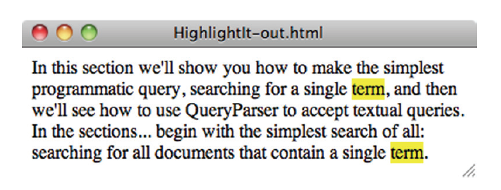
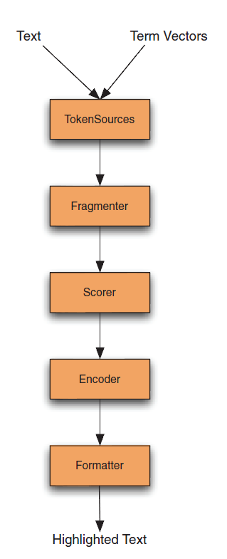

## 8.3 高亮显示查询词项 Highlighting query terms ##

highlighter 模块能够拆分和高亮显示基于 Luene 查询的文本。highlighter 最初由 Mark Harwood 捐献，但自那以后有很多开发者加入这个模块的开发。向最终用户提供一些围绕用户的搜索文本中特定词项的命中效果，能为用户提供一种强大的方式来判断每个命中的相关程度。通常，瞥一眼围绕搜索词项的效果就足够了解其结果是否值得进一步查究。每一个命中包含一些匹配文档的片段高亮显示查询的词项。图 8.11 展示了一个高亮显示部分文本的示例，基于字符串 "term" 的词项查询，源码如代码清单 8.3 所示。与拼写纠正类似，web 搜索引擎已将这些特性确定为基线要求，并且其它类型搜索程序也期望具有这样的基线要求。

图 8.11

  

一般意义上的高亮显示实际上由两个独立的功能组成。第一个是动态分片功能，意味着从一个大的文本中债取出几个最匹配搜索查询的语句。有些搜索程序略过这一步，而是依赖于为每个文档提取出静态摘要或总结，但这通常会给出很差的用户体验，因为摘要或总结是静态的。第二个功能是高亮显示（highlighting），借以将特定的单词置于它们包围文本的特效环境（context）中，称为突出（are called out），一般是加粗字体并对背景加颜色，这样用户的眼睛能快速跳到匹配的特定单词上。

这两个功能是完全独立的。例如，可以对一个 title 域进行高亮显示而无需从中产生分片，因为我们经常展现完整的标题。或者，对于一个含有大数量文本的域，会先对它进行分片，然后再应用高亮显示。

  

## 8.3.1 Highlighter 组件 ##

Highlighter 代码是复杂而灵活的实用工具，并且充分地考虑了把文本分片和高亮显示期间划分为不同步骤的必要性。图 8.12 展示了 Highlighter 类所采用计算高亮显示文本的步骤，让我们探究一下每个步骤。

图 8.12

  

  

#### TokenSources ####

高亮显示需要两个不同的输入：其工作的实际完整原始文本（一个字符串），以及一个源自这个文本的 TokenStream。典型的做法是将全部文本作为一个存储域编入索引库，但如果有另一种外部存储，例如，存储在数据库中，也会工作得很好。只是要确保那个源能够足够快速地将一个页面有价值的文本传递出来。

&emsp;&emsp;要创建 TokenStream，需要使用与索引期间相同的分析器，对文本进行重新分析。另一种方案，因为在索引期间大概已经分析了这个文本，只要之前使用 `setStoreTermVectors(true)`、`setStoreTermVectorPositions(true)`、`setStoreTermVectorOffsets(true)` 这些设置对域进行索引，就可以从之前存储的词向量生成 TokenStream。

&emsp;&emsp;highlighter 模块的 TokenSources 类有多个静态便利方法用于从索引中获取 TokenStream 对象，不论哪种数据源可用都可以。只要愿意，也可以自己创建单独的 TokenStream。通常情况下，词向量会获得最快的性能，但它们需要消耗额外的索引空间。

&emsp;&emsp;Highlighter 依赖于从词元流中获取的每个词项起始和结束偏移量，来定位准确的字符片段在原始输入文本中的位置，以进行高亮显示。因此，分析器在每个词元上设置 startOffset 和 endOffset 正确地与原始字符偏移量完全一致，是至关重要的。如果不正确，就会看到错误的文本片段被高亮显示了，或者在高亮显示期间遇到 InvalidTokenOffsetsException 异常。Lucene 的核心分析器都会正确地设置偏移量，因此，这一般不会称为问题，除非自己创建的分析器。

  

#### 分片器 Fragmenter ####

Fragmenter 是一个 Java 接口，它的目的是按照想法将原始字符串切分成单独的片段。NullFragmenter 是实现该接口的一个具体的类，将整个字符串作为一个独立的片段。这个实现适用于标题 title 域，以及其它比较短的文本域，用在希望显示完整文本的地方。SimpleFragmenter 是另一个具体的 Fragmenter 实现类，它按字符长度将文本切分成固定大小的片段，但不处理语句的边界。可以指定每个片段多少个字符（默认是 100）。但这个分片器太过于简单：它在创建分片时，不考虑查询的位置约束，这意味着对于短语查询和跨度查询，一个匹配的跨度很轻易的被拆分到两个片段中去。

&emsp;&emsp;所幸的是，还有一个分片器，SimpleSpanFragmenter，解决了这个问题，它也是以相同的大小拆分片段，但通过尝试创建分片总是包括匹配每个文档的跨度，不会将跨度拆分到两个片段中去。必须为该分片器传递一个 QueryScorer 对象，这样，它就知道跨度匹配在哪个位置。

&emsp;&emsp;如果没有在 Highlighter 实例上设置 Fragmenter，默认使用 SimpleFragmenter。一个友好的 Fragmenter 实现应该尝试在语句边界上产生片段。Solr 有一个 RegexFragmenter，基于所提供的正则表达式产生片段，可以用于基本的通过语句分片。

Highlighter 然后得到通过分片器产生的每一个分片，并把它们传递给 Scorer。

  

#### 评分器 Scorer ####

分片器 Fragmenter 的输出是一系列文本片段，Highlighter 必须挑出最合适的呈现出来。要做到这一点，Highlighter 询问 Scorer，一个 Java 接口，对每个片段进行评分。highlighter 包提供了两个具体的实现类：QueryTermScorer 基于从所提供的查询，有多少个词项出现在片段中，对每个片段进行评分。另一个是 QueryScorer，尝试只给促成文档匹配的实际词项出现分配评分。将 SimpleSpanFragmenter 和 QueryScorer 组合使用通常是最好的选择，因为这样就能对真正的匹配内容进行高亮显示。

&emsp;&emsp;QueryTermScorer 使用查询中的词项，它从原生（primitive）词项、短语、以及布尔查询提取词项，并且基于它们对应的加权因子计算权重。一个查询必须以最原生的形式被重写以使其适于 QueryTermScorer 使用。例如，通配符、模糊、前缀，以及范围查询将它们自己重写为一个匹配全部词项的布尔查询。调用 `Query.rewrite(IndexReader)` 方法，将查询翻译为其原生形式，在把这个 Query 传递给 QueryTermScorer 之前重写这个查询，除非确定该查询已经是一个原生查询。

&emsp;&emsp;QueryScorer 提取查询的匹配跨度，然后利用这些跨度给每个片段评分。不匹配该查询的片段，即使它们包含查询词项的一个子集，也会收到 0.0 的评分。如果使用更简单的 QueryTermScorer，会找到一个 PhraseQuery 能显示不显示完整短语的片段，这会令人非常困惑并且会损害最终用户对程序的信任。注意，QueryScorer 对每个匹配文档都是特定的，因为它列举文档的匹配跨度，因此它必须对每个需要高亮显示的文档创建实例。因为这些好处，强烈建议使用 QueryScorer 替代更简单的 QueryTermQuery。后面所有的示例都使用 QueryScorer。QueryScorer 的域名（field name）指定哪个域用于评分片段，如果传递 null 值，QueryScorer 从传入的 Query 中得到域名。

到此，Highlighter 选择了最好的评分片段呈现给最终用户。剩下的工作就是正确地格式化它们。

  

#### Encoder ####

Encoder 是 Java 接口，具有简单的目的：将原始文本编码为外部格式。有两个具体的实现类：DefaultEncoder 是 Highlighter 默认使用的编码器，对文本不做任何变换。SimpleHTMLEncoder 将文本编码为 HTML 格式，将任何特殊字符进行转义，例如 \<, \>, \& 符号，以及其它非 ASCII 字符。一旦编码器工作完成，最后一步就是格式片段以呈现出来。

  

#### Formatter ####

Formatter 是 Java 接口，用于将每个文本片段转换为字符串，同样将要高亮显示的词项转换为字符串，并渲染最终的高亮显示。Highlighter 提供三个具体的类可供选择。SimpleHTMLFormatter 使用开始和结束标记包围每个命中。默认的构造器使用 \<b>（加粗）HTML 标记。GradientFormatter 使用不同的背景色调来表明搜索结果匹配程度，它使用 \ HTML 标签。SpanGradientFormatter 做同样的事，但使用 \ HTML 标签，因为有些浏览器不能正确渲染 \ 标签。也可以创建自己的类实现 Formmatter 接口。

探索了全部参与高亮显示的组件，下面通过完整的例子来验证这些组件的工作。

 
&emsp;&emsp;&emsp;&emsp;*&emsp;&emsp;&emsp;&emsp;&emsp;&emsp;&emsp;&emsp;*&emsp;&emsp;&emsp;&emsp;&emsp;&emsp;&emsp;&emsp;*
  

  

## 8.3.2 独立的高亮显示示例 ##

