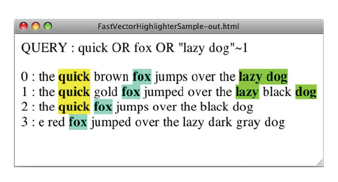

## 8.4 利用 FastVectorHighlighter 对查询词项进行高亮显示 ##

FastVectorHighlighter 高亮显示器组件由 Koji Sekiguchi 捐献。

如前一张所见，Highlighter 是为用户提供是否对搜索结果进行进一步探查最基本的工具。Highlighter 广受欢迎并广泛用于 Lucene 应用程序中，但当文档很大时，如果通过其 `setMaxDocCharsToAnalyze(int maxDocCharsToAnalyze)` 方法增大了分析字符的数量，Highlighter 可能会耗费非常多的时间。还有另一个高亮显示器 FastVectorHighlighter，Lucene 2.9 版首次加入 Lucene，提供了更好的性能。

&emsp;&emsp;如其名字所暗示，FastVectorHighlighter 是一个快速的高亮显示工具，需要更多的磁盘空间开销，因为它依赖于索引中必须存在词向量。在 Lucene 的 benchmark 中有一个名为 highlight-vs-vector-highlight.alg 的算法文件，可以看到这两个高亮显示器在处理时间上的不同。到 Lucene 2.9，这个时间点的现代硬件，该算法显示 FastVectorHighlighter 的运行速度大概比 Highlighter 快 2.5 倍。

&emsp;&emsp;FastVectorHighlighter 比 Highlighter 的优势不仅仅表现在速度上，还表现在功能上。首先，FastVectorHighlighter 能支持通过 ngram 分词器分词的域。Highlighter 还不能很好地支持这样的域。第二，更具吸引力的是，FastVectorHighlighter 可以输出多色彩（multicolored）标签进行高亮显示，如图 8.13 所示。第三，FastVectorHighlighter 能够支持对每个短语（per phrase）加标签，而不是 Highlighter 支持的每个词项（per term）加标签。例如，如果搜索短语 "lazy dog"，FastVectorHighlighter 产生输出： \<b\>lazy dog\</b\>，而 Highlighter 产生输出： \<b\>lazy\</b\> \<b\>dog\</b\>。


<div align=center></div>
<div align=center style="font-weight:bold;color:black;font-size:17px;">图 8.13 FastVectorHighlighter 支持多色彩对命中高亮显示</div>
<br /><br />


下面看看如何使用 FastVectorHighlighter，运行代码清单 8.4 所示的程序后，会看到如图 8.13 所示的 HTML 页面：

<table width="100%"><tr><td bgcolor=green><font color=black>Listing 8.4 FastVectorHighlighter 示例</td></tr></table>


```java
public class FastVectorHighlighterSample {

  static final String[] DOCS = {                                      // ①
    "the quick brown fox jumps over the lazy dog",
    "the quick gold fox jumped over the lazy black dog",
    "the quick fox jumps over the black dog",
    "the red fox jumped over the lazy dark gray dog"
  };
  static final String QUERY = "quick OR fox OR \"lazy dog\"~1";       // ②
  static final String F = "f";
  static Directory dir = new ByteBuffersDirectory();
  static Analyzer analyzer = new StandardAnalyzer();

  public static void main(String[] args) throws Exception {
    String filename = "fast-highter.html";
    if (args.length != 1) {
      System.out.println("Usage: FastVectorHighlighterSample <filename>");
    }
    else{
      filename = args[0];
    }
    makeIndex();
    searchIndex(filename);
  }

  static void makeIndex() throws IOException {
    IndexWriterConfig config = new IndexWriterConfig(analyzer);
    IndexWriter writer = new IndexWriter(dir, config);

    FieldType tvTextStoredType = new FieldType(TextField.TYPE_STORED);
    tvTextStoredType.setStoreTermVectors(true);
    tvTextStoredType.setStoreTermVectorPositions(true);
    tvTextStoredType.setStoreTermVectorOffsets(true);

    for(String d : DOCS){
      Document doc = new Document();
      doc.add(new Field(F, d, tvTextStoredType));
      writer.addDocument(doc);
    }
    writer.close();
  }
  
  static void searchIndex(String filename) throws Exception {
    QueryParser parser = new QueryParser(F, analyzer);
    Query query = parser.parse(QUERY);

    FastVectorHighlighter highlighter = getHighlighter();             // ③
    FieldQuery fieldQuery = highlighter.getFieldQuery(query);         // ④

    DirectoryReader reader = DirectoryReader.open(dir);
    IndexSearcher searcher = new IndexSearcher(reader);
    TopDocs docs = searcher.search(query, 10);                       

    FileWriter writer = new FileWriter(filename);
    writer.write("<html>");
    writer.write("<body>");
    writer.write("<p>QUERY : " + QUERY + "</p>");
    for(ScoreDoc scoreDoc : docs.scoreDocs) {
      String snippet = highlighter.getBestFragment(                   // ⑤
          fieldQuery, searcher.getIndexReader(),                      // ⑤
          scoreDoc.doc, F, 100 );                                     // ⑤
      if (snippet != null) {
        writer.write(scoreDoc.doc + " : " + snippet + "<br/>");
      }
    }
    writer.write("</body></html>");
    writer.close();
    reader.close();
  }
  
  static FastVectorHighlighter getHighlighter() {
    FragListBuilder fragListBuilder = new SimpleFragListBuilder();    
    FragmentsBuilder fragmentBuilder =
      new ScoreOrderFragmentsBuilder(
        BaseFragmentsBuilder.COLORED_PRE_TAGS,
        BaseFragmentsBuilder.COLORED_POST_TAGS);

    return new FastVectorHighlighter(true, true,  // ⑥
        fragListBuilder, fragmentBuilder);        // ⑥
  }
}

```

① 对这些文档进行索引
② 查询表达式
③ 获取 FastVectorHighlighter 对象
④ 创建 FieldQuery 对象
⑤ 高亮显示评分最高的片段
⑥ 创建 FastVectorHighlighter 实例对象

运行程序，在当前目录下生成 fast-highter.html 文件，用浏览器打开该文件，即会显示如图 8.13 所示的效果。

makeIndex() 方法将变量 DOCS 持有的四个静态文档加入到索引。注意，要进行高亮显示的域必须设置 `FieldType.setStoreTermVectors(true)`、`tvTextStoredType.setStoreTermVectorPositions(true)` 以及  `tvTextStoredType.setStoreTermVectorOffsets(true)` 进行索引。searchIndex() 方法对常量 QUERY 中的 "quick OR fox OR \"lazy dog\"~1" 执行搜索，并高亮显示搜索结果。

要获取高亮显示的分片，首先必须获得 FastVectorHighlighter 实例对象，有了该对象，就可以通过它创建 FieldQuery 对象。FieldQuery 是进行高亮显示必要的对象，作为参数传递给 FastVectorHighlighter 的 getBestFragment() 方法。要获得 FastVectorHighlighter 实例，可以简单地通过默认构造器创建，如下所示：

```java
FastVectorHighlighter highlighter = new FastVectorHighlighter();
```

然而，使用这样的实例，不能利用 FastVectorHighlighter 的多色彩标签特性。因为这个原因，在代码清单中提供了 getHighlighter() 方法，在这个方法中，为了支持多色彩标签特性，将 COLORED_PRE_TAGS 和 COLORED_POST_TAGS 常量作为参数传递给 ScoreOrderFragmentsBuilder 构造器，然后将 FragmentsBuilder 实例作为参数传递给 FastVectorHighlighter 构造器。

&emsp;&emsp;如我们所见，FastVectorHighlighter 比 Highlighter 具有更吸引人的优势。那么就总是使用 FastVectorHighlighter 而把 Highlighter 忘记了吗？不，不能这样做，因为 FastVectorHighlighter 也有一些劣势。其中之一就是它会消耗额外的磁盘空间，因为高亮显示的域必须索引为词向量。更进一步，默认的 FragmentsBuilder 在构建片段时忽略单词边界。可以在图 8.13 中看到这个限制，最后的片段开始于单词 the 的字符 "e"。要避免这个麻烦，需要实现自定义的 FragmentsBuilder 把单词边界考虑进去（新版本已解决，消除了单词边界的问题）。最后，FastVectorHighlighter 只支持基本的查询，例如 TermQuery 和 PhraseQuery。也支持包含这些基本查询的 BooleanQuery。而 Highlighter 支持 Lucene 中几乎所有的查询类型，包括 WildcardQuery 和 SpanQuery。

每种高亮显示器都有自己的有点和缺点，需要根据应用程序和最终用户做出明确的决策。


